AWSのコスト管理は、クラウド運用において最も重要な要素の1つです。AWSは複数のコスト管理ツールを提供しており、可視化、予算管理、最適化を実現できます。

## コスト管理ツールの概要

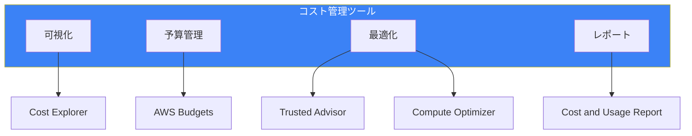

## AWS Cost Explorer

### 概要

コストと使用量を可視化・分析するツールです。

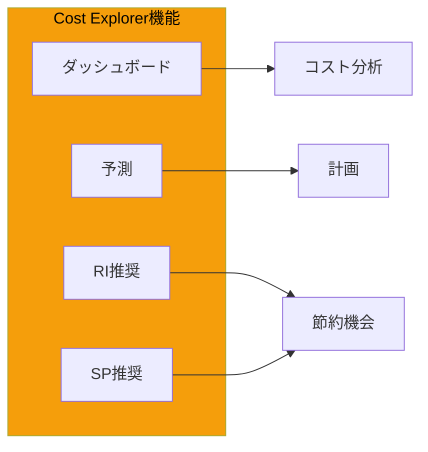

### 主要機能

| 機能 | 説明 |
|------|------|
| コスト分析 | サービス、タグ、アカウント別 |
| 使用量分析 | リソースの使用パターン |
| 予測 | 将来のコスト予測 |
| RI/SP推奨 | 購入推奨の提示 |
| 異常検出 | コスト異常のアラート |

### フィルタとグループ化

```
フィルタ:
- サービス
- リージョン
- アカウント
- タグ
- 使用タイプ
- 購入オプション

グループ化:
- 日/月単位
- サービス別
- タグ別
- アカウント別
```

### API活用

```bash
# コストデータの取得
aws ce get-cost-and-usage \
    --time-period Start=2024-01-01,End=2024-01-31 \
    --granularity MONTHLY \
    --metrics BlendedCost UnblendedCost \
    --group-by Type=DIMENSION,Key=SERVICE

# 予測の取得
aws ce get-cost-forecast \
    --time-period Start=2024-02-01,End=2024-03-01 \
    --metric UNBLENDED_COST \
    --granularity MONTHLY
```

## AWS Budgets

### 概要

予算を設定し、超過時にアラートを発信します。

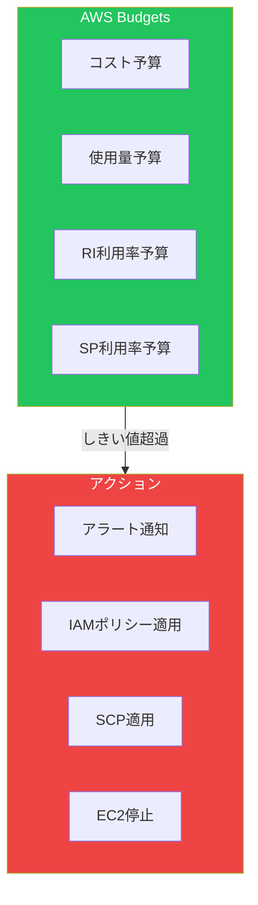

### 予算タイプ

| タイプ | 用途 |
|--------|------|
| コスト予算 | 支出の上限管理 |
| 使用量予算 | リソース使用量の管理 |
| RI利用率予算 | RI活用度の監視 |
| RI カバレッジ予算 | RI適用率の監視 |
| SP利用率予算 | SP活用度の監視 |
| SP カバレッジ予算 | SP適用率の監視 |

### アクション設定

```bash
# コスト予算の作成
aws budgets create-budget \
    --account-id 123456789012 \
    --budget '{
        "BudgetName": "Monthly-Budget",
        "BudgetLimit": {
            "Amount": "1000",
            "Unit": "USD"
        },
        "BudgetType": "COST",
        "TimeUnit": "MONTHLY",
        "CostFilters": {
            "Service": ["Amazon Elastic Compute Cloud - Compute"]
        }
    }' \
    --notifications-with-subscribers '[
        {
            "Notification": {
                "NotificationType": "ACTUAL",
                "ComparisonOperator": "GREATER_THAN",
                "Threshold": 80,
                "ThresholdType": "PERCENTAGE"
            },
            "Subscribers": [
                {
                    "SubscriptionType": "EMAIL",
                    "Address": "admin@example.com"
                }
            ]
        }
    ]'
```

### Budgets Actions

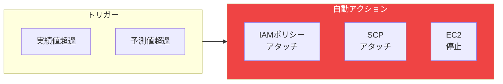

## Cost and Usage Report (CUR)

### 概要

最も詳細なコストデータをS3に出力します。

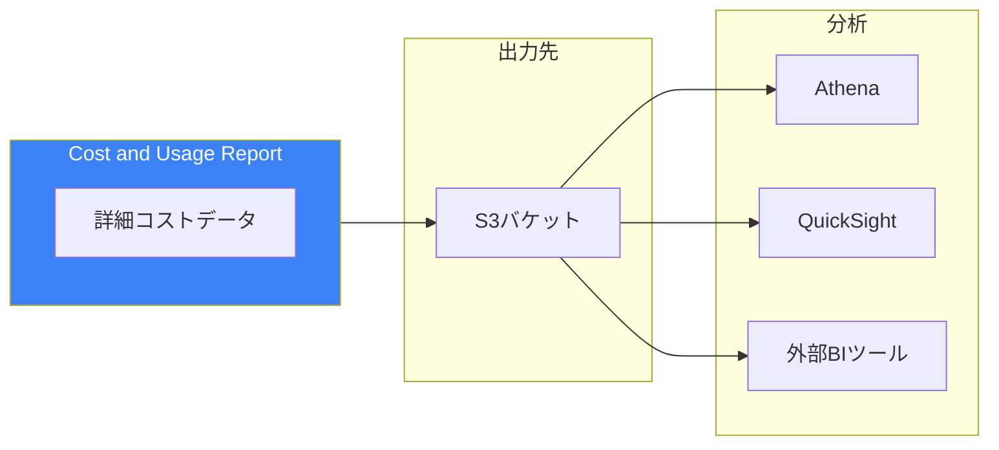

### CURの列

| カテゴリ | 例 |
|---------|-----|
| Identity | line_item_id |
| 請求 | bill_payer_account_id, bill_billing_period_start_date |
| 行項目 | line_item_usage_type, line_item_operation |
| 製品 | product_product_name, product_region |
| 価格 | pricing_public_on_demand_cost |
| 予約 | reservation_reservation_arn |
| リソース | resource_tags_user_* |

### Athenaでの分析

```sql
-- サービス別月次コスト
SELECT
    line_item_product_code,
    SUM(line_item_unblended_cost) as cost
FROM
    cur_database.cur_table
WHERE
    bill_billing_period_start_date = '2024-01-01'
GROUP BY
    line_item_product_code
ORDER BY
    cost DESC;

-- タグ別コスト
SELECT
    resource_tags_user_environment,
    SUM(line_item_unblended_cost) as cost
FROM
    cur_database.cur_table
WHERE
    resource_tags_user_environment IS NOT NULL
GROUP BY
    resource_tags_user_environment;
```

## Trusted Advisor

### 概要

AWSのベストプラクティスに基づいたチェックを提供します。

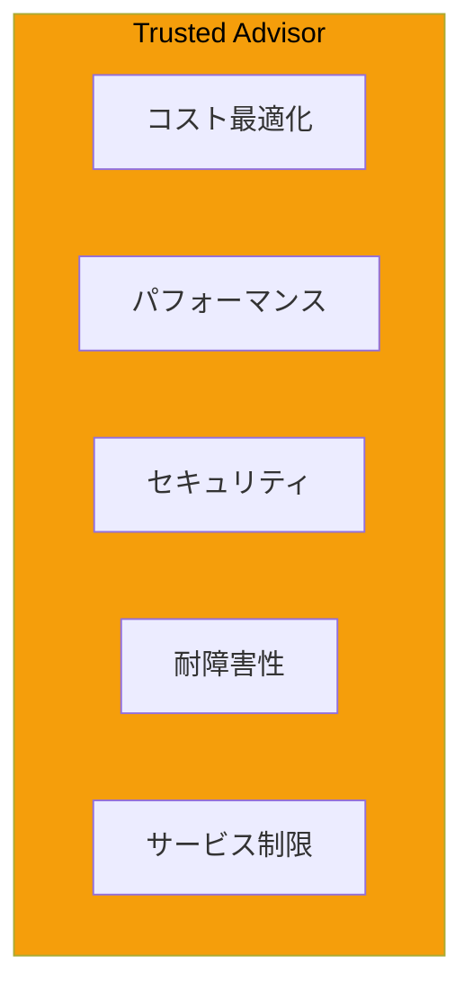

### コスト最適化チェック

| チェック | 説明 |
|---------|------|
| 未使用EC2 | 低使用率のインスタンス |
| 未使用EBS | 未接続のボリューム |
| 未使用EIP | 関連付けられていないEIP |
| RDSアイドル | 低使用率のDB |
| RI最適化 | 購入推奨 |

### サポートプラン別機能

| チェック | Basic/Developer | Business/Enterprise |
|---------|----------------|---------------------|
| コア7チェック | ✅ | ✅ |
| 全チェック | ❌ | ✅ |
| API アクセス | ❌ | ✅ |
| CloudWatch統合 | ❌ | ✅ |

## Compute Optimizer

### 概要

機械学習を使用してコンピュートリソースの最適化を推奨します。

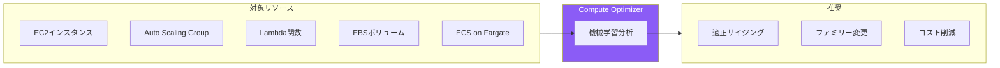

### 推奨の種類

| リソース | 推奨内容 |
|---------|---------|
| EC2 | インスタンスタイプ変更 |
| EBS | ボリュームタイプ/サイズ変更 |
| Lambda | メモリサイズ変更 |
| ASG | 構成最適化 |

### 拡張メトリクス

```bash
# 拡張メトリクスの有効化
aws compute-optimizer put-recommendation-preferences \
    --resource-type Ec2Instance \
    --scope '{"Name": "AccountId", "Value": "123456789012"}' \
    --enhanced-infrastructure-metrics Active
```

## コスト配分タグ

### タグ戦略

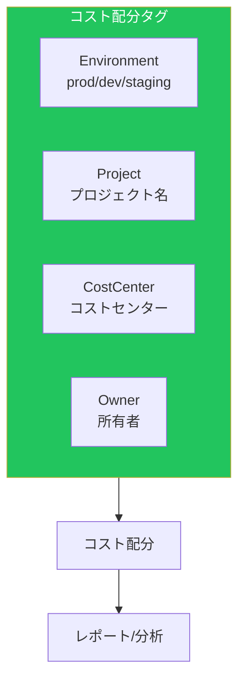

### 推奨タグ

| タグキー | 用途 | 例 |
|---------|------|-----|
| Environment | 環境識別 | prod, dev, staging |
| Project | プロジェクト | web-app, api |
| CostCenter | 部門コスト | 1234 |
| Owner | 責任者 | team-a@example.com |
| Application | アプリケーション | frontend |

### タグの有効化

```bash
# コスト配分タグの有効化
aws ce update-cost-allocation-tags-status \
    --cost-allocation-tags-status \
        '{"TagKey": "Environment", "Status": "Active"}' \
        '{"TagKey": "Project", "Status": "Active"}'
```

## 異常検出

### Cost Anomaly Detection

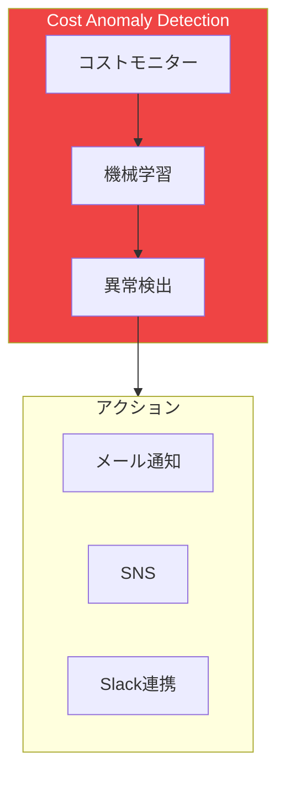

### 設定例

```bash
# 異常検出モニターの作成
aws ce create-anomaly-monitor \
    --anomaly-monitor '{
        "MonitorName": "service-monitor",
        "MonitorType": "DIMENSIONAL",
        "MonitorDimension": "SERVICE"
    }'

# サブスクリプションの作成
aws ce create-anomaly-subscription \
    --anomaly-subscription '{
        "SubscriptionName": "cost-alerts",
        "MonitorArnList": ["arn:aws:ce::xxx:anomalymonitor/xxx"],
        "Subscribers": [
            {"Type": "EMAIL", "Address": "admin@example.com"}
        ],
        "Threshold": 100,
        "Frequency": "DAILY"
    }'
```

## ベストプラクティス

### コスト管理フレームワーク

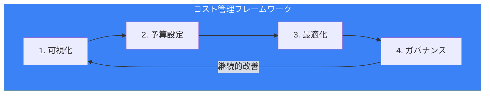

### チェックリスト

| フェーズ | アクション |
|---------|----------|
| 可視化 | Cost Explorer有効化、CUR設定 |
| 予算 | AWS Budgets設定、アラート |
| 最適化 | Trusted Advisor確認、Compute Optimizer |
| ガバナンス | タグポリシー、SCPによる制限 |

## まとめ

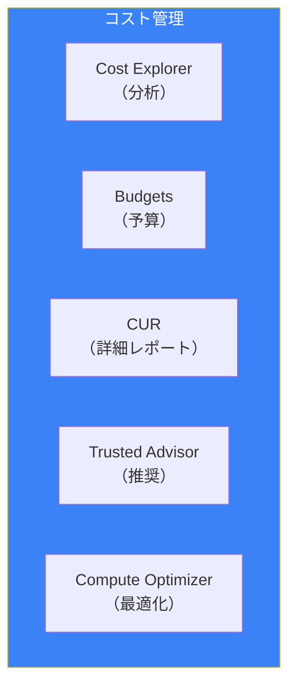

| ツール | 主な用途 | 推奨度 |
|--------|---------|--------|
| Cost Explorer | 日常的なコスト分析 | ★★★ |
| AWS Budgets | 予算管理とアラート | ★★★ |
| CUR | 詳細分析とBI連携 | ★★☆ |
| Trusted Advisor | ベストプラクティス確認 | ★★☆ |
| Compute Optimizer | リソース最適化 | ★★★ |

適切なコスト管理ツールの活用により、AWSコストを可視化し、最適化の機会を特定できます。

## 参考資料

- [AWS Cost Explorer](https://docs.aws.amazon.com/cost-management/latest/userguide/ce-what-is.html)
- [AWS Budgets](https://docs.aws.amazon.com/cost-management/latest/userguide/budgets-managing-costs.html)
- [Cost and Usage Report](https://docs.aws.amazon.com/cur/latest/userguide/)
- [Compute Optimizer](https://docs.aws.amazon.com/compute-optimizer/latest/ug/)
