マルチアカウント環境では、アカウント間でリソースを共有したり、他のアカウントにアクセスしたりする必要があります。AWSは複数のクロスアカウントアクセス方法を提供しており、ユースケースに応じて適切な方法を選択することが重要です。

## クロスアカウントアクセスの概要

### なぜクロスアカウントアクセスが必要か

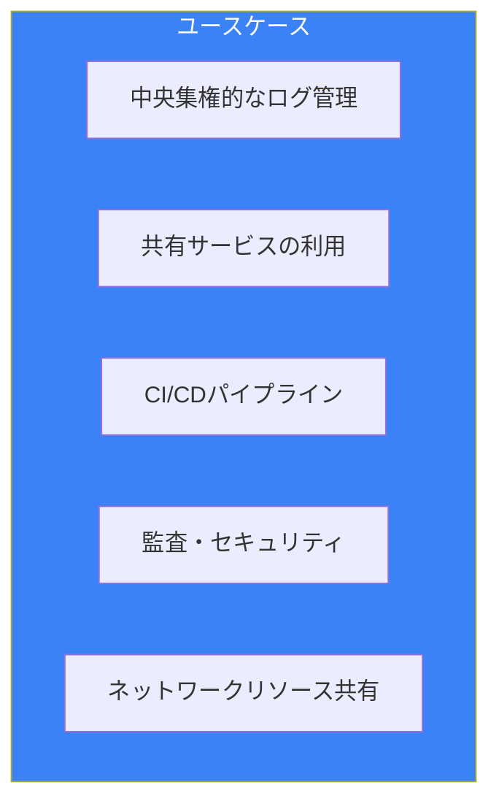

### アクセス方法の分類

| 方法 | 用途 | アクセス対象 |
|------|------|-------------|
| **IAMロール（AssumeRole）** | 一時的なアクセス | 任意のリソース |
| **リソースベースポリシー** | 特定リソースへのアクセス | S3、SNS、SQS等 |
| **RAM** | リソースの共有 | VPC、Route 53等 |
| **IAM Identity Center** | SSOアクセス | コンソール・CLI |

## IAMロールによるクロスアカウントアクセス

### AssumeRoleの仕組み

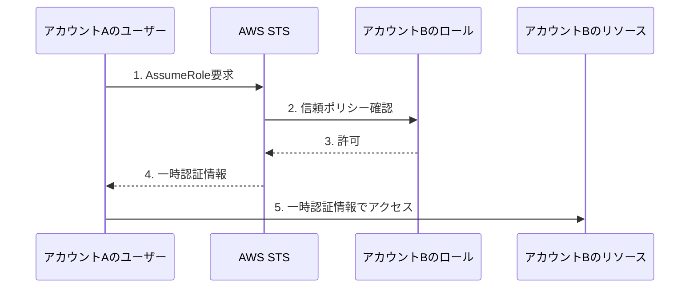

### 信頼ポリシー（Trust Policy）

アカウントBのロールに設定する信頼ポリシー：

```json
{
  "Version": "2012-10-17",
  "Statement": [
    {
      "Effect": "Allow",
      "Principal": {
        "AWS": "arn:aws:iam::111111111111:root"
      },
      "Action": "sts:AssumeRole",
      "Condition": {
        "StringEquals": {
          "sts:ExternalId": "unique-external-id"
        }
      }
    }
  ]
}
```

### 権限ポリシー（Permission Policy）

ロールに付与する権限：

```json
{
  "Version": "2012-10-17",
  "Statement": [
    {
      "Effect": "Allow",
      "Action": [
        "s3:GetObject",
        "s3:ListBucket"
      ],
      "Resource": [
        "arn:aws:s3:::shared-bucket",
        "arn:aws:s3:::shared-bucket/*"
      ]
    }
  ]
}
```

### アカウントAからのAssumeRole

アカウントAのユーザー/ロールに必要な権限：

```json
{
  "Version": "2012-10-17",
  "Statement": [
    {
      "Effect": "Allow",
      "Action": "sts:AssumeRole",
      "Resource": "arn:aws:iam::222222222222:role/CrossAccountRole"
    }
  ]
}
```

### CLIでのAssumeRole

```bash
# 一時認証情報を取得
aws sts assume-role \
    --role-arn arn:aws:iam::222222222222:role/CrossAccountRole \
    --role-session-name my-session \
    --external-id unique-external-id

# プロファイルを設定（~/.aws/config）
[profile cross-account]
role_arn = arn:aws:iam::222222222222:role/CrossAccountRole
source_profile = default
external_id = unique-external-id
```

## External IDの重要性

### 混乱した代理問題（Confused Deputy）

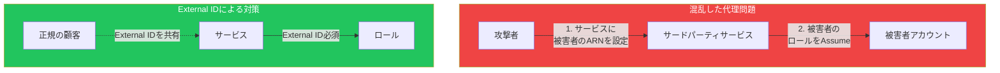

### External IDの使い方

| シナリオ | External ID |
|---------|-------------|
| 自社アカウント間 | 省略可能 |
| サードパーティ連携 | 必須 |
| Organizationsメンバー間 | 省略可能（org-idで制御） |

## リソースベースポリシー

### 対応サービス

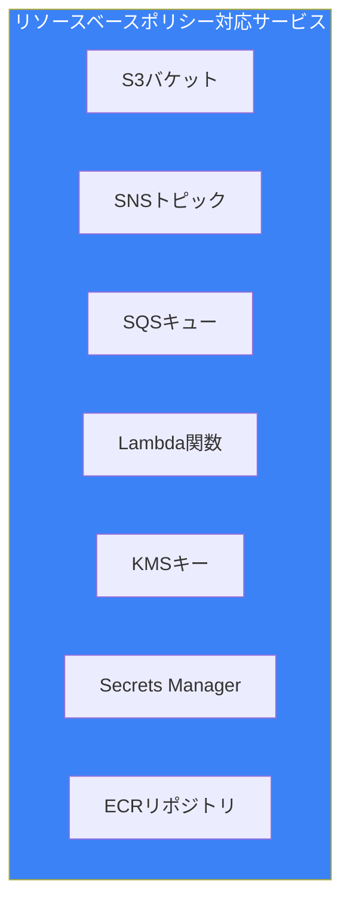

### S3バケットポリシー例

```json
{
  "Version": "2012-10-17",
  "Statement": [
    {
      "Sid": "CrossAccountAccess",
      "Effect": "Allow",
      "Principal": {
        "AWS": "arn:aws:iam::111111111111:role/DataPipelineRole"
      },
      "Action": [
        "s3:GetObject",
        "s3:PutObject"
      ],
      "Resource": "arn:aws:s3:::shared-data-bucket/*"
    }
  ]
}
```

### IAMロール vs リソースベースポリシー

| 特徴 | IAMロール | リソースベースポリシー |
|------|----------|---------------------|
| アイデンティティ切り替え | あり | なし |
| 元のアクセス権 | 失われる | 保持される |
| 設定場所 | 両方のアカウント | リソース側のみ |
| 対応リソース | すべて | 一部のサービスのみ |

**重要な違い**: リソースベースポリシーでは、元のアイデンティティの権限を保持したままアクセスできます。

## AWS Resource Access Manager（RAM）

### RAMとは

RAMは、AWSリソースを他のアカウントと共有するためのサービスです。

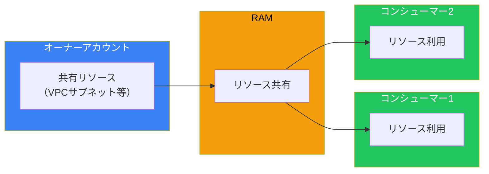

### 共有可能なリソース

| サービス | 共有可能なリソース |
|---------|------------------|
| **VPC** | サブネット、Transit Gateway |
| **Route 53** | ルールグループ、Resolver |
| **EC2** | 専有ホスト、容量予約 |
| **License Manager** | ライセンス設定 |
| **AWS Outposts** | ローカルゲートウェイ |
| **Systems Manager** | インシデントマネージャー |

### VPCサブネットの共有

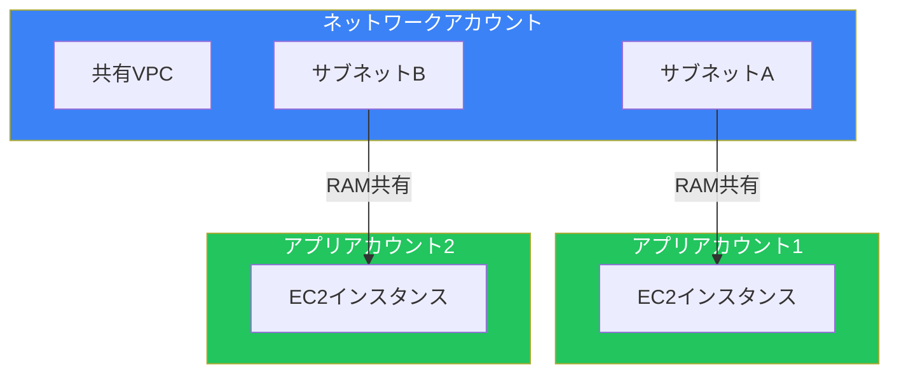

### RAMの設定

```bash
# リソース共有を作成
aws ram create-resource-share \
    --name "shared-vpc-subnets" \
    --resource-arns arn:aws:ec2:ap-northeast-1:111111111111:subnet/subnet-12345 \
    --principals arn:aws:organizations::111111111111:ou/o-xxx/ou-yyy

# Organizations内での自動共有を有効化
aws ram enable-sharing-with-aws-organization
```

## Organizationsとの連携

### Organizations内でのアクセス制御

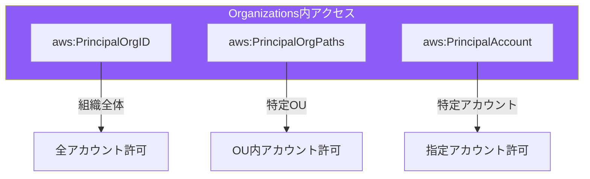

### 組織ID条件

```json
{
  "Version": "2012-10-17",
  "Statement": [
    {
      "Effect": "Allow",
      "Principal": "*",
      "Action": "s3:GetObject",
      "Resource": "arn:aws:s3:::shared-bucket/*",
      "Condition": {
        "StringEquals": {
          "aws:PrincipalOrgID": "o-xxxxxxxxxx"
        }
      }
    }
  ]
}
```

### OUパス条件

```json
{
  "Version": "2012-10-17",
  "Statement": [
    {
      "Effect": "Allow",
      "Principal": "*",
      "Action": "sts:AssumeRole",
      "Condition": {
        "ForAnyValue:StringLike": {
          "aws:PrincipalOrgPaths": [
            "o-xxx/r-xxx/ou-xxx-production/*"
          ]
        }
      }
    }
  ]
}
```

## 実践パターン

### パターン1: 中央ログ集約

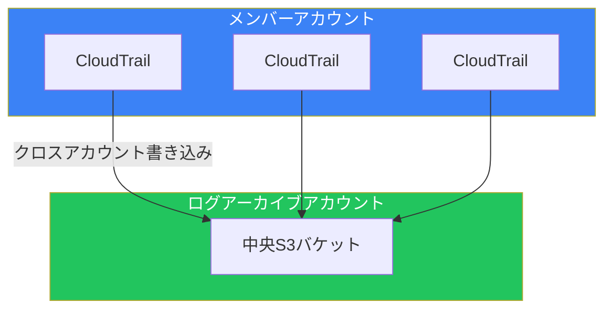

S3バケットポリシー：

```json
{
  "Version": "2012-10-17",
  "Statement": [
    {
      "Sid": "AWSCloudTrailAclCheck",
      "Effect": "Allow",
      "Principal": {
        "Service": "cloudtrail.amazonaws.com"
      },
      "Action": "s3:GetBucketAcl",
      "Resource": "arn:aws:s3:::central-logs-bucket",
      "Condition": {
        "StringEquals": {
          "aws:SourceOrgID": "o-xxxxxxxxxx"
        }
      }
    },
    {
      "Sid": "AWSCloudTrailWrite",
      "Effect": "Allow",
      "Principal": {
        "Service": "cloudtrail.amazonaws.com"
      },
      "Action": "s3:PutObject",
      "Resource": "arn:aws:s3:::central-logs-bucket/*",
      "Condition": {
        "StringEquals": {
          "aws:SourceOrgID": "o-xxxxxxxxxx"
        }
      }
    }
  ]
}
```

### パターン2: 共有VPCネットワーク

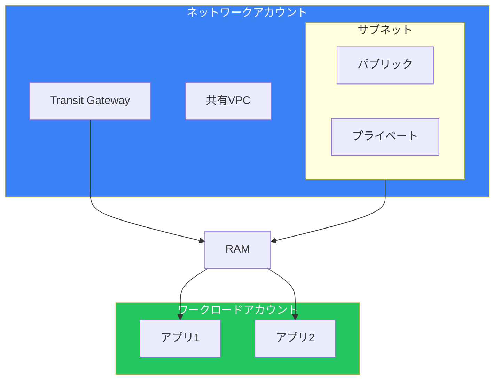

### パターン3: CI/CDクロスアカウントデプロイ

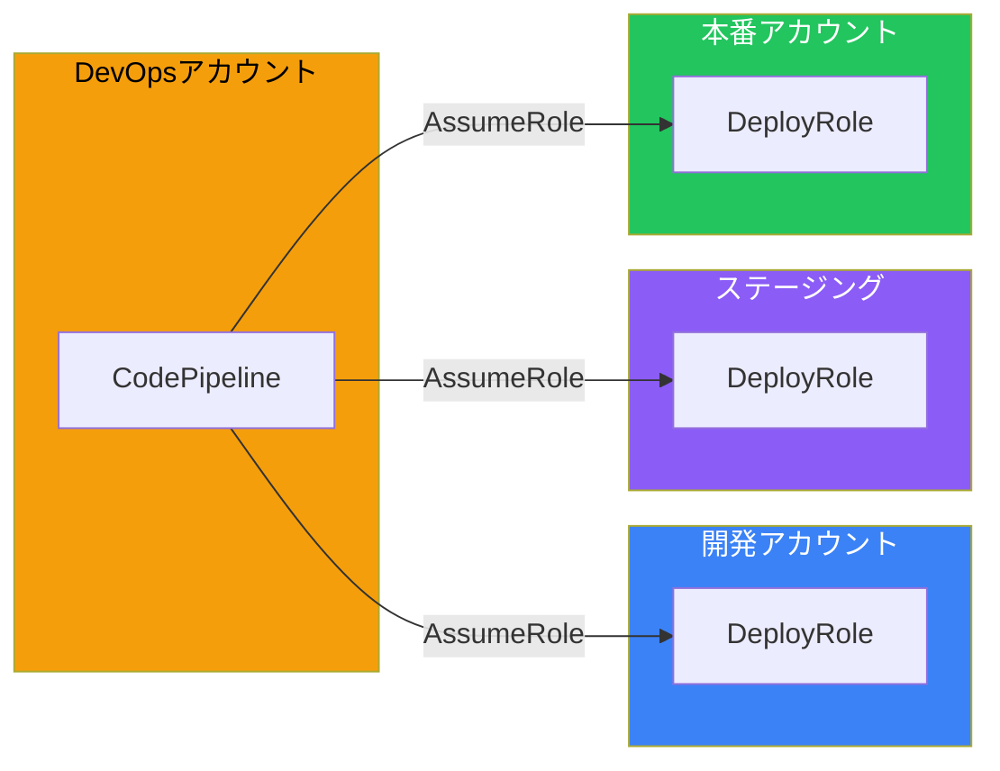

## セキュリティベストプラクティス

### チェックリスト

| カテゴリ | ベストプラクティス |
|---------|------------------|
| **最小権限** | 必要最小限のアクションのみ許可 |
| **External ID** | サードパーティ連携では必須 |
| **条件キー** | aws:PrincipalOrgID等で制限 |
| **ロール名規則** | 命名規則を統一 |
| **監査** | CloudTrailでAssumeRoleを監視 |
| **有効期限** | セッション時間を適切に設定 |

### 避けるべきパターン

```json
// ❌ 悪い例: 全アカウントを許可
{
  "Principal": {"AWS": "*"}
}

// ✅ 良い例: 組織IDで制限
{
  "Principal": {"AWS": "*"},
  "Condition": {
    "StringEquals": {
      "aws:PrincipalOrgID": "o-xxxxxxxxxx"
    }
  }
}
```

## まとめ

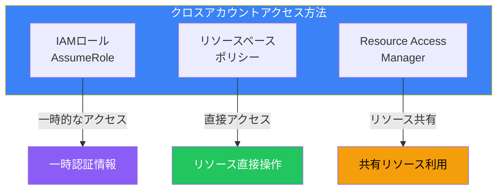

| 方法 | ユースケース | 設定の複雑さ |
|------|------------|-------------|
| IAMロール | 汎用的なアクセス | 中 |
| リソースベースポリシー | 特定リソースへのアクセス | 低 |
| RAM | VPC等の共有 | 低 |
| Organizations条件 | 組織全体での制御 | 低 |

適切なクロスアカウントアクセス設計により、セキュリティを維持しながら効率的なマルチアカウント運用が可能になります。

## 参考資料

- [IAM Roles for Cross-Account Access](https://docs.aws.amazon.com/IAM/latest/UserGuide/tutorial_cross-account-with-roles.html)
- [AWS Resource Access Manager User Guide](https://docs.aws.amazon.com/ram/latest/userguide/)
- [Cross-Account Policy Evaluation](https://docs.aws.amazon.com/IAM/latest/UserGuide/reference_policies_evaluation-logic-cross-account.html)
