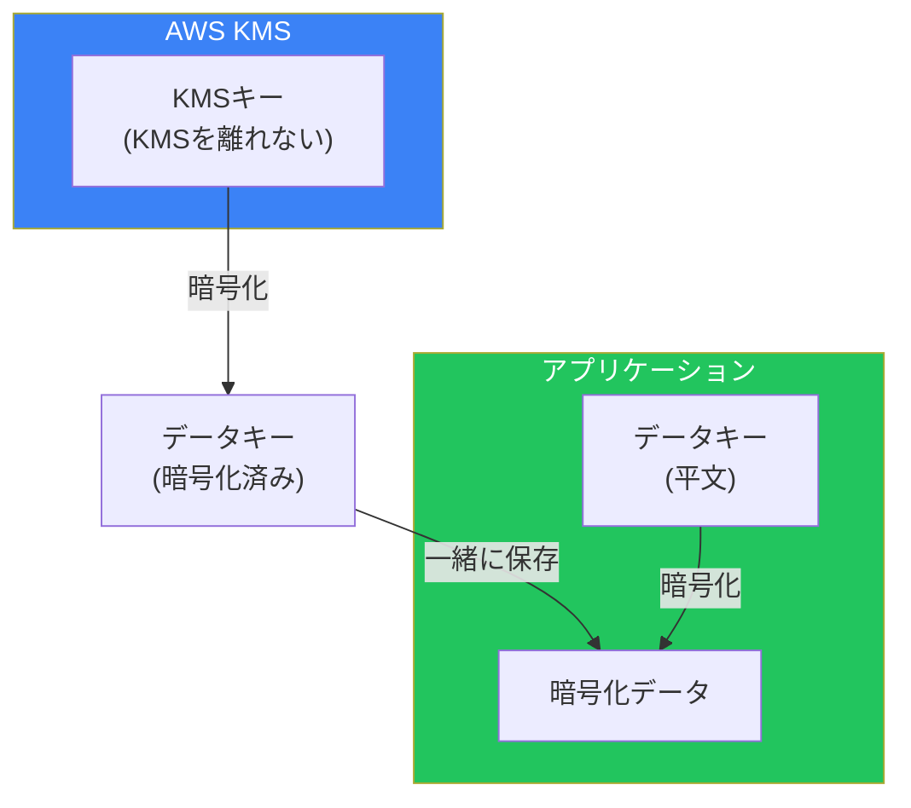
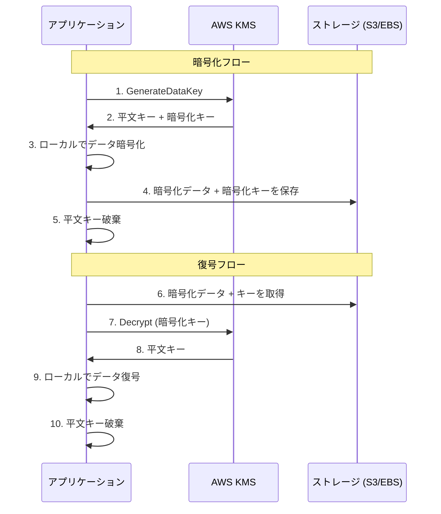

データはほとんどの組織にとって最も価値のある資産です。顧客情報、財務記録、知的財産、運用データ—これらが悪意ある第三者の手に渡れば、壊滅的な結果を招く可能性があります。AWSはデータ保護のための複数のレイヤーを提供しており、その中心にあるのがAWS Key Management Service（KMS）です。

## なぜデータ保護が重要なのか

データ保護の目標はシンプルです：ストレージメディアが侵害された場合でも、認可された当事者のみがデータを読み取れるようにすることです。

### 物理アクセスの問題

従来のデータセンターでは、物理的なセキュリティが暗黙のデータ保護を提供していました。建物へのアクセスを制御できれば、ハードドライブへのアクセスも制御できました。誰かがデータベースを持ち出すことは単純には不可能でした。

クラウドでは、この物理的な障壁が同じ形では存在しません。データはAWSが管理する共有インフラ上に存在します。AWSは優れた物理的セキュリティを維持していますが、あなたが物理的に制御していないシステムにデータを預けていることになります。暗号化はこの信頼関係を変革します：たとえ誰かが物理ストレージにアクセスしたとしても、暗号化されたデータはキーがなければ無価値です。

### コンプライアンスと規制要件

多くの規制が暗号化を義務付けています：

- **PCI DSS**はカード会員データの暗号化を要求
- **HIPAA**は保護対象医療情報の暗号化を要求
- **GDPR**は暗号化を個人データの主要なセキュリティ対策として認識
- **SOC 2**はセキュリティコントロールの一部として暗号化を評価

適切な暗号化とキー管理なしには、コンプライアンスは不可能です。

### 内部者の脅威

暗号化は内部者の脅威からも保護します。データベース管理者はデータベース内のデータにアクセスできます。ストレージ管理者は生のストレージにアクセスできます。適切な暗号化とキーの分離により、これらの特権ユーザーでさえ、明示的なキーアクセス権限がなければデータを読み取ることができません。

## AWS KMSを理解する

AWS Key Management Service（KMS）は、暗号化キーを作成・制御するためのマネージドサービスです。KMSを理解するには、いくつかの重要な概念を理解する必要があります。

### KMSが実際に行うこと

KMSの主要な仕事は1つ：暗号化キーを保護し管理することです。あなたのデータを保存するのではなく、データを暗号化するために使用されるキーを保存・保護します。

KMSでデータを暗号化する際、データを暗号化のためにAWSに送信しているわけではありません（大規模なデータセットでは現実的ではありません）。代わりに、KMSはアプリケーションがローカルで暗号化に使用するキーを生成します。この区別は、AWS暗号化の実際の仕組みを理解する上で重要です。

### KMSキー：階層構造

KMSは階層的なキー構造を使用します：



**KMSキー（旧称カスタマーマスターキー）**：これらはKMSに保存されるトップレベルのキーです。暗号化されていない状態でKMSを離れることはありません。KMSキーは少量のデータ（最大4KB）を直接暗号化するか、より一般的にはデータキーを暗号化します。

**データキー**：実際にデータを暗号化するために使用されるキーです。KMSはオンデマンドでデータキーを生成し、KMSキーで暗号化して、平文キー（即時使用用）と暗号化キー（保存用）の両方を提供します。このパターンはエンベロープ暗号化と呼ばれます。

### KMSキーのタイプ

AWSは3種類のKMSキーを提供しており、それぞれトレードオフがあります：

**AWSマネージドキー**は、AWSサービスで暗号化を有効にすると自動的に作成されます。AWSがすべての管理—ローテーション、アクセスポリシー、ライフサイクル—を処理します。これらのキーを直接管理することはできません。便利ですが、制御は最小限です。カスタムアクセス制御が不要な基本的な暗号化に使用します。

**カスタマーマネージドキー**は、自分で作成・管理するキーです。キーポリシー（誰がキーを使用できるか）、ローテーションスケジュール、ライフサイクルを制御します。これらのキーを無効化または削除できます。月額$1/キーのコストがかかります。データを復号できる人を制御する必要がある場合や、アカウント間で暗号化データを共有する必要がある場合に使用します。

**カスタムキーストア（CloudHSMバック）**は、自分が制御する専用ハードウェアセキュリティモジュールにキーを保存します。AWSはこれらのキーにアクセスできません。最高レベルの制御を提供しますが、重大な運用上の複雑さを伴います。専用キーストレージを義務付ける厳格な規制要件に使用します。

### キーポリシー：誰がキーを使用できるか

すべてのKMSキーには、誰がそれを使用できるかを定義するキーポリシーがあります。これはIAMポリシーとは別ですが、両方が一緒に評価されます。

デフォルトのキーポリシーはrootアカウントにフルアクセスを与え、IAMポリシーが権限を付与することを許可します。より制限的なポリシーでは：

- キーの使用を特定のロールやサービスに制限
- リクエストが特定のAWSサービス経由で来ることを要求（`kms:ViaService`条件を使用）
- 特定のプリンシパルへのクロスアカウントアクセスを有効化
- キー管理とキー使用を分離

キーポリシーを理解することは、暗号化に対する最小権限を実装するために不可欠です。

## エンベロープ暗号化：なぜ存在するのか

エンベロープ暗号化は、データをデータキーで暗号化し、そのデータキーをKMSキーで暗号化するパターンです。これは余分な複雑さに見えます—なぜKMSで直接すべてを暗号化しないのでしょうか？

### パフォーマンスの問題

KMSはネットワークサービスです。すべての暗号化操作にはAWSへのAPI呼び出しが必要です。少数の操作であれば問題ありません。しかし、数百万のデータベースレコードを暗号化する場合、レイテンシは許容できないでしょう。

エンベロープ暗号化はKMS呼び出しを制限することでこれを解決します。KMSを一度呼び出してデータキーを生成し、そのキーをローカルで使用して任意の量のデータを暗号化（高速、ネットワーク呼び出しなし）し、暗号化されたデータキーをデータと一緒に保存します。

### サイズ制限の問題

KMSは最大4KBのデータしか直接暗号化できません。これは意図的な設計選択です—KMSはバルクデータ暗号化ではなく、キー保護に最適化されています。エンベロープ暗号化はこの制限を完全に取り除きます。

### 実際の動作



暗号化時：
1. KMS GenerateDataKeyを呼び出して、平文データキーとその暗号化形式を取得
2. 平文データキーを使用してローカルでデータを暗号化
3. 平文データキーをメモリから破棄
4. 暗号化されたデータキーを暗号化データと一緒に保存

復号時：
1. ストレージから暗号化されたデータキーを取得
2. KMS Decryptを呼び出して平文データキーを取得
3. 平文データキーを使用してローカルでデータを復号
4. 平文データキーをメモリから破棄

暗号化されたデータキーはKMSアクセスなしには無価値です。平文キーはメモリ内に一時的にのみ存在します。これにより、優れたパフォーマンスと強力なセキュリティが両立されます。

## AWSサービス全体での保存時暗号化

ほとんどのAWSストレージサービスは、保存時暗号化のためにKMSと統合しています。

### S3暗号化オプション

S3はいくつかの暗号化オプションを提供しています：

**SSE-S3**はS3が完全に管理するキーを使用します。キーの可視性や制御はありません。最もシンプルなオプションですが、制御は最小限です。

**SSE-KMS**はKMSキーを使用します。キー使用のCloudTrailロギングを取得でき、キーポリシーを通じてアクセスを制御でき、きめ細かい制御のためにカスタマーマネージドキーを使用できます。ほとんどのユースケースで推奨されるオプションです。

**SSE-C**（カスタマー提供キー）は、各リクエストで暗号化キーを提供する必要があります。AWSはキーを保存しません—キー管理はあなたの責任です。KMSの使用を妨げる特定の要件がある場合にのみ使用します。

**クライアントサイド暗号化**は、S3に送信する前にデータを暗号化することを意味します。AWSは平文データを見ることがありません。AWSでさえデータにアクセスできないエンドツーエンド暗号化が必要な場合に使用します。

重要な機能は**S3 Bucket Keys**で、S3が個々のオブジェクトキーを暗号化するために使用するバケットレベルのキーをキャッシュすることで、KMSコストを削減します。多くのオブジェクトを持つバケットでは、KMSリクエストコストを99%削減できます。

### EBS暗号化

EBSボリュームはKMSキーで暗号化できます。暗号化を有効にすると：

- ボリューム上のすべての保存データが暗号化される
- ボリュームのすべてのスナップショットが暗号化される
- インスタンスとボリューム間を移動するすべてのデータが暗号化される

アカウントのデフォルトEBS暗号化を有効にして、すべての新しいボリュームが自動的に暗号化されるようにできます。暗号化されていないボリュームを直接暗号化することはできません—暗号化されたスナップショットを作成し、そこから復元する必要があります。

### RDS暗号化

RDS暗号化はストレージレイヤーで機能します：

- ディスク上のすべてのデータが暗号化される
- 自動バックアップとスナップショットが暗号化される
- 同じリージョンのリードレプリカは同じキーを使用

重要な制限：既存の暗号化されていないRDSインスタンスを暗号化することはできません。暗号化されたスナップショットを作成（暗号化を有効にしてコピー）し、新しいインスタンスに復元する必要があります。

### DynamoDB暗号化

DynamoDBは、AWS所有キー（デフォルト、無料）またはカスタマーマネージドKMSキーを使用した保存時暗号化をサポートしています。KMSキーを使用する場合、すべてのテーブルデータ、インデックス、ストリームが暗号化されます。

## AWS CloudHSM：ハードウェア制御が必要な場合

CloudHSMは、VPC内に専用のハードウェアセキュリティモジュール（HSM）を提供します。AWSがHSMインフラを管理するKMSとは異なり、CloudHSMはHSMハードウェアへの独占的なアクセスを提供します。

### CloudHSMを使用するタイミング

CloudHSMは以下の場合に適切です：

**規制要件が専用キーストレージを義務付けている場合**：一部のコンプライアンスフレームワーク（特定のユースケースでのPCI DSSなど）は、自分だけが制御する専用ハードウェアに暗号化キーを保存することを要求します。

**FIPS 140-2 Level 3コンプライアンスが必要な場合**：KMSはLevel 2を提供し、CloudHSMはLevel 3を提供します。Level 3には改ざん証拠と改ざん応答メカニズムが含まれます。

**特定の暗号化アルゴリズムが必要な場合**：CloudHSMは、カスタムPKCS#11操作を含め、KMSよりも幅広いアルゴリズムをサポートします。

**パフォーマンス要件が専用ハードウェアを求める場合**：CloudHSMは、KMSのマルチテナント変動なしに予測可能なレイテンシを提供します。

### 運用の現実

CloudHSMには重大な運用上のオーバーヘッドが伴います：

- HSMクラスターを管理する（ただしAWSがハードウェアを管理）
- 暗号化マテリアルのバックアップとリカバリに責任を持つ
- HSM内のユーザーアカウントとキーを管理する
- HSM認証情報へのアクセスを失った場合、AWSは復旧できない

ほとんどのワークロードでは、KMSははるかに少ない運用負担で十分なセキュリティを提供します。特定の要件がそれを求める場合にのみCloudHSMを使用してください。

### カスタムキーストア：ハイブリッドアプローチ

KMSカスタムキーストアを使用すると、標準のKMS APIを通じてCloudHSMバックのキーを使用できます。これにより：

- CloudHSMの制御とコンプライアンス
- KMS APIのシンプルさ
- KMSを使用するAWSサービスとの統合

このハイブリッドアプローチは、CloudHSMコンプライアンスが必要だが標準のAWSサービス統合を使用したい場合に、しばしば最良の選択です。

## AWS Secrets Manager：アプリケーションシークレットの管理

Secrets Managerは、アプリケーションシークレット—データベース認証情報、APIキー、OAuthトークン、類似の機密設定—を管理するために特別に設計されています。

### なぜKMSを直接使用しないのか

シークレットをKMSで暗号化してParameter StoreやS3に保存することもできます。Secrets Managerは以下を通じて価値を追加します：

**自動ローテーション**：Secrets Managerは、アプリケーションのダウンタイムなしにデータベース認証情報を自動的にローテーションできます。新しい認証情報の作成、データベースの更新、アプリケーションの移行の調整を処理します。

**バージョン管理**：Secrets Managerはシークレットの複数のバージョンを維持し、認証情報変更の段階的なロールアウトとロールバックを可能にします。

**ネイティブデータベース統合**：サポートされているデータベース（RDS、DocumentDB、Redshift）では、Secrets Managerがローテーションワークフロー全体を自動的に処理します。

**きめ細かいアクセス制御**：リソースベースのポリシーとIAMを組み合わせて、誰がどのシークレットにアクセスできるかを正確に制御します。

### ローテーションの課題

認証情報のローテーションは見かけ以上に難しいです。以下が必要です：

1. 新しい認証情報を生成
2. データベースを更新してそれらを受け入れる
3. アプリケーションを移行してそれらを使用
4. 移行中に古い認証情報が有効なままであることを確認
5. 最終的に古い認証情報を廃止

Secrets Managerは、これらの課題を体系的に処理する4ステップのローテーションプロセス（createSecret、setSecret、testSecret、finishSecret）でこれを解決します。

## 転送中の暗号化

データ保護は保存時のデータだけではありません。ネットワークを移動するデータも保護が必要です。

### 至る所でTLS

現代のAWSサービスはデフォルトで転送中のデータにTLSを使用します。あなたの責任は以下を確保することです：

- アプリケーションがHTTPSエンドポイント（HTTPではなく）を使用
- 古いTLSバージョンが無効化されている（TLS 1.2以上が最低要件）
- アプリケーションコードで証明書検証が無効化されていない
- 利用可能な場合はプライベート接続（VPCエンドポイント、PrivateLink）を使用

### 転送中の暗号化の強制

S3バケットポリシーは、HTTPSを使用しないリクエストを拒否できます：

```json
{
  "Effect": "Deny",
  "Principal": "*",
  "Action": "s3:*",
  "Resource": "arn:aws:s3:::bucket/*",
  "Condition": {
    "Bool": {"aws:SecureTransport": "false"}
  }
}
```

IAM条件を通じて他のサービスでも同様の強制が可能です。

## よくある間違い

### 制御が必要な時にAWSマネージドキーを使用する

AWSマネージドキーは便利ですが、オプションを制限します：
- CloudTrailでキー使用を確認できない（ログエントリはどのデータにアクセスされたかを示さない）
- クロスアカウントアクセスを付与できない
- キーを無効化または削除できない
- カスタムキーポリシーを適用できない

これらの機能のいずれかが必要になる可能性がある場合は、最初からカスタマーマネージドキーを使用してください。

### キーローテーションの計画を怠る

KMSはカスタマーマネージドキーの自動キーローテーション（年次）をサポートしています。ローテーションが発生すると、KMSは以前のバージョンで暗号化されたデータを復号するために古いキーマテリアルを保持します。最初からローテーションを有効にしてください—アプリケーションに対して透過的です。

シークレットについては、認証情報のローテーションがどのように機能するかを計画してください。アプリケーションは認証情報の更新を処理しますか？分散システム間でローテーションをどのように調整しますか？

### キー削除の影響を無視する

KMSキーの削除をスケジュールすると、待機期間（7〜30日）が設定されます。削除されると、そのキーで暗号化されたデータは永久にアクセス不能になります。復旧はありません。

削除の代わりにキーの無効化を検討してください—無効化されたキーは再有効化できます。すべての暗号化データが再暗号化されたか、もう必要ないことが確実な場合にのみキーを削除してください。

### キーアクセスの過剰な権限付与

多くのプリンシパルに`kms:*`を許可するキーポリシーは、暗号化の目的を無効にします。暗号化されたデータにアクセスできるすべての人がキーにもアクセスできる場合、暗号化は最小限の保護しか提供しません。

最小権限を適用してください：キー管理者（管理はできるがキーを使用できない）とキーユーザー（暗号化/復号はできるが管理できない）を分離してください。条件を使用して、キー使用を特定のサービスやコンテキストに制限してください。

## まとめ

AWSのデータ保護は、適切なキー管理を伴う暗号化を中心としています：

| サービス | 目的 | 使用するタイミング |
|---------|-----|-----------------|
| KMS | キー管理と暗号化 | ほとんどの暗号化ニーズ |
| CloudHSM | 専用ハードウェアキーストレージ | 厳格なコンプライアンス要件 |
| Secrets Manager | アプリケーションシークレット管理 | データベース認証情報、APIキー |
| S3 SSE-KMS | オブジェクト暗号化 | 監査要件のあるS3データ |
| EBS/RDS暗号化 | ボリューム/データベース暗号化 | すべての本番ストレージ |

重要な原則：

- **デフォルトで暗号化**：すべてのストレージサービスで暗号化を有効に
- **カスタマーマネージドキーを使用**：制御やクロスアカウントアクセスが必要な場合
- **エンベロープ暗号化を実装**：アプリケーションレベルの暗号化に
- **自動的に認証情報をローテーション**：Secrets Managerを使用
- **キー管理とキー使用を分離**：多層防御のために
- **キーライフサイクルを計画**：ローテーション、無効化、最終的な削除

暗号化は最後の防衛線を提供します—他のコントロールが失敗し攻撃者がストレージにアクセスした場合でも、適切に暗号化されたデータは保護されたままです。キー管理の複雑さはこの保護の代償であり、AWSサービスはその複雑さを管理可能にします。

## 参考文献

- [AWS KMS Developer Guide](https://docs.aws.amazon.com/kms/latest/developerguide/)
- [AWS KMS Best Practices](https://docs.aws.amazon.com/kms/latest/developerguide/best-practices.html)
- [AWS CloudHSM User Guide](https://docs.aws.amazon.com/cloudhsm/latest/userguide/)
- [AWS Secrets Manager User Guide](https://docs.aws.amazon.com/secretsmanager/)
- Crane, Dylan. *AWS Security*. Manning Publications, 2022.
- Muñoz, Mauricio, et al. *Mastering AWS Security, 2nd Edition*. Packt, 2024.
