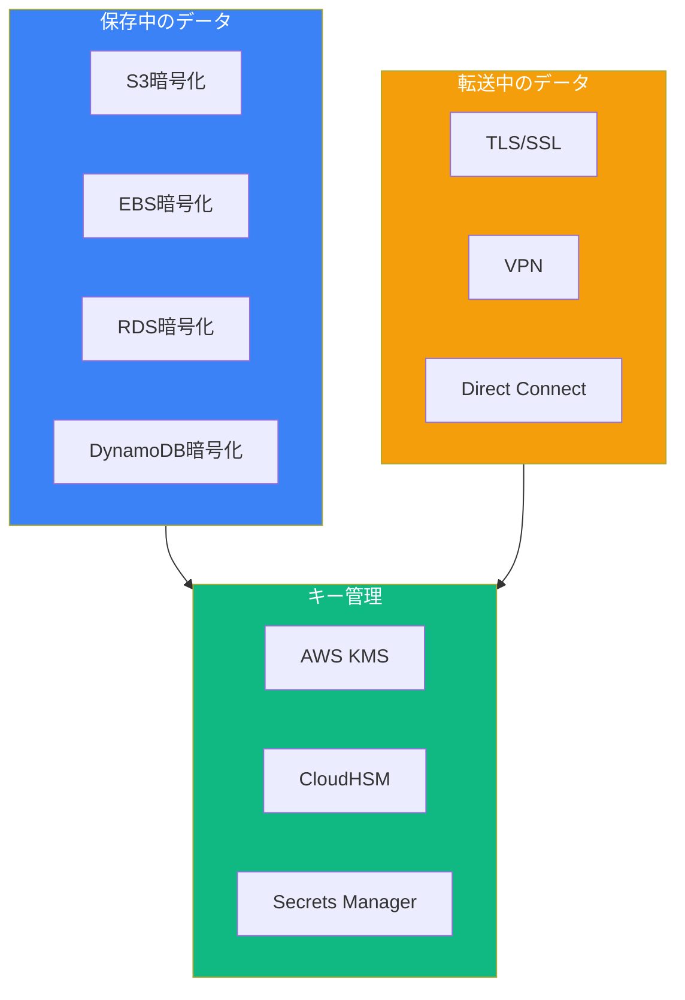
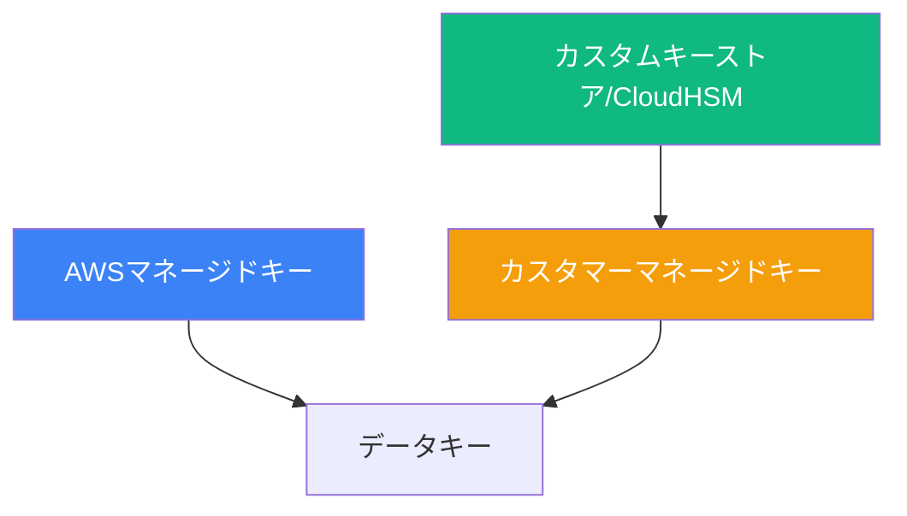
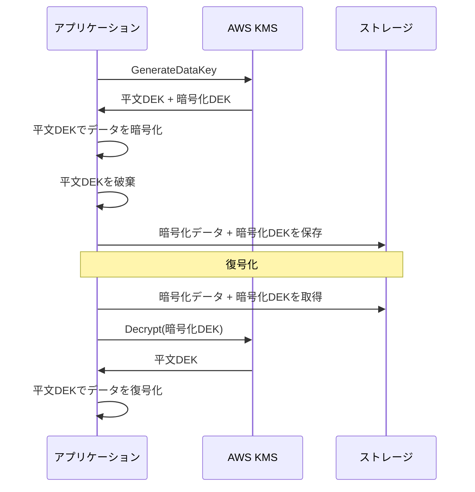
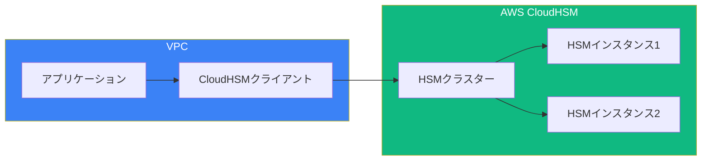

データ保護は、AWSセキュリティスペシャリティ認定の重要なドメインです。AWS Key Management Service（KMS）と暗号化戦略を理解することは、保存中および転送中のデータを保護するために不可欠です。

## データ保護の概要



## AWS KMSキータイプ

### キー階層



### 比較

| 機能 | AWSマネージド | カスタマーマネージド | カスタムキーストア |
|-----|-------------|-------------------|-----------------|
| 作成 | AWSが作成 | ユーザーが作成 | HSMで作成 |
| ローテーション | 自動（年次） | オプション（年次） | 手動 |
| キーポリシー | AWSが管理 | ユーザーが管理 | ユーザーが管理 |
| 削除 | 削除不可 | 7-30日待機 | 即時 |
| コスト | 無料 | $1/月 | HSMコスト |
| ユースケース | 基本的な暗号化 | カスタムポリシー | コンプライアンス |

### カスタマーマネージドキーの作成

```python
import boto3

kms = boto3.client('kms')

# 対称暗号化キーを作成
response = kms.create_key(
    Description='アプリケーション暗号化キー',
    KeyUsage='ENCRYPT_DECRYPT',
    KeySpec='SYMMETRIC_DEFAULT',
    Origin='AWS_KMS',
    MultiRegion=False,
    Tags=[
        {'TagKey': 'Environment', 'TagValue': 'Production'},
        {'TagKey': 'Application', 'TagValue': 'MyApp'}
    ]
)

key_id = response['KeyMetadata']['KeyId']

# 参照しやすいようにエイリアスを作成
kms.create_alias(
    AliasName='alias/my-app-key',
    TargetKeyId=key_id
)

# 自動キーローテーションを有効化
kms.enable_key_rotation(KeyId=key_id)
```

## キーポリシー

### デフォルトキーポリシー

```json
{
  "Version": "2012-10-17",
  "Statement": [
    {
      "Sid": "Enable IAM User Permissions",
      "Effect": "Allow",
      "Principal": {
        "AWS": "arn:aws:iam::123456789012:root"
      },
      "Action": "kms:*",
      "Resource": "*"
    }
  ]
}
```

### 制限的なキーポリシー

```json
{
  "Version": "2012-10-17",
  "Statement": [
    {
      "Sid": "Allow Key Administrators",
      "Effect": "Allow",
      "Principal": {
        "AWS": "arn:aws:iam::123456789012:role/KeyAdministrator"
      },
      "Action": [
        "kms:Create*",
        "kms:Describe*",
        "kms:Enable*",
        "kms:List*",
        "kms:Put*",
        "kms:Update*",
        "kms:Revoke*",
        "kms:Disable*",
        "kms:Get*",
        "kms:Delete*",
        "kms:ScheduleKeyDeletion",
        "kms:CancelKeyDeletion"
      ],
      "Resource": "*"
    },
    {
      "Sid": "Allow Key Usage",
      "Effect": "Allow",
      "Principal": {
        "AWS": "arn:aws:iam::123456789012:role/ApplicationRole"
      },
      "Action": [
        "kms:Encrypt",
        "kms:Decrypt",
        "kms:GenerateDataKey*"
      ],
      "Resource": "*",
      "Condition": {
        "StringEquals": {
          "kms:ViaService": "s3.us-east-1.amazonaws.com"
        }
      }
    },
    {
      "Sid": "Allow Grants for AWS Services",
      "Effect": "Allow",
      "Principal": {
        "AWS": "arn:aws:iam::123456789012:role/ApplicationRole"
      },
      "Action": [
        "kms:CreateGrant",
        "kms:ListGrants",
        "kms:RevokeGrant"
      ],
      "Resource": "*",
      "Condition": {
        "Bool": {
          "kms:GrantIsForAWSResource": "true"
        }
      }
    }
  ]
}
```

## エンベロープ暗号化



### 実装

```python
import boto3
from cryptography.fernet import Fernet
import base64

kms = boto3.client('kms')

def encrypt_data(key_id: str, plaintext: bytes) -> tuple:
    # データキーを生成
    response = kms.generate_data_key(
        KeyId=key_id,
        KeySpec='AES_256'
    )

    plaintext_key = response['Plaintext']
    encrypted_key = response['CiphertextBlob']

    # 平文キーでデータを暗号化
    fernet = Fernet(base64.urlsafe_b64encode(plaintext_key))
    encrypted_data = fernet.encrypt(plaintext)

    # 暗号化データと暗号化キーを返す（平文キーは破棄）
    return encrypted_data, encrypted_key


def decrypt_data(encrypted_data: bytes, encrypted_key: bytes) -> bytes:
    # データキーを復号化
    response = kms.decrypt(CiphertextBlob=encrypted_key)
    plaintext_key = response['Plaintext']

    # データを復号化
    fernet = Fernet(base64.urlsafe_b64encode(plaintext_key))
    return fernet.decrypt(encrypted_data)


# 使用例
key_id = 'alias/my-app-key'
data = b'機密情報'

encrypted_data, encrypted_key = encrypt_data(key_id, data)
decrypted_data = decrypt_data(encrypted_data, encrypted_key)
```

## S3暗号化

### サーバーサイド暗号化オプション

| オプション | キー管理 | ユースケース |
|----------|---------|------------|
| SSE-S3 | AWSが管理 | デフォルト暗号化 |
| SSE-KMS | KMSが管理 | 監査証跡、キーローテーション |
| SSE-C | 顧客が提供 | 完全なキー制御 |
| クライアントサイド | アプリが管理 | エンドツーエンド暗号化 |

### SSE-KMS設定

```python
import boto3

s3 = boto3.client('s3')

# バケットのデフォルト暗号化を有効化
s3.put_bucket_encryption(
    Bucket='my-secure-bucket',
    ServerSideEncryptionConfiguration={
        'Rules': [
            {
                'ApplyServerSideEncryptionByDefault': {
                    'SSEAlgorithm': 'aws:kms',
                    'KMSMasterKeyID': 'alias/my-bucket-key'
                },
                'BucketKeyEnabled': True  # KMSコストを削減
            }
        ]
    }
)

# 特定のキーでアップロード
s3.put_object(
    Bucket='my-secure-bucket',
    Key='sensitive-file.txt',
    Body=b'機密データ',
    ServerSideEncryption='aws:kms',
    SSEKMSKeyId='alias/my-bucket-key'
)
```

### バケットポリシーで暗号化を強制

```json
{
  "Version": "2012-10-17",
  "Statement": [
    {
      "Sid": "DenyUnencryptedUploads",
      "Effect": "Deny",
      "Principal": "*",
      "Action": "s3:PutObject",
      "Resource": "arn:aws:s3:::my-secure-bucket/*",
      "Condition": {
        "StringNotEquals": {
          "s3:x-amz-server-side-encryption": "aws:kms"
        }
      }
    },
    {
      "Sid": "DenyWrongKMSKey",
      "Effect": "Deny",
      "Principal": "*",
      "Action": "s3:PutObject",
      "Resource": "arn:aws:s3:::my-secure-bucket/*",
      "Condition": {
        "StringNotEquals": {
          "s3:x-amz-server-side-encryption-aws-kms-key-id": "arn:aws:kms:us-east-1:123456789012:key/key-id"
        }
      }
    }
  ]
}
```

## EBS暗号化

```python
import boto3

ec2 = boto3.client('ec2')

# アカウントのデフォルトEBS暗号化を有効化
ec2.enable_ebs_encryption_by_default()

# デフォルトKMSキーを設定
ec2.modify_ebs_default_kms_key_id(
    KmsKeyId='alias/ebs-default-key'
)

# 暗号化ボリュームを作成
response = ec2.create_volume(
    AvailabilityZone='us-east-1a',
    Size=100,
    VolumeType='gp3',
    Encrypted=True,
    KmsKeyId='alias/my-ebs-key'
)

# 暗号化スナップショットを作成
ec2.create_snapshot(
    VolumeId='vol-12345678',
    Description='暗号化スナップショット'
)
```

## RDS暗号化

```python
import boto3

rds = boto3.client('rds')

# 暗号化RDSインスタンスを作成
response = rds.create_db_instance(
    DBInstanceIdentifier='secure-database',
    DBInstanceClass='db.t3.medium',
    Engine='mysql',
    MasterUsername='admin',
    MasterUserPassword='secure-password',
    AllocatedStorage=100,
    StorageEncrypted=True,
    KmsKeyId='alias/rds-encryption-key',
    EnableIAMDatabaseAuthentication=True
)

# 暗号化スナップショットを作成
rds.create_db_snapshot(
    DBSnapshotIdentifier='secure-snapshot',
    DBInstanceIdentifier='secure-database'
)

# 新しいKMSキーでスナップショットをコピー（再暗号化）
rds.copy_db_snapshot(
    SourceDBSnapshotIdentifier='secure-snapshot',
    TargetDBSnapshotIdentifier='re-encrypted-snapshot',
    KmsKeyId='alias/new-rds-key'
)
```

## AWS CloudHSM



### CloudHSM vs KMS

| 機能 | AWS KMS | CloudHSM |
|-----|---------|----------|
| キー保管 | AWSが管理 | 顧客が制御するHSM |
| コンプライアンス | FIPS 140-2 Level 2 | FIPS 140-2 Level 3 |
| キータイプ | 対称、RSA、ECC | 対称、RSA、ECC、カスタム |
| パフォーマンス | 共有 | 専用 |
| アクセス | API | 直接HSMアクセス |
| コスト | リクエスト単位 | HSM時間単位 |
| ユースケース | ほとんどのワークロード | 厳格なコンプライアンス |

### CloudHSMとKMSの統合

```python
import boto3

kms = boto3.client('kms')

# CloudHSMを基盤としたカスタムキーストアを作成
response = kms.create_custom_key_store(
    CustomKeyStoreName='my-hsm-key-store',
    CloudHsmClusterId='cluster-xxx',
    TrustAnchorCertificate=trust_anchor_cert,
    KeyStorePassword='hsm-password'
)

key_store_id = response['CustomKeyStoreId']

# カスタムキーストアに接続
kms.connect_custom_key_store(
    CustomKeyStoreId=key_store_id
)

# カスタムキーストアでキーを作成
key = kms.create_key(
    CustomKeyStoreId=key_store_id,
    Origin='AWS_CLOUDHSM',
    Description='HSMを基盤とした暗号化キー'
)
```

## AWS Secrets Manager

```python
import boto3
import json

secrets = boto3.client('secretsmanager')

# シークレットを作成
response = secrets.create_secret(
    Name='prod/database/credentials',
    Description='本番データベース認証情報',
    SecretString=json.dumps({
        'username': 'admin',
        'password': 'super-secret-password',
        'host': 'db.example.com',
        'port': 3306
    }),
    KmsKeyId='alias/secrets-key',
    Tags=[
        {'Key': 'Environment', 'Value': 'Production'}
    ]
)

# 自動ローテーションを有効化
secrets.rotate_secret(
    SecretId='prod/database/credentials',
    RotationLambdaARN='arn:aws:lambda:region:account:function:rotate-secret',
    RotationRules={
        'AutomaticallyAfterDays': 30
    }
)

# シークレットを取得
response = secrets.get_secret_value(
    SecretId='prod/database/credentials'
)

credentials = json.loads(response['SecretString'])
```

### ローテーションLambda関数

```python
import boto3
import json

def lambda_handler(event, context):
    secret_id = event['SecretId']
    token = event['ClientRequestToken']
    step = event['Step']

    secrets = boto3.client('secretsmanager')

    if step == 'createSecret':
        # 新しいシークレット値を生成
        new_password = generate_password()
        secrets.put_secret_value(
            SecretId=secret_id,
            ClientRequestToken=token,
            SecretString=json.dumps({'password': new_password}),
            VersionStages=['AWSPENDING']
        )

    elif step == 'setSecret':
        # データベースを新しい認証情報で更新
        pending = secrets.get_secret_value(
            SecretId=secret_id,
            VersionStage='AWSPENDING'
        )
        update_database_password(json.loads(pending['SecretString']))

    elif step == 'testSecret':
        # 新しい認証情報をテスト
        pending = secrets.get_secret_value(
            SecretId=secret_id,
            VersionStage='AWSPENDING'
        )
        test_database_connection(json.loads(pending['SecretString']))

    elif step == 'finishSecret':
        # ペンディングを現行に移動
        secrets.update_secret_version_stage(
            SecretId=secret_id,
            VersionStage='AWSCURRENT',
            MoveToVersionId=token,
            RemoveFromVersionId=get_current_version(secret_id)
        )
```

## データ保護のベストプラクティス

### 1. すべての暗号化にKMSを使用

```python
# サービス全体で暗号化を有効化
def enable_encryption():
    # S3
    s3.put_bucket_encryption(
        Bucket='my-bucket',
        ServerSideEncryptionConfiguration={...}
    )

    # EBS
    ec2.enable_ebs_encryption_by_default()

    # RDS - 作成時に
    rds.create_db_instance(StorageEncrypted=True, ...)

    # DynamoDB
    dynamodb.update_table(
        TableName='my-table',
        SSESpecification={'Enabled': True, 'SSEType': 'KMS'}
    )
```

### 2. 転送中の暗号化を強制

```python
# HTTPSを強制するS3バケットポリシー
{
    "Effect": "Deny",
    "Principal": "*",
    "Action": "s3:*",
    "Resource": ["arn:aws:s3:::bucket/*"],
    "Condition": {
        "Bool": {"aws:SecureTransport": "false"}
    }
}
```

### 3. キーローテーションを実装

```python
# KMSキーの自動ローテーションを有効化
kms.enable_key_rotation(KeyId='alias/my-key')

# Secrets Managerの場合
secrets.rotate_secret(
    SecretId='my-secret',
    RotationRules={'AutomaticallyAfterDays': 30}
)
```

### 4. キーアクセスに最小権限を使用

```json
{
  "Effect": "Allow",
  "Action": ["kms:Decrypt"],
  "Resource": "arn:aws:kms:region:account:key/key-id",
  "Condition": {
    "StringEquals": {
      "kms:ViaService": "s3.us-east-1.amazonaws.com"
    }
  }
}
```

## まとめ

| サービス | 目的 | 主な機能 |
|---------|-----|---------|
| AWS KMS | キー管理 | CMK、自動ローテーション、キーポリシー |
| CloudHSM | ハードウェアセキュリティ | FIPS 140-2 Level 3、専用HSM |
| Secrets Manager | シークレット保管 | 自動ローテーション、バージョニング |
| S3 SSE | オブジェクト暗号化 | SSE-S3、SSE-KMS、SSE-C |
| EBS暗号化 | ボリューム暗号化 | デフォルト暗号化、スナップショット暗号化 |

重要なポイント：

- 制御と監査のためにカスタマーマネージドキーを使用
- 大きなデータにはエンベロープ暗号化を実装
- すべてのストレージサービスでデフォルト暗号化を有効化
- 厳格なコンプライアンス要件にはCloudHSMを使用
- Secrets Managerでシークレットを自動ローテーション
- TLSで転送中の暗号化を強制
- キー使用権限に最小権限を適用
- バケットキーでKMSコストを削減

データ保護は、AWSセキュリティスペシャリティ認定と、コンプライアントで安全なアプリケーション構築に不可欠です。

## 参考文献

- [AWS KMS Developer Guide](https://docs.aws.amazon.com/kms/latest/developerguide/)
- [AWS CloudHSM User Guide](https://docs.aws.amazon.com/cloudhsm/latest/userguide/)
- [AWS Secrets Manager User Guide](https://docs.aws.amazon.com/secretsmanager/)
- Muñoz, Mauricio, et al. *AWS Certified Security Study Guide, 2nd Edition*. Wiley, 2025.
- Book, Adam, and Stuart Scott. *AWS Certified Security – Specialty (SCS-C02) Exam Guide*. Packt, 2024.
