データの可用性と耐久性を確保するために、AWSは各種データストアにレプリケーション機能を提供しています。ユースケースに応じて適切なレプリケーション戦略を選択することが重要です。

## レプリケーションの種類

### 同期 vs 非同期

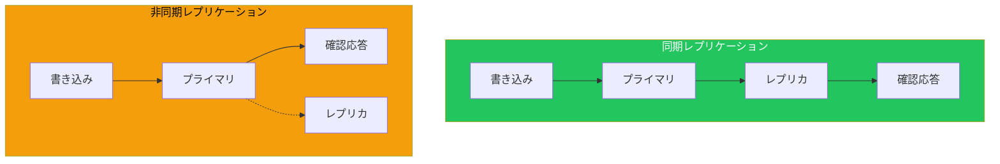

| 特性 | 同期 | 非同期 |
|------|------|--------|
| データ一貫性 | 強い | 結果整合性 |
| レイテンシー | 高い | 低い |
| 可用性への影響 | あり | 少ない |
| 距離 | 近距離向け | 遠距離可能 |

## RDSのレプリケーション

### Multi-AZ配置

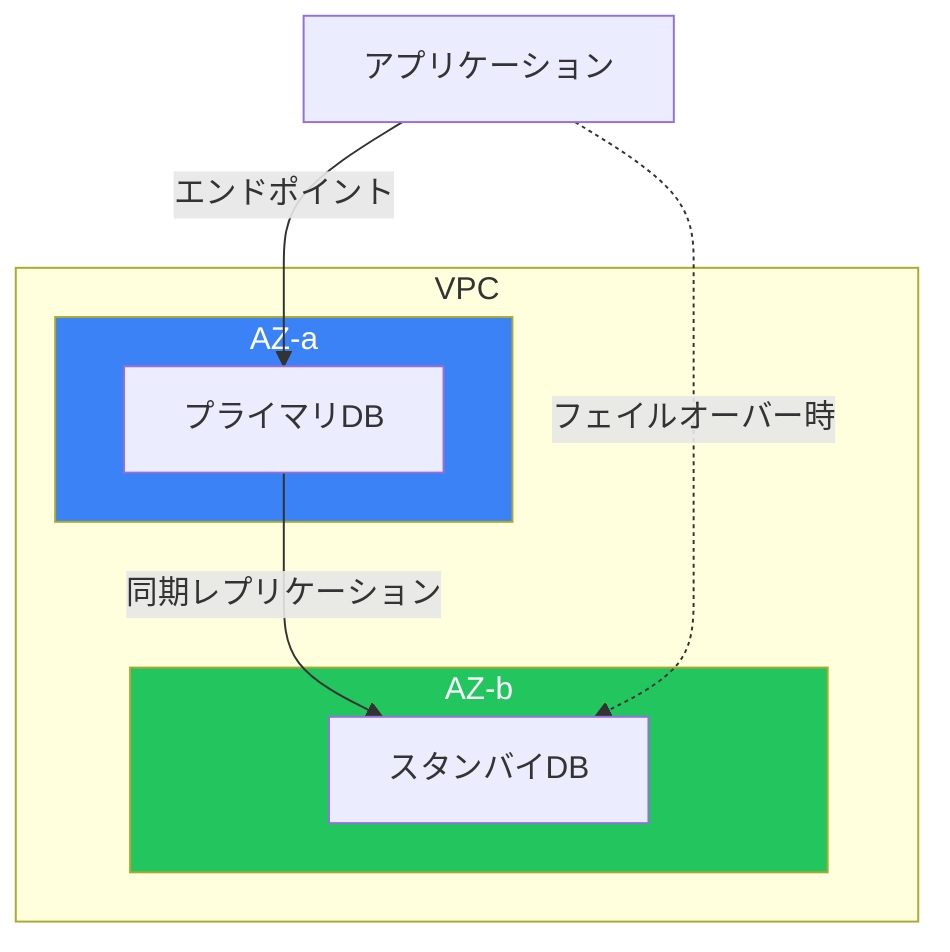

特徴：
- **同期レプリケーション**: データ損失なし
- **自動フェイルオーバー**: 60-120秒
- **単一エンドポイント**: アプリケーション変更不要

### リードレプリカ

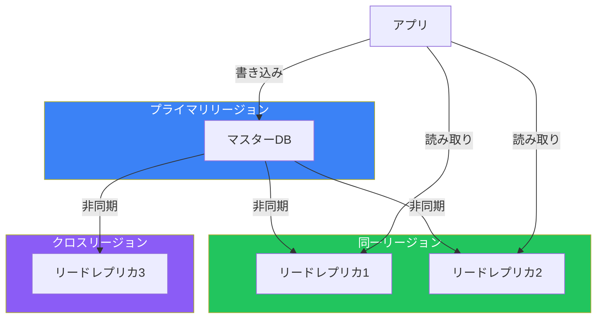

| 用途 | 説明 |
|------|------|
| 読み取りスケーリング | 読み取り負荷の分散 |
| DR | クロスリージョンのバックアップ |
| 移行 | 昇格によるカットオーバー |

### 設定例

```bash
# Multi-AZ有効化
aws rds modify-db-instance \
    --db-instance-identifier mydb \
    --multi-az \
    --apply-immediately

# リードレプリカ作成（クロスリージョン）
aws rds create-db-instance-read-replica \
    --db-instance-identifier mydb-replica \
    --source-db-instance-identifier arn:aws:rds:ap-northeast-1:xxx:db:mydb \
    --region us-west-2
```

## Auroraのレプリケーション

### Aurora レプリカ

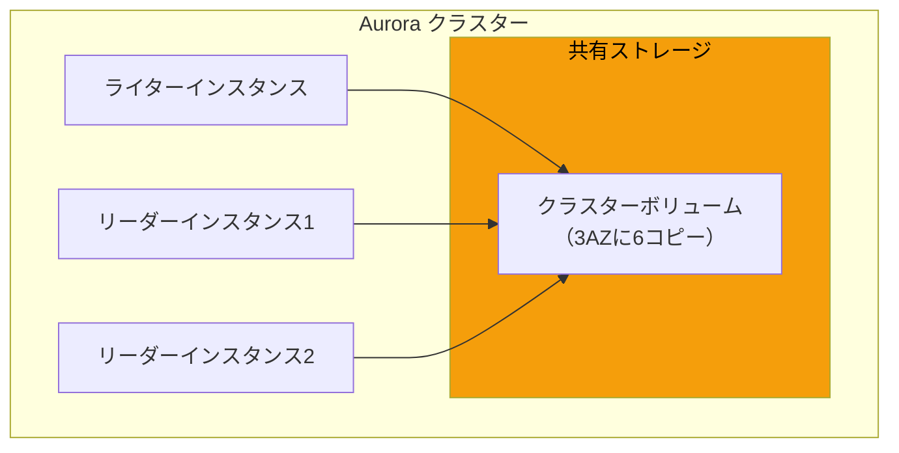

特徴：
- **最大15リーダー**: 高い読み取りスケーラビリティ
- **ミリ秒単位のレプリカラグ**: 共有ストレージのため
- **自動フェイルオーバー**: 30秒以内

### Aurora Global Database

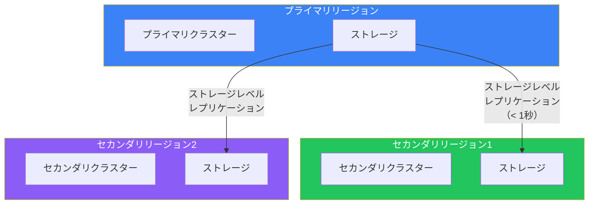

| 特徴 | 詳細 |
|------|------|
| レプリケーションラグ | 通常1秒未満 |
| セカンダリリージョン | 最大5リージョン |
| フェイルオーバー | 計画的: 分単位、非計画: RPO 1秒 |
| ユースケース | グローバルDR、低レイテンシー読み取り |

### 設定例

```bash
# Global Databaseの作成
aws rds create-global-cluster \
    --global-cluster-identifier my-global-db \
    --source-db-cluster-identifier my-primary-cluster \
    --region ap-northeast-1

# セカンダリリージョンにクラスターを追加
aws rds create-db-cluster \
    --db-cluster-identifier my-secondary-cluster \
    --global-cluster-identifier my-global-db \
    --engine aurora-mysql \
    --region us-west-2

# 計画的フェイルオーバー
aws rds failover-global-cluster \
    --global-cluster-identifier my-global-db \
    --target-db-cluster-identifier arn:aws:rds:us-west-2:xxx:cluster:my-secondary-cluster
```

## S3のレプリケーション

### レプリケーションの種類

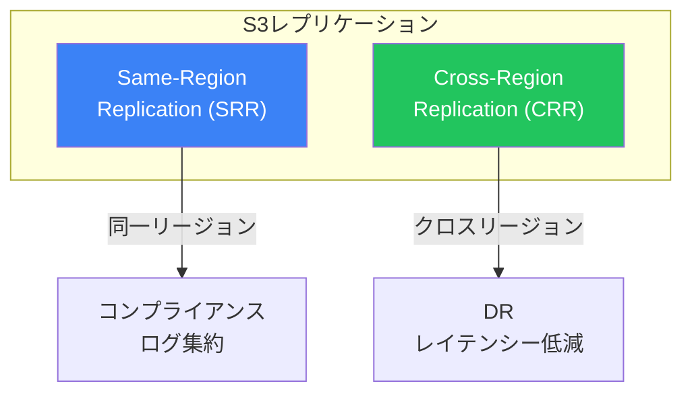

### レプリケーションルール

```json
{
  "Rules": [
    {
      "ID": "ReplicateAll",
      "Status": "Enabled",
      "Priority": 1,
      "Filter": {},
      "Destination": {
        "Bucket": "arn:aws:s3:::destination-bucket",
        "ReplicationTime": {
          "Status": "Enabled",
          "Time": {"Minutes": 15}
        },
        "Metrics": {
          "Status": "Enabled",
          "EventThreshold": {"Minutes": 15}
        }
      },
      "DeleteMarkerReplication": {"Status": "Enabled"}
    }
  ]
}
```

### S3 Replication Time Control (RTC)

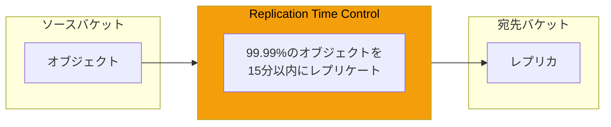

### バッチレプリケーション

既存オブジェクトのレプリケーション：

```bash
# S3 Batch Replicationジョブの作成
aws s3control create-job \
    --account-id 123456789012 \
    --operation '{"S3ReplicateObject":{}}' \
    --manifest '{"Spec":{"Format":"S3BatchOperations_CSV_20180820","Fields":["Bucket","Key"]},"Location":{"ObjectArn":"arn:aws:s3:::manifest-bucket/manifest.csv","ETag":"xxx"}}' \
    --report '{"Bucket":"arn:aws:s3:::report-bucket","Format":"Report_CSV_20180820","Enabled":true,"Prefix":"reports/"}' \
    --priority 10 \
    --role-arn arn:aws:iam::123456789012:role/S3BatchRole
```

## DynamoDBのレプリケーション

### DynamoDB Global Tables

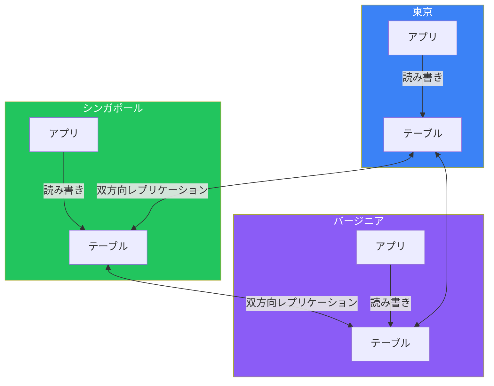

特徴：
- **アクティブ-アクティブ**: 全リージョンで読み書き可能
- **結果整合性**: 通常1秒未満で伝播
- **競合解決**: 最後の書き込みが優先
- **自動**: 追加設定なしでフェイルオーバー

### 設定例

```bash
# Global Tableの作成（既存テーブルにレプリカ追加）
aws dynamodb update-table \
    --table-name MyTable \
    --replica-updates \
        Create={RegionName=us-west-2} \
        Create={RegionName=eu-west-1}

# レプリカの確認
aws dynamodb describe-table --table-name MyTable \
    --query "Table.Replicas"
```

### DynamoDB Streams

変更データキャプチャ：

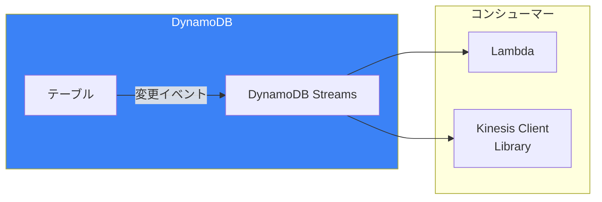

## レプリケーション戦略の選択

### 選択フローチャート

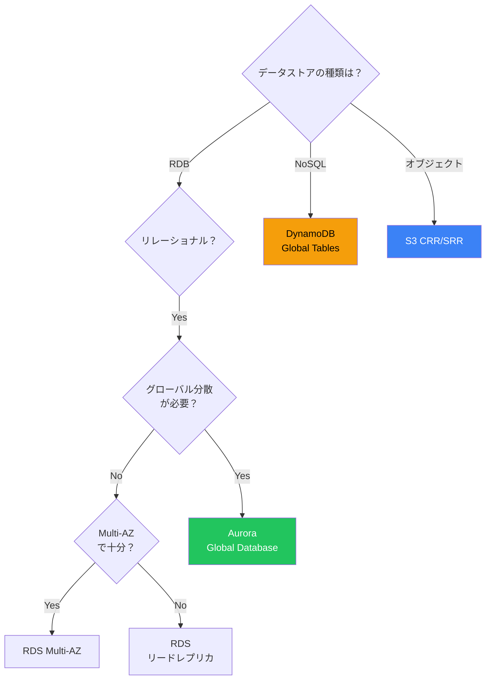

### 比較表

| サービス | レプリケーション | ラグ | フェイルオーバー |
|---------|----------------|------|----------------|
| RDS Multi-AZ | 同期 | 0 | 60-120秒 |
| RDS リードレプリカ | 非同期 | 秒〜分 | 手動昇格 |
| Aurora レプリカ | 同期（ストレージ） | ミリ秒 | 30秒以内 |
| Aurora Global | 非同期 | < 1秒 | 分単位 |
| S3 CRR | 非同期 | 分〜時間 | N/A |
| S3 RTC | 非同期（SLA付き） | 15分以内 | N/A |
| DynamoDB Global | 非同期 | < 1秒 | 自動 |

## ベストプラクティス

### RDS/Aurora

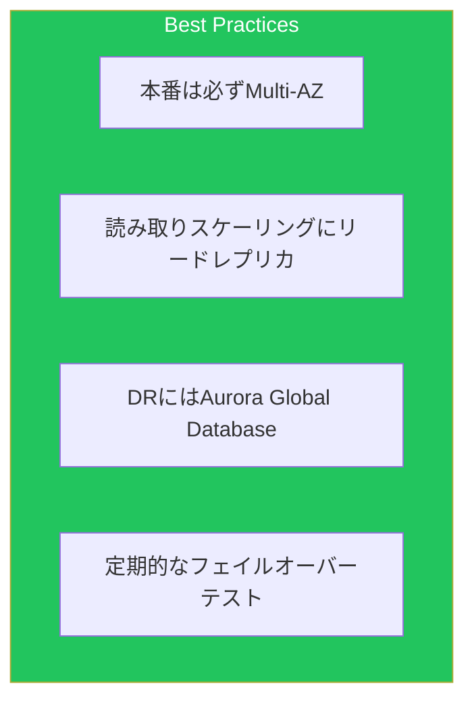

### S3

| 項目 | 推奨 |
|------|------|
| バージョニング | 必須（レプリケーション要件） |
| 暗号化 | ソースと宛先で一貫性を保つ |
| RTCの使用 | RPO要件がある場合 |
| 監視 | レプリケーションメトリクスを監視 |

### DynamoDB

| 項目 | 推奨 |
|------|------|
| キー設計 | ホットパーティションを避ける |
| 競合 | 最終書き込み優先を理解 |
| コスト | レプリカリージョンの書き込みも課金 |

## まとめ

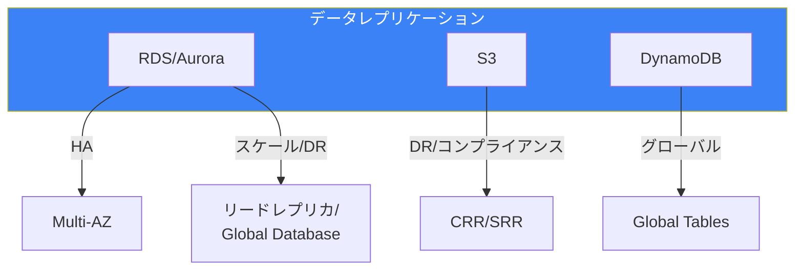

| 要件 | 推奨ソリューション |
|------|------------------|
| RDBの高可用性 | RDS Multi-AZ |
| RDBの読み取りスケール | リードレプリカ |
| グローバルRDB DR | Aurora Global Database |
| オブジェクトDR | S3 CRR |
| グローバルNoSQL | DynamoDB Global Tables |

適切なレプリケーション戦略により、データの可用性、耐久性、パフォーマンスを最適化できます。

## 参考資料

- [Amazon RDS Multi-AZ Deployments](https://docs.aws.amazon.com/AmazonRDS/latest/UserGuide/Concepts.MultiAZ.html)
- [Aurora Global Database](https://docs.aws.amazon.com/AmazonRDS/latest/AuroraUserGuide/aurora-global-database.html)
- [S3 Replication](https://docs.aws.amazon.com/AmazonS3/latest/userguide/replication.html)
- [DynamoDB Global Tables](https://docs.aws.amazon.com/amazondynamodb/latest/developerguide/GlobalTables.html)
