オンプレミスからAWSへのデータ移行には、ネットワーク帯域、データ量、セキュリティ要件に応じた適切なサービスの選択が重要です。AWSは多様なデータ転送サービスを提供しています。

## データ転送方法の概要

### オンライン vs オフライン

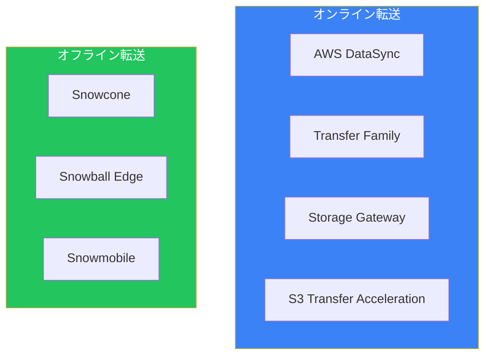

### 選択の目安

| データ量 | ネットワーク | 推奨サービス |
|---------|------------|-------------|
| 〜10TB | 良好 | DataSync |
| 〜10TB | 制限あり | Snowcone |
| 10TB〜80TB | 制限あり | Snowball Edge |
| 80TB〜 | 制限あり | 複数Snowball |
| PB規模 | 制限あり | Snowmobile |

## AWS DataSync

### 概要

オンプレミスとAWS間、またはAWSサービス間でデータを高速に転送します。

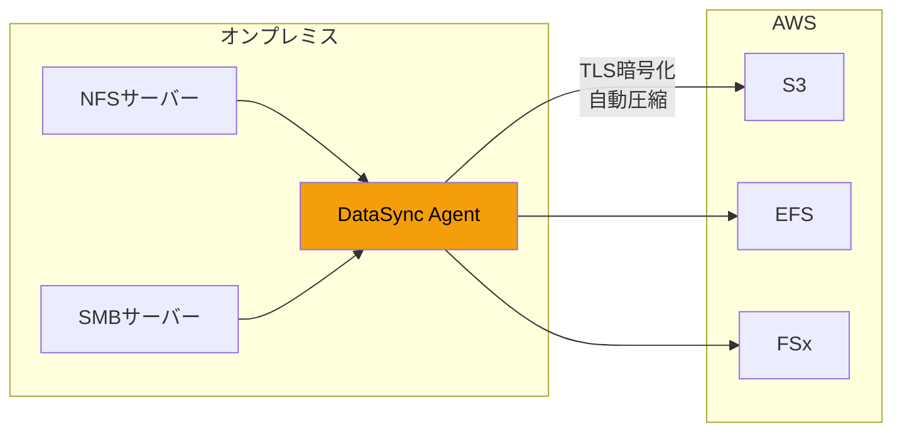

### 特徴

| 機能 | 説明 |
|------|------|
| 高速転送 | ネットワーク帯域を最大限活用 |
| 自動検証 | データ整合性を自動チェック |
| スケジューリング | 定期的な同期が可能 |
| 暗号化 | 転送中の暗号化 |
| フィルタリング | パターンマッチで選択転送 |

### 対応ストレージ

**ソース:**
- NFS
- SMB
- HDFS
- オブジェクトストレージ（S3互換）
- AWS（S3、EFS、FSx）

**デスティネーション:**
- Amazon S3（全ストレージクラス）
- Amazon EFS
- Amazon FSx（Windows、Lustre、OpenZFS、NetApp）

### 設定例

```bash
# エージェントの作成（オンプレミスにデプロイ）
aws datasync create-agent \
    --agent-name my-agent \
    --activation-key XXXXX-XXXXX-XXXXX-XXXXX

# ソースロケーションの作成
aws datasync create-location-nfs \
    --server-hostname nfs.example.com \
    --subdirectory /exports/data \
    --on-prem-config AgentArns=arn:aws:datasync:ap-northeast-1:xxx:agent/xxx

# デスティネーションロケーションの作成
aws datasync create-location-s3 \
    --s3-bucket-arn arn:aws:s3:::my-bucket \
    --s3-config BucketAccessRoleArn=arn:aws:iam::xxx:role/DataSyncRole

# タスクの作成と実行
aws datasync create-task \
    --source-location-arn arn:aws:datasync:ap-northeast-1:xxx:location/xxx \
    --destination-location-arn arn:aws:datasync:ap-northeast-1:xxx:location/xxx \
    --options VerifyMode=POINT_IN_TIME_CONSISTENT,TransferMode=ALL
```

## AWS Transfer Family

### 概要

SFTP、FTPS、FTPプロトコルでS3やEFSにファイル転送するマネージドサービスです。

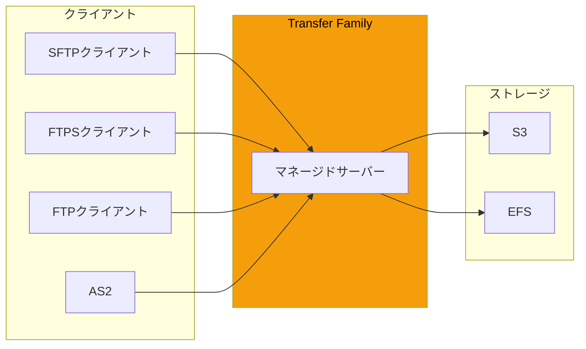

### プロトコル比較

| プロトコル | 暗号化 | ポート | ユースケース |
|-----------|--------|-------|-------------|
| SFTP | SSH | 22 | セキュアな転送（推奨） |
| FTPS | TLS | 21, 990 | レガシーシステム連携 |
| FTP | なし | 21 | 内部ネットワークのみ |
| AS2 | S/MIME | 443 | B2B EDI |

### 認証オプション

| 認証方式 | 説明 |
|---------|------|
| サービス管理 | Transfer Familyで管理 |
| AWS Directory Service | AD認証 |
| カスタム | Lambda + API Gateway |

### 設定例

```bash
# SFTPサーバーの作成
aws transfer create-server \
    --endpoint-type PUBLIC \
    --protocols SFTP \
    --identity-provider-type SERVICE_MANAGED

# ユーザーの作成
aws transfer create-user \
    --server-id s-xxx \
    --user-name myuser \
    --role arn:aws:iam::xxx:role/TransferRole \
    --home-directory /my-bucket/home/myuser \
    --ssh-public-key-body "ssh-rsa AAAA..."
```

## Snow Family

### デバイス比較

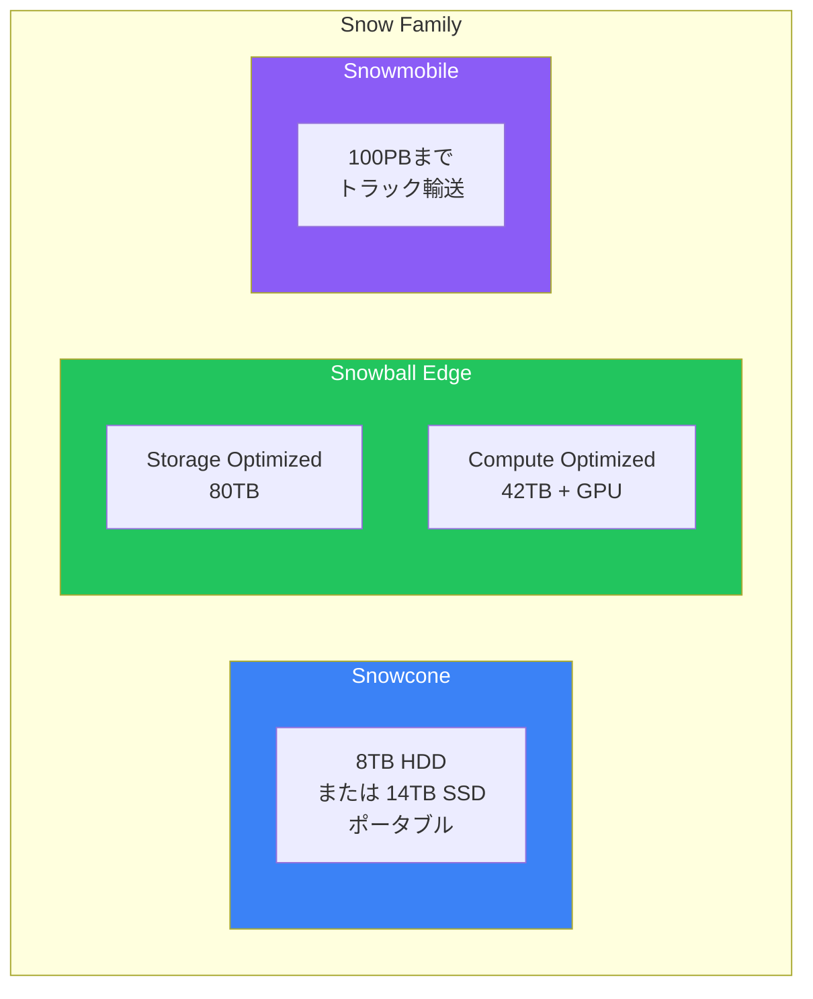

### 詳細比較

| 項目 | Snowcone | Snowball Edge Storage | Snowball Edge Compute |
|------|----------|----------------------|----------------------|
| ストレージ | 8TB HDD / 14TB SSD | 80TB | 42TB |
| コンピュート | なし | EC2互換 | EC2互換 + GPU |
| 重量 | 2.1kg | 22.3kg | 22.3kg |
| 用途 | 小規模/エッジ | 大規模転送 | エッジコンピューティング |
| 配送 | 通常配送 | 専用配送 | 専用配送 |

### ユースケース

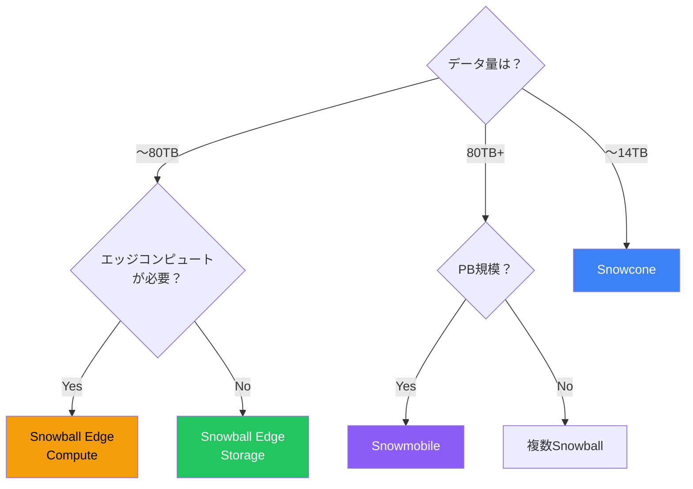

### Snowball Edgeの使用フロー


### コマンド例

```bash
# Snowball Edgeへの接続
snowballEdge configure

# S3バケットとして使用
aws s3 ls --endpoint http://192.168.1.100:8080

# データのコピー
aws s3 cp /local/data s3://my-bucket/ \
    --recursive \
    --endpoint http://192.168.1.100:8080
```

## AWS Storage Gateway

### 概要

オンプレミスからAWSストレージへのハイブリッドアクセスを提供します。

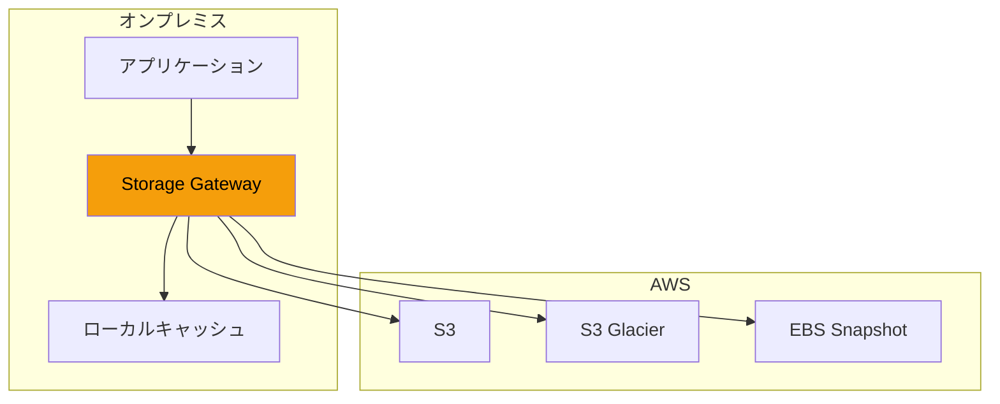

### ゲートウェイタイプ

| タイプ | プロトコル | バックエンド | ユースケース |
|--------|-----------|-------------|-------------|
| S3 File Gateway | NFS/SMB | S3 | ファイル共有 |
| FSx File Gateway | SMB | FSx for Windows | Windows環境 |
| Volume Gateway | iSCSI | S3 + EBS | ブロックストレージ |
| Tape Gateway | iSCSI VTL | S3 Glacier | バックアップ |

### Volume Gatewayのモード

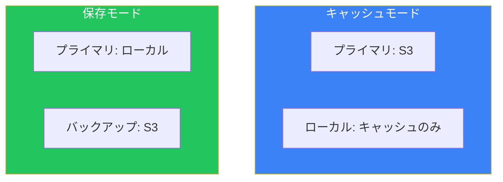

| モード | ローカル | 用途 |
|--------|---------|------|
| キャッシュ | 頻繁にアクセスするデータ | 大容量データ |
| 保存 | 全データ | 低レイテンシー要件 |

## S3 Transfer Acceleration

### 概要

CloudFrontエッジロケーションを使用してS3への転送を高速化します。

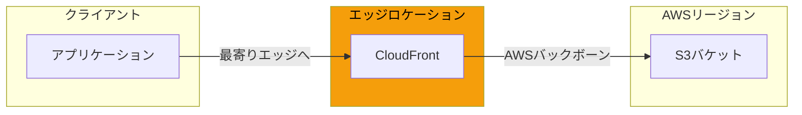

### 有効化

```bash
# Transfer Accelerationの有効化
aws s3api put-bucket-accelerate-configuration \
    --bucket my-bucket \
    --accelerate-configuration Status=Enabled

# 転送（Accelerateエンドポイント使用）
aws s3 cp large-file.zip s3://my-bucket/ \
    --endpoint-url https://my-bucket.s3-accelerate.amazonaws.com
```

## 選択フローチャート

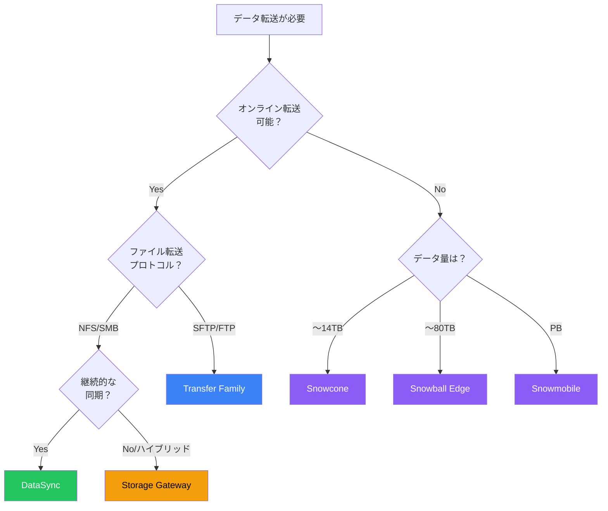

## コスト比較

### オンライン転送

| サービス | 料金体系 |
|---------|---------|
| DataSync | GB単位の転送料金 |
| Transfer Family | 時間 + GB転送 |
| Storage Gateway | 時間 + GB転送 + リクエスト |
| S3 Transfer Acceleration | GB転送（通常より高い） |

### オフライン転送

| デバイス | 料金 |
|---------|------|
| Snowcone | デバイス日額 + データ転送 |
| Snowball Edge | ジョブ単位 + 日額 |
| Snowmobile | 個別見積もり |

## ベストプラクティス

### データ転送の計画

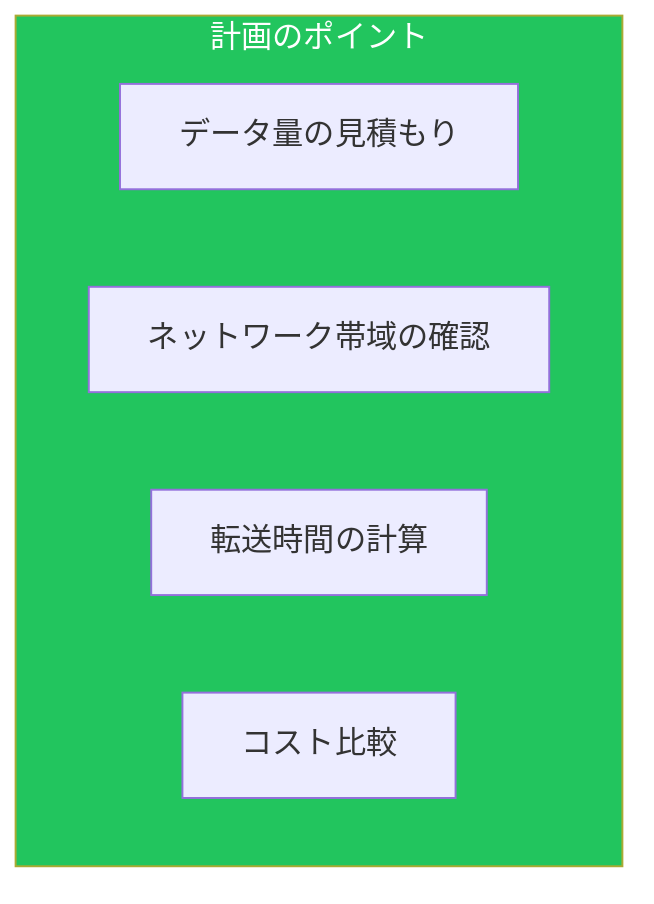

### 転送時間の計算

```
転送時間 = データ量 / 実効帯域幅

例: 100TB / 1Gbps (実効80%)
= 100TB / 100MB/s
= 1,000,000秒
≒ 12日
```

## まとめ

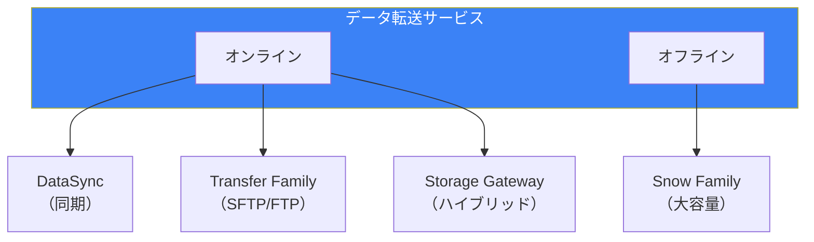

| サービス | 主なユースケース | 推奨度 |
|---------|----------------|--------|
| DataSync | ストレージ移行/同期 | ★★★ |
| Transfer Family | SFTP/FTP連携 | ★★☆ |
| Storage Gateway | ハイブリッド運用 | ★★☆ |
| Snow Family | 大容量オフライン転送 | ★★★ |

適切なデータ転送サービスの選択により、コストと時間を最適化しながら確実にデータを移行できます。

## 参考資料

- [AWS DataSync User Guide](https://docs.aws.amazon.com/datasync/latest/userguide/)
- [AWS Transfer Family User Guide](https://docs.aws.amazon.com/transfer/latest/userguide/)
- [AWS Snow Family User Guide](https://docs.aws.amazon.com/snowball/latest/ug/)
- [AWS Storage Gateway User Guide](https://docs.aws.amazon.com/storagegateway/latest/userguide/)
