データベース移行は、クラウド移行プロジェクトの中で最も慎重に計画すべき作業の1つです。AWSはDatabase Migration Service（DMS）とSchema Conversion Tool（SCT）を提供し、同種間・異種間のデータベース移行をサポートします。

## データベース移行の概要

### 移行パターン

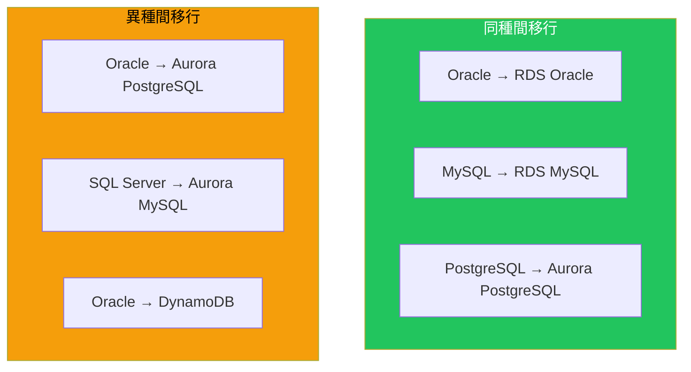

### 移行方法の比較

| 方法 | ダウンタイム | 複雑さ | 用途 |
|------|------------|--------|------|
| ダンプ&リストア | 長い | 低 | 小規模DB |
| ネイティブレプリケーション | 短い | 中 | 同種間 |
| DMS | 最小 | 中〜高 | 汎用 |
| DMS + SCT | 最小 | 高 | 異種間 |

## AWS Database Migration Service (DMS)

### アーキテクチャ

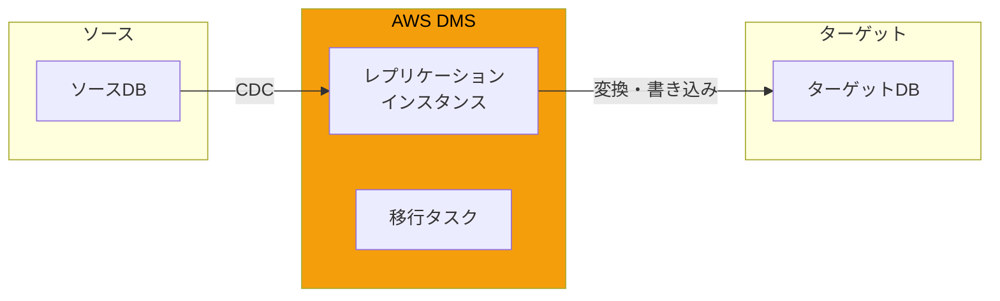

### 対応データベース

**ソース:**
- Oracle、SQL Server、MySQL、MariaDB、PostgreSQL
- Amazon RDS、Aurora、S3
- MongoDB、DocumentDB
- SAP ASE、IBM Db2

**ターゲット:**
- Amazon RDS、Aurora
- Amazon Redshift、DynamoDB、S3
- OpenSearch、Neptune、Kinesis
- DocumentDB、Kafka

### 移行タイプ

| タイプ | 説明 | ユースケース |
|--------|------|-------------|
| Full Load | 全データを一括移行 | 初期移行 |
| CDC | 変更データのみ継続的に同期 | 継続的レプリケーション |
| Full Load + CDC | 一括移行後に変更を同期 | 最小ダウンタイム移行 |

### 設定例

```bash
# レプリケーションインスタンスの作成
aws dms create-replication-instance \
    --replication-instance-identifier my-dms-instance \
    --replication-instance-class dms.r5.large \
    --allocated-storage 100 \
    --vpc-security-group-ids sg-xxx \
    --availability-zone ap-northeast-1a

# ソースエンドポイントの作成
aws dms create-endpoint \
    --endpoint-identifier source-oracle \
    --endpoint-type source \
    --engine-name oracle \
    --server-name oracle.example.com \
    --port 1521 \
    --username admin \
    --password xxx \
    --database-name ORCL

# ターゲットエンドポイントの作成
aws dms create-endpoint \
    --endpoint-identifier target-aurora \
    --endpoint-type target \
    --engine-name aurora-postgresql \
    --server-name aurora-cluster.xxx.ap-northeast-1.rds.amazonaws.com \
    --port 5432 \
    --username admin \
    --password xxx \
    --database-name mydb

# 移行タスクの作成
aws dms create-replication-task \
    --replication-task-identifier full-load-and-cdc \
    --source-endpoint-arn arn:aws:dms:ap-northeast-1:xxx:endpoint:source \
    --target-endpoint-arn arn:aws:dms:ap-northeast-1:xxx:endpoint:target \
    --replication-instance-arn arn:aws:dms:ap-northeast-1:xxx:rep:my-instance \
    --migration-type full-load-and-cdc \
    --table-mappings file://table-mappings.json
```

### テーブルマッピング

```json
{
  "rules": [
    {
      "rule-type": "selection",
      "rule-id": "1",
      "rule-name": "include-all-tables",
      "object-locator": {
        "schema-name": "HR",
        "table-name": "%"
      },
      "rule-action": "include"
    },
    {
      "rule-type": "transformation",
      "rule-id": "2",
      "rule-name": "rename-schema",
      "rule-target": "schema",
      "object-locator": {
        "schema-name": "HR"
      },
      "rule-action": "rename",
      "value": "hr_new"
    }
  ]
}
```

## AWS Schema Conversion Tool (SCT)

### 概要

異種間移行でスキーマとコードを変換します。

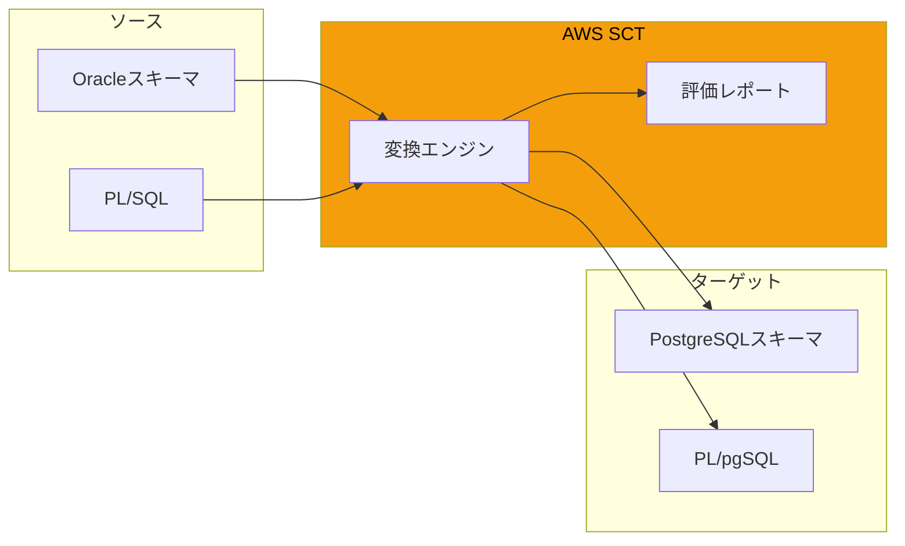

### SCTの機能

| 機能 | 説明 |
|------|------|
| スキーマ変換 | テーブル、インデックス、制約 |
| コード変換 | ストアドプロシージャ、関数、トリガー |
| 評価レポート | 変換の複雑さを分析 |
| アクションアイテム | 手動対応が必要な項目 |

### 変換の複雑さ

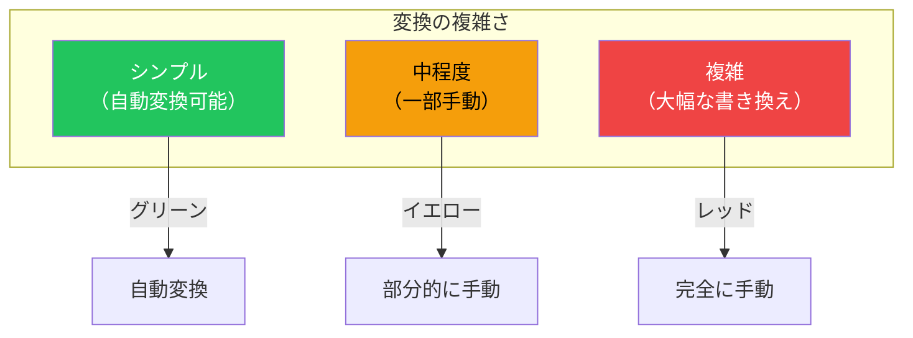

### 評価レポートの例

| 項目 | Oracle | PostgreSQL | アクション |
|------|--------|------------|----------|
| CONNECT BY | あり | WITH RECURSIVE | 書き換え必要 |
| ROWNUM | あり | ROW_NUMBER() | 変換可能 |
| SEQUENCE | あり | あり | 自動変換 |
| パッケージ | あり | なし | スキーマに分割 |

## 移行フェーズ

### 3フェーズアプローチ

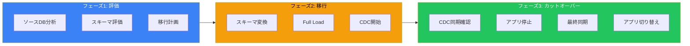

### フェーズ1: 評価

```bash
# SCTでの評価レポート生成
# 1. SCTにソースDBを接続
# 2. ターゲットを選択
# 3. 評価レポートを生成

# DMSでの接続テスト
aws dms test-connection \
    --replication-instance-arn arn:aws:dms:ap-northeast-1:xxx:rep:instance \
    --endpoint-arn arn:aws:dms:ap-northeast-1:xxx:endpoint:source
```

### フェーズ2: 移行

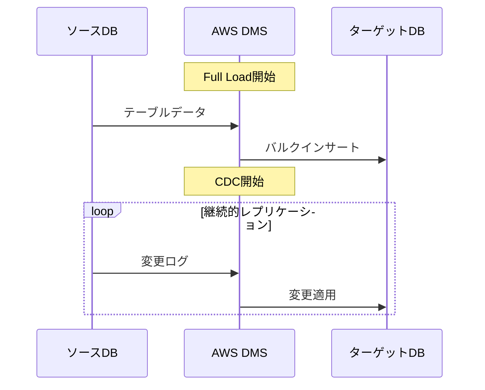

### フェーズ3: カットオーバー

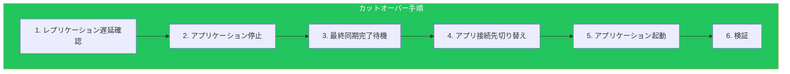

## ダウンタイム最小化

### 戦略比較

| 戦略 | ダウンタイム | 複雑さ | リスク |
|------|------------|--------|--------|
| ビッグバン | 長い | 低 | 高 |
| DMS CDC | 分単位 | 中 | 中 |
| Blue/Green | 秒単位 | 高 | 低 |

### DMS CDC戦略

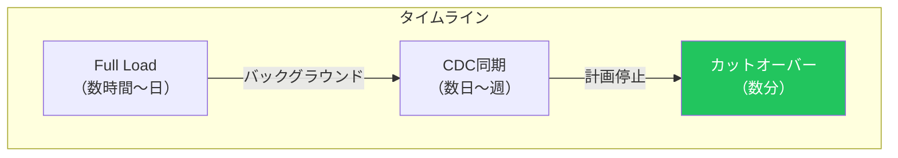

### Blue/Green with RDS

```bash
# Blue/Greenデプロイメントの作成
aws rds create-blue-green-deployment \
    --blue-green-deployment-name my-blue-green \
    --source arn:aws:rds:ap-northeast-1:xxx:db:source-db \
    --target-engine-version 14.6

# 切り替え実行
aws rds switchover-blue-green-deployment \
    --blue-green-deployment-identifier my-blue-green
```

## 異種間移行の例

### Oracle to Aurora PostgreSQL

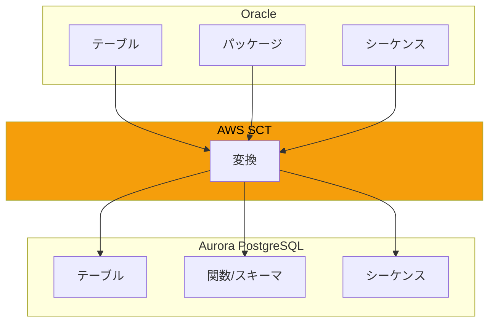

### 主要な変換ポイント

| Oracle | PostgreSQL | 注意点 |
|--------|------------|--------|
| VARCHAR2 | VARCHAR | 同等 |
| NUMBER | NUMERIC/INTEGER | 精度確認 |
| DATE | TIMESTAMP | 時刻含む |
| CLOB | TEXT | 同等 |
| PL/SQL | PL/pgSQL | 構文差異あり |
| パッケージ | スキーマ+関数 | 分割必要 |

## 監視とトラブルシューティング

### CloudWatchメトリクス

| メトリクス | 説明 | アラートしきい値 |
|-----------|------|----------------|
| CDCLatencySource | ソース遅延 | > 60秒 |
| CDCLatencyTarget | ターゲット遅延 | > 60秒 |
| FullLoadThroughput | 転送スループット | 低下時 |
| TablesErrored | エラーテーブル数 | > 0 |

### よくある問題

| 問題 | 原因 | 対策 |
|------|------|------|
| LOBデータの欠落 | LOBモード設定 | Limited/Full LOBモード |
| パフォーマンス低下 | インスタンスサイズ | スケールアップ |
| CDC遅延 | 大量の変更 | 並列処理設定 |
| 外部キーエラー | テーブル順序 | 制約の一時無効化 |

## ベストプラクティス

### 計画

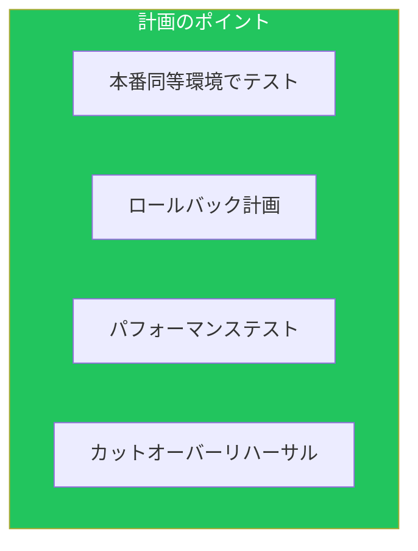

### チェックリスト

| フェーズ | チェック項目 |
|---------|-------------|
| 事前 | ソースDBの権限設定 |
| 事前 | ネットワーク接続性 |
| 事前 | SCT評価レポート確認 |
| 移行中 | レプリケーション遅延監視 |
| 移行中 | エラーログ確認 |
| 事後 | データ整合性検証 |
| 事後 | アプリケーション動作確認 |

## まとめ

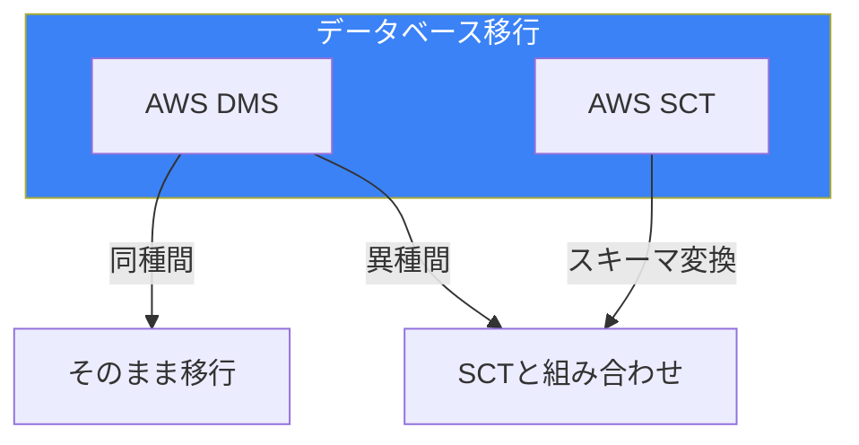

| ツール | 用途 | 重要度 |
|--------|------|--------|
| DMS | データ移行 | ★★★ |
| SCT | スキーマ変換 | ★★★（異種間） |
| CDC | 最小ダウンタイム | ★★★ |
| 検証 | データ整合性 | ★★★ |

適切な移行戦略とツールの選択により、リスクを最小化しながらデータベース移行を成功させることができます。

## 参考資料

- [AWS DMS User Guide](https://docs.aws.amazon.com/dms/latest/userguide/)
- [AWS SCT User Guide](https://docs.aws.amazon.com/SchemaConversionTool/latest/userguide/)
- [Database Migration Playbook](https://docs.aws.amazon.com/dms/latest/oracle-to-aurora-postgresql-migration-playbook/)
