安全で効率的なデプロイは、継続的デリバリーの成功に不可欠です。AWSは複数のデプロイ戦略とサービスを提供しており、ワークロードに応じて適切な方法を選択できます。

## デプロイ戦略の概要

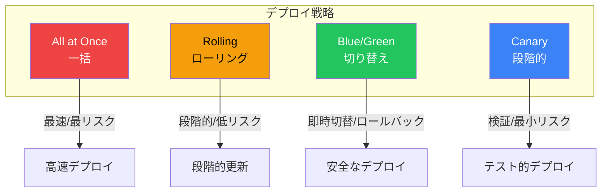

### 比較表

| 戦略 | ダウンタイム | ロールバック | コスト | 複雑さ |
|------|------------|-------------|--------|--------|
| All at Once | あり | 遅い | 最低 | 低 |
| Rolling | なし | 中程度 | 低 | 中 |
| Blue/Green | なし | 即時 | 高（2倍） | 中 |
| Canary | なし | 即時 | 中程度 | 高 |

## All at Once（一括デプロイ）

### 概要

すべてのインスタンスを同時に更新します。

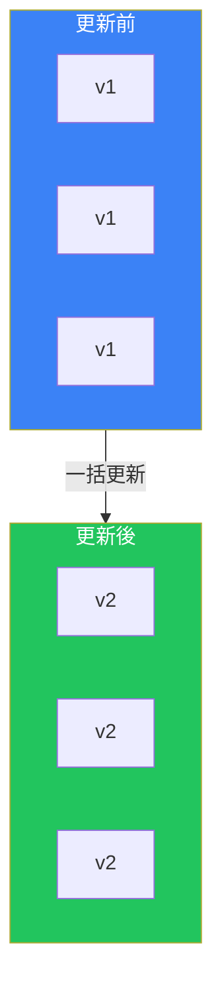

### 適したケース

- 開発/テスト環境
- ダウンタイムが許容される場合
- 迅速なデプロイが必要な場合

## Rolling（ローリングデプロイ）

### 概要

インスタンスを順次更新します。

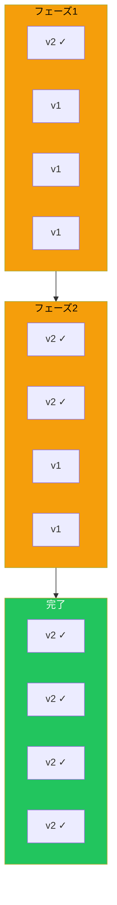

### バリエーション

| タイプ | 説明 |
|--------|------|
| Rolling | 1つずつ更新 |
| Rolling with Additional Batch | 追加インスタンスで更新 |
| Immutable | 新規インスタンスグループ作成 |

## Blue/Green デプロイ

### 概要

2つの同一環境を用意し、トラフィックを切り替えます。

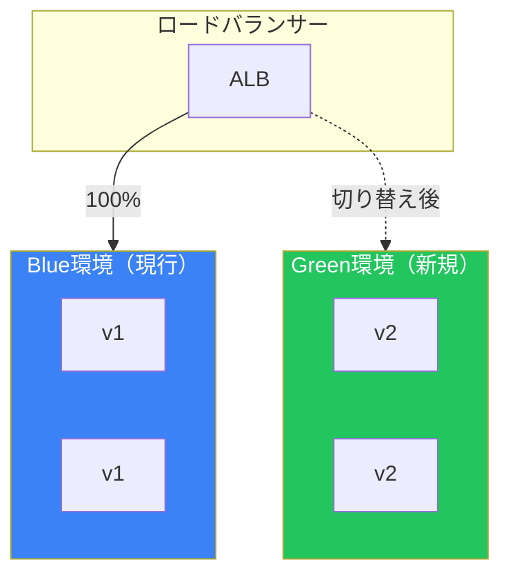

### 実装方法

| サービス | 実装方法 |
|---------|---------|
| EC2 | Auto Scaling Group の切り替え |
| ECS | CodeDeploy Blue/Green |
| Lambda | バージョン/エイリアス |
| RDS | Blue/Green Deployments |

### Route 53での切り替え

```bash
# 加重ルーティングで段階的に切り替え
aws route53 change-resource-record-sets \
    --hosted-zone-id Z1234 \
    --change-batch '{
        "Changes": [{
            "Action": "UPSERT",
            "ResourceRecordSet": {
                "Name": "app.example.com",
                "Type": "A",
                "SetIdentifier": "green",
                "Weight": 100,
                "AliasTarget": {
                    "HostedZoneId": "Z5678",
                    "DNSName": "green-alb.example.com",
                    "EvaluateTargetHealth": true
                }
            }
        }]
    }'
```

## Canary デプロイ

### 概要

新バージョンを少数のインスタンスにデプロイし、段階的に拡大します。

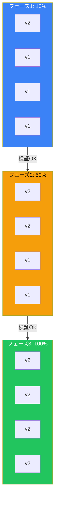

### CodeDeployの設定

```yaml
# CodeDeploy Canary設定
version: 0.0
Resources:
  - TargetService:
      Type: AWS::ECS::Service
      Properties:
        TaskDefinition: "arn:aws:ecs:..."
        LoadBalancerInfo:
          ContainerName: "app"
          ContainerPort: 80
        PlatformVersion: "LATEST"
Hooks:
  - BeforeAllowTraffic: "LambdaFunctionForValidation"
  - AfterAllowTraffic: "LambdaFunctionForSmokeTest"
```

## AWS CodeDeploy

### デプロイタイプ

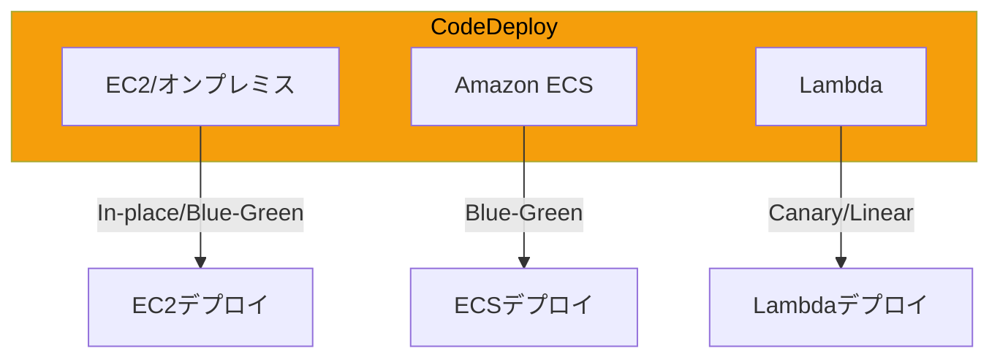

### デプロイ設定

| 設定 | 説明 |
|------|------|
| CodeDeployDefault.AllAtOnce | すべて同時 |
| CodeDeployDefault.HalfAtATime | 半分ずつ |
| CodeDeployDefault.OneAtATime | 1つずつ |
| CodeDeployDefault.LambdaCanary10Percent5Minutes | 10%→5分後に残り |
| CodeDeployDefault.LambdaLinear10PercentEvery1Minute | 毎分10%ずつ |

### appspec.yml（EC2）

```yaml
version: 0.0
os: linux
files:
  - source: /
    destination: /var/www/html
hooks:
  BeforeInstall:
    - location: scripts/stop_server.sh
      timeout: 300
  AfterInstall:
    - location: scripts/install_dependencies.sh
      timeout: 300
  ApplicationStart:
    - location: scripts/start_server.sh
      timeout: 300
  ValidateService:
    - location: scripts/validate_service.sh
      timeout: 300
```

## ECSデプロイ戦略

### デプロイタイプ

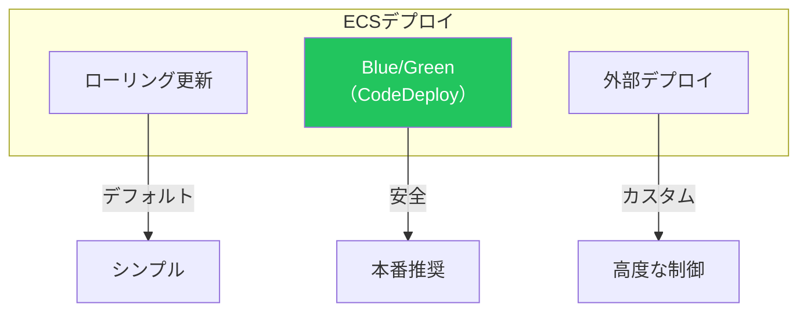

### ローリング更新設定

```json
{
  "deploymentConfiguration": {
    "maximumPercent": 200,
    "minimumHealthyPercent": 100
  }
}
```

### Blue/Green（CodeDeploy）

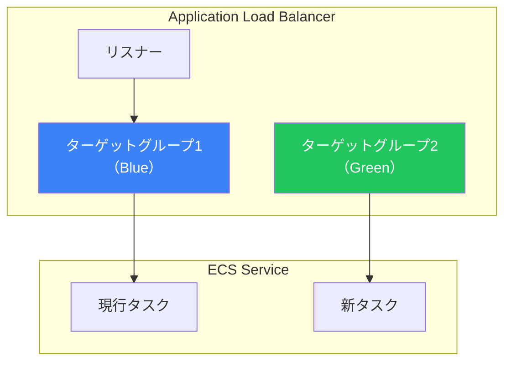

## Lambdaデプロイ戦略

### バージョンとエイリアス

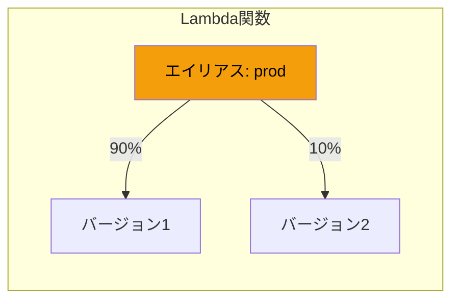

### SAMでのCanary設定

```yaml
Resources:
  MyFunction:
    Type: AWS::Serverless::Function
    Properties:
      FunctionName: my-function
      AutoPublishAlias: live
      DeploymentPreference:
        Type: Canary10Percent5Minutes
        Alarms:
          - !Ref ErrorAlarm
        Hooks:
          PreTraffic: !Ref PreTrafficHook
          PostTraffic: !Ref PostTrafficHook
```

## ロールバック戦略

### 自動ロールバック

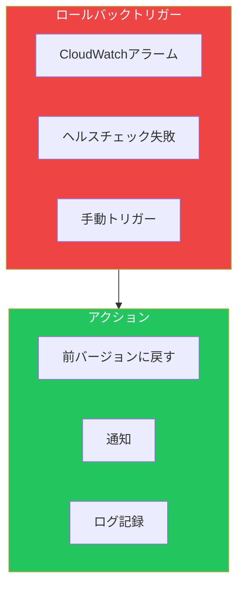

### CodeDeployロールバック設定

```json
{
  "autoRollbackConfiguration": {
    "enabled": true,
    "events": [
      "DEPLOYMENT_FAILURE",
      "DEPLOYMENT_STOP_ON_ALARM",
      "DEPLOYMENT_STOP_ON_REQUEST"
    ]
  },
  "alarmConfiguration": {
    "enabled": true,
    "alarms": [
      {"name": "HighErrorRate"},
      {"name": "HighLatency"}
    ]
  }
}
```

## ベストプラクティス

### デプロイ戦略の選択

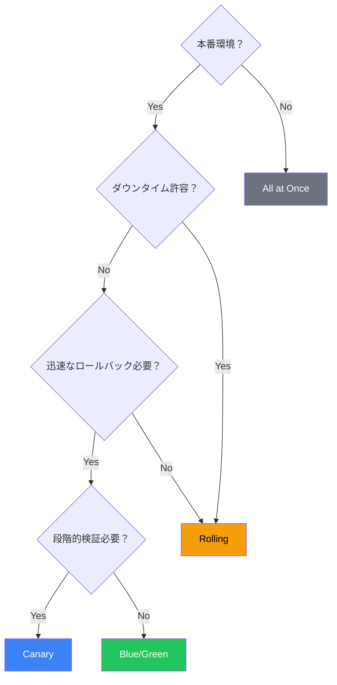

### チェックリスト

| フェーズ | チェック項目 |
|---------|-------------|
| 事前 | ヘルスチェック設定 |
| 事前 | ロールバック手順確認 |
| 事前 | モニタリング設定 |
| デプロイ中 | メトリクス監視 |
| デプロイ中 | エラーログ確認 |
| 事後 | 動作検証 |
| 事後 | パフォーマンス確認 |

## まとめ

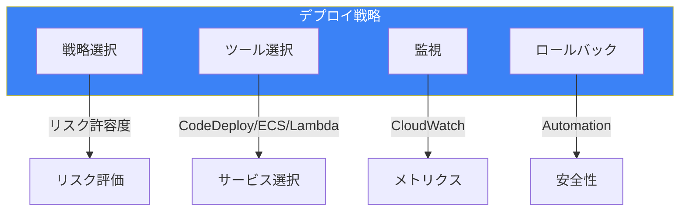

| 戦略 | 推奨環境 | リスク |
|------|---------|--------|
| All at Once | 開発/テスト | 高 |
| Rolling | ステージング | 中 |
| Blue/Green | 本番 | 低 |
| Canary | 本番（重要） | 最低 |

適切なデプロイ戦略の選択により、安全で効率的なリリースを実現できます。

## 参考資料

- [AWS CodeDeploy User Guide](https://docs.aws.amazon.com/codedeploy/latest/userguide/)
- [Amazon ECS Deployment Types](https://docs.aws.amazon.com/AmazonECS/latest/developerguide/deployment-types.html)
- [Lambda Deployment Preferences](https://docs.aws.amazon.com/serverless-application-model/latest/developerguide/automating-updates-to-serverless-apps.html)
