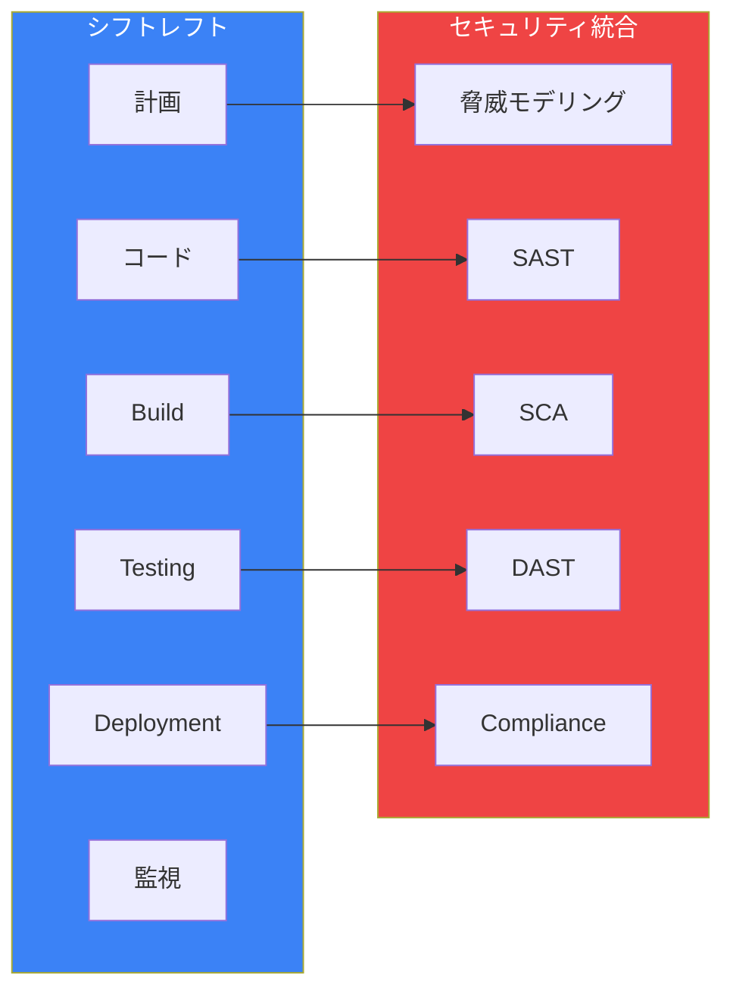
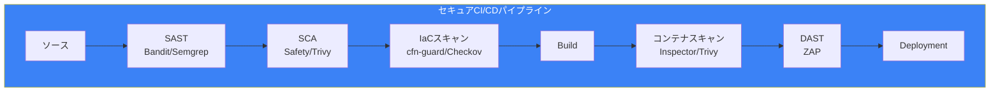
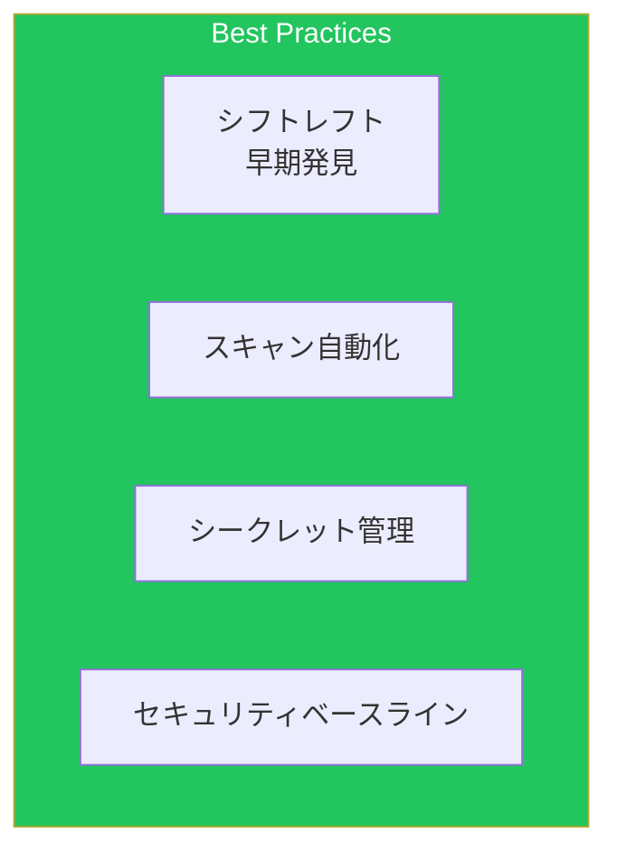

DevSecOpsは、開発プロセスにセキュリティを組み込む手法です。本記事では、[セキュリティ記事](/blog/aws-iam-deep-dive)で触れなかったCI/CDへのセキュリティ統合を解説します。

## DevSecOps概要



## シークレット管理

### Secrets Managerパターン

```yaml
# シークレット定義
DatabaseSecret:
  Type: AWS::SecretsManager::Secret
  Properties:
    Name: !Sub "${AWS::StackName}/database"
    Description: Database credentials
    GenerateSecretString:
      SecretStringTemplate: '{"username": "admin"}'
      GenerateStringKey: password
      PasswordLength: 32
      ExcludeCharacters: '"@/\'
    KmsKeyId: !Ref KMSKey
    Tags:
      - Key: Application
        Value: !Ref ApplicationName

# シークレットローテーション
SecretRotationSchedule:
  Type: AWS::SecretsManager::RotationSchedule
  Properties:
    SecretId: !Ref DatabaseSecret
    RotationLambdaARN: !GetAtt RotationFunction.Arn
    RotationRules:
      AutomaticallyAfterDays: 30
      ScheduleExpression: "cron(0 4 ? * SUN *)"

# Lambda関数でのシークレット取得
SecretAccessPolicy:
  Type: AWS::IAM::ManagedPolicy
  Properties:
    PolicyDocument:
      Version: '2012-10-17'
      Statement:
        - Effect: Allow
          Action:
            - secretsmanager:GetSecretValue
          Resource: !Ref DatabaseSecret
          Condition:
            StringEquals:
              secretsmanager:VersionStage: AWSCURRENT
```

### Lambda Extensionでのシークレット取得

```python
import json
import urllib.request
import os

def get_secret_from_extension(secret_name):
    """Lambda Extensionを使用したシークレット取得（キャッシュ対応）"""

    headers = {
        "X-Aws-Parameters-Secrets-Token": os.environ.get('AWS_SESSION_TOKEN')
    }

    # Parameters and Secrets Lambda Extension
    url = f"http://localhost:2773/secretsmanager/get?secretId={secret_name}"

    req = urllib.request.Request(url, headers=headers)
    response = urllib.request.urlopen(req)
    secret = json.loads(response.read().decode())

    return json.loads(secret['SecretString'])

def lambda_handler(event, context):
    # シークレット取得（Extensionによりキャッシュされる）
    db_credentials = get_secret_from_extension('my-app/database')

    connection = connect_to_database(
        host=db_credentials['host'],
        user=db_credentials['username'],
        password=db_credentials['password']
    )

    return {"statusCode": 200}
```

### Parameter Storeパターン

```yaml
# 機密パラメータ
SecureParameter:
  Type: AWS::SSM::Parameter
  Properties:
    Name: /app/production/api-key
    Type: SecureString
    Value: !Sub "{{resolve:secretsmanager:api-key}}"
    KeyId: !Ref KMSKey
    Tier: Standard
    Tags:
      Environment: Production

# ECSタスクでの使用
TaskDefinition:
  Type: AWS::ECS::TaskDefinition
  Properties:
    ContainerDefinitions:
      - Name: app
        Secrets:
          - Name: DB_PASSWORD
            ValueFrom: !Ref DatabaseSecret
          - Name: API_KEY
            ValueFrom: !Sub "arn:aws:ssm:${AWS::Region}:${AWS::AccountId}:parameter/app/production/api-key"
```

## 静的アプリケーションセキュリティテスト (SAST)

### CodeBuild統合

```yaml
# buildspec.yml with SAST
version: 0.2

phases:
  install:
    commands:
      - pip install bandit safety semgrep

  pre_build:
    commands:
      # Python SAST (Bandit)
      - echo "Running Bandit security scan..."
      - bandit -r src/ -f json -o bandit-report.json || true

      # Semgrep (multi-language)
      - echo "Running Semgrep..."
      - semgrep --config=auto src/ --json --output=semgrep-report.json || true

      # 依存関係の脆弱性チェック
      - echo "Checking dependencies..."
      - safety check -r requirements.txt --json > safety-report.json || true

  build:
    commands:
      # セキュリティスキャン結果の評価
      - |
        python << 'EOF'
        import json
        import sys

        # Bandit結果チェック
        with open('bandit-report.json') as f:
            bandit = json.load(f)
            high_severity = [r for r in bandit.get('results', [])
                           if r.get('issue_severity') == 'HIGH']
            if high_severity:
                print(f"Found {len(high_severity)} HIGH severity issues in Bandit")
                sys.exit(1)

        # Safety結果チェック
        with open('safety-report.json') as f:
            safety = json.load(f)
            if safety:
                print(f"Found {len(safety)} vulnerable dependencies")
                sys.exit(1)

        print("Security scans passed")
        EOF

reports:
  bandit-report:
    files:
      - bandit-report.json
    file-format: BANDITJSON
```

### Amazon CodeGuru Reviewer

```yaml
CodeGuruReviewerAssociation:
  Type: AWS::CodeGuruReviewer::RepositoryAssociation
  Properties:
    Name: my-repo
    Type: CodeCommit

# CodePipelineでの統合
SecurityScanStage:
  Type: AWS::CodePipeline::Pipeline
  Properties:
    Stages:
      - Name: SecurityScan
        Actions:
          - Name: CodeGuruReview
            ActionTypeId:
              Category: Test
              Owner: AWS
              Provider: CodeGuruReviewer
              Version: "1"
            Configuration:
              RepositoryName: !Ref CodeCommitRepo
            InputArtifacts:
              - Name: SourceOutput
```

## ソフトウェア構成分析 (SCA)

### Amazon Inspector

```yaml
# ECRスキャン設定
ECRRepository:
  Type: AWS::ECR::Repository
  Properties:
    RepositoryName: my-app
    ImageScanningConfiguration:
      ScanOnPush: true
    ImageTagMutability: IMMUTABLE

# Inspector設定
InspectorResourceGroup:
  Type: AWS::Inspector2::Filter
  Properties:
    FilterAction: NONE
    FilterCriteria:
      EcrImageTags:
        - Comparison: EQUALS
          Value: latest
      FindingStatus:
        - Comparison: EQUALS
          Value: ACTIVE
      Severity:
        - Comparison: EQUALS
          Value: CRITICAL
```

### CodeBuildでのスキャン統合

```yaml
version: 0.2

phases:
  build:
    commands:
      - echo "Building Docker image..."
      - docker build -t $ECR_REPO:$CODEBUILD_RESOLVED_SOURCE_VERSION .

      # Trivy でコンテナスキャン
      - echo "Scanning container image..."
      - |
        trivy image --exit-code 1 --severity CRITICAL,HIGH \
          --format json --output trivy-report.json \
          $ECR_REPO:$CODEBUILD_RESOLVED_SOURCE_VERSION

  post_build:
    commands:
      - echo "Pushing image to ECR..."
      - docker push $ECR_REPO:$CODEBUILD_RESOLVED_SOURCE_VERSION

      # Inspector スキャン完了を待機
      - |
        aws ecr wait image-scan-complete \
          --repository-name my-app \
          --image-id imageTag=$CODEBUILD_RESOLVED_SOURCE_VERSION

      # スキャン結果確認
      - |
        FINDINGS=$(aws ecr describe-image-scan-findings \
          --repository-name my-app \
          --image-id imageTag=$CODEBUILD_RESOLVED_SOURCE_VERSION \
          --query 'imageScanFindings.findingSeverityCounts')

        CRITICAL=$(echo $FINDINGS | jq -r '.CRITICAL // 0')
        if [ "$CRITICAL" -gt "0" ]; then
          echo "Critical vulnerabilities found!"
          exit 1
        fi
```

## IaCセキュリティスキャン

### CloudFormation Guard

```ruby
# cfn-guard-rules.guard

# S3バケットは暗号化必須
let s3_buckets = Resources.*[ Type == 'AWS::S3::Bucket' ]

rule s3_encryption_required when %s3_buckets !empty {
    %s3_buckets.Properties.BucketEncryption exists
    %s3_buckets.Properties.BucketEncryption.ServerSideEncryptionConfiguration[*].ServerSideEncryptionByDefault.SSEAlgorithm in ['AES256', 'aws:kms']
}

# S3バケットはパブリックアクセスブロック必須
rule s3_public_access_blocked when %s3_buckets !empty {
    %s3_buckets.Properties.PublicAccessBlockConfiguration exists
    %s3_buckets.Properties.PublicAccessBlockConfiguration.BlockPublicAcls == true
    %s3_buckets.Properties.PublicAccessBlockConfiguration.BlockPublicPolicy == true
}

# RDSは暗号化必須
let rds_instances = Resources.*[ Type == 'AWS::RDS::DBInstance' ]

rule rds_encryption_required when %rds_instances !empty {
    %rds_instances.Properties.StorageEncrypted == true
}

# Lambda関数はVPC内に配置
let lambda_functions = Resources.*[ Type == 'AWS::Lambda::Function' ]

rule lambda_in_vpc when %lambda_functions !empty {
    %lambda_functions.Properties.VpcConfig exists
    %lambda_functions.Properties.VpcConfig.SubnetIds !empty
}
```

### CodeBuildでのIaCスキャン

```yaml
version: 0.2

phases:
  install:
    commands:
      - pip install cfn-lint checkov

  pre_build:
    commands:
      # CloudFormation Lint
      - echo "Running cfn-lint..."
      - cfn-lint templates/*.yaml --format json > cfn-lint-report.json || true

      # CloudFormation Guard
      - echo "Running cfn-guard..."
      - |
        cfn-guard validate \
          --data templates/*.yaml \
          --rules rules/security-rules.guard \
          --output-format json > cfn-guard-report.json || true

      # Checkov (包括的IaCスキャン)
      - echo "Running Checkov..."
      - |
        checkov --directory templates/ \
          --framework cloudformation \
          --output json > checkov-report.json || true

  build:
    commands:
      # スキャン結果評価
      - |
        python << 'EOF'
        import json
        import sys

        # Checkov結果チェック
        with open('checkov-report.json') as f:
            checkov = json.load(f)
            failed = checkov.get('results', {}).get('failed_checks', [])
            critical = [c for c in failed if c.get('check_result', {}).get('result') == 'FAILED']

            if len(critical) > 0:
                print(f"Found {len(critical)} failed security checks")
                for check in critical[:5]:
                    print(f"  - {check.get('check_id')}: {check.get('check_name')}")
                sys.exit(1)

        print("IaC security scans passed")
        EOF
```

## 動的アプリケーションセキュリティテスト (DAST)

### OWASP ZAP統合

```yaml
version: 0.2

phases:
  build:
    commands:
      # アプリケーションをステージング環境にデプロイ
      - aws cloudformation deploy --stack-name staging --template-file template.yaml

      # デプロイ完了を待機
      - sleep 60

      # ZAPスキャン実行
      - |
        docker run --rm -v $(pwd):/zap/wrk:rw \
          owasp/zap2docker-stable zap-baseline.py \
          -t https://staging.example.com \
          -g gen.conf \
          -r zap-report.html \
          -J zap-report.json \
          -I

      # 結果評価
      - |
        ALERTS=$(cat zap-report.json | jq '.site[0].alerts | length')
        HIGH_ALERTS=$(cat zap-report.json | jq '[.site[0].alerts[] | select(.riskcode == "3")] | length')

        if [ "$HIGH_ALERTS" -gt "0" ]; then
          echo "High risk vulnerabilities found!"
          exit 1
        fi

artifacts:
  files:
    - zap-report.html
    - zap-report.json
```

## コンプライアンス自動化

### Security Hub統合

```yaml
SecurityHubConfiguration:
  Type: AWS::SecurityHub::Hub
  Properties:
    EnableDefaultStandards: true

# カスタム標準
CustomStandard:
  Type: Custom::SecurityHubStandard
  Properties:
    Standards:
      - AWS Foundational Security Best Practices
      - CIS AWS Foundations Benchmark
      - PCI DSS

# 自動修復
SecurityHubAutoRemediation:
  Type: AWS::Events::Rule
  Properties:
    EventPattern:
      source:
        - aws.securityhub
      detail-type:
        - Security Hub Findings - Imported
      detail:
        findings:
          Compliance:
            Status:
              - FAILED
          Severity:
            Label:
              - CRITICAL
              - HIGH
    Targets:
      - Id: RemediationLambda
        Arn: !GetAtt RemediationFunction.Arn
```

### コンプライアンスダッシュボード

```python
import boto3
from datetime import datetime

securityhub = boto3.client('securityhub')

def get_compliance_summary():
    """コンプライアンスサマリーを取得"""

    response = securityhub.get_findings(
        Filters={
            'ComplianceStatus': [
                {'Value': 'FAILED', 'Comparison': 'EQUALS'}
            ],
            'RecordState': [
                {'Value': 'ACTIVE', 'Comparison': 'EQUALS'}
            ]
        },
        MaxResults=100
    )

    findings_by_standard = {}
    findings_by_severity = {'CRITICAL': 0, 'HIGH': 0, 'MEDIUM': 0, 'LOW': 0}

    for finding in response.get('Findings', []):
        # 標準別集計
        for standard in finding.get('Compliance', {}).get('RelatedRequirements', []):
            if standard not in findings_by_standard:
                findings_by_standard[standard] = 0
            findings_by_standard[standard] += 1

        # 重大度別集計
        severity = finding.get('Severity', {}).get('Label', 'LOW')
        findings_by_severity[severity] += 1

    return {
        'timestamp': datetime.utcnow().isoformat(),
        'by_standard': findings_by_standard,
        'by_severity': findings_by_severity,
        'total_findings': len(response.get('Findings', []))
    }
```

## CI/CDパイプライン統合



## ベストプラクティス



| カテゴリ | 項目 |
|---------|------|
| 設計 | シフトレフトで早期に問題発見 |
| 自動化 | 全てのセキュリティチェックを自動化 |
| シークレット | コードにシークレットを含めない |
| 継続的 | コンプライアンスの継続的な監視 |

## まとめ

| 領域 | ツール |
|------|--------|
| SAST | CodeGuru Reviewer, Bandit, Semgrep |
| SCA | Inspector, Safety, Trivy |
| IaC | cfn-guard, Checkov |
| コンプライアンス | Security Hub, Config |

DevSecOpsを実践することで、セキュリティをビルトインした開発プロセスを実現できます。

## 参考資料

- [AWS DevSecOps](https://aws.amazon.com/devops/what-is-devsecops/)
- [Amazon Inspector](https://docs.aws.amazon.com/inspector/)
- [AWS Security Hub](https://docs.aws.amazon.com/securityhub/)
- [CloudFormation Guard](https://github.com/aws-cloudformation/cloudformation-guard)
