AWS Direct Connectは、オンプレミス環境とAWSを専用線で接続するサービスです。インターネット経由のVPN接続と比較して、一貫した低レイテンシーと高帯域幅を提供します。

## なぜDirect Connectが必要か

### VPN vs Direct Connect

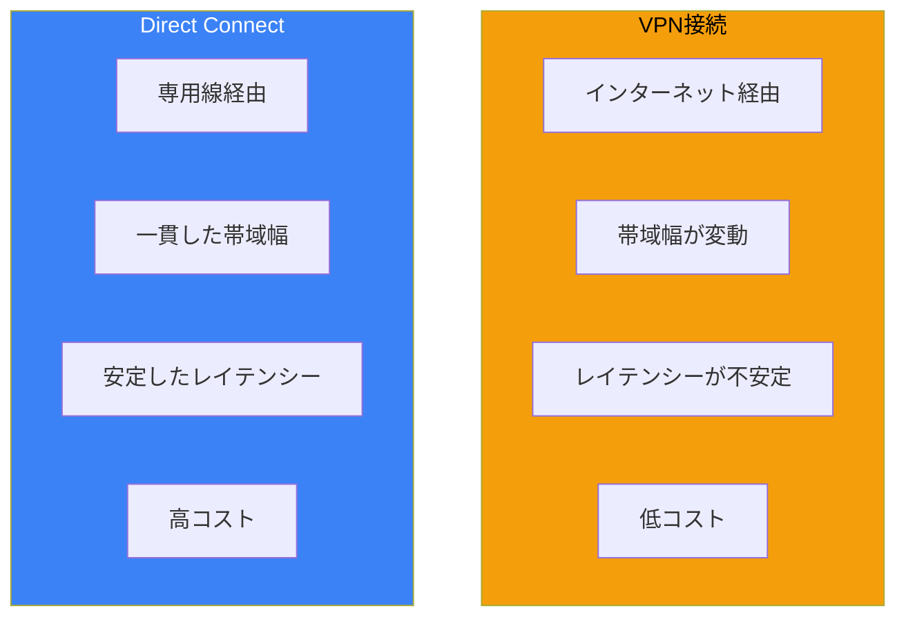

### 選択基準

| 要件 | VPN | Direct Connect |
|------|-----|----------------|
| 大量データ転送 | △ | ◎ |
| リアルタイム処理 | △ | ◎ |
| コスト優先 | ◎ | △ |
| 導入スピード | ◎ | △ |
| SLA要件 | △ | ◎ |

## Direct Connectの接続タイプ

### 3つの接続オプション

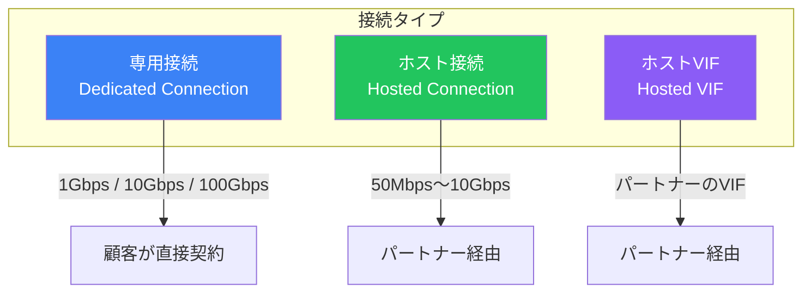

### 専用接続（Dedicated Connection）

| 特徴 | 詳細 |
|------|------|
| 帯域幅 | 1Gbps、10Gbps、100Gbps |
| 契約 | 顧客がAWSと直接契約 |
| 物理ポート | 専用ポートを占有 |
| VIF数 | 最大50 VIF（プライベート/パブリック/トランジット） |

### ホスト接続（Hosted Connection）

| 特徴 | 詳細 |
|------|------|
| 帯域幅 | 50Mbps〜10Gbps |
| 契約 | APNパートナー経由 |
| 物理ポート | パートナーと共有 |
| VIF数 | 1接続につき1 VIF |

### 比較表

| 項目 | 専用接続 | ホスト接続 |
|------|---------|-----------|
| 最小帯域 | 1Gbps | 50Mbps |
| 導入期間 | 長い（数週間〜） | 短い |
| コスト | 高い | 柔軟 |
| VIF制限 | 50 VIF | 1 VIF |
| 推奨用途 | 大規模利用 | 小〜中規模 |

## VIF（Virtual Interface）

### VIFの種類

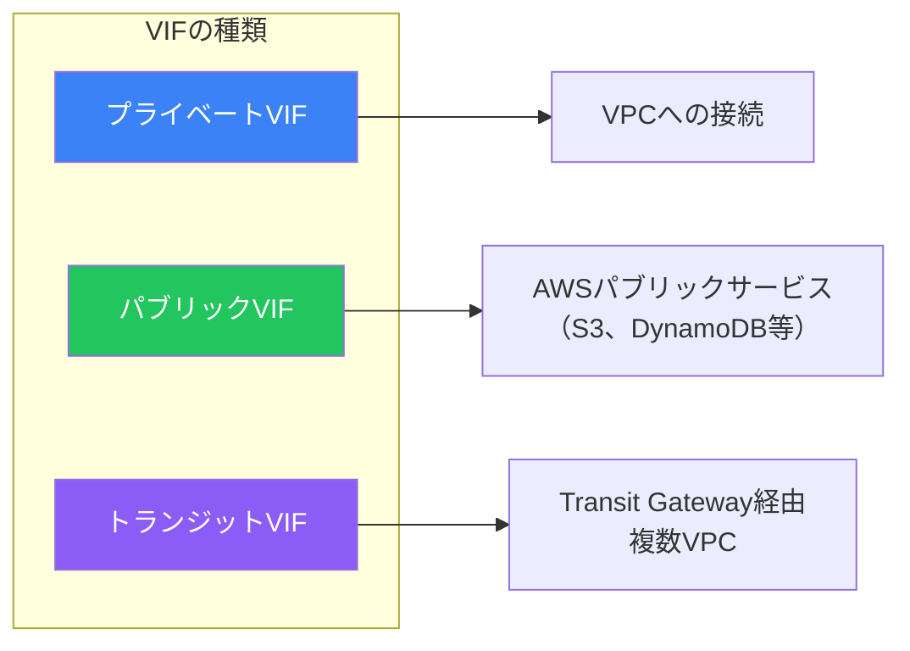

### プライベートVIF

VPCのプライベートリソースにアクセス：

```
用途: EC2、RDS、ELB等へのプライベートアクセス
接続先: VGW（Virtual Private Gateway）または Direct Connect Gateway
BGP ASN: カスタムASN使用可能
```

### パブリックVIF

AWSパブリックエンドポイントにアクセス：

```
用途: S3、DynamoDB、EC2パブリックIP等へのアクセス
接続先: AWSリージョン
BGP ASN: パブリックASNまたはAWS提供のASN
広報される経路: AWSのパブリックIPプレフィックス
```

### トランジットVIF

Transit Gateway経由で複数VPCに接続：

```
用途: 複数VPC、複数リージョンへのアクセス
接続先: Direct Connect Gateway → Transit Gateway
BGP ASN: カスタムASN使用可能
最大スループット: VIF接続速度と同等
```

## Direct Connect Gateway

### 概要

Direct Connect Gatewayは、1つのDirect Connect接続から複数のVPCやリージョンにアクセスするためのグローバルリソースです。

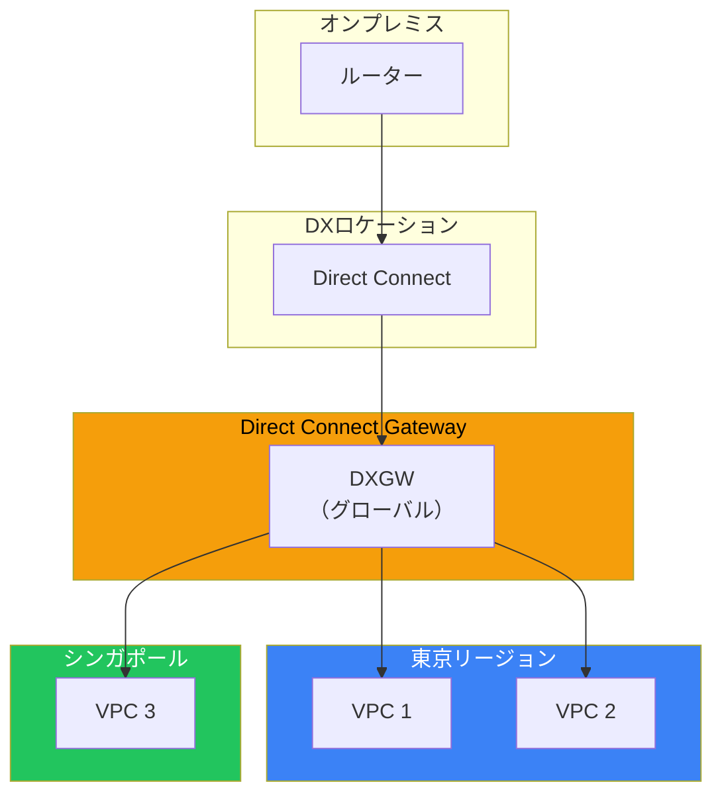

### Direct Connect Gateway vs VGW直接接続

| 機能 | VGW直接接続 | Direct Connect Gateway |
|------|------------|----------------------|
| 接続VPC数 | 1 | 複数 |
| クロスリージョン | ❌ | ✅ |
| クロスアカウント | ❌ | ✅ |
| Transit Gateway連携 | ❌ | ✅ |

### 設定例

```bash
# Direct Connect Gatewayの作成
aws directconnect create-direct-connect-gateway \
    --direct-connect-gateway-name my-dxgw \
    --amazon-side-asn 64512

# VGWとの関連付け
aws directconnect create-direct-connect-gateway-association \
    --direct-connect-gateway-id dxgw-xxx \
    --gateway-id vgw-xxx \
    --add-allowed-prefixes-to-direct-connect-gateway cidrBlocks=10.0.0.0/16
```

## 冗長性設計

### 冗長性レベル

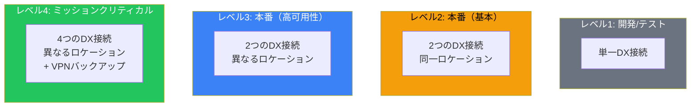

### 推奨アーキテクチャ

#### 最大回復性（Maximum Resiliency）

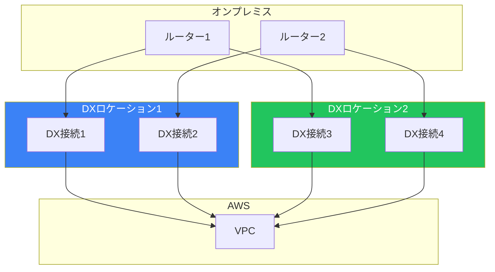

#### 高回復性（High Resiliency）

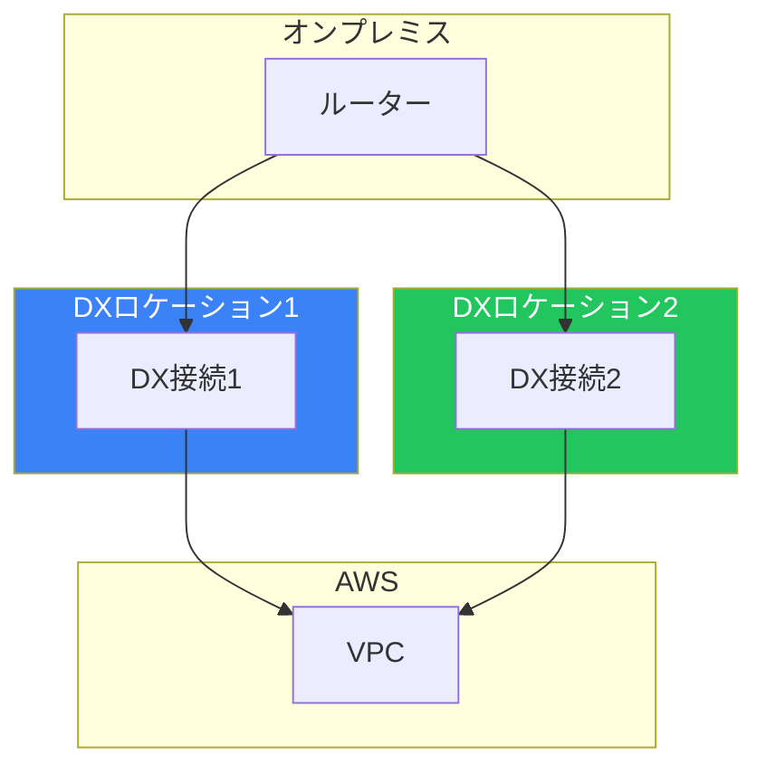

### VPNバックアップ

Direct Connect障害時のバックアップとしてVPNを設定：

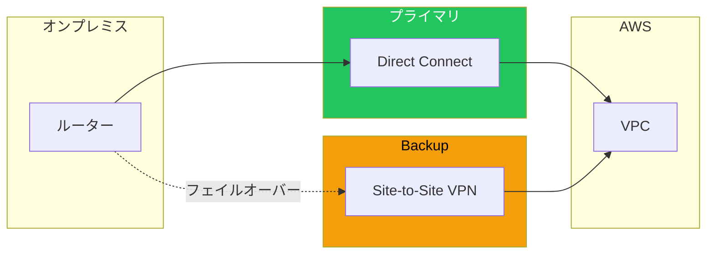

BGP設定でDirect Connectを優先：

| 設定 | Direct Connect | VPN |
|------|---------------|-----|
| AS Path長 | 短い | 長い（AS Prepend） |
| Local Preference | 高い | 低い |
| MED | 低い | 高い |

## LAG（Link Aggregation Group）

### LAGとは

複数のDirect Connect接続を1つの論理接続として束ねる機能：

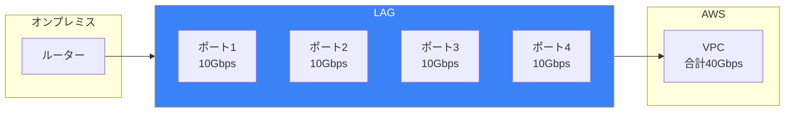

### LAGの要件

| 要件 | 詳細 |
|------|------|
| 最大ポート数 | 4 |
| ポート速度 | すべて同一（1G/10G/100G） |
| 最小アクティブ | 設定可能（0〜4） |

## MACsec

### MACsecとは

Direct Connect接続を暗号化するレイヤー2セキュリティ：

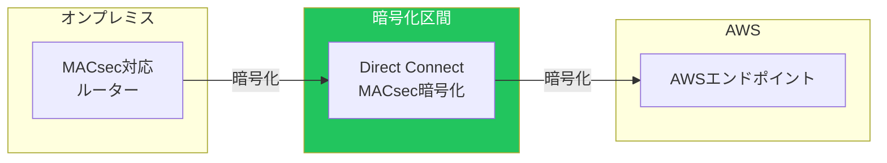

### MACsecの要件

| 要件 | 詳細 |
|------|------|
| 対応速度 | 10Gbps、100Gbps |
| 暗号スイート | AES-256-GCM、AES-128-GCM |
| 鍵管理 | CKN/CAKペア |

## コスト構造

### 料金要素

| 要素 | 説明 |
|------|------|
| **ポート時間料金** | 接続速度に応じた時間課金 |
| **データ転送料金** | AWS→オンプレミスの転送量 |
| **パートナー料金** | ホスト接続の場合 |
| **クロスコネクト** | データセンター内の接続料金 |

### 料金例（東京リージョン）

| 接続速度 | ポート時間料金（月額概算） |
|---------|------------------------|
| 1Gbps | 約$220 |
| 10Gbps | 約$2,200 |
| 100Gbps | 約$22,000 |

データ転送料金：$0.041/GB（AWS→オンプレミス）

## ベストプラクティス

### 設計時のチェックリスト

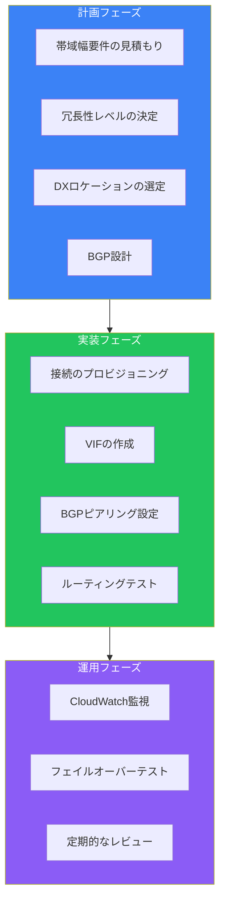

### よくある間違い

| 間違い | 正しい対応 |
|--------|----------|
| 単一ロケーションのみ | 異なるロケーションで冗長化 |
| VPNバックアップなし | VPNをバックアップとして設定 |
| BGP設定の不備 | AS PathやMEDで優先度制御 |
| 監視の欠如 | CloudWatchでメトリクス監視 |

## まとめ

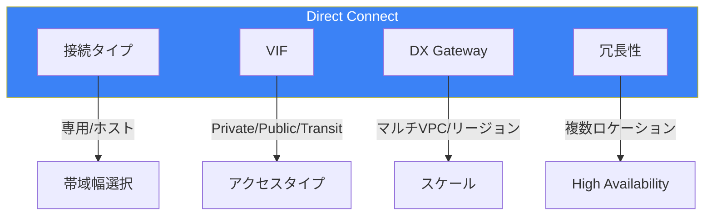

| コンポーネント | 用途 | 重要度 |
|--------------|------|--------|
| 専用接続 | 大規模利用 | ★★★ |
| ホスト接続 | 小〜中規模 | ★★☆ |
| DX Gateway | マルチVPC | ★★★ |
| LAG | 帯域幅集約 | ★★☆ |
| MACsec | 暗号化 | ★★☆ |

Direct Connectは、一貫したパフォーマンスが必要なハイブリッドアーキテクチャの基盤です。適切な冗長性設計により、高可用性を実現できます。

## 参考資料

- [AWS Direct Connect User Guide](https://docs.aws.amazon.com/directconnect/latest/UserGuide/)
- [Direct Connect Resiliency Recommendations](https://docs.aws.amazon.com/directconnect/latest/UserGuide/resilency_toolkit.html)
- [Direct Connect Gateway](https://docs.aws.amazon.com/directconnect/latest/UserGuide/direct-connect-gateways.html)
