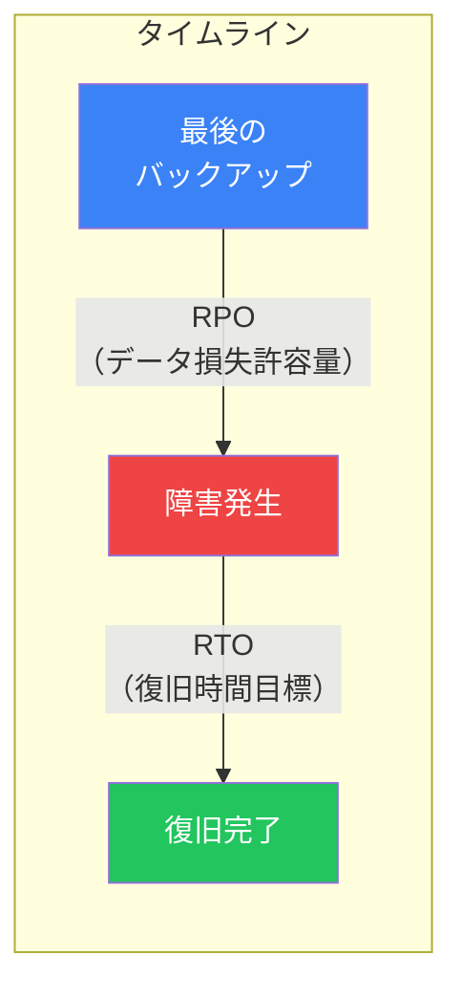
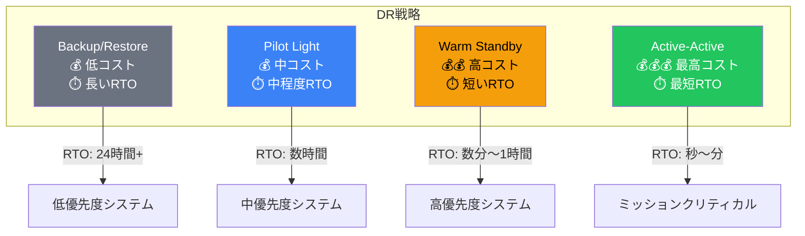
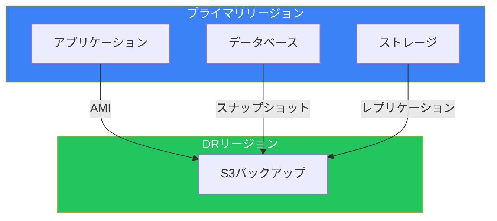
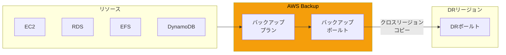
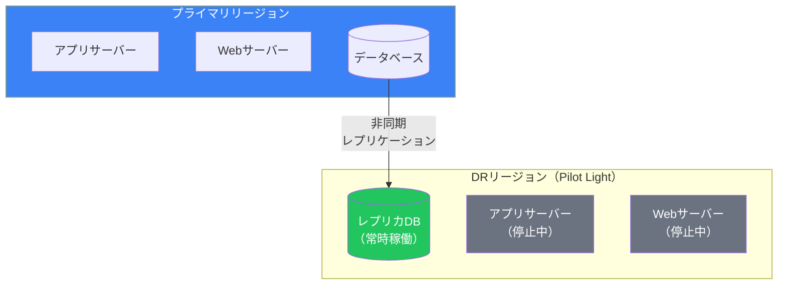
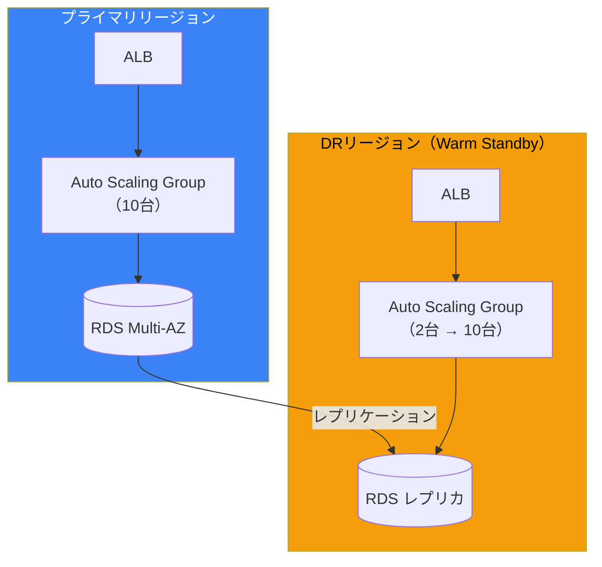
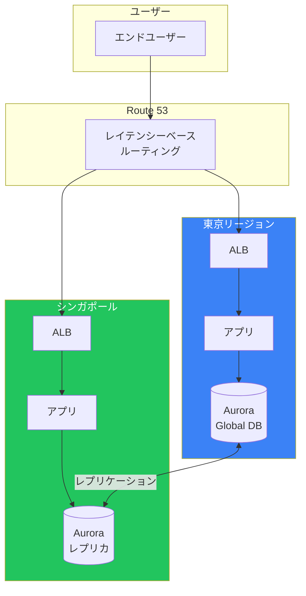
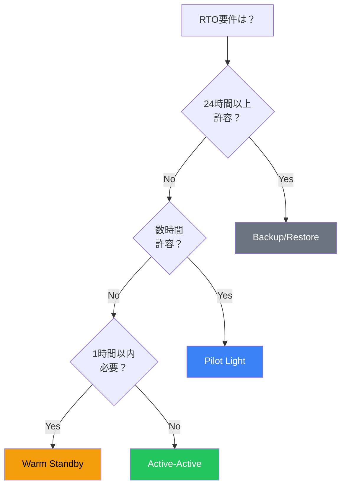
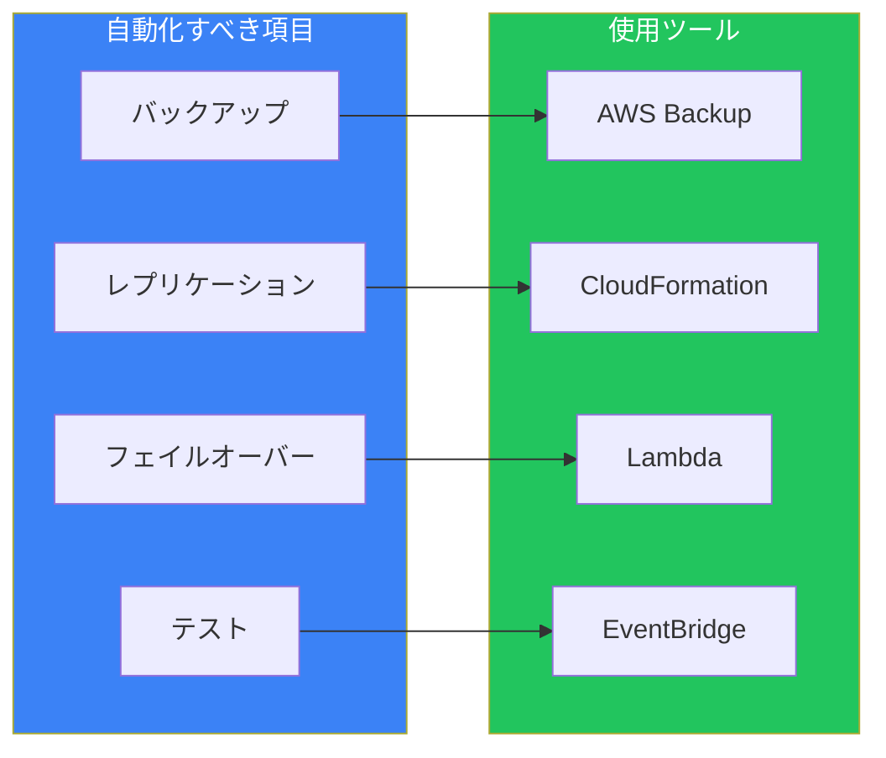
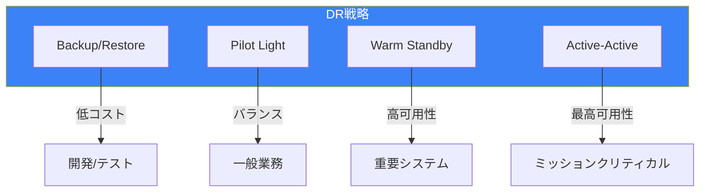

災害復旧（Disaster Recovery、DR）は、自然災害、ハードウェア障害、サイバー攻撃などからビジネスを守るための重要な戦略です。AWSは複数のDRオプションを提供しており、要件に応じて適切なアプローチを選択できます。

## DR計画の基本概念

### RTO と RPO



| 指標 | 定義 | 質問 |
|------|------|------|
| **RTO** | Recovery Time Objective | どれだけ早く復旧する必要があるか？ |
| **RPO** | Recovery Point Objective | どれだけのデータ損失を許容できるか？ |

### 高可用性 vs 災害復旧

| 項目 | 高可用性（HA） | 災害復旧（DR） |
|------|---------------|---------------|
| 目的 | 単一障害点の排除 | 大規模障害からの復旧 |
| 範囲 | 単一リージョン内 | リージョン間 |
| 自動化 | 通常は自動 | 手動または自動 |
| コスト | 中程度 | 戦略により変動 |

## 4つのDR戦略

### 概要比較



### 戦略比較表

| 戦略 | RTO | RPO | コスト | 複雑さ |
|------|-----|-----|--------|--------|
| Backup/Restore | 24時間+ | 24時間+ | 最低 | 低 |
| Pilot Light | 数時間 | 分〜時間 | 低 | 中 |
| Warm Standby | 分〜1時間 | 秒〜分 | 中 | 中〜高 |
| Active-Active | 秒〜分 | ほぼゼロ | 最高 | 高 |

## Backup/Restore

### 概要

最もシンプルでコスト効率の高い戦略。データをバックアップし、災害時に復元します。



### 実装方法

```bash
# EBSスナップショットのクロスリージョンコピー
aws ec2 copy-snapshot \
    --source-region ap-northeast-1 \
    --source-snapshot-id snap-xxx \
    --destination-region us-west-2

# RDSスナップショットのクロスリージョンコピー
aws rds copy-db-snapshot \
    --source-db-snapshot-identifier arn:aws:rds:ap-northeast-1:xxx:snapshot:xxx \
    --target-db-snapshot-identifier my-snapshot-copy \
    --source-region ap-northeast-1

# S3クロスリージョンレプリケーション
aws s3api put-bucket-replication \
    --bucket my-bucket \
    --replication-configuration file://replication.json
```

### AWS Backupによる自動化



### 適したユースケース

- 開発/テスト環境
- 低優先度のワークロード
- コスト最優先のシステム
- 長いRTOが許容される場合

## Pilot Light

### 概要

コアシステム（データベース等）のみをDRリージョンで常時稼働させ、災害時に残りのコンポーネントを起動します。



### 実装方法

#### データベースレプリケーション

```bash
# RDS リードレプリカ（クロスリージョン）
aws rds create-db-instance-read-replica \
    --db-instance-identifier mydb-replica \
    --source-db-instance-identifier arn:aws:rds:ap-northeast-1:xxx:db:mydb \
    --source-region ap-northeast-1 \
    --region us-west-2

# Aurora Global Database
aws rds create-global-cluster \
    --global-cluster-identifier my-global-cluster \
    --source-db-cluster-identifier arn:aws:rds:ap-northeast-1:xxx:cluster:my-cluster
```

#### 復旧時の手順

1. データベースレプリカを昇格
2. EC2インスタンスを起動
3. Route 53でトラフィックを切り替え

### 適したユースケース

- 中程度の優先度のワークロード
- 数時間のRTOが許容される場合
- コストとRTOのバランスを取りたい場合

## Warm Standby

### 概要

DRリージョンで縮小版のシステムを常時稼働させます。災害時はスケールアップして本番トラフィックを処理します。



### 実装のポイント

| コンポーネント | プライマリ | Warm Standby |
|--------------|-----------|--------------|
| EC2 | フルキャパシティ | 最小構成 |
| Auto Scaling | アクティブ | 小さい最小値 |
| ALB | アクティブ | アクティブ（待機） |
| RDS | マスター | リードレプリカ |

### 復旧手順

```bash
# 1. Auto Scaling Groupの容量を増加
aws autoscaling update-auto-scaling-group \
    --auto-scaling-group-name my-dr-asg \
    --min-size 10 \
    --desired-capacity 10

# 2. RDSレプリカを昇格
aws rds promote-read-replica \
    --db-instance-identifier mydb-replica

# 3. Route 53でフェイルオーバー（自動の場合はヘルスチェック依存）
```

### 適したユースケース

- 高優先度のビジネスアプリケーション
- 分〜1時間のRTOが必要な場合
- 中程度のコストが許容される場合

## Active-Active（Multi-Site）

### 概要

複数のリージョンで本番トラフィックを処理します。災害時のフェイルオーバーは最小限で済みます。



### 主要コンポーネント

#### Aurora Global Database

```bash
# プライマリクラスターからグローバルデータベースを作成
aws rds create-global-cluster \
    --global-cluster-identifier my-global-db \
    --source-db-cluster-identifier my-primary-cluster

# セカンダリリージョンにクラスターを追加
aws rds create-db-cluster \
    --db-cluster-identifier my-secondary-cluster \
    --global-cluster-identifier my-global-db \
    --engine aurora-mysql \
    --region us-west-2
```

#### DynamoDB Global Tables

```bash
# グローバルテーブルの作成
aws dynamodb create-table \
    --table-name MyTable \
    --attribute-definitions AttributeName=pk,AttributeType=S \
    --key-schema AttributeName=pk,KeyType=HASH \
    --billing-mode PAY_PER_REQUEST \
    --stream-specification StreamEnabled=true,StreamViewType=NEW_AND_OLD_IMAGES

# レプリカの追加
aws dynamodb update-table \
    --table-name MyTable \
    --replica-updates Create={RegionName=us-west-2}
```

### 適したユースケース

- ミッションクリティカルなシステム
- グローバルユーザーベース
- ほぼゼロのダウンタイムが必要な場合
- コストより可用性を優先

## 戦略選択フローチャート



## DR実装のベストプラクティス

### 自動化



### テスト

| テスト種類 | 頻度 | 内容 |
|-----------|------|------|
| バックアップ検証 | 週次 | リストアテスト |
| フェイルオーバー演習 | 月次 | 手順の確認 |
| 本番切り替えテスト | 四半期 | 実際のフェイルオーバー |
| カオスエンジニアリング | 継続的 | 障害注入テスト |

### ドキュメント化

必ず文書化すべき項目：
- RPO/RTO目標
- 復旧手順（ランブック）
- 連絡先リスト
- 責任者と承認フロー
- テスト結果の履歴

## まとめ



| 戦略 | RTO | RPO | コスト | 推奨用途 |
|------|-----|-----|--------|---------|
| Backup/Restore | 24h+ | 24h+ | $ | 開発環境 |
| Pilot Light | 数時間 | 分〜時間 | $$ | 一般業務 |
| Warm Standby | 分〜1時間 | 秒〜分 | $$$ | 重要業務 |
| Active-Active | 秒〜分 | ほぼ0 | $$$$ | 最重要システム |

適切なDR戦略の選択は、ビジネス要件、コスト、技術的複雑さのバランスに基づいて行います。定期的なテストと改善が、DR計画の成功の鍵です。

## 参考資料

- [Disaster Recovery on AWS](https://docs.aws.amazon.com/whitepapers/latest/disaster-recovery-workloads-on-aws/)
- [AWS Backup User Guide](https://docs.aws.amazon.com/aws-backup/latest/devguide/)
- [Aurora Global Database](https://docs.aws.amazon.com/AmazonRDS/latest/AuroraUserGuide/aurora-global-database.html)
