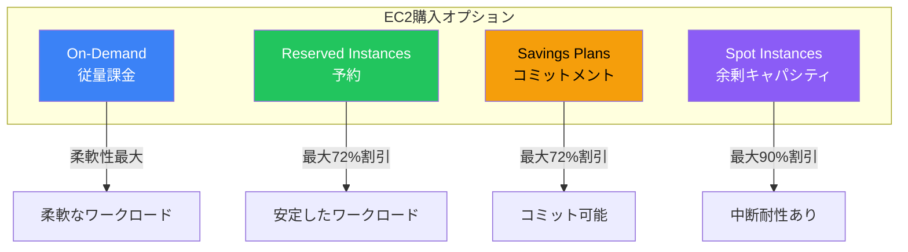
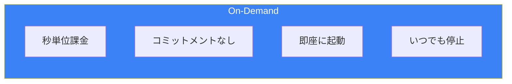
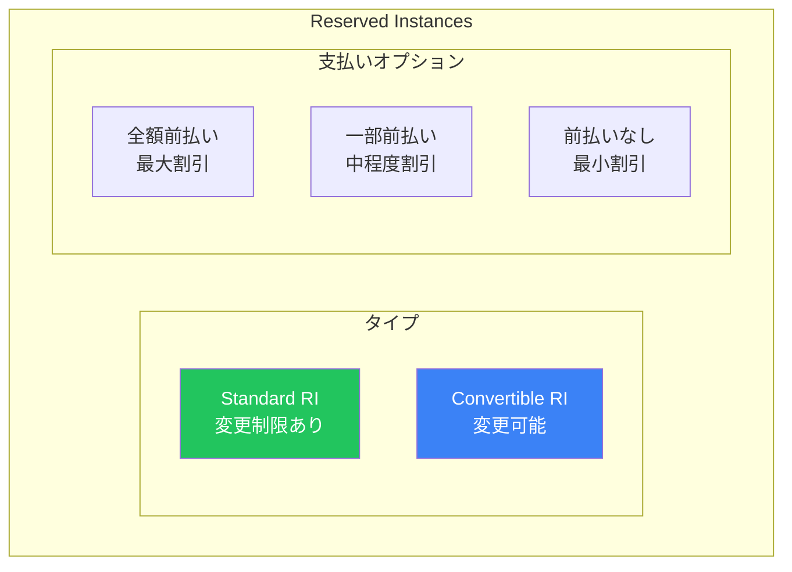
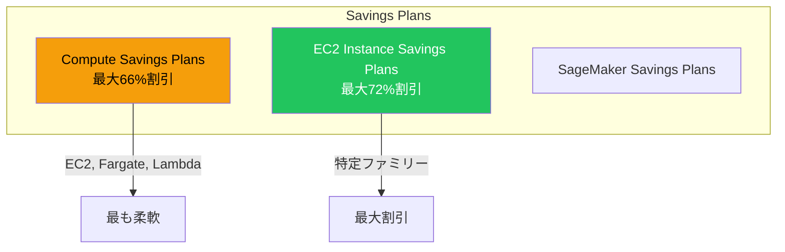
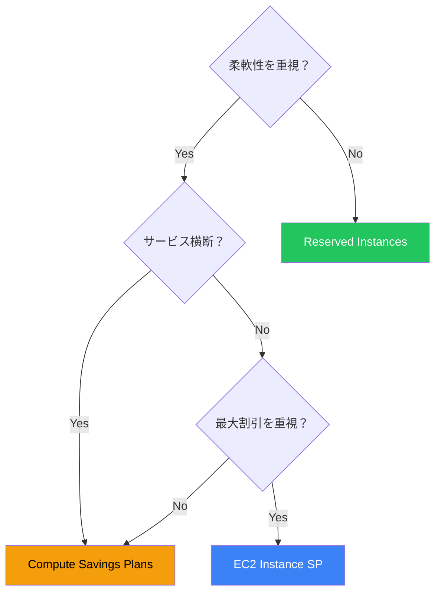
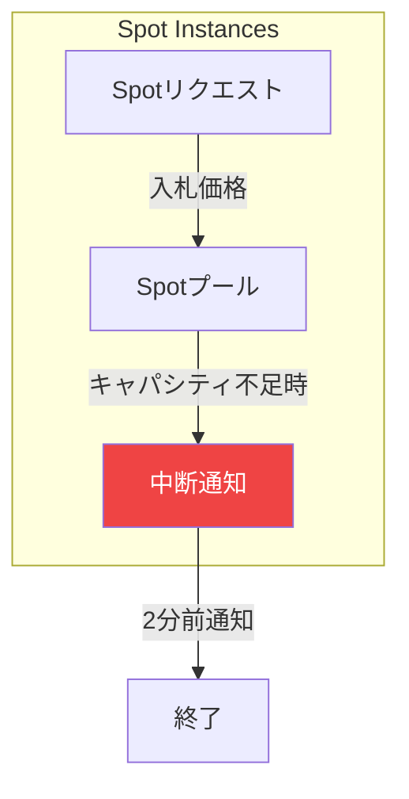
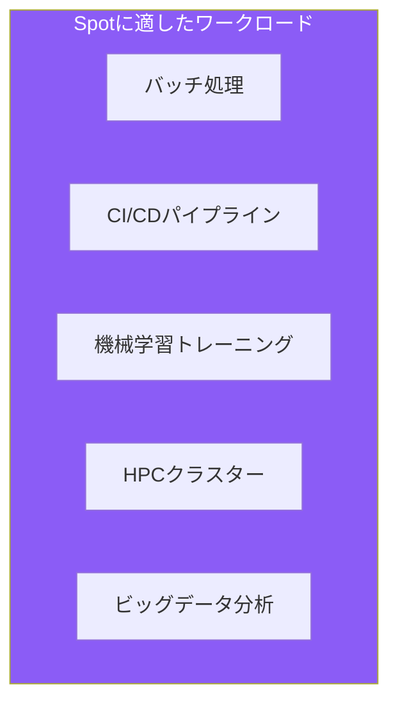
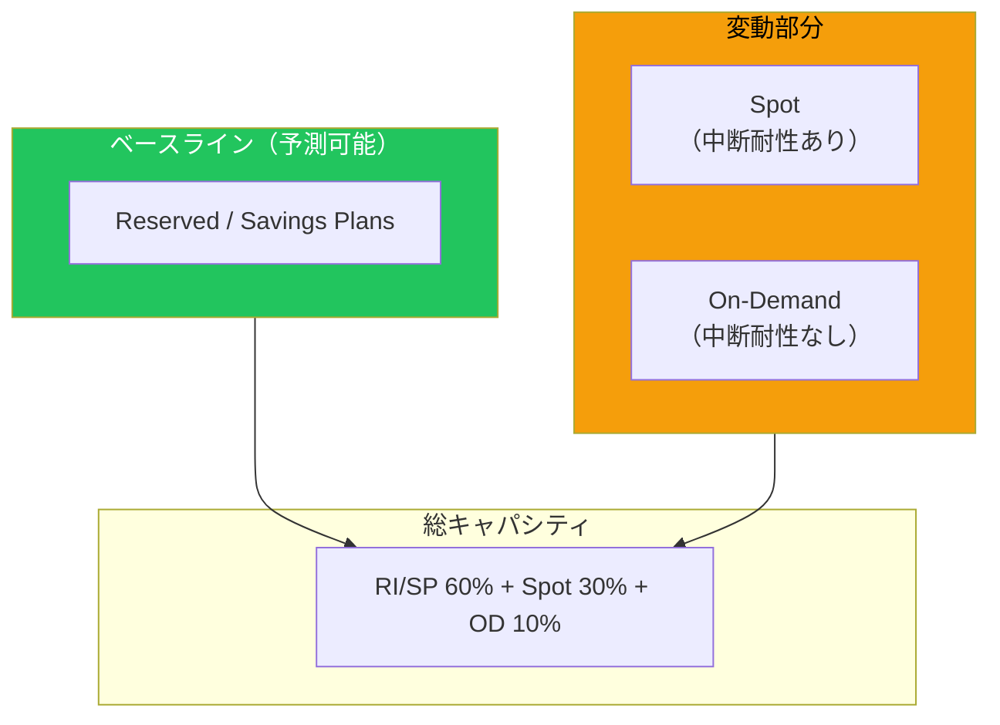
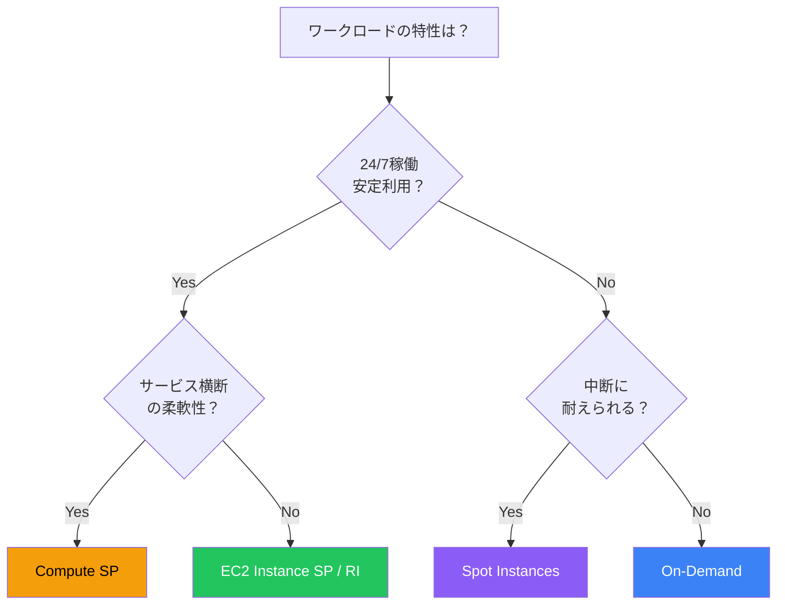
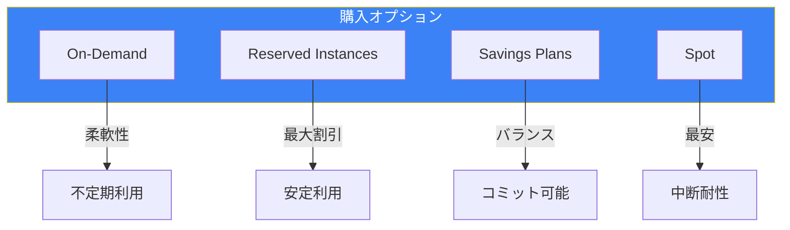

EC2のコストを最適化するには、ワークロードの特性に応じた購入オプションの選択が重要です。AWSは4つの主要な購入オプションを提供しており、適切に組み合わせることで大幅なコスト削減が可能です。

## 購入オプションの概要



### 比較表

| 項目 | On-Demand | Reserved | Savings Plans | Spot |
|------|-----------|----------|---------------|------|
| 割引率 | 0% | 最大72% | 最大72% | 最大90% |
| コミットメント | なし | 1年/3年 | 1年/3年 | なし |
| 柔軟性 | 最高 | 低 | 中〜高 | 中断あり |
| 用途 | 不定期利用 | 安定利用 | コミット可能 | 中断耐性 |

## On-Demand Instances

### 特徴



### 適したユースケース

| ユースケース | 理由 |
|-------------|------|
| 開発/テスト | 予測困難、短期利用 |
| 突発的な負荷 | Auto Scalingでの追加 |
| 新規ワークロード | 使用量が未知 |
| 短期プロジェクト | コミット不要 |

## Reserved Instances (RI)

### タイプと支払いオプション



### 割引率（3年、Linux）

| タイプ | 全額前払い | 一部前払い | 前払いなし |
|--------|----------|-----------|-----------|
| Standard | 〜62% | 〜60% | 〜56% |
| Convertible | 〜54% | 〜52% | 〜48% |

### Standard vs Convertible

| 項目 | Standard | Convertible |
|------|----------|-------------|
| インスタンスファミリー変更 | ❌ | ✅ |
| OS変更 | ❌ | ✅ |
| テナンシー変更 | ❌ | ✅ |
| マーケットプレイス売却 | ✅ | ❌ |
| 割引率 | 高い | 低い |

### リージョナル vs ゾーン

| 項目 | リージョナルRI | ゾーンRI |
|------|---------------|----------|
| キャパシティ予約 | なし | あり |
| AZの柔軟性 | あり | 特定AZのみ |
| インスタンスサイズ | 柔軟（同ファミリー内） | 固定 |

## Savings Plans

### タイプ



### Compute vs EC2 Instance Savings Plans

| 項目 | Compute SP | EC2 Instance SP |
|------|------------|-----------------|
| リージョン変更 | ✅ | ❌ |
| ファミリー変更 | ✅ | ❌ |
| OS変更 | ✅ | ✅ |
| テナンシー変更 | ✅ | ✅ |
| 対象サービス | EC2, Fargate, Lambda | EC2のみ |
| 割引率 | 中程度 | 最大 |

### RI vs Savings Plans



## Spot Instances

### 概要

AWSの余剰キャパシティを最大90%割引で利用できます。ただし、2分前の通知で中断される可能性があります。



### 中断対策

| 戦略 | 説明 |
|------|------|
| 複数AZ/ファミリー | キャパシティプールの分散 |
| Spot Fleet | 複数プールから調達 |
| 中断ハンドリング | 通知を検知して処理 |
| チェックポイント | 進捗を定期保存 |

### 中断通知の検知

```bash
# EC2メタデータから中断通知を確認
TOKEN=$(curl -X PUT "http://169.254.169.254/latest/api/token" \
    -H "X-aws-ec2-metadata-token-ttl-seconds: 21600")

curl -H "X-aws-ec2-metadata-token: $TOKEN" \
    http://169.254.169.254/latest/meta-data/spot/instance-action
```

### Spot Fleet

```json
{
  "SpotFleetRequestConfig": {
    "IamFleetRole": "arn:aws:iam::xxx:role/SpotFleetRole",
    "TargetCapacity": 10,
    "SpotPrice": "0.05",
    "AllocationStrategy": "capacityOptimized",
    "LaunchTemplateConfigs": [
      {
        "LaunchTemplateSpecification": {
          "LaunchTemplateId": "lt-xxx",
          "Version": "1"
        },
        "Overrides": [
          {"InstanceType": "m5.large", "AvailabilityZone": "ap-northeast-1a"},
          {"InstanceType": "m5.xlarge", "AvailabilityZone": "ap-northeast-1a"},
          {"InstanceType": "m4.large", "AvailabilityZone": "ap-northeast-1c"}
        ]
      }
    ]
  }
}
```

### 適したユースケース



## 購入オプションの組み合わせ

### ベースライン + 変動対応



### Auto Scaling Groupでの混合

```json
{
  "MixedInstancesPolicy": {
    "InstancesDistribution": {
      "OnDemandBaseCapacity": 2,
      "OnDemandPercentageAboveBaseCapacity": 20,
      "SpotAllocationStrategy": "capacity-optimized"
    },
    "LaunchTemplate": {
      "LaunchTemplateSpecification": {
        "LaunchTemplateId": "lt-xxx",
        "Version": "$Latest"
      },
      "Overrides": [
        {"InstanceType": "m5.large"},
        {"InstanceType": "m5.xlarge"},
        {"InstanceType": "m4.large"}
      ]
    }
  }
}
```

## コスト最適化のフレームワーク

### 選択フローチャート



### 推奨割合

| ワークロードタイプ | RI/SP | Spot | On-Demand |
|------------------|-------|------|-----------|
| 本番Webサーバー | 70% | 0% | 30% |
| バッチ処理 | 20% | 70% | 10% |
| 開発/テスト | 0% | 50% | 50% |
| CI/CD | 0% | 80% | 20% |

## まとめ



| オプション | 主なユースケース | 割引率 |
|-----------|----------------|--------|
| On-Demand | 不定期/テスト | 0% |
| Reserved | 安定した本番 | 〜72% |
| Savings Plans | 柔軟なコミット | 〜72% |
| Spot | バッチ/CI/CD | 〜90% |

適切な購入オプションの組み合わせにより、パフォーマンスを維持しながらEC2コストを大幅に削減できます。

## 参考資料

- [EC2 Pricing](https://aws.amazon.com/ec2/pricing/)
- [Reserved Instances](https://docs.aws.amazon.com/AWSEC2/latest/UserGuide/ec2-reserved-instances.html)
- [Savings Plans](https://docs.aws.amazon.com/savingsplans/latest/userguide/)
- [Spot Instances](https://docs.aws.amazon.com/AWSEC2/latest/UserGuide/using-spot-instances.html)
