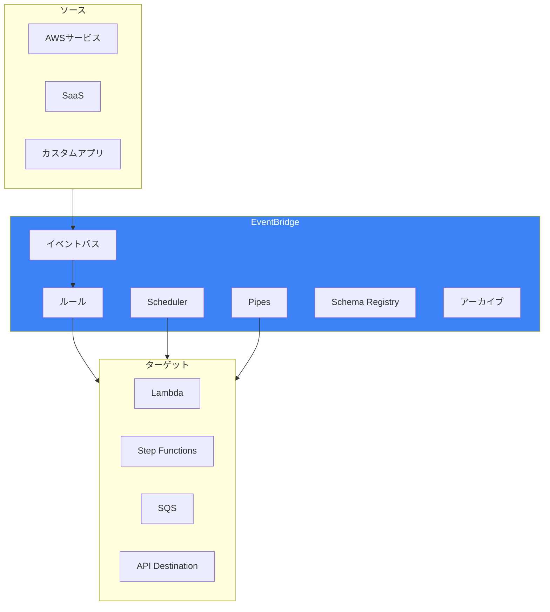
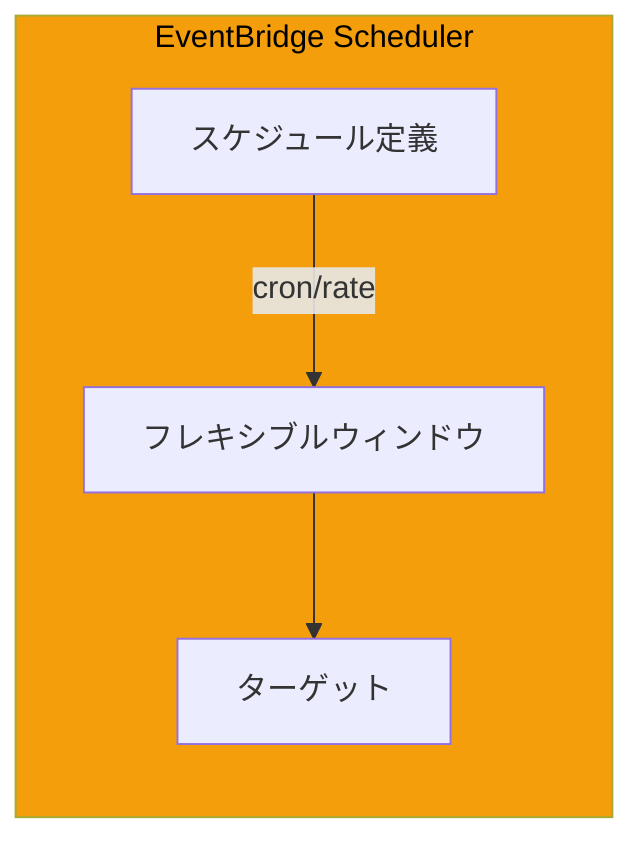
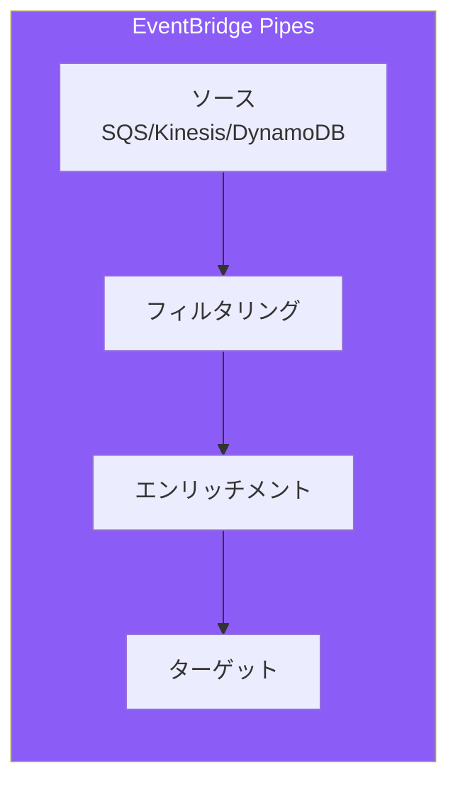
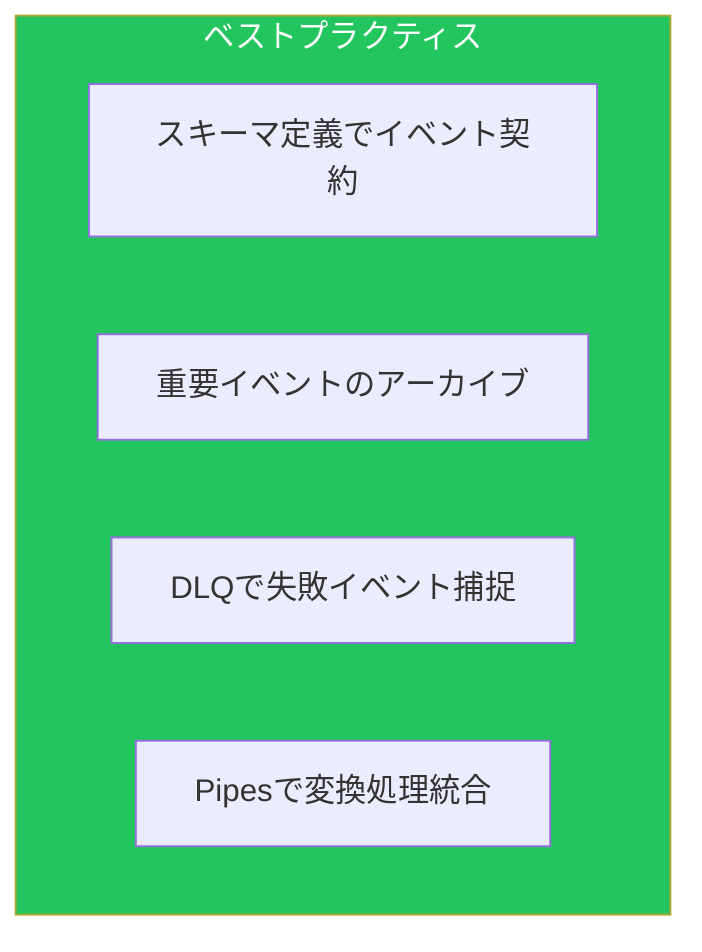

Amazon EventBridgeは、イベント駆動アーキテクチャの中核となるサービスです。本記事では、[運用記事](/blog/aws-operational-excellence)で触れなかった高度な機能を解説します。

## EventBridgeアーキテクチャ



## イベントパターンマッチング

### 基本パターン

```yaml
# 完全一致
BasicMatchRule:
  Type: AWS::Events::Rule
  Properties:
    EventBusName: !Ref CustomEventBus
    EventPattern:
      source:
        - "orders.api"
      detail-type:
        - "Order Created"
      detail:
        status:
          - "pending"

# 配列内のいずれかにマッチ
ArrayMatchRule:
  Type: AWS::Events::Rule
  Properties:
    EventPattern:
      source:
        - "orders.api"
        - "inventory.api"
      detail:
        priority:
          - "high"
          - "critical"
```

### 高度なパターン

```yaml
# プレフィックスマッチ
PrefixMatchRule:
  Type: AWS::Events::Rule
  Properties:
    EventPattern:
      source:
        - prefix: "aws."
      detail:
        eventName:
          - prefix: "Create"

# サフィックスマッチ
SuffixMatchRule:
  Type: AWS::Events::Rule
  Properties:
    EventPattern:
      detail:
        resourceArn:
          - suffix: "-production"

# ワイルドカード
WildcardRule:
  Type: AWS::Events::Rule
  Properties:
    EventPattern:
      detail:
        instanceId:
          - wildcard: "i-*"

# 数値比較
NumericMatchRule:
  Type: AWS::Events::Rule
  Properties:
    EventPattern:
      detail:
        amount:
          - numeric:
              - ">="
              - 1000
        quantity:
          - numeric:
              - ">"
              - 0
              - "<="
              - 100

# 存在チェック
ExistsRule:
  Type: AWS::Events::Rule
  Properties:
    EventPattern:
      detail:
        errorCode:
          - exists: true
        successMessage:
          - exists: false

# 否定マッチ
NegationRule:
  Type: AWS::Events::Rule
  Properties:
    EventPattern:
      detail:
        status:
          - anything-but: "test"
        environment:
          - anything-but:
              prefix: "dev-"
```

### 複合パターン

```yaml
# OR条件（$or）
OrConditionRule:
  Type: AWS::Events::Rule
  Properties:
    EventPattern:
      source:
        - "orders.api"
      "$or":
        - detail:
            status:
              - "failed"
        - detail:
            retryCount:
              - numeric:
                  - ">="
                  - 3

# 複雑な条件の組み合わせ
ComplexRule:
  Type: AWS::Events::Rule
  Properties:
    EventPattern:
      source:
        - "payment.service"
      detail-type:
        - "Transaction Completed"
      detail:
        transactionType:
          - "purchase"
          - "refund"
        amount:
          - numeric:
              - ">="
              - 100
        currency:
          - "USD"
          - "JPY"
        metadata:
          region:
            - prefix: "ap-"
```

## EventBridge Scheduler

### 概要



### スケジュール設定

```yaml
# 1回限りのスケジュール
OneTimeSchedule:
  Type: AWS::Scheduler::Schedule
  Properties:
    Name: one-time-report
    ScheduleExpression: "at(2024-12-31T23:59:00)"
    ScheduleExpressionTimezone: Asia/Tokyo
    FlexibleTimeWindow:
      Mode: "OFF"
    Target:
      Arn: !GetAtt ReportFunction.Arn
      RoleArn: !GetAtt SchedulerRole.Arn
      Input: '{"type": "year-end-report"}'

# 定期実行スケジュール
RecurringSchedule:
  Type: AWS::Scheduler::Schedule
  Properties:
    Name: daily-cleanup
    ScheduleExpression: "cron(0 2 * * ? *)"  # 毎日AM2時
    ScheduleExpressionTimezone: Asia/Tokyo
    FlexibleTimeWindow:
      Mode: FLEXIBLE
      MaximumWindowInMinutes: 15
    Target:
      Arn: !GetAtt CleanupFunction.Arn
      RoleArn: !GetAtt SchedulerRole.Arn
      RetryPolicy:
        MaximumEventAgeInSeconds: 3600
        MaximumRetryAttempts: 3

# Rate式スケジュール
RateSchedule:
  Type: AWS::Scheduler::Schedule
  Properties:
    Name: health-check
    ScheduleExpression: "rate(5 minutes)"
    FlexibleTimeWindow:
      Mode: FLEXIBLE
      MaximumWindowInMinutes: 2
    Target:
      Arn: !GetAtt HealthCheckFunction.Arn
      RoleArn: !GetAtt SchedulerRole.Arn
    State: ENABLED
```

### スケジュールグループ

```yaml
ScheduleGroup:
  Type: AWS::Scheduler::ScheduleGroup
  Properties:
    Name: production-schedules
    Tags:
      - Key: Environment
        Value: Production

# グループ内のスケジュール
GroupedSchedule:
  Type: AWS::Scheduler::Schedule
  Properties:
    GroupName: !Ref ScheduleGroup
    Name: batch-job
    ScheduleExpression: "cron(0 */6 * * ? *)"
    FlexibleTimeWindow:
      Mode: FLEXIBLE
      MaximumWindowInMinutes: 30
    Target:
      Arn: !Ref BatchJobStateMachine
      RoleArn: !GetAtt SchedulerRole.Arn
```

## EventBridge Pipes

### 概要



### Pipe設定

```yaml
# SQSからLambdaへのPipe
SQSToLambdaPipe:
  Type: AWS::Pipes::Pipe
  Properties:
    Name: orders-processing-pipe
    RoleArn: !GetAtt PipeRole.Arn
    Source: !GetAtt OrdersQueue.Arn
    SourceParameters:
      SqsQueueParameters:
        BatchSize: 10
        MaximumBatchingWindowInSeconds: 30
      FilterCriteria:
        Filters:
          - Pattern: '{"body": {"priority": ["high", "critical"]}}'
    Enrichment: !GetAtt EnrichmentFunction.Arn
    EnrichmentParameters:
      InputTemplate: '{"orderId": <$.body.orderId>, "customerId": <$.body.customerId>}'
    Target: !GetAtt ProcessingFunction.Arn
    TargetParameters:
      LambdaFunctionParameters:
        InvocationType: REQUEST_RESPONSE

# DynamoDB StreamsからStep Functionsへ
DynamoDBToStepFunctionsPipe:
  Type: AWS::Pipes::Pipe
  Properties:
    Name: order-state-change-pipe
    RoleArn: !GetAtt PipeRole.Arn
    Source: !GetAtt OrdersTable.StreamArn
    SourceParameters:
      DynamoDBStreamParameters:
        BatchSize: 100
        MaximumBatchingWindowInSeconds: 5
        StartingPosition: LATEST
        MaximumRetryAttempts: 3
        DeadLetterConfig:
          Arn: !GetAtt DLQ.Arn
      FilterCriteria:
        Filters:
          - Pattern: |
              {
                "eventName": ["MODIFY"],
                "dynamodb": {
                  "NewImage": {
                    "status": {"S": ["completed", "cancelled"]}
                  }
                }
              }
    Target: !Ref OrderWorkflow
    TargetParameters:
      StepFunctionStateMachineParameters:
        InvocationType: FIRE_AND_FORGET

# Kinesis Data StreamsからEventBridge API Destinationへ
KinesisToApiPipe:
  Type: AWS::Pipes::Pipe
  Properties:
    Name: events-to-external-api
    RoleArn: !GetAtt PipeRole.Arn
    Source: !GetAtt EventsStream.Arn
    SourceParameters:
      KinesisStreamParameters:
        BatchSize: 50
        StartingPosition: LATEST
        MaximumBatchingWindowInSeconds: 10
    Enrichment: !GetAtt TransformFunction.Arn
    Target: !GetAtt ExternalApiDestination.Arn
    TargetParameters:
      HttpParameters:
        HeaderParameters:
          Content-Type: application/json
          X-Api-Key: !Sub "{{resolve:secretsmanager:api-key}}"
```

## Schema Registry

### スキーマ検出

```yaml
SchemaDiscoverer:
  Type: AWS::EventSchemas::Discoverer
  Properties:
    SourceArn: !GetAtt CustomEventBus.Arn
    Description: Auto-discover schemas from custom events

# カスタムスキーマ定義
OrderSchema:
  Type: AWS::EventSchemas::Schema
  Properties:
    RegistryName: discovered-schemas
    SchemaName: orders@OrderCreated
    Type: OpenApi3
    Content: |
      {
        "openapi": "3.0.0",
        "info": {
          "title": "OrderCreated",
          "version": "1.0.0"
        },
        "paths": {},
        "components": {
          "schemas": {
            "OrderCreated": {
              "type": "object",
              "required": ["orderId", "customerId", "items", "total"],
              "properties": {
                "orderId": {"type": "string"},
                "customerId": {"type": "string"},
                "items": {
                  "type": "array",
                  "items": {
                    "type": "object",
                    "properties": {
                      "productId": {"type": "string"},
                      "quantity": {"type": "integer"},
                      "price": {"type": "number"}
                    }
                  }
                },
                "total": {"type": "number"},
                "currency": {"type": "string", "default": "JPY"},
                "createdAt": {"type": "string", "format": "date-time"}
              }
            }
          }
        }
      }
```

### コード生成

```bash
# スキーマからコード生成
aws schemas get-code-binding-source \
    --registry-name discovered-schemas \
    --schema-name orders@OrderCreated \
    --language Python36 \
    --schema-version 1 \
    --output code.zip

# TypeScript用
aws schemas get-code-binding-source \
    --registry-name discovered-schemas \
    --schema-name orders@OrderCreated \
    --language TypeScript3 \
    --schema-version 1 \
    --output code.zip
```

## アーカイブとリプレイ

### アーカイブ設定

```yaml
EventArchive:
  Type: AWS::Events::Archive
  Properties:
    ArchiveName: orders-archive
    SourceArn: !GetAtt CustomEventBus.Arn
    Description: Archive all order events
    EventPattern:
      source:
        - "orders.api"
    RetentionDays: 90

# 全イベントアーカイブ
FullArchive:
  Type: AWS::Events::Archive
  Properties:
    ArchiveName: full-archive
    SourceArn: !GetAtt CustomEventBus.Arn
    RetentionDays: 365
```

### リプレイ実行

```bash
# リプレイの開始
aws events start-replay \
    --replay-name order-replay-2024-01-15 \
    --event-source-arn arn:aws:events:ap-northeast-1:123456789012:archive/orders-archive \
    --destination '{"Arn": "arn:aws:events:ap-northeast-1:123456789012:event-bus/orders"}' \
    --event-start-time 2024-01-15T00:00:00Z \
    --event-end-time 2024-01-15T23:59:59Z

# リプレイ状態確認
aws events describe-replay --replay-name order-replay-2024-01-15
```

## API Destinations

### 外部API連携

```yaml
# コネクション（認証設定）
ApiConnection:
  Type: AWS::Events::Connection
  Properties:
    Name: external-api-connection
    AuthorizationType: API_KEY
    AuthParameters:
      ApiKeyAuthParameters:
        ApiKeyName: X-API-Key
        ApiKeyValue: !Sub "{{resolve:secretsmanager:external-api-key}}"

# OAuth認証
OAuthConnection:
  Type: AWS::Events::Connection
  Properties:
    Name: oauth-connection
    AuthorizationType: OAUTH_CLIENT_CREDENTIALS
    AuthParameters:
      OAuthParameters:
        AuthorizationEndpoint: https://auth.example.com/oauth/token
        ClientParameters:
          ClientID: !Sub "{{resolve:secretsmanager:oauth-client-id}}"
          ClientSecret: !Sub "{{resolve:secretsmanager:oauth-client-secret}}"
        HttpMethod: POST
        OAuthHttpParameters:
          BodyParameters:
            - Key: grant_type
              Value: client_credentials
              IsValueSecret: false

# API Destination
ApiDestination:
  Type: AWS::Events::ApiDestination
  Properties:
    Name: external-webhook
    ConnectionArn: !GetAtt ApiConnection.Arn
    InvocationEndpoint: https://api.example.com/webhook
    HttpMethod: POST
    InvocationRateLimitPerSecond: 100

# ルール
WebhookRule:
  Type: AWS::Events::Rule
  Properties:
    EventBusName: !Ref CustomEventBus
    EventPattern:
      source:
        - "orders.api"
      detail-type:
        - "Order Completed"
    Targets:
      - Id: ExternalWebhook
        Arn: !GetAtt ApiDestination.Arn
        RoleArn: !GetAtt EventBridgeRole.Arn
        HttpParameters:
          HeaderParameters:
            Content-Type: application/json
          QueryStringParameters:
            source: aws
        InputTransformer:
          InputPathsMap:
            orderId: "$.detail.orderId"
            total: "$.detail.total"
          InputTemplate: |
            {
              "event": "order_completed",
              "data": {
                "order_id": "<orderId>",
                "amount": <total>
              }
            }
        RetryPolicy:
          MaximumEventAgeInSeconds: 3600
          MaximumRetryAttempts: 3
        DeadLetterConfig:
          Arn: !GetAtt DLQ.Arn
```

## クロスアカウント/リージョン

### クロスアカウントイベント

```yaml
# ソースアカウント
CrossAccountRule:
  Type: AWS::Events::Rule
  Properties:
    EventBusName: default
    EventPattern:
      source:
        - "aws.ec2"
      detail-type:
        - "EC2 Instance State-change Notification"
    Targets:
      - Id: CentralEventBus
        Arn: arn:aws:events:ap-northeast-1:999999999999:event-bus/central
        RoleArn: !GetAtt CrossAccountRole.Arn

# ターゲットアカウントのイベントバスポリシー
CentralEventBusPolicy:
  Type: AWS::Events::EventBusPolicy
  Properties:
    EventBusName: central
    StatementId: AllowCrossAccount
    Statement:
      Effect: Allow
      Principal:
        AWS:
          - "111111111111"
          - "222222222222"
      Action: events:PutEvents
      Resource: !GetAtt CentralEventBus.Arn
      Condition:
        StringEquals:
          events:source:
            - "aws.ec2"
```

## ベストプラクティス



| カテゴリ | 項目 |
|---------|------|
| 設計 | Schema Registryでイベント契約 |
| 信頼性 | アーカイブで監査・リプレイ対応 |
| 運用 | DLQで失敗イベント管理 |
| 効率化 | Pipesでストリーム処理統合 |

## まとめ

| 機能 | 用途 |
|------|------|
| イベントパターン | 柔軟なマッチング |
| Scheduler | 時間ベースのトリガー |
| Pipes | ストリーム処理の統合 |
| API Destinations | 外部API連携 |

EventBridgeの高度な機能を活用することで、柔軟なイベント駆動アーキテクチャを構築できます。

## 参考資料

- [EventBridge User Guide](https://docs.aws.amazon.com/eventbridge/latest/userguide/)
- [EventBridge Scheduler](https://docs.aws.amazon.com/scheduler/latest/UserGuide/)
- [EventBridge Pipes](https://docs.aws.amazon.com/eventbridge/latest/userguide/eb-pipes.html)
