AWS Site-to-Site VPNは、オンプレミス環境とAWS VPCをインターネット経由で安全に接続するサービスです。Direct Connectと比較して導入が容易で、バックアップ接続としても活用されます。

## Site-to-Site VPNの概要

### 基本アーキテクチャ

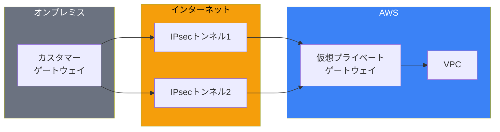

### コンポーネント

| コンポーネント | 説明 |
|--------------|------|
| **カスタマーゲートウェイ（CGW）** | オンプレミス側のVPNデバイス情報 |
| **仮想プライベートゲートウェイ（VGW）** | VPC側のVPNエンドポイント |
| **Transit Gateway** | 複数VPCへの接続時に使用 |
| **VPN接続** | CGWとVGW/TGW間のIPsecトンネル |

## VPN接続オプション

### VGW接続 vs TGW接続

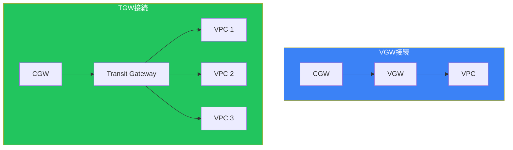

### 比較

| 機能 | VGW接続 | TGW接続 |
|------|--------|---------|
| 接続先VPC数 | 1 | 複数 |
| ECMP | ❌ | ✅ |
| 帯域幅 | 最大1.25Gbps | 最大50Gbps（ECMP時） |
| ルーティング | シンプル | 柔軟 |
| コスト | 低い | 高い |

## IPsecトンネルの詳細

### トンネル構成

各VPN接続は2つのIPsecトンネルで構成されます：

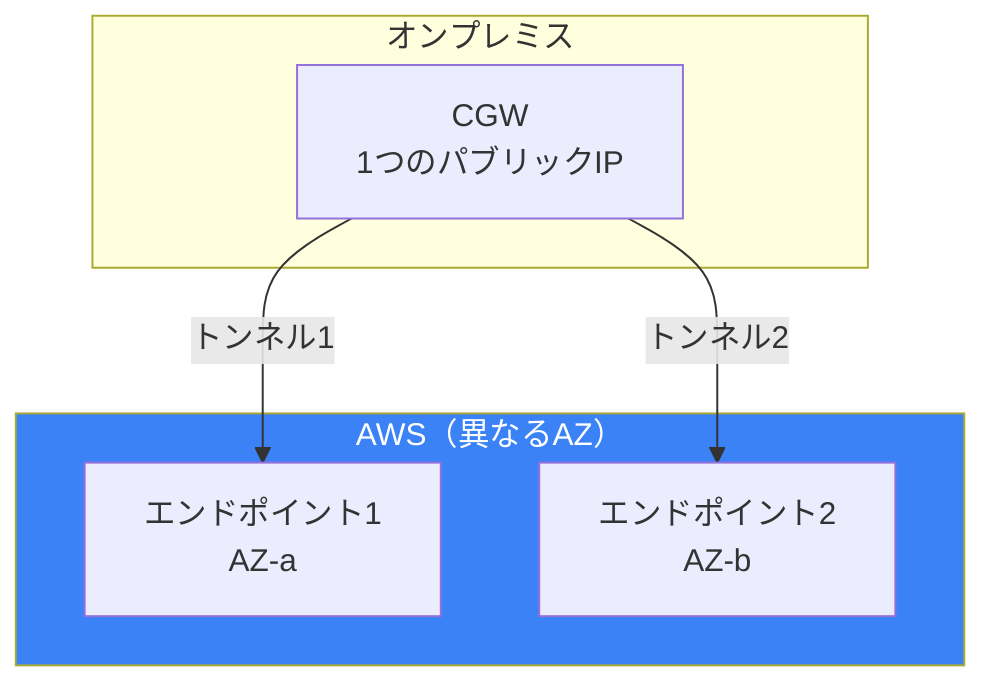

**重要**: 2つのトンネルを両方設定して冗長性を確保してください。AWSのメンテナンス時に片方のトンネルが使用不可になることがあります。

### トンネルオプション

| オプション | 説明 |
|----------|------|
| **事前共有キー** | 認証用のシークレット |
| **トンネル内CIDR** | /30のIPアドレス範囲 |
| **IKEバージョン** | IKEv1またはIKEv2 |
| **Phase 1/2暗号化** | AES128、AES256等 |
| **Phase 1/2 DH** | Diffie-Hellmanグループ |
| **Dead Peer Detection** | 接続断の検出 |

### 設定例

```bash
# カスタマーゲートウェイの作成
aws ec2 create-customer-gateway \
    --type ipsec.1 \
    --public-ip 203.0.113.1 \
    --bgp-asn 65000

# VPN接続の作成（VGW）
aws ec2 create-vpn-connection \
    --type ipsec.1 \
    --customer-gateway-id cgw-xxx \
    --vpn-gateway-id vgw-xxx \
    --options "{\"TunnelOptions\":[
        {\"PreSharedKey\":\"secretkey1\",\"TunnelInsideCidr\":\"169.254.10.0/30\"},
        {\"PreSharedKey\":\"secretkey2\",\"TunnelInsideCidr\":\"169.254.11.0/30\"}
    ]}"
```

## ルーティング

### 静的ルーティング vs BGP

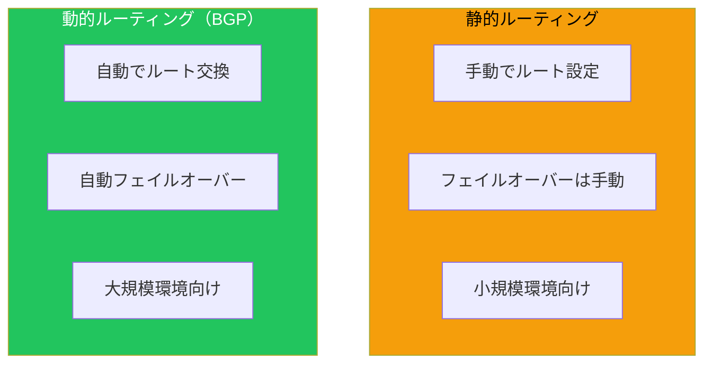

### BGP設定のポイント

| 設定 | 推奨値 |
|------|--------|
| Hold Timer | 30秒（デフォルト） |
| Keepalive | 10秒 |
| BGP ASN | プライベートASN（64512-65534） |
| AS Path Prepend | フェイルオーバー制御に使用 |

## AWS VPN CloudHub

### 概要

VPN CloudHubは、複数のオンプレミス拠点をAWS経由で相互接続するアーキテクチャです。

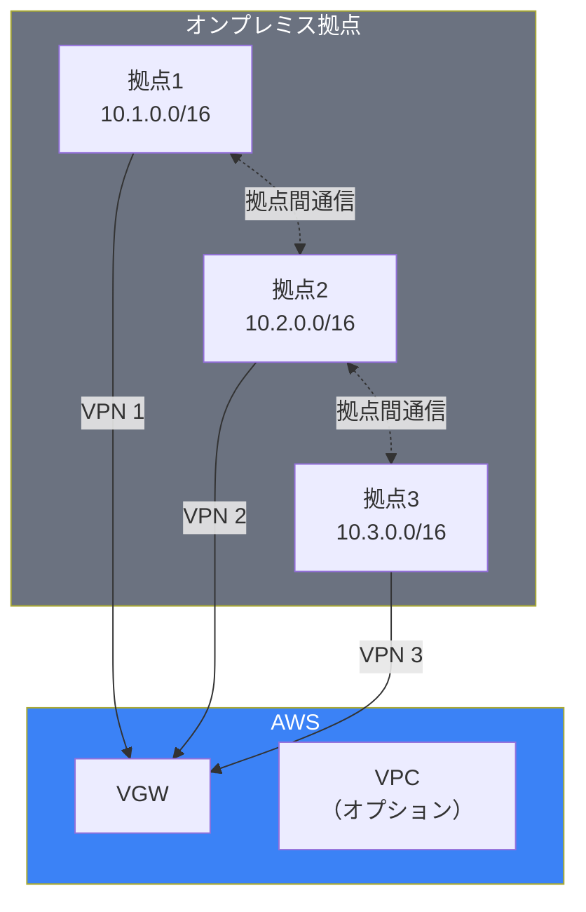

### 特徴

| 特徴 | 詳細 |
|------|------|
| ハブ&スポーク | VGWがハブとして機能 |
| 拠点間通信 | AWS経由でルーティング |
| BGP必須 | 動的ルーティングが必要 |
| VPCオプション | VPCなしでも使用可能 |

### 設定のポイント

```
拠点1 → VGW: 10.1.0.0/16を広報
拠点2 → VGW: 10.2.0.0/16を広報
拠点3 → VGW: 10.3.0.0/16を広報

VGW → 各拠点: 他拠点のルートを広報
```

## Accelerated Site-to-Site VPN

### 概要

AWS Global Acceleratorを使用してVPN接続を高速化：

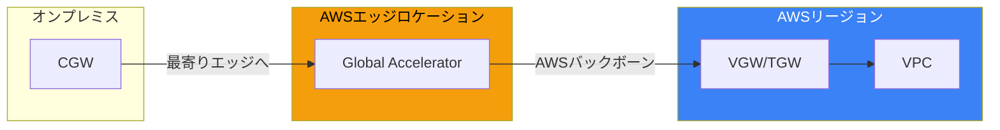

### メリット

| 項目 | 通常のVPN | Accelerated VPN |
|------|----------|-----------------|
| 経路 | インターネット全区間 | エッジ以降はAWSバックボーン |
| レイテンシー | 変動あり | 安定・低減 |
| ジッター | 大きい | 小さい |
| 追加コスト | なし | あり |

### 有効化

```bash
# Accelerated VPNを有効にして作成
aws ec2 create-vpn-connection \
    --type ipsec.1 \
    --customer-gateway-id cgw-xxx \
    --transit-gateway-id tgw-xxx \
    --options EnableAcceleration=true
```

## 冗長構成

### パターン1: デュアルトンネル（基本）

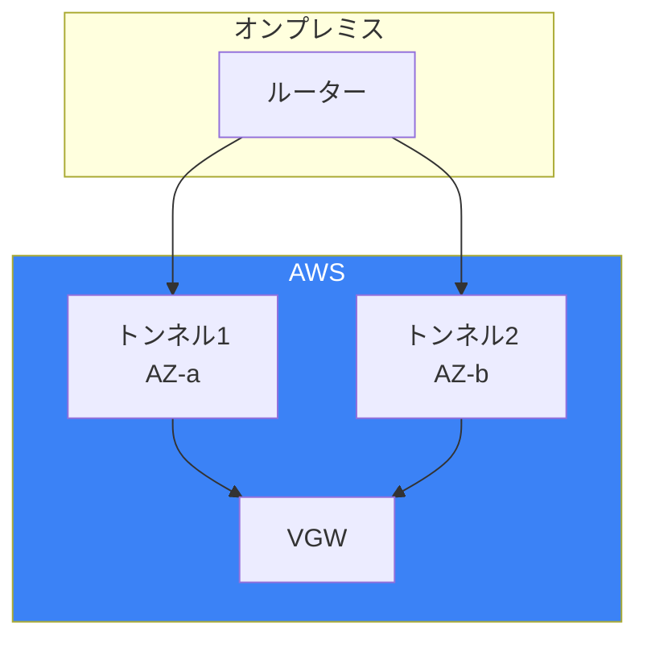

### パターン2: デュアルCGW

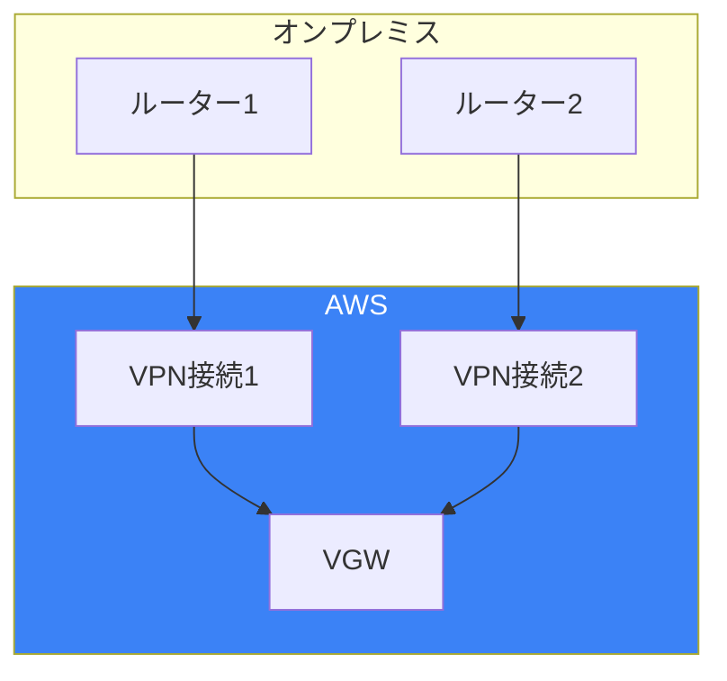

### パターン3: Direct Connect + VPNバックアップ

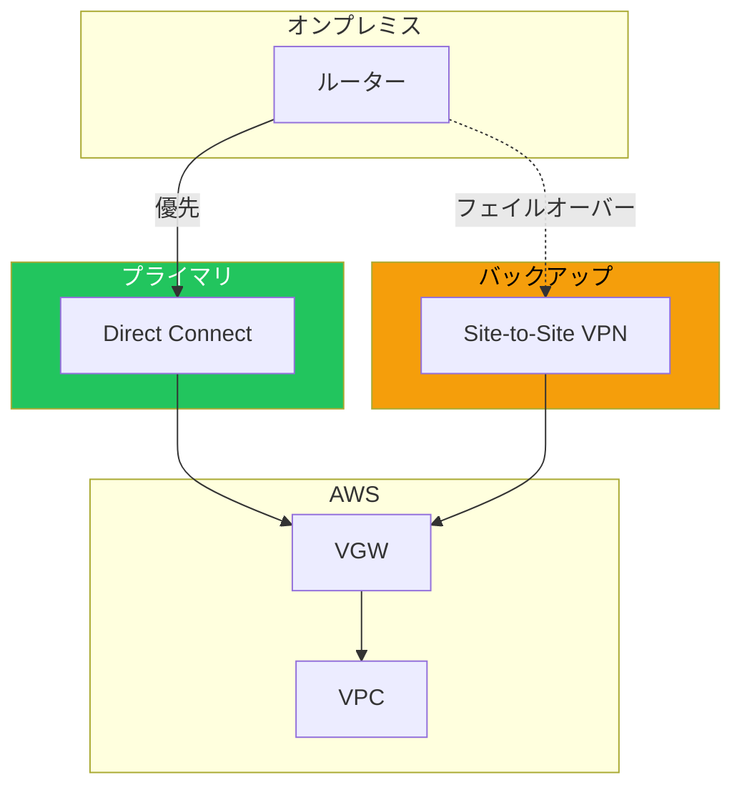

### BGPでの優先度制御

| 手法 | 説明 | 用途 |
|------|------|------|
| AS Path Prepend | パスを長くして優先度を下げる | バックアップ経路 |
| Local Preference | 高い値を優先 | プライマリ経路 |
| MED | 低い値を優先 | 経路選択 |

```
# VPNをバックアップにする例
Direct Connect: AS Path = 65000
VPN: AS Path = 65000 65000 65000（Prepend）
```

## Private IP VPN

### 概要

Transit Gateway経由でプライベートIPアドレスでVPN接続：

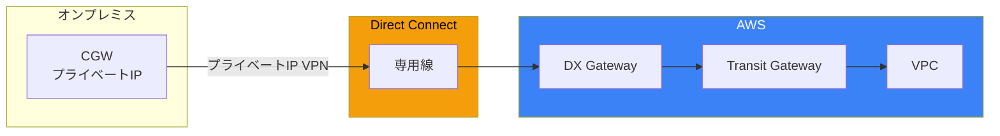

### ユースケース

- パブリックIPを使用したくない場合
- Direct Connect上でVPNの暗号化が必要な場合
- コンプライアンス要件

## モニタリング

### CloudWatchメトリクス

| メトリクス | 説明 |
|-----------|------|
| TunnelState | トンネルの状態（0=DOWN、1=UP） |
| TunnelDataIn | 受信バイト数 |
| TunnelDataOut | 送信バイト数 |

### アラーム設定例

```bash
# トンネルダウンアラーム
aws cloudwatch put-metric-alarm \
    --alarm-name "VPN-Tunnel-Down" \
    --metric-name TunnelState \
    --namespace AWS/VPN \
    --statistic Maximum \
    --period 60 \
    --threshold 1 \
    --comparison-operator LessThanThreshold \
    --dimensions Name=VpnId,Value=vpn-xxx Name=TunnelIpAddress,Value=x.x.x.x \
    --evaluation-periods 2 \
    --alarm-actions arn:aws:sns:ap-northeast-1:xxx:alerts
```

## ベストプラクティス

### チェックリスト

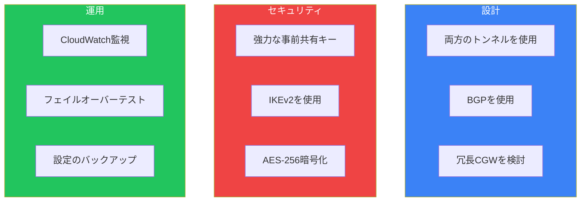

### よくある問題

| 問題 | 原因 | 対策 |
|------|------|------|
| トンネルが確立しない | Phase 1/2パラメータ不一致 | 設定を確認 |
| 片方のトンネルのみ | ルーティング設定不備 | 両トンネルへルート |
| 間欠的な切断 | DPDタイムアウト | タイマー調整 |
| 帯域不足 | 1.25Gbps制限 | TGW+ECMPまたはDX |

## まとめ

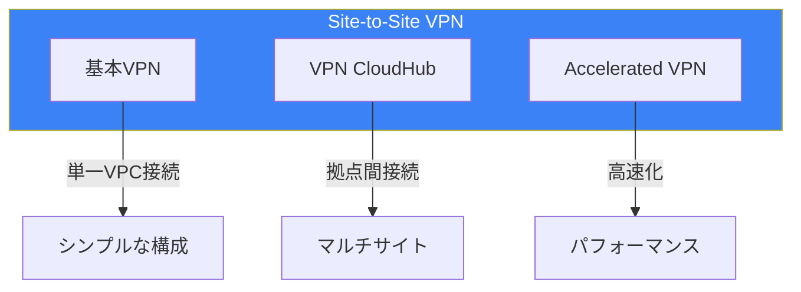

| 構成 | ユースケース | 帯域幅 |
|------|------------|--------|
| VGW + VPN | 単一VPC、小規模 | 最大1.25Gbps |
| TGW + VPN | 複数VPC、ECMP | 最大50Gbps |
| VPN CloudHub | 拠点間接続 | 1.25Gbps/接続 |
| Accelerated VPN | 低レイテンシー要件 | 同上 |

Site-to-Site VPNは、迅速なハイブリッド接続の確立や、Direct Connectのバックアップとして重要な役割を果たします。

## 参考資料

- [AWS Site-to-Site VPN User Guide](https://docs.aws.amazon.com/vpn/latest/s2svpn/)
- [VPN CloudHub](https://docs.aws.amazon.com/vpn/latest/s2svpn/VPN_CloudHub.html)
- [Accelerated Site-to-Site VPN](https://docs.aws.amazon.com/vpn/latest/s2svpn/accelerated-vpn.html)
