Infrastructure as Code（IaC）は、インフラストラクチャをコードとして管理し、バージョン管理、自動化、再現性を実現する手法です。AWSでは複数のIaCツールを利用でき、それぞれに特徴があります。

## IaCツールの概要

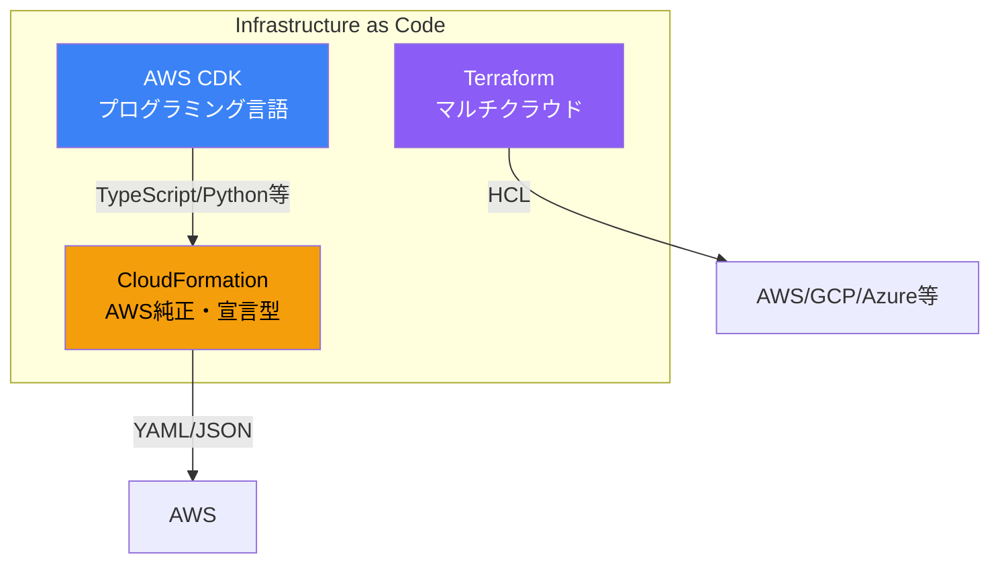

### 比較表

| 項目 | CloudFormation | CDK | Terraform |
|------|---------------|-----|-----------|
| 提供元 | AWS | AWS | HashiCorp |
| 言語 | YAML/JSON | TypeScript/Python等 | HCL |
| 対応クラウド | AWSのみ | AWSのみ | マルチクラウド |
| 状態管理 | AWS管理 | AWS管理 | 自己管理/Terraform Cloud |
| 学習コスト | 中 | 低〜中 | 中 |

## AWS CloudFormation

### 概要

AWSネイティブのIaCサービスで、YAML/JSONでインフラを定義します。

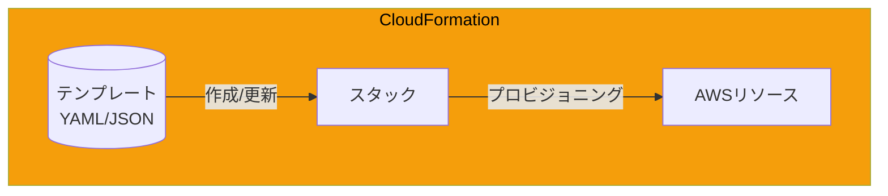

### 基本構造

```yaml
AWSTemplateFormatVersion: '2010-09-09'
Description: 'Sample CloudFormation Template'

Parameters:
  Environment:
    Type: String
    AllowedValues:
      - dev
      - staging
      - prod

Mappings:
  RegionMap:
    ap-northeast-1:
      AMI: ami-0123456789abcdef0

Conditions:
  IsProd: !Equals [!Ref Environment, prod]

Resources:
  MyVPC:
    Type: AWS::EC2::VPC
    Properties:
      CidrBlock: 10.0.0.0/16
      Tags:
        - Key: Name
          Value: !Sub '${Environment}-vpc'

  MyInstance:
    Type: AWS::EC2::Instance
    Condition: IsProd
    Properties:
      ImageId: !FindInMap [RegionMap, !Ref 'AWS::Region', AMI]
      InstanceType: t3.micro

Outputs:
  VPCId:
    Value: !Ref MyVPC
    Export:
      Name: !Sub '${Environment}-vpc-id'
```

### 主要機能

| 機能 | 説明 |
|------|------|
| スタック | リソースの論理的なグループ |
| ネストスタック | スタックの再利用・モジュール化 |
| スタックセット | 複数アカウント・リージョンへの展開 |
| ドリフト検出 | 実際の状態との差分検出 |
| 変更セット | 変更内容のプレビュー |

### 組み込み関数

```yaml
# よく使う組み込み関数
Resources:
  Example:
    Type: AWS::S3::Bucket
    Properties:
      # 参照
      BucketName: !Ref BucketNameParam

      # 文字列置換
      BucketName: !Sub '${Environment}-${AWS::AccountId}-bucket'

      # 条件分岐
      VersioningConfiguration:
        Status: !If [IsProd, Enabled, Suspended]

      # 結合
      BucketName: !Join ['-', [!Ref Environment, bucket]]

      # 属性取得
      Tags:
        - Key: Arn
          Value: !GetAtt OtherResource.Arn
```

### スタックセット

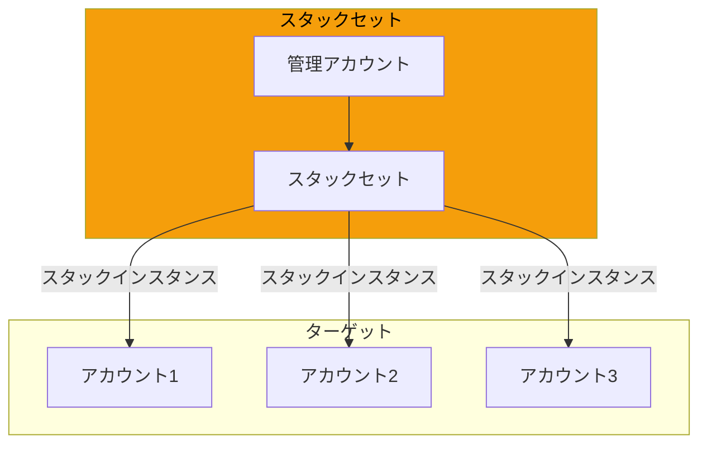

## AWS CDK

### 概要

プログラミング言語でインフラを定義し、CloudFormationテンプレートを生成します。

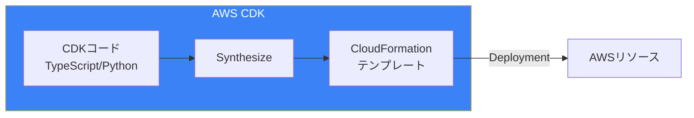

### 対応言語

| 言語 | 特徴 |
|------|------|
| TypeScript | 最も成熟、型安全 |
| Python | 学習コスト低 |
| Java | エンタープライズ向け |
| C# | .NET環境 |
| Go | 軽量 |

### 基本構造（TypeScript）

```typescript
import * as cdk from 'aws-cdk-lib';
import * as ec2 from 'aws-cdk-lib/aws-ec2';
import * as s3 from 'aws-cdk-lib/aws-s3';
import { Construct } from 'constructs';

export class MyStack extends cdk.Stack {
  constructor(scope: Construct, id: string, props?: cdk.StackProps) {
    super(scope, id, props);

    // VPCの作成
    const vpc = new ec2.Vpc(this, 'MyVpc', {
      maxAzs: 2,
      natGateways: 1,
    });

    // S3バケットの作成
    const bucket = new s3.Bucket(this, 'MyBucket', {
      versioned: true,
      encryption: s3.BucketEncryption.S3_MANAGED,
      removalPolicy: cdk.RemovalPolicy.DESTROY,
    });

    // 出力
    new cdk.CfnOutput(this, 'BucketName', {
      value: bucket.bucketName,
    });
  }
}

// アプリケーション
const app = new cdk.App();
new MyStack(app, 'MyStack', {
  env: {
    account: process.env.CDK_DEFAULT_ACCOUNT,
    region: process.env.CDK_DEFAULT_REGION,
  },
});
```

### Constructレベル

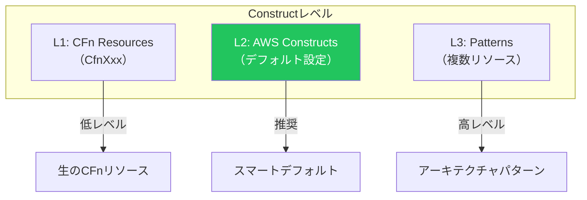

### L2 Constructの例

```typescript
// L2: スマートデフォルト付き
const vpc = new ec2.Vpc(this, 'Vpc', {
  maxAzs: 2,
  // 自動でパブリック/プライベートサブネット作成
  // NAT Gateway設定
  // ルートテーブル設定
});

// L1: 生のCloudFormation
const cfnVpc = new ec2.CfnVPC(this, 'CfnVpc', {
  cidrBlock: '10.0.0.0/16',
  // すべて手動で設定が必要
});
```

### CDKコマンド

```bash
# プロジェクト初期化
cdk init app --language typescript

# テンプレート生成（Synthesize）
cdk synth

# 差分確認
cdk diff

# デプロイ
cdk deploy

# 複数スタックのデプロイ
cdk deploy --all

# 削除
cdk destroy
```

## Terraform

### 概要

HashiCorpが提供するマルチクラウド対応のIaCツールです。

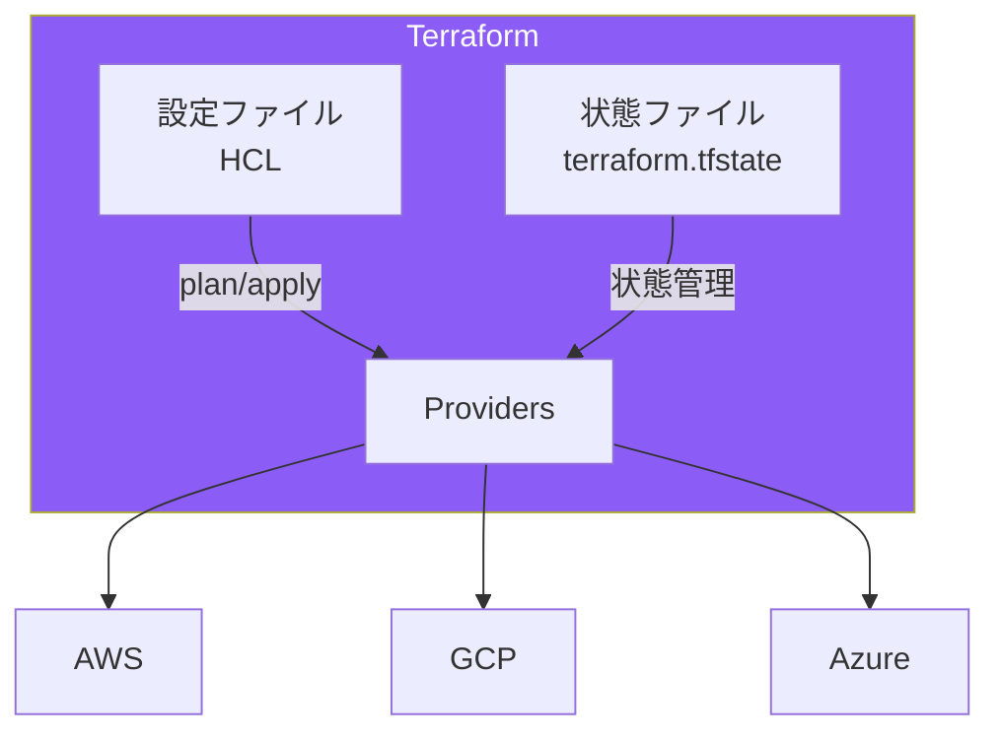

### 基本構造

```hcl
# プロバイダー設定
terraform {
  required_version = ">= 1.0.0"

  required_providers {
    aws = {
      source  = "hashicorp/aws"
      version = "~> 5.0"
    }
  }

  # バックエンド（状態管理）
  backend "s3" {
    bucket = "my-terraform-state"
    key    = "prod/terraform.tfstate"
    region = "ap-northeast-1"

    dynamodb_table = "terraform-locks"
    encrypt        = true
  }
}

provider "aws" {
  region = var.region
}

# 変数
variable "environment" {
  type    = string
  default = "dev"
}

variable "region" {
  type    = string
  default = "ap-northeast-1"
}

# リソース
resource "aws_vpc" "main" {
  cidr_block = "10.0.0.0/16"

  tags = {
    Name        = "${var.environment}-vpc"
    Environment = var.environment
  }
}

resource "aws_subnet" "public" {
  count = 2

  vpc_id            = aws_vpc.main.id
  cidr_block        = cidrsubnet(aws_vpc.main.cidr_block, 8, count.index)
  availability_zone = data.aws_availability_zones.available.names[count.index]

  tags = {
    Name = "${var.environment}-public-${count.index + 1}"
  }
}

# データソース
data "aws_availability_zones" "available" {
  state = "available"
}

# 出力
output "vpc_id" {
  value = aws_vpc.main.id
}
```

### 状態管理

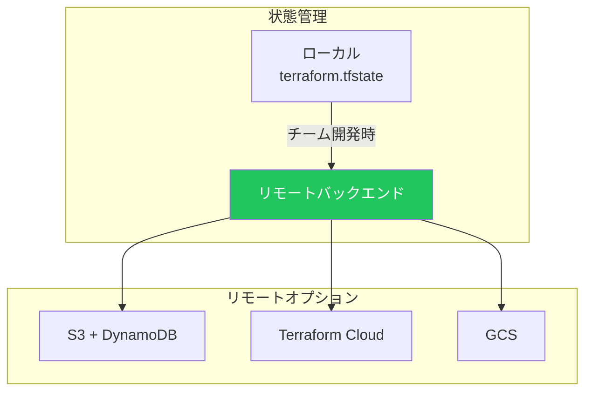

### Terraformコマンド

```bash
# 初期化
terraform init

# フォーマット
terraform fmt

# 検証
terraform validate

# 実行計画
terraform plan

# 適用
terraform apply

# 削除
terraform destroy

# 状態確認
terraform state list
terraform state show aws_vpc.main

# ワークスペース（環境分離）
terraform workspace new dev
terraform workspace select prod
```

### モジュール

```hcl
# モジュール定義（modules/vpc/main.tf）
variable "environment" {}
variable "cidr_block" {}

resource "aws_vpc" "this" {
  cidr_block = var.cidr_block

  tags = {
    Name = "${var.environment}-vpc"
  }
}

output "vpc_id" {
  value = aws_vpc.this.id
}

# モジュール使用
module "vpc" {
  source = "./modules/vpc"

  environment = var.environment
  cidr_block  = "10.0.0.0/16"
}

# 公開モジュール
module "vpc" {
  source  = "terraform-aws-modules/vpc/aws"
  version = "5.0.0"

  name = "my-vpc"
  cidr = "10.0.0.0/16"
}
```

## 比較詳細

### アーキテクチャ

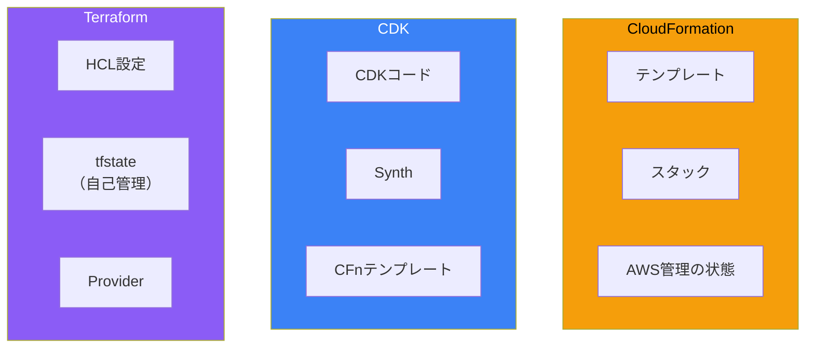

### 機能比較

| 機能 | CloudFormation | CDK | Terraform |
|------|---------------|-----|-----------|
| 新サービス対応 | 最速 | 最速 | やや遅い |
| モジュール化 | ネストスタック | Construct | Module |
| テスト | 限定的 | 充実 | 充実 |
| プレビュー | 変更セット | cdk diff | terraform plan |
| インポート | ✅ | ✅ | ✅ |
| ドリフト検出 | ✅ | ✅ | terraform plan |

### 開発体験

| 項目 | CloudFormation | CDK | Terraform |
|------|---------------|-----|-----------|
| IDE補完 | 限定的 | 優秀 | 優秀 |
| リファクタリング | 困難 | 容易 | 中程度 |
| 再利用性 | 低 | 高 | 高 |
| デバッグ | 困難 | 容易 | 中程度 |

## ユースケース別選択

### 選択フローチャート

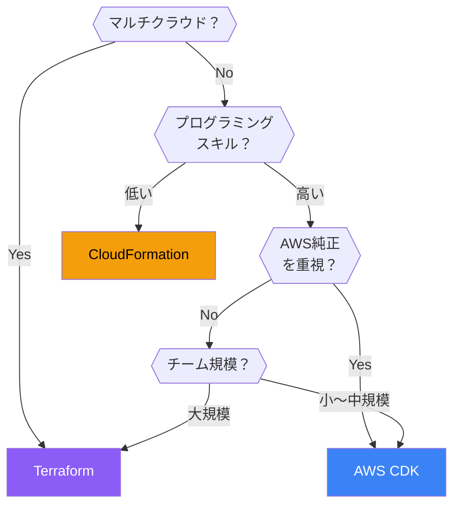

### ユースケース

| ユースケース | 推奨ツール | 理由 |
|-------------|-----------|------|
| AWSのみ・シンプル | CloudFormation | 追加ツール不要 |
| AWSのみ・複雑 | CDK | 抽象化・再利用 |
| マルチクラウド | Terraform | 統一された管理 |
| スタートアップ | CDK | 開発スピード |
| エンタープライズ | Terraform/CDK | ガバナンス |

## ベストプラクティス

### 共通原則

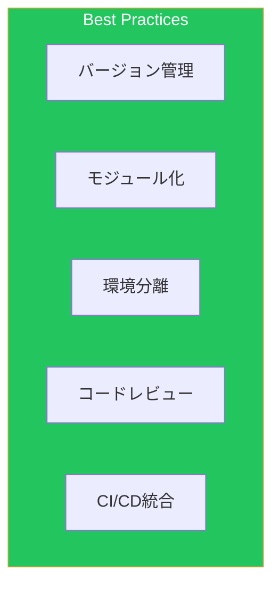

### CloudFormation

```yaml
# パラメータストアとの連携
Parameters:
  DBPassword:
    Type: AWS::SSM::Parameter::Value<String>
    Default: /myapp/db/password
    NoEcho: true

# スタックポリシー（削除保護）
# aws cloudformation set-stack-policy
```

### CDK

```typescript
// アスペクトによる横断的な設定
import { Aspects, Tags } from 'aws-cdk-lib';

// すべてのリソースにタグを追加
Aspects.of(app).add(new Tags.add('Environment', 'prod'));

// テスト
import { Template } from 'aws-cdk-lib/assertions';

test('VPC Created', () => {
  const template = Template.fromStack(stack);
  template.resourceCountIs('AWS::EC2::VPC', 1);
});
```

### Terraform

```hcl
# 変数のバリデーション
variable "environment" {
  type = string
  validation {
    condition     = contains(["dev", "staging", "prod"], var.environment)
    error_message = "Environment must be dev, staging, or prod."
  }
}

# ライフサイクル管理
resource "aws_instance" "example" {
  lifecycle {
    create_before_destroy = true
    prevent_destroy       = true
    ignore_changes        = [tags]
  }
}
```

## 移行パターン

### CloudFormation → CDK

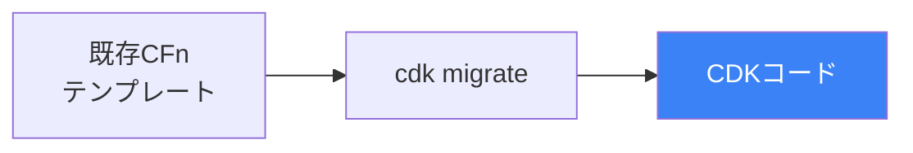

```bash
# CloudFormationスタックからCDKへ移行
cdk migrate --stack-name MyStack --language typescript
```

### Terraform → CloudFormation

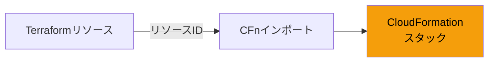

## まとめ

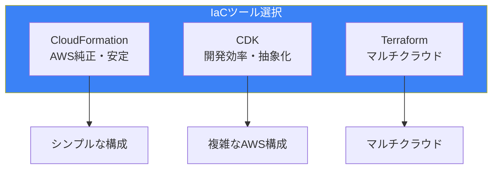

| ツール | 強み | 弱み |
|--------|------|------|
| CloudFormation | AWS最新機能、追加ツール不要 | 記述量多い、抽象化困難 |
| CDK | 開発効率、型安全、テスト | 学習コスト、CFn依存 |
| Terraform | マルチクラウド、成熟したエコシステム | 状態管理、AWSサポート遅延 |

ワークロードの特性、チームのスキル、組織の要件に応じて適切なIaCツールを選択することが重要です。

## 参考資料

- [AWS CloudFormation User Guide](https://docs.aws.amazon.com/AWSCloudFormation/latest/UserGuide/)
- [AWS CDK Developer Guide](https://docs.aws.amazon.com/cdk/v2/guide/)
- [Terraform AWS Provider](https://registry.terraform.io/providers/hashicorp/aws/latest/docs)
