クラウド移行を成功させるには、各ワークロードに最適な移行戦略を選択することが重要です。AWSは「7つのR」と呼ばれる移行パターンを定義しており、これに基づいて計画を立てることで効率的な移行が可能になります。

## 7つのRの概要

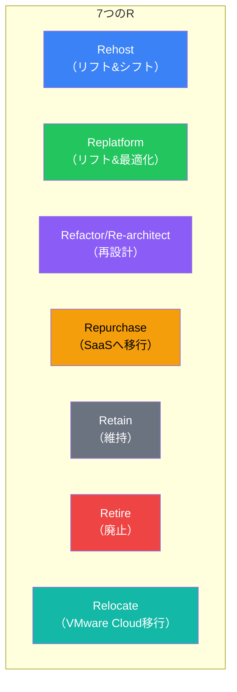

### 比較表

| 戦略 | 変更度 | 労力 | コスト最適化 | 速度 |
|------|--------|------|-------------|------|
| Rehost | 最小 | 低 | 低 | 最速 |
| Replatform | 小〜中 | 中 | 中 | 速い |
| Refactor | 大 | 高 | 高 | 遅い |
| Repurchase | 中 | 中 | 中〜高 | 中程度 |
| Retain | なし | なし | なし | N/A |
| Retire | なし | 低 | 高 | N/A |
| Relocate | 最小 | 低 | 低 | 速い |

## Rehost（リフト&シフト）

### 概要

アプリケーションをそのままAWSに移行します。最も迅速な移行方法です。

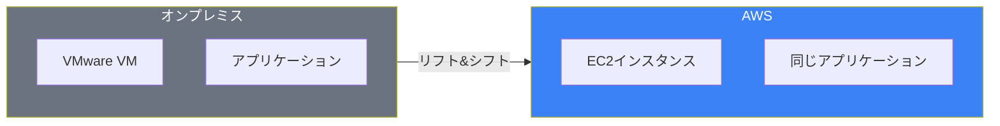

### 使用するサービス

| サービス | 用途 |
|---------|------|
| AWS Application Migration Service | サーバーの自動移行 |
| AWS Server Migration Service | VMの移行（レガシー） |
| CloudEndure Migration | 継続的レプリケーション |

### メリット/デメリット

| メリット | デメリット |
|---------|-----------|
| 迅速な移行 | クラウド最適化されない |
| 低リスク | コスト効率が低い可能性 |
| スキル要件が低い | 技術的負債が残る |

### 適したケース

- 迅速なデータセンター撤退が必要
- アプリケーションの変更が困難
- 移行後の最適化を計画している

## Replatform（リフト&最適化）

### 概要

コアアーキテクチャは維持しつつ、一部のコンポーネントをマネージドサービスに置き換えます。

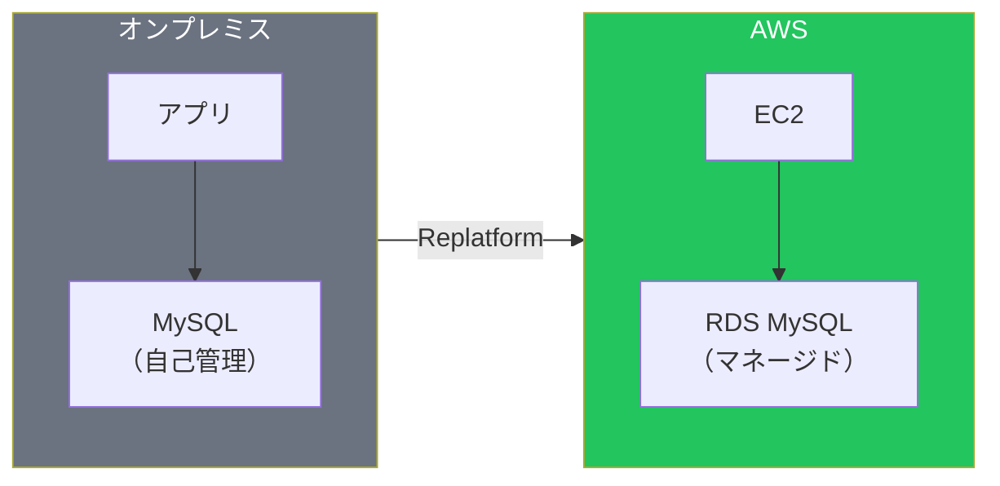

### 一般的なReplatformパターン

| 変更前 | 変更後 | メリット |
|--------|--------|---------|
| 自己管理MySQL | RDS MySQL | 運用負荷削減 |
| ファイルサーバー | EFS/FSx | スケーラビリティ |
| 自己管理キャッシュ | ElastiCache | マネージド化 |
| Cron | EventBridge + Lambda | サーバーレス化 |

### 適したケース

- 運用負荷を削減したい
- マネージドサービスの利点を活用したい
- 大幅なコード変更は避けたい

## Refactor/Re-architect（再設計）

### 概要

クラウドネイティブアーキテクチャに再設計します。最も労力がかかりますが、最大のメリットを得られます。

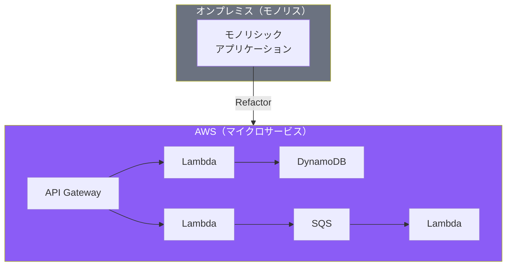

### Refactorパターン

| パターン | 説明 |
|---------|------|
| マイクロサービス化 | モノリスを分割 |
| サーバーレス化 | Lambda/Fargateへ移行 |
| コンテナ化 | ECS/EKSへ移行 |
| イベント駆動化 | SNS/SQS/EventBridgeを活用 |

### 適したケース

- スケーラビリティが重要
- 新機能の開発速度を上げたい
- 運用コストを大幅に削減したい
- 技術的負債を解消したい

## Repurchase（SaaSへ移行）

### 概要

既存のアプリケーションをSaaSソリューションに置き換えます。

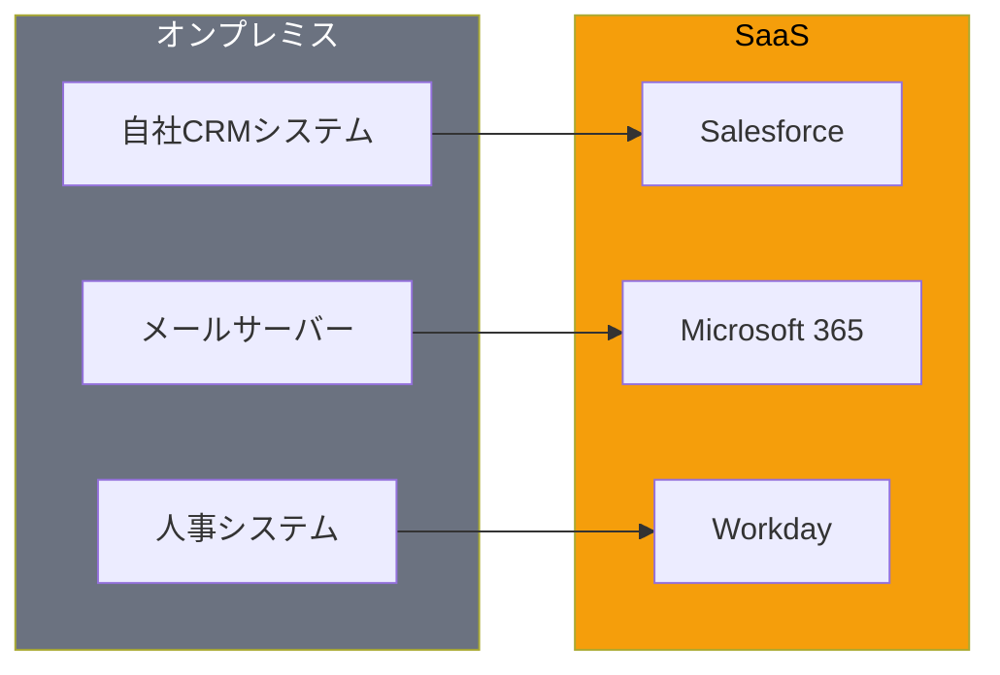

### 一般的なRepurchase例

| カテゴリ | 自社運用 | SaaS |
|---------|---------|------|
| CRM | 独自開発 | Salesforce |
| ERP | SAP on-prem | SAP S/4HANA Cloud |
| メール | Exchange | Microsoft 365 |
| コラボ | ファイルサーバー | Google Workspace |
| HR | PeopleSoft | Workday |

### 適したケース

- コモディティ化されたアプリケーション
- 差別化要因ではないシステム
- 運用から解放されたい

## Retain（維持）

### 概要

移行せず、オンプレミスに残します。

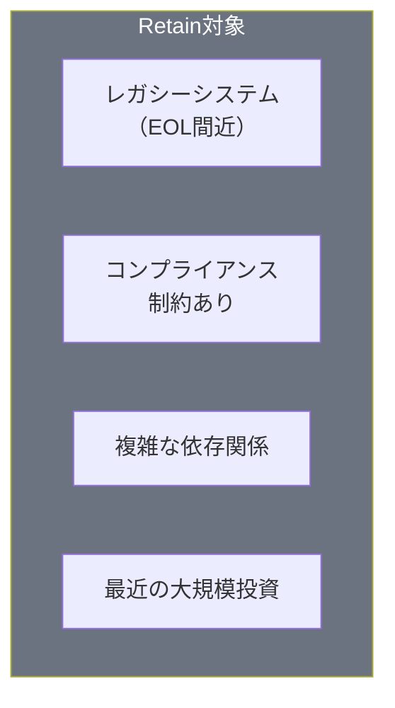

### 適したケース

- 近い将来に廃止予定
- 移行のROIが低い
- 規制上の制約がある
- 最近大規模な投資をした

## Retire（廃止）

### 概要

不要なアプリケーションを特定し、廃止します。

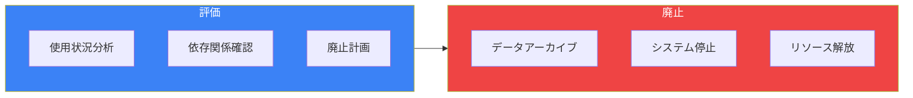

### 発見される典型的なケース

- 重複したシステム
- 未使用のアプリケーション
- テスト/開発環境の残骸
- 買収で引き継いだ冗長システム

## Relocate（VMware Cloud移行）

### 概要

VMware Cloud on AWSを使用して、VMwareワークロードをそのまま移行します。

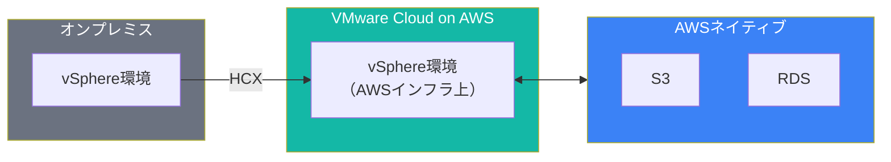

### 適したケース

- VMware環境への大規模投資がある
- VMware固有の機能を使用している
- 運用チームのスキルセットを維持したい

## 移行フェーズ

### AWS Migration Framework

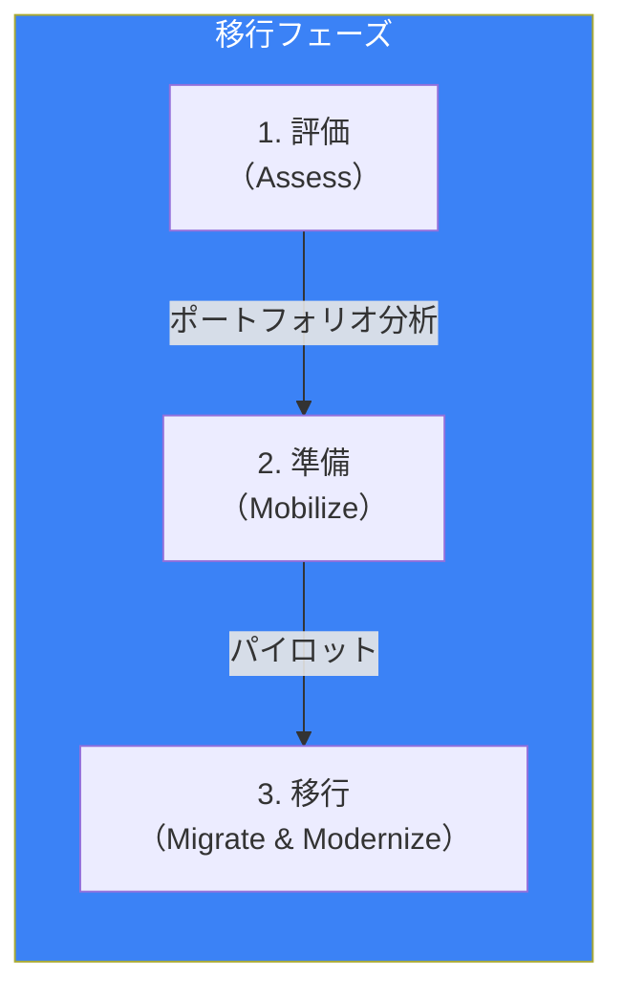

### 評価フェーズで使用するツール

| ツール | 用途 |
|--------|------|
| AWS Migration Hub | 移行の一元管理 |
| AWS Application Discovery Service | サーバー/依存関係の発見 |
| AWS Migration Evaluator | TCO分析 |
| CART | クラウドレディネス評価 |

## 戦略選択のフローチャート

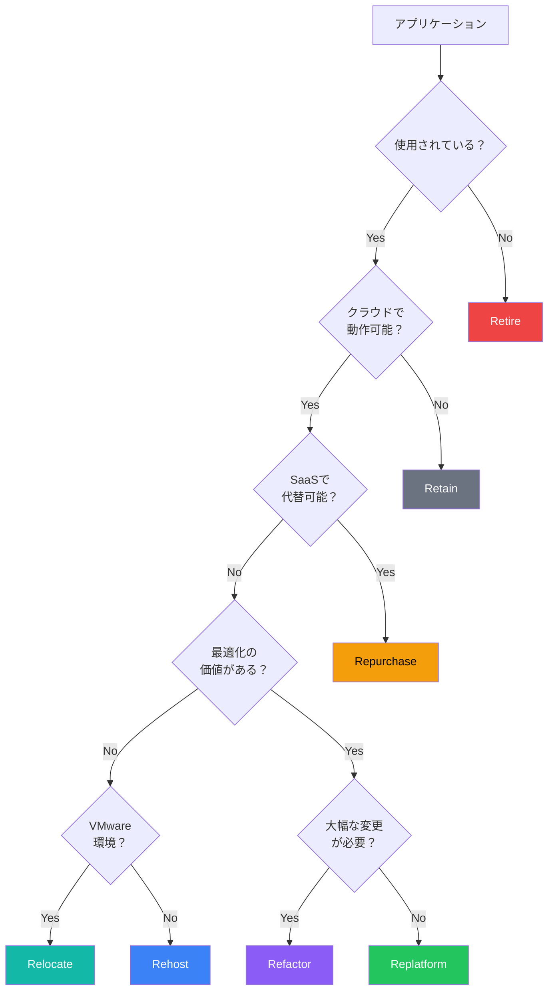

## 大規模移行のベストプラクティス

### ウェーブ計画

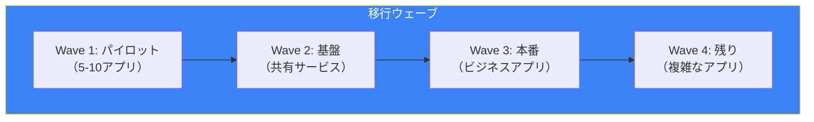

### 成功のポイント

| ポイント | 説明 |
|---------|------|
| 自動化 | 移行ツールを最大限活用 |
| 並行実行 | 複数ワークロードを同時移行 |
| テスト | 各ウェーブでテストを徹底 |
| ロールバック | 失敗時の戻り手順を準備 |

## まとめ

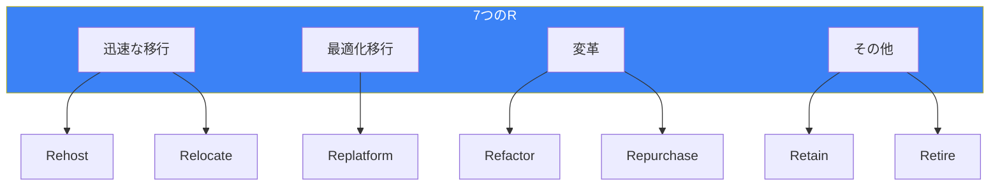

| 戦略 | 主なユースケース | 推奨度 |
|------|----------------|--------|
| Rehost | 迅速な移行 | ★★★ |
| Replatform | 運用効率化 | ★★★ |
| Refactor | 長期最適化 | ★★☆ |
| Repurchase | コモディティ化 | ★★☆ |
| Relocate | VMware環境 | ★★☆ |
| Retain | 制約あり | ★☆☆ |
| Retire | 不要システム | ★★★ |

適切な移行戦略の選択により、コスト、リスク、速度のバランスを取りながら、クラウドの価値を最大化できます。

## 参考資料

- [AWS Migration Whitepaper](https://docs.aws.amazon.com/whitepapers/latest/aws-migration-whitepaper/)
- [AWS Prescriptive Guidance](https://docs.aws.amazon.com/prescriptive-guidance/)
- [AWS Migration Hub](https://docs.aws.amazon.com/migrationhub/latest/ug/)
