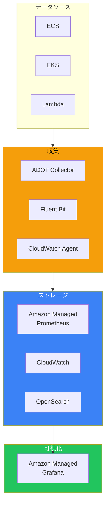
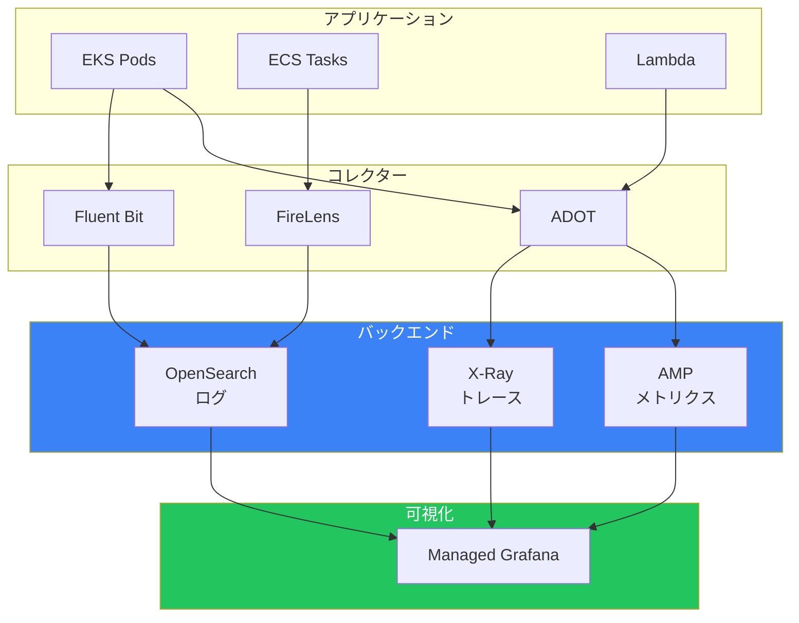
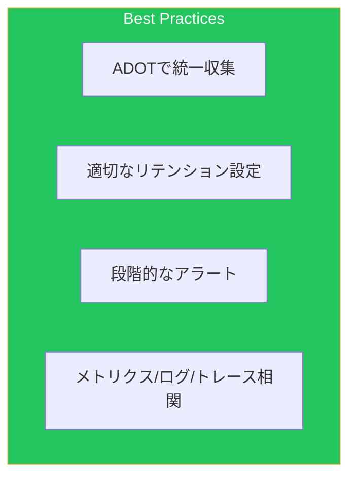

AWSでは、CloudWatchに加えてオープンソースツールを活用した可観測性スタックを構築できます。本記事では、マネージドサービスを使った統合モニタリング環境を解説します。

## 可観測性スタック概要



## Amazon Managed Prometheus (AMP)

### ワークスペース作成

```yaml
PrometheusWorkspace:
  Type: AWS::APS::Workspace
  Properties:
    Alias: production-metrics
    Tags:
      - Key: Environment
        Value: Production

# アラートマネージャー設定
AlertManagerDefinition:
  Type: AWS::APS::RuleGroupsNamespace
  Properties:
    Workspace: !GetAtt PrometheusWorkspace.Arn
    Name: alertmanager
    Data: !Sub |
      alertmanager_config: |
        route:
          receiver: 'sns-notifications'
          group_by: ['alertname', 'severity']
          group_wait: 30s
          group_interval: 5m
          repeat_interval: 4h
        receivers:
          - name: 'sns-notifications'
            sns_configs:
              - topic_arn: ${AlertTopic}
                sigv4:
                  region: ${AWS::Region}
                message: |
                  {{ range .Alerts }}
                  Alert: {{ .Labels.alertname }}
                  Severity: {{ .Labels.severity }}
                  Description: {{ .Annotations.description }}
                  {{ end }}
```

### アラートルール

```yaml
AlertRules:
  Type: AWS::APS::RuleGroupsNamespace
  Properties:
    Workspace: !GetAtt PrometheusWorkspace.Arn
    Name: alert-rules
    Data: |
      groups:
        - name: application-alerts
          rules:
            - alert: HighErrorRate
              expr: |
                sum(rate(http_requests_total{status=~"5.."}[5m])) /
                sum(rate(http_requests_total[5m])) > 0.05
              for: 5m
              labels:
                severity: critical
              annotations:
                summary: "High error rate detected"
                description: "Error rate is {{ $value | humanizePercentage }}"

            - alert: HighLatency
              expr: |
                histogram_quantile(0.95, sum(rate(http_request_duration_seconds_bucket[5m])) by (le)) > 1
              for: 5m
              labels:
                severity: warning
              annotations:
                summary: "High latency detected"
                description: "95th percentile latency is {{ $value }}s"

            - alert: PodCrashLooping
              expr: |
                increase(kube_pod_container_status_restarts_total[1h]) > 5
              for: 10m
              labels:
                severity: warning
              annotations:
                summary: "Pod {{ $labels.pod }} is crash looping"
```

### ADOT Collector設定

```yaml
# EKSでのADOT Collector ConfigMap
apiVersion: v1
kind: ConfigMap
metadata:
  name: adot-collector-config
  namespace: opentelemetry
data:
  config.yaml: |
    receivers:
      prometheus:
        config:
          scrape_configs:
            - job_name: 'kubernetes-pods'
              kubernetes_sd_configs:
                - role: pod
              relabel_configs:
                - source_labels: [__meta_kubernetes_pod_annotation_prometheus_io_scrape]
                  action: keep
                  regex: true
                - source_labels: [__meta_kubernetes_pod_annotation_prometheus_io_path]
                  action: replace
                  target_label: __metrics_path__
                  regex: (.+)
                - source_labels: [__address__, __meta_kubernetes_pod_annotation_prometheus_io_port]
                  action: replace
                  regex: ([^:]+)(?::\d+)?;(\d+)
                  replacement: $1:$2
                  target_label: __address__

      otlp:
        protocols:
          grpc:
            endpoint: 0.0.0.0:4317
          http:
            endpoint: 0.0.0.0:4318

    processors:
      batch:
        timeout: 30s
        send_batch_size: 1000

      memory_limiter:
        check_interval: 1s
        limit_mib: 1000

    exporters:
      awsprometheusremotewrite:
        endpoint: https://aps-workspaces.ap-northeast-1.amazonaws.com/workspaces/ws-xxxxx/api/v1/remote_write
        aws_auth:
          region: ap-northeast-1
          service: aps

      awsxray:
        region: ap-northeast-1

    service:
      pipelines:
        metrics:
          receivers: [prometheus, otlp]
          processors: [memory_limiter, batch]
          exporters: [awsprometheusremotewrite]
        traces:
          receivers: [otlp]
          processors: [memory_limiter, batch]
          exporters: [awsxray]
```

## Amazon Managed Grafana (AMG)

### ワークスペース作成

```yaml
GrafanaWorkspace:
  Type: AWS::Grafana::Workspace
  Properties:
    Name: production-grafana
    AccountAccessType: CURRENT_ACCOUNT
    AuthenticationProviders:
      - AWS_SSO
    PermissionType: SERVICE_MANAGED
    DataSources:
      - AMAZON_OPENSEARCH_SERVICE
      - CLOUDWATCH
      - PROMETHEUS
    NotificationDestinations:
      - SNS
    RoleArn: !GetAtt GrafanaRole.Arn
    GrafanaVersion: "10.4"

GrafanaRole:
  Type: AWS::IAM::Role
  Properties:
    AssumeRolePolicyDocument:
      Version: '2012-10-17'
      Statement:
        - Effect: Allow
          Principal:
            Service: grafana.amazonaws.com
          Action: sts:AssumeRole
    ManagedPolicyArns:
      - arn:aws:iam::aws:policy/AmazonPrometheusQueryAccess
      - arn:aws:iam::aws:policy/AmazonOpenSearchServiceReadOnlyAccess
    Policies:
      - PolicyName: CloudWatchAccess
        PolicyDocument:
          Version: '2012-10-17'
          Statement:
            - Effect: Allow
              Action:
                - cloudwatch:DescribeAlarms
                - cloudwatch:GetMetricData
                - cloudwatch:GetMetricStatistics
                - cloudwatch:ListMetrics
                - logs:DescribeLogGroups
                - logs:GetLogEvents
                - logs:StartQuery
                - logs:StopQuery
                - logs:GetQueryResults
              Resource: "*"
```

### Terraform/API設定

```hcl
# Grafanaダッシュボード（Terraform）
resource "grafana_dashboard" "main" {
  config_json = jsonencode({
    title = "Application Overview"
    panels = [
      {
        title  = "Request Rate"
        type   = "graph"
        gridPos = { x = 0, y = 0, w = 12, h = 8 }
        targets = [
          {
            expr = "sum(rate(http_requests_total[5m])) by (service)"
            legendFormat = "{{service}}"
          }
        ]
      },
      {
        title  = "Error Rate"
        type   = "graph"
        gridPos = { x = 12, y = 0, w = 12, h = 8 }
        targets = [
          {
            expr = "sum(rate(http_requests_total{status=~\"5..\"}[5m])) / sum(rate(http_requests_total[5m]))"
          }
        ]
      },
      {
        title  = "Latency Percentiles"
        type   = "graph"
        gridPos = { x = 0, y = 8, w = 24, h = 8 }
        targets = [
          {
            expr = "histogram_quantile(0.50, sum(rate(http_request_duration_seconds_bucket[5m])) by (le))"
            legendFormat = "p50"
          },
          {
            expr = "histogram_quantile(0.95, sum(rate(http_request_duration_seconds_bucket[5m])) by (le))"
            legendFormat = "p95"
          },
          {
            expr = "histogram_quantile(0.99, sum(rate(http_request_duration_seconds_bucket[5m])) by (le))"
            legendFormat = "p99"
          }
        ]
      }
    ]
  })
}
```

## Amazon OpenSearch Service

### ドメイン作成

```yaml
OpenSearchDomain:
  Type: AWS::OpenSearchService::Domain
  Properties:
    DomainName: logs-domain
    EngineVersion: OpenSearch_2.11
    ClusterConfig:
      InstanceType: r6g.large.search
      InstanceCount: 3
      DedicatedMasterEnabled: true
      DedicatedMasterType: r6g.large.search
      DedicatedMasterCount: 3
      ZoneAwarenessEnabled: true
      ZoneAwarenessConfig:
        AvailabilityZoneCount: 3
    EBSOptions:
      EBSEnabled: true
      VolumeType: gp3
      VolumeSize: 100
      Iops: 3000
      Throughput: 125
    EncryptionAtRestOptions:
      Enabled: true
      KmsKeyId: !Ref KMSKey
    NodeToNodeEncryptionOptions:
      Enabled: true
    DomainEndpointOptions:
      EnforceHTTPS: true
      TLSSecurityPolicy: Policy-Min-TLS-1-2-2019-07
    VPCOptions:
      SubnetIds:
        - !Ref PrivateSubnet1
        - !Ref PrivateSubnet2
        - !Ref PrivateSubnet3
      SecurityGroupIds:
        - !Ref OpenSearchSecurityGroup
    AccessPolicies:
      Version: '2012-10-17'
      Statement:
        - Effect: Allow
          Principal:
            AWS: !GetAtt FluentBitRole.Arn
          Action: es:*
          Resource: !Sub arn:aws:es:${AWS::Region}:${AWS::AccountId}:domain/logs-domain/*
```

### インデックステンプレート

```json
{
  "index_patterns": ["application-logs-*"],
  "template": {
    "settings": {
      "number_of_shards": 3,
      "number_of_replicas": 1,
      "index.lifecycle.name": "logs-policy",
      "index.lifecycle.rollover_alias": "application-logs"
    },
    "mappings": {
      "properties": {
        "@timestamp": { "type": "date" },
        "level": { "type": "keyword" },
        "message": { "type": "text" },
        "service": { "type": "keyword" },
        "trace_id": { "type": "keyword" },
        "span_id": { "type": "keyword" },
        "user_id": { "type": "keyword" },
        "request_id": { "type": "keyword" },
        "latency_ms": { "type": "integer" },
        "status_code": { "type": "integer" }
      }
    }
  }
}
```

### Fluent Bit設定

```yaml
# EKS Fluent Bit ConfigMap
apiVersion: v1
kind: ConfigMap
metadata:
  name: fluent-bit-config
  namespace: logging
data:
  fluent-bit.conf: |
    [SERVICE]
        Flush         5
        Log_Level     info
        Daemon        off
        Parsers_File  parsers.conf

    [INPUT]
        Name              tail
        Tag               kube.*
        Path              /var/log/containers/*.log
        Parser            docker
        DB                /var/log/flb_kube.db
        Mem_Buf_Limit     50MB
        Skip_Long_Lines   On
        Refresh_Interval  10

    [FILTER]
        Name                kubernetes
        Match               kube.*
        Kube_URL            https://kubernetes.default.svc:443
        Kube_CA_File        /var/run/secrets/kubernetes.io/serviceaccount/ca.crt
        Kube_Token_File     /var/run/secrets/kubernetes.io/serviceaccount/token
        Merge_Log           On
        K8S-Logging.Parser  On
        K8S-Logging.Exclude On

    [OUTPUT]
        Name            opensearch
        Match           *
        Host            vpc-logs-domain-xxxxx.ap-northeast-1.es.amazonaws.com
        Port            443
        TLS             On
        AWS_Auth        On
        AWS_Region      ap-northeast-1
        Index           application-logs
        Type            _doc
        Suppress_Type_Name On

  parsers.conf: |
    [PARSER]
        Name        docker
        Format      json
        Time_Key    time
        Time_Format %Y-%m-%dT%H:%M:%S.%LZ

    [PARSER]
        Name        application
        Format      regex
        Regex       ^(?<time>[^ ]+) (?<level>[^ ]+) (?<message>.*)$
        Time_Key    time
        Time_Format %Y-%m-%dT%H:%M:%S.%LZ
```

## Container Insights

### EKS Container Insights

```yaml
# CloudWatch Agent ConfigMap
apiVersion: v1
kind: ConfigMap
metadata:
  name: cwagent-config
  namespace: amazon-cloudwatch
data:
  cwagentconfig.json: |
    {
      "logs": {
        "metrics_collected": {
          "kubernetes": {
            "cluster_name": "my-cluster",
            "metrics_collection_interval": 60
          }
        },
        "force_flush_interval": 5
      },
      "traces": {
        "traces_collected": {
          "xray": {
            "tcp_proxy": {
              "bind_address": "0.0.0.0:2000"
            }
          },
          "otlp": {
            "grpc_endpoint": "0.0.0.0:4317"
          }
        }
      }
    }
```

### ECS Container Insights

```yaml
ECSCluster:
  Type: AWS::ECS::Cluster
  Properties:
    ClusterName: my-cluster
    ClusterSettings:
      - Name: containerInsights
        Value: enabled
    Configuration:
      ExecuteCommandConfiguration:
        Logging: OVERRIDE
        LogConfiguration:
          CloudWatchLogGroupName: /ecs/exec-logs
          CloudWatchEncryptionEnabled: true

# FireLensでカスタムログルーティング
TaskDefinition:
  Type: AWS::ECS::TaskDefinition
  Properties:
    ContainerDefinitions:
      - Name: app
        LogConfiguration:
          LogDriver: awsfirelens
          Options:
            Name: opensearch
            Host: vpc-logs-domain-xxxxx.ap-northeast-1.es.amazonaws.com
            Port: "443"
            Index: ecs-logs
            Type: _doc
            AWS_Auth: "On"
            AWS_Region: ap-northeast-1
            tls: "On"

      - Name: log-router
        Image: amazon/aws-for-fluent-bit:latest
        Essential: true
        FirelensConfiguration:
          Type: fluentbit
          Options:
            enable-ecs-log-metadata: "true"
        LogConfiguration:
          LogDriver: awslogs
          Options:
            awslogs-group: /ecs/firelens
            awslogs-region: !Ref AWS::Region
            awslogs-stream-prefix: firelens
```

## 統合アーキテクチャ



## ベストプラクティス



| カテゴリ | 項目 |
|---------|------|
| 収集 | ADOTで統一的なデータ収集 |
| ストレージ | サービス特性に応じた選択 |
| 可視化 | Grafanaで統合ダッシュボード |
| 運用 | 3つのシグナル（メトリクス/ログ/トレース）の相関分析 |

## まとめ

| サービス | 用途 |
|---------|------|
| Amazon Managed Prometheus | 時系列メトリクス |
| Amazon Managed Grafana | 統合可視化 |
| OpenSearch Service | ログ分析・検索 |
| Container Insights | コンテナメトリクス |

マネージドサービスを組み合わせることで、スケーラブルな可観測性スタックを構築できます。

## 参考資料

- [Amazon Managed Service for Prometheus](https://docs.aws.amazon.com/prometheus/)
- [Amazon Managed Grafana](https://docs.aws.amazon.com/grafana/)
- [Amazon OpenSearch Service](https://docs.aws.amazon.com/opensearch-service/)
- [AWS Distro for OpenTelemetry](https://aws-otel.github.io/)
