オペレーショナルエクセレンスは、AWS Well-Architected Frameworkの柱の1つです。システムを効果的に運用し、継続的に改善するための設計原則とベストプラクティスを提供します。

## オペレーショナルエクセレンスの原則

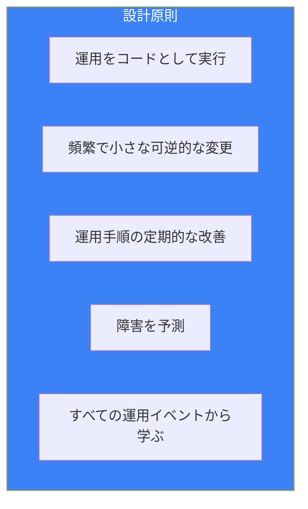

## Observability（可観測性）

### 3つの柱

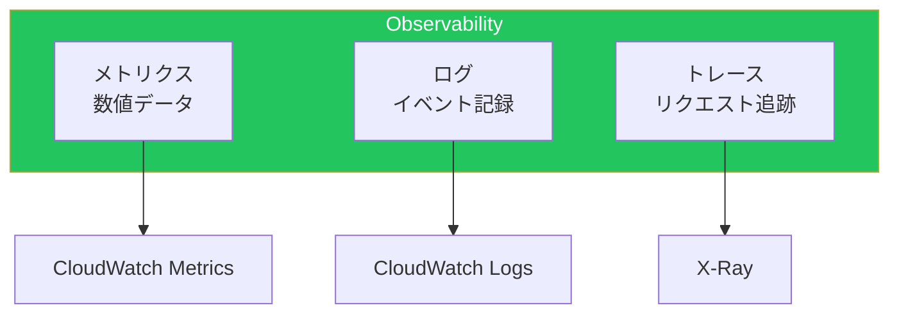

### CloudWatch

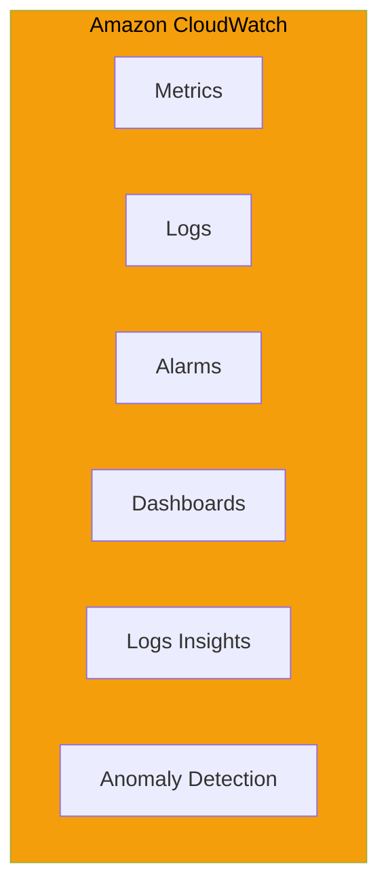

#### メトリクス

| メトリクスタイプ | 説明 | 例 |
|----------------|------|-----|
| 標準メトリクス | 自動収集 | CPUUtilization |
| カスタムメトリクス | 手動送信 | アプリ固有の値 |
| 高解像度メトリクス | 1秒間隔 | リアルタイム監視 |
| 埋め込みメトリクス | ログから抽出 | EMF形式 |

```bash
# カスタムメトリクスの送信
aws cloudwatch put-metric-data \
    --namespace "MyApp" \
    --metric-name "OrderCount" \
    --value 100 \
    --unit "Count" \
    --dimensions "Environment=prod"
```

#### CloudWatch Logs

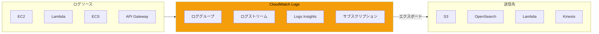

#### Logs Insightsクエリ

```sql
-- エラーログの検索
fields @timestamp, @message
| filter @message like /ERROR/
| sort @timestamp desc
| limit 100

-- レイテンシー分析
fields @timestamp, @duration
| stats avg(@duration), max(@duration), min(@duration)
  by bin(5m)

-- 特定パターンの集計
fields @message
| parse @message /user=(?<user>\S+)/
| stats count(*) by user
| sort count desc
```

#### アラーム

```yaml
# CloudFormationでのアラーム定義
Resources:
  HighCPUAlarm:
    Type: AWS::CloudWatch::Alarm
    Properties:
      AlarmName: HighCPUUtilization
      AlarmDescription: CPU utilization exceeded 80%
      MetricName: CPUUtilization
      Namespace: AWS/EC2
      Statistic: Average
      Period: 300
      EvaluationPeriods: 2
      Threshold: 80
      ComparisonOperator: GreaterThanThreshold
      Dimensions:
        - Name: InstanceId
          Value: !Ref MyInstance
      AlarmActions:
        - !Ref AlertSNSTopic
```

### AWS X-Ray

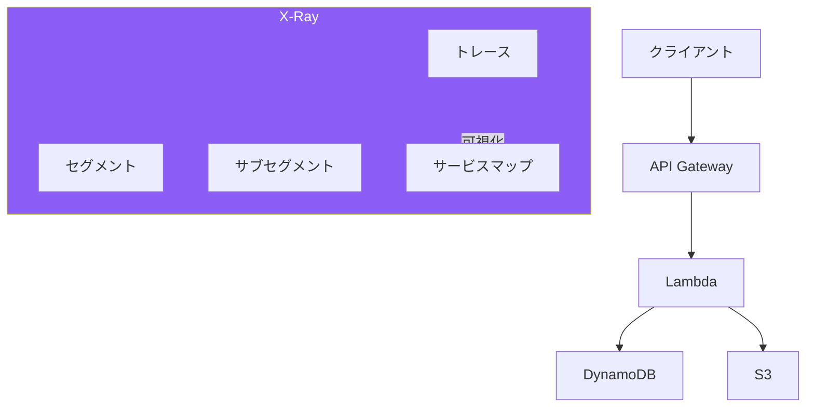

#### X-Rayの概念

| 概念 | 説明 |
|------|------|
| トレース | 1リクエストの全体フロー |
| セグメント | 1サービスの処理単位 |
| サブセグメント | セグメント内の詳細 |
| アノテーション | 検索可能なメタデータ |
| メタデータ | 追加情報（検索不可） |

```python
# Lambda関数でのX-Ray
from aws_xray_sdk.core import xray_recorder

@xray_recorder.capture('process_order')
def process_order(order_id):
    # アノテーションを追加
    xray_recorder.put_annotation('order_id', order_id)

    # サブセグメント
    with xray_recorder.in_subsegment('validate'):
        validate_order(order_id)

    with xray_recorder.in_subsegment('save'):
        save_order(order_id)
```

### CloudWatch Application Insights

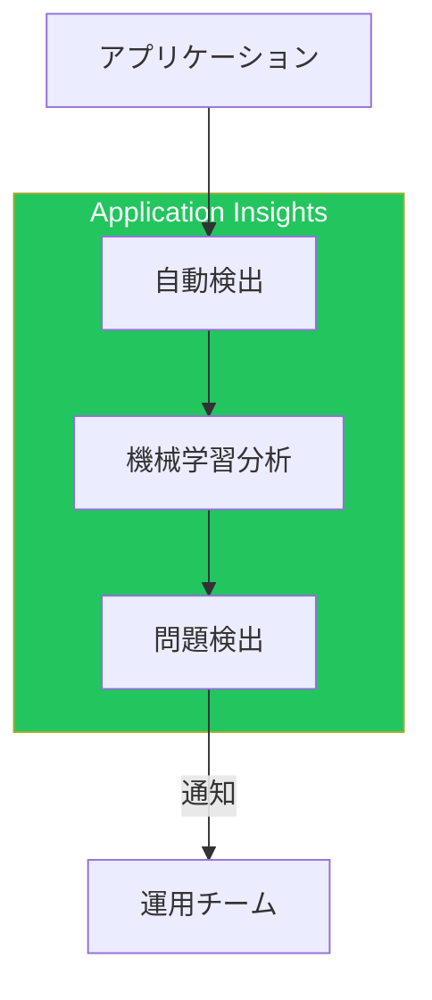

## 自動化

### AWS Systems Manager

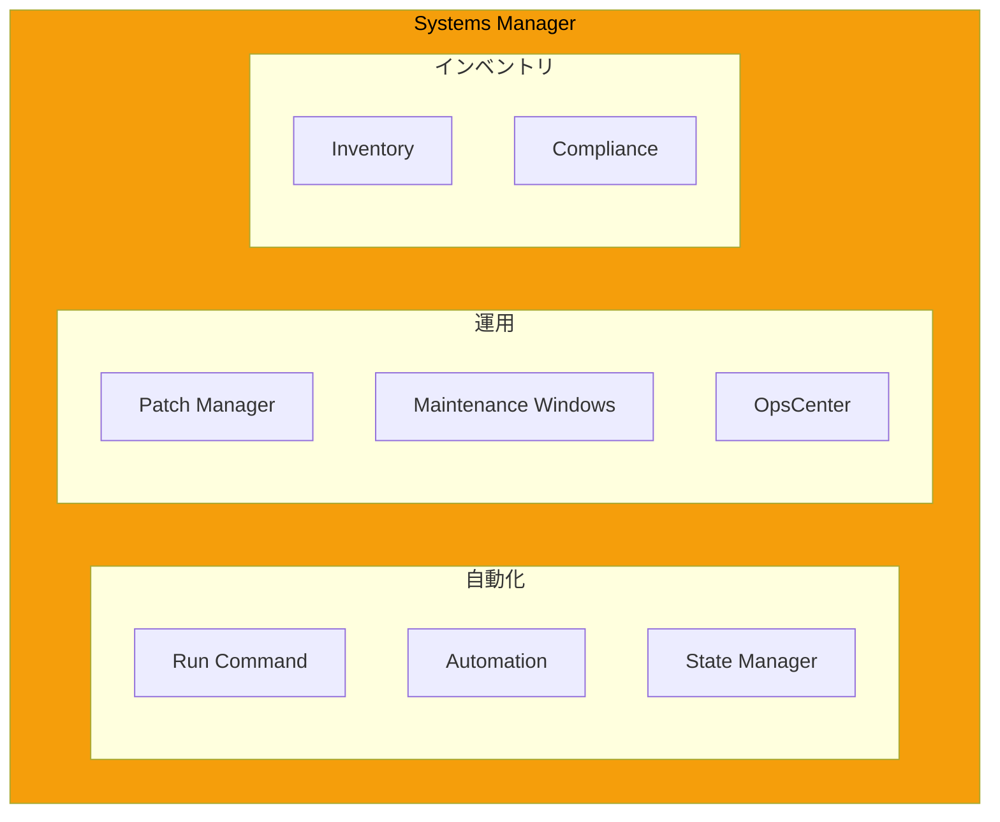

### Run Command

```bash
# パッチ適用
aws ssm send-command \
    --document-name "AWS-RunPatchBaseline" \
    --targets "Key=tag:Environment,Values=prod" \
    --parameters "Operation=Install"

# スクリプト実行
aws ssm send-command \
    --document-name "AWS-RunShellScript" \
    --targets "Key=InstanceIds,Values=i-1234567890abcdef0" \
    --parameters '{"commands":["echo Hello World"]}'
```

### Automation Runbook

```yaml
# SSM Automationドキュメント
schemaVersion: '0.3'
description: 'Remediate unencrypted S3 bucket'
assumeRole: '{{AutomationAssumeRole}}'
parameters:
  BucketName:
    type: String
    description: 'S3 Bucket Name'
  AutomationAssumeRole:
    type: String

mainSteps:
  - name: EnableEncryption
    action: aws:executeAwsApi
    inputs:
      Service: s3
      Api: PutBucketEncryption
      Bucket: '{{BucketName}}'
      ServerSideEncryptionConfiguration:
        Rules:
          - ApplyServerSideEncryptionByDefault:
              SSEAlgorithm: AES256

  - name: VerifyEncryption
    action: aws:executeAwsApi
    inputs:
      Service: s3
      Api: GetBucketEncryption
      Bucket: '{{BucketName}}'
```

### EventBridge

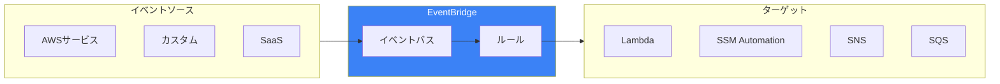

#### イベントパターン

```json
{
  "source": ["aws.ec2"],
  "detail-type": ["EC2 Instance State-change Notification"],
  "detail": {
    "state": ["stopped", "terminated"]
  }
}
```

#### スケジュール

```json
{
  "schedule": "rate(5 minutes)"
}

{
  "schedule": "cron(0 9 * * ? *)"
}
```

### Step Functions

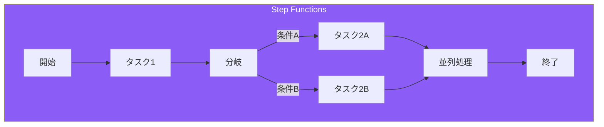

#### 状態タイプ

| タイプ | 説明 |
|--------|------|
| Task | Lambda、ECS等の実行 |
| Choice | 条件分岐 |
| Parallel | 並列実行 |
| Wait | 待機 |
| Pass | パススルー |
| Succeed/Fail | 終了状態 |
| Map | 配列の反復処理 |

```json
{
  "StartAt": "ProcessOrder",
  "States": {
    "ProcessOrder": {
      "Type": "Task",
      "Resource": "arn:aws:lambda:...:ProcessOrder",
      "Next": "CheckInventory"
    },
    "CheckInventory": {
      "Type": "Choice",
      "Choices": [
        {
          "Variable": "$.inStock",
          "BooleanEquals": true,
          "Next": "ShipOrder"
        }
      ],
      "Default": "BackOrder"
    },
    "ShipOrder": {
      "Type": "Task",
      "Resource": "arn:aws:lambda:...:ShipOrder",
      "End": true
    },
    "BackOrder": {
      "Type": "Task",
      "Resource": "arn:aws:lambda:...:BackOrder",
      "End": true
    }
  }
}
```

## インシデント管理

### AWS Incident Manager

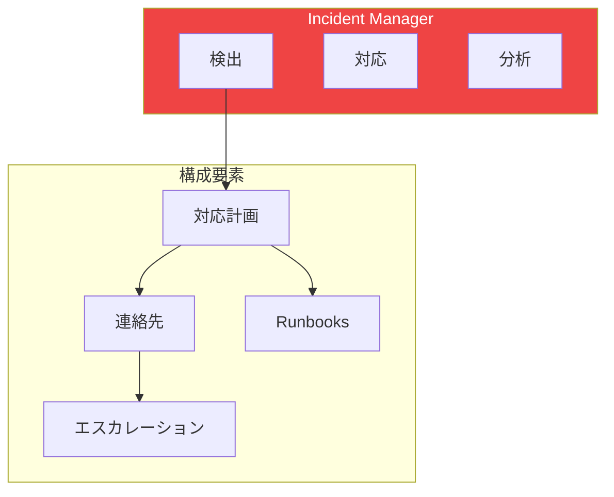

### 対応計画

```yaml
# 対応計画の構成要素
ResponsePlan:
  - DisplayName: "Production Incident"
  - IncidentTemplate:
      Title: "Production Service Degradation"
      Impact: 2  # 1-5
      Summary: "Production service experiencing issues"
  - Engagements:
      - ContactId: oncall-team
  - Actions:
      - SSMAutomation:
          DocumentName: "CollectDiagnostics"
          RoleArn: "arn:aws:iam::xxx:role/IncidentRole"
```

### OpsCenter

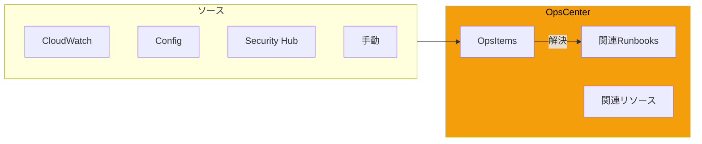

## 変更管理

### AWS Config

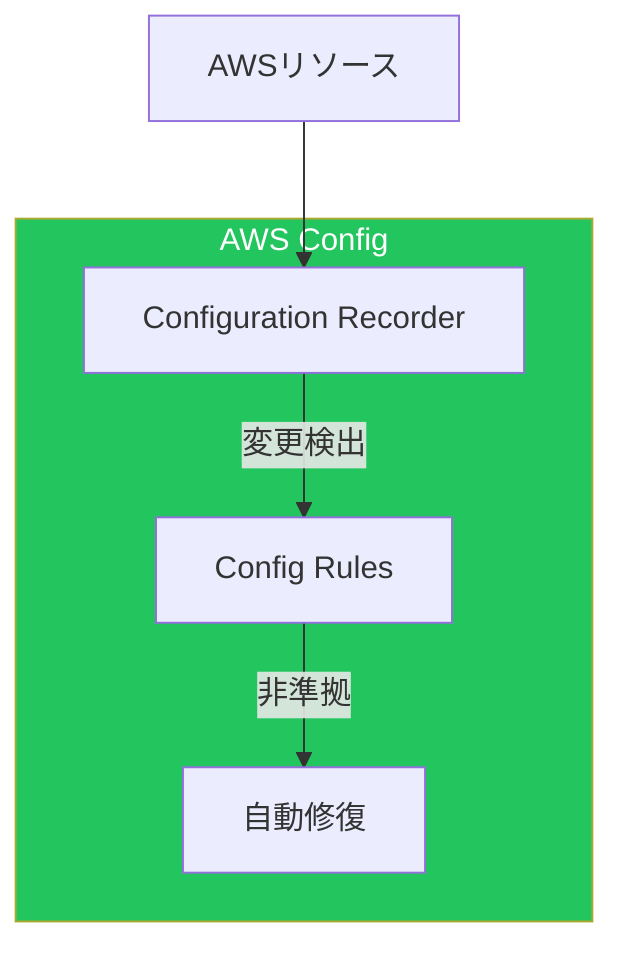

### Config Rules

```yaml
# カスタムConfig Rule
Resources:
  S3BucketPublicReadProhibited:
    Type: AWS::Config::ConfigRule
    Properties:
      ConfigRuleName: s3-bucket-public-read-prohibited
      Source:
        Owner: AWS
        SourceIdentifier: S3_BUCKET_PUBLIC_READ_PROHIBITED
      Scope:
        ComplianceResourceTypes:
          - AWS::S3::Bucket

  # 自動修復
  RemediationConfiguration:
    Type: AWS::Config::RemediationConfiguration
    Properties:
      ConfigRuleName: !Ref S3BucketPublicReadProhibited
      Automatic: true
      TargetId: AWS-DisableS3BucketPublicReadWrite
      TargetType: SSM_DOCUMENT
      Parameters:
        S3BucketName:
          ResourceValue:
            Value: RESOURCE_ID
```

### CloudTrail

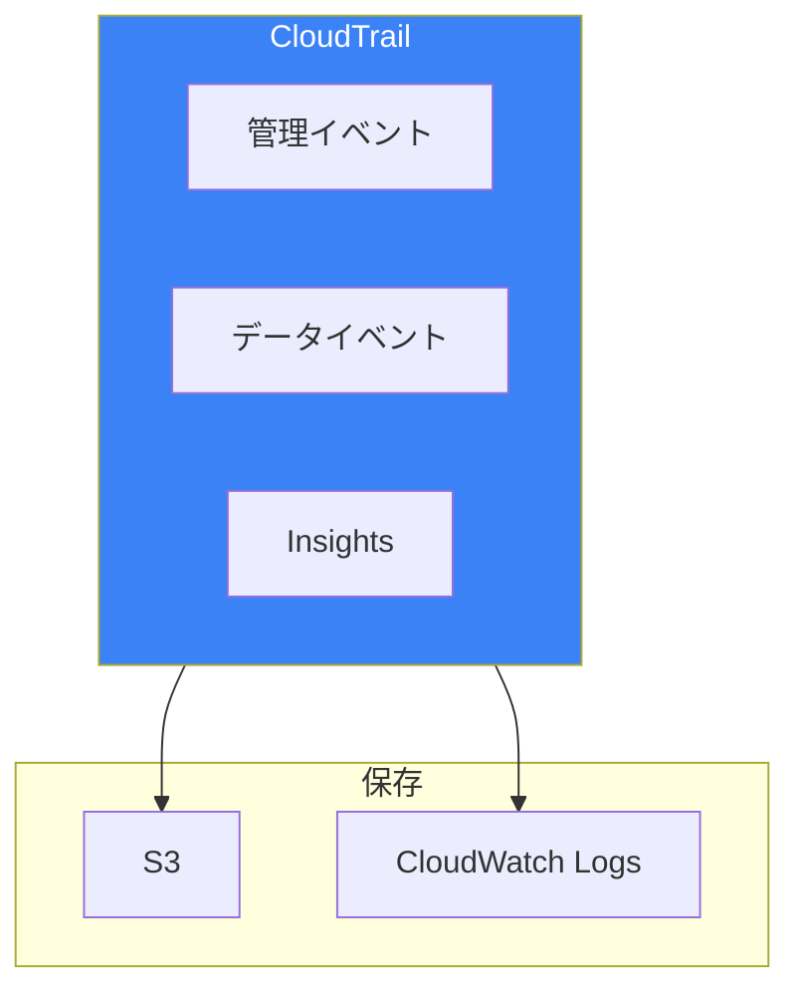

## ベストプラクティス

### 運用の成熟度モデル

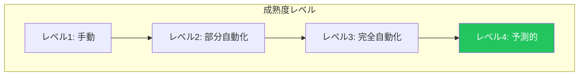

### チェックリスト

| 領域 | チェック項目 |
|------|-------------|
| Observability | メトリクス、ログ、トレース設定 |
| アラート | 適切なしきい値、通知経路 |
| 自動化 | Runbook整備、自動修復 |
| 変更管理 | 変更追跡、コンプライアンス |
| インシデント | 対応計画、エスカレーション |

### ダッシュボード設計

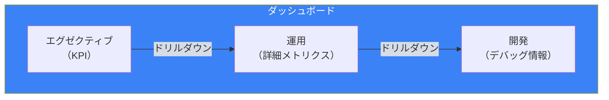

## まとめ

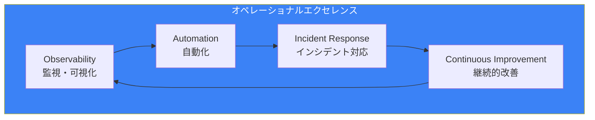

| 領域 | 主要サービス |
|------|-------------|
| モニタリング | CloudWatch, X-Ray |
| 自動化 | Systems Manager, EventBridge, Step Functions |
| インシデント管理 | Incident Manager, OpsCenter |
| 変更管理 | Config, CloudTrail |

効果的な運用を実現するには、適切な可観測性の確保、自動化の推進、インシデント対応の体制整備が不可欠です。継続的な改善により、運用の成熟度を高めていきましょう。

## 参考資料

- [AWS Well-Architected Framework - Operational Excellence](https://docs.aws.amazon.com/wellarchitected/latest/operational-excellence-pillar/)
- [Amazon CloudWatch User Guide](https://docs.aws.amazon.com/AmazonCloudWatch/latest/monitoring/)
- [AWS Systems Manager User Guide](https://docs.aws.amazon.com/systems-manager/latest/userguide/)
- [AWS X-Ray Developer Guide](https://docs.aws.amazon.com/xray/latest/devguide/)
