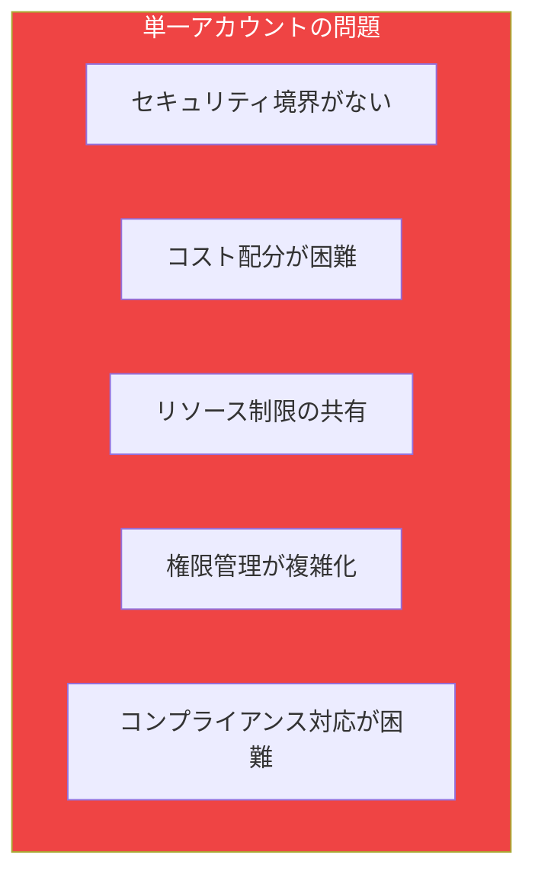
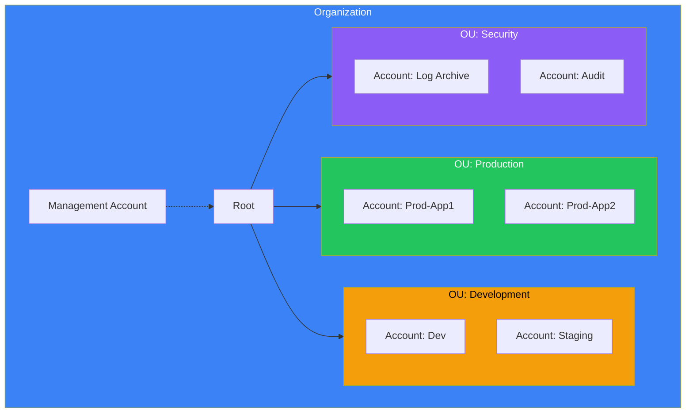
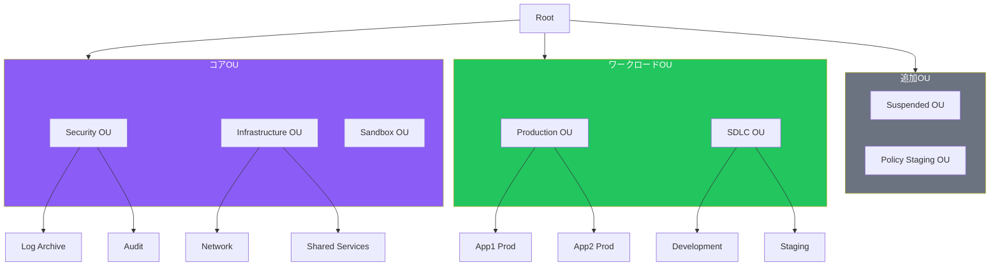
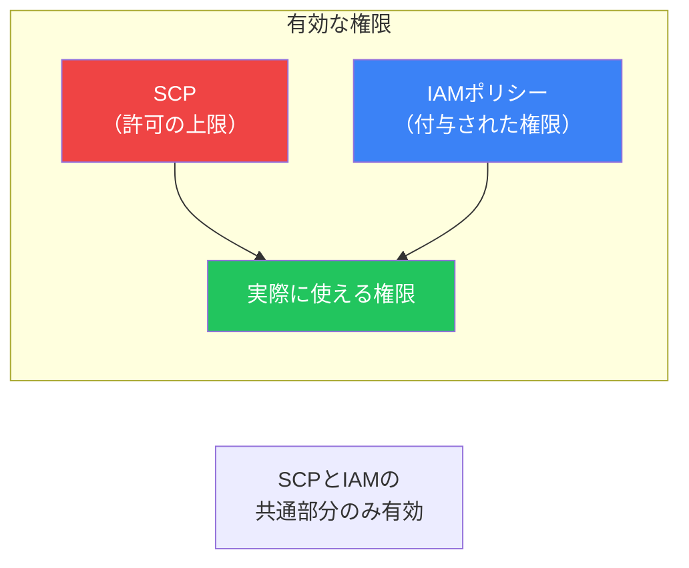
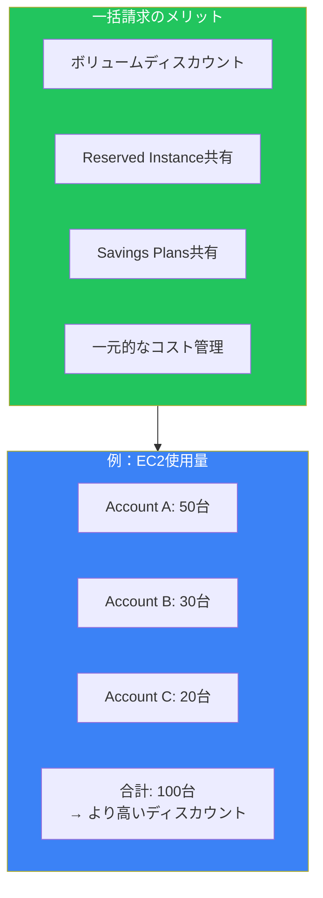
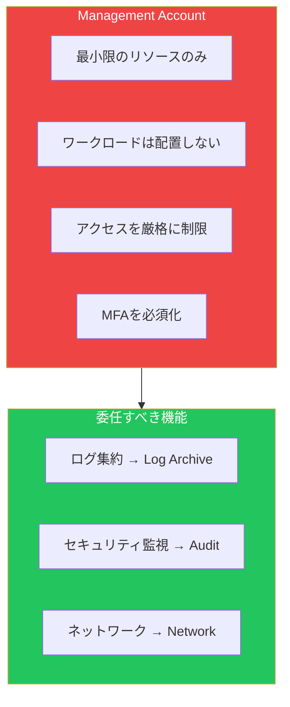
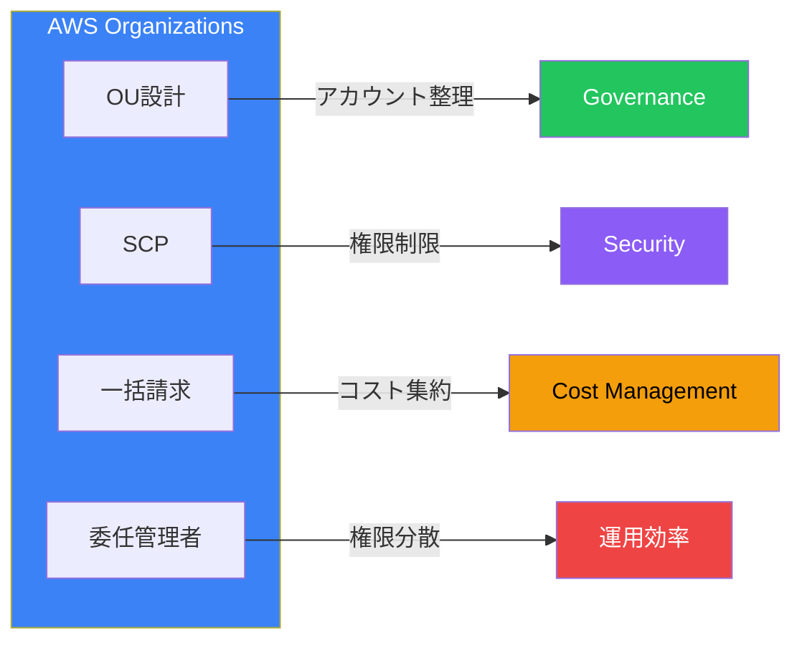

AWS Organizationsは、複数のAWSアカウントを一元管理するためのサービスです。エンタープライズ規模の組織では、セキュリティ、コスト管理、コンプライアンスの観点から、適切なマルチアカウント戦略が不可欠です。

## なぜマルチアカウントが必要か

### 単一アカウントの限界

1つのAWSアカウントですべてを運用すると、以下の問題が発生します：



### マルチアカウントのメリット

| 観点 | 単一アカウント | マルチアカウント |
|------|---------------|-----------------|
| セキュリティ | 全リソースが同一境界 | アカウント単位で分離 |
| コスト | タグベースの配分のみ | アカウント単位で明確 |
| 権限 | IAMポリシーが複雑化 | アカウント単位で簡素化 |
| 障害影響 | 全環境に影響 | 影響範囲を限定 |
| サービス制限 | 全体で共有 | アカウント単位で独立 |

## AWS Organizationsの構造

### 基本コンポーネント



### 用語の整理

| コンポーネント | 説明 |
|---------------|------|
| **Organization** | 複数のAWSアカウントの集合体 |
| **Management Account** | 組織の管理アカウント（旧Master Account） |
| **Member Account** | 組織に属する一般アカウント |
| **Root** | 組織階層の最上位 |
| **OU（Organizational Unit）** | アカウントをグループ化する単位 |
| **SCP** | OUまたはアカウントに適用するポリシー |

## OU設計のベストプラクティス

### 推奨OU構造



### OU設計の原則

1. **セキュリティを最優先**: Security OUは独立させる
2. **環境で分離**: 本番とSDLC（開発/ステージング）を分ける
3. **シンプルに保つ**: 深すぎる階層は避ける（最大5レベル）
4. **成長を見据える**: 将来のアカウント追加を考慮

## SCP（サービスコントロールポリシー）

### SCPとは

SCPは組織全体またはOU単位で「できること」の上限を定義します。IAMポリシーとは異なり、**許可を与えるのではなく、許可の上限を制限**します。



### SCP vs IAMポリシー

| 特徴 | SCP | IAMポリシー |
|------|-----|------------|
| 適用対象 | アカウント/OU | ユーザー/ロール/グループ |
| 目的 | 許可の上限を設定 | 権限を付与 |
| Management Account | 影響なし | 影響あり |
| デフォルト | FullAWSAccess | 権限なし |

### SCPの戦略

#### Deny List（推奨）

デフォルトで全て許可し、禁止事項を明示的にDeny：

```json
{
  "Version": "2012-10-17",
  "Statement": [
    {
      "Sid": "DenyRootUser",
      "Effect": "Deny",
      "Action": "*",
      "Resource": "*",
      "Condition": {
        "StringLike": {
          "aws:PrincipalArn": "arn:aws:iam::*:root"
        }
      }
    }
  ]
}
```

#### Allow List

すべてをデフォルトで禁止し、許可するサービスを明示：

```json
{
  "Version": "2012-10-17",
  "Statement": [
    {
      "Effect": "Allow",
      "Action": [
        "ec2:*",
        "s3:*",
        "rds:*"
      ],
      "Resource": "*"
    }
  ]
}
```

### 実践的なSCP例

#### リージョン制限

```json
{
  "Version": "2012-10-17",
  "Statement": [
    {
      "Sid": "DenyNonApprovedRegions",
      "Effect": "Deny",
      "NotAction": [
        "iam:*",
        "organizations:*",
        "support:*",
        "budgets:*"
      ],
      "Resource": "*",
      "Condition": {
        "StringNotEquals": {
          "aws:RequestedRegion": [
            "ap-northeast-1",
            "us-east-1"
          ]
        }
      }
    }
  ]
}
```

#### セキュリティサービスの保護

```json
{
  "Version": "2012-10-17",
  "Statement": [
    {
      "Sid": "ProtectSecurityServices",
      "Effect": "Deny",
      "Action": [
        "cloudtrail:StopLogging",
        "cloudtrail:DeleteTrail",
        "config:StopConfigurationRecorder",
        "config:DeleteConfigurationRecorder",
        "guardduty:DeleteDetector",
        "guardduty:DisassociateFromMasterAccount"
      ],
      "Resource": "*"
    }
  ]
}
```

#### S3パブリックアクセス禁止

```json
{
  "Version": "2012-10-17",
  "Statement": [
    {
      "Sid": "DenyS3PublicAccess",
      "Effect": "Deny",
      "Action": [
        "s3:PutBucketPublicAccessBlock",
        "s3:DeletePublicAccessBlock"
      ],
      "Resource": "*",
      "Condition": {
        "StringNotEquals": {
          "aws:PrincipalOrgMasterAccountId": "${aws:PrincipalAccount}"
        }
      }
    }
  ]
}
```

## 一括請求（Consolidated Billing）

### メリット



### RIとSavings Plansの共有

Reserved InstancesとSavings Plansは組織内で自動的に共有されます：

| 設定 | 動作 |
|------|------|
| 共有ON（デフォルト） | 組織全体で利用可能 |
| 共有OFF | 購入アカウントのみ利用可能 |

## アカウント作成の自動化

### Organizations API

```python
import boto3

org_client = boto3.client('organizations')

# 新しいアカウントを作成
response = org_client.create_account(
    Email='new-account@example.com',
    AccountName='new-production-account',
    RoleName='OrganizationAccountAccessRole',
    IamUserAccessToBilling='DENY'
)

# 作成状態を確認
create_status = org_client.describe_create_account_status(
    CreateAccountRequestId=response['CreateAccountStatus']['Id']
)
```

### Account Factory（Control Tower）

大規模なアカウント作成には、Control TowerのAccount Factoryを使用します（次の記事で詳述）。

## 委任管理者

### 委任可能なサービス

Management Account以外に管理権限を委任できます：

| サービス | 委任内容 |
|---------|---------|
| AWS Config | 組織全体のルール管理 |
| GuardDuty | 脅威検出の一元管理 |
| Security Hub | セキュリティ統合 |
| CloudFormation StackSets | スタックのデプロイ |
| Systems Manager | 運用管理 |

```bash
# GuardDutyの委任管理者を設定
aws organizations register-delegated-administrator \
    --account-id 123456789012 \
    --service-principal guardduty.amazonaws.com
```

## ベストプラクティス

### Management Accountの保護



### チェックリスト

| カテゴリ | ベストプラクティス |
|---------|------------------|
| **アカウント設計** | ワークロードごとにアカウントを分離 |
| **OU設計** | セキュリティ、インフラ、ワークロードで分類 |
| **SCP** | Deny Listアプローチを採用 |
| **Management Account** | ワークロードを配置しない |
| **委任** | 可能な限り委任管理者を使用 |
| **自動化** | アカウント作成をコード化 |

## よくある間違い

### 1. SCPがManagement Accountに効かない

SCPはManagement Accountには適用されません。これは仕様です。

### 2. SCPで権限を付与しようとする

SCPは「上限」を設定するもので、権限を「付与」するものではありません。実際の権限付与はIAMポリシーで行います。

### 3. 深すぎるOU階層

OUは最大5レベルまでですが、2-3レベルに抑えることを推奨します。

## まとめ



| 機能 | 用途 | 重要度 |
|------|------|--------|
| OU | アカウントのグループ化 | ★★★ |
| SCP | 権限の上限設定 | ★★★ |
| 一括請求 | コスト最適化 | ★★☆ |
| 委任管理者 | 運用の分散 | ★★☆ |

AWS Organizationsは、マルチアカウント戦略の基盤です。適切なOU設計とSCPにより、セキュリティとガバナンスを両立できます。

## 参考資料

- [AWS Organizations User Guide](https://docs.aws.amazon.com/organizations/latest/userguide/)
- [AWS Multi-Account Strategy](https://docs.aws.amazon.com/whitepapers/latest/organizing-your-aws-environment/)
- [SCP Examples](https://docs.aws.amazon.com/organizations/latest/userguide/orgs_manage_policies_scps_examples.html)
