パフォーマンス効率は、AWS Well-Architected Frameworkの柱の1つです。ワークロードの要件に応じて適切なリソースを選択し、継続的に最適化することが重要です。

## パフォーマンス設計の原則

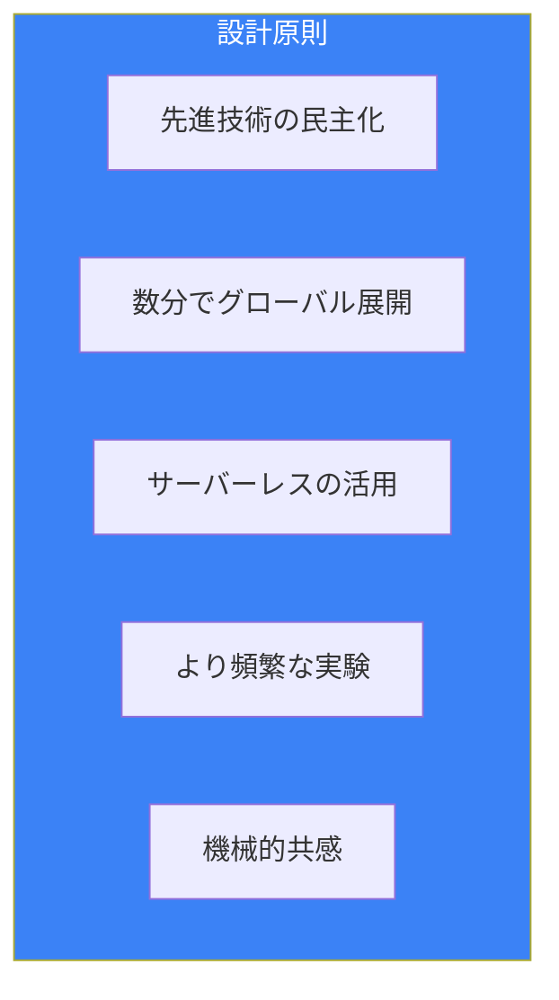

## コンピュート選択

### 選択フローチャート

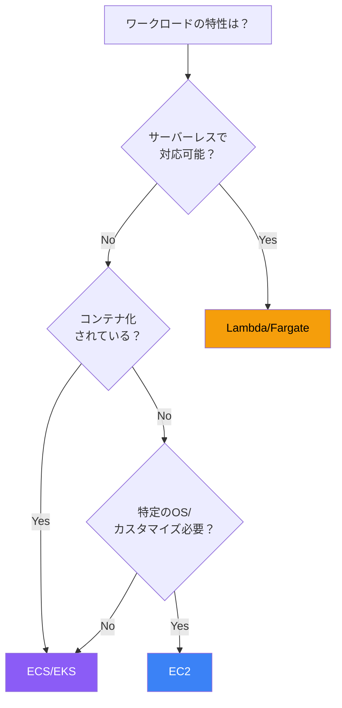

### EC2インスタンスファミリー

| ファミリー | 用途 | ユースケース |
|-----------|------|-------------|
| M | 汎用 | Webサーバー、アプリサーバー |
| C | コンピュート最適化 | バッチ処理、HPC |
| R | メモリ最適化 | インメモリDB、キャッシュ |
| I/D | ストレージ最適化 | データウェアハウス、分散FS |
| G/P | GPU | 機械学習、グラフィックス |
| T | バースト | 開発、小規模ワークロード |

### インスタンス選択のポイント

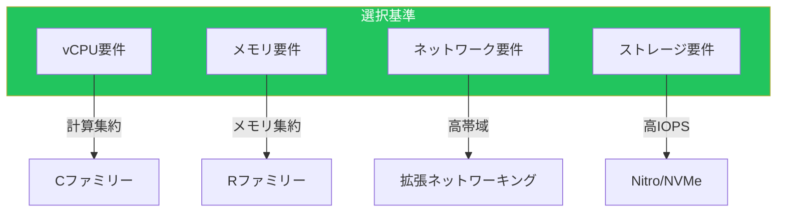

## ストレージ選択

### ストレージタイプ比較

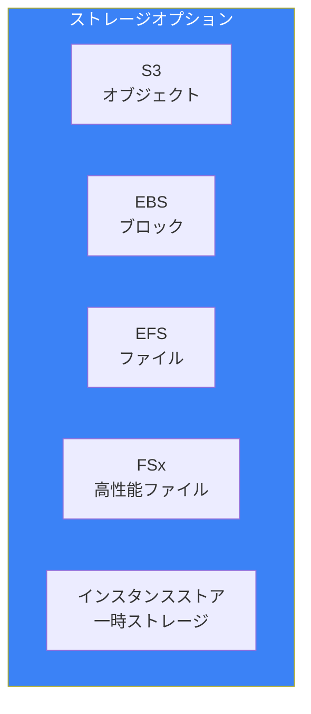

### EBSボリュームタイプ

| タイプ | IOPS | スループット | 用途 |
|--------|------|-------------|------|
| gp3 | 最大16,000 | 最大1,000MB/s | 汎用 |
| io2 | 最大256,000 | 最大4,000MB/s | 高IOPS |
| st1 | - | 最大500MB/s | スループット重視 |
| sc1 | - | 最大250MB/s | コールドデータ |

### ストレージ選択フロー

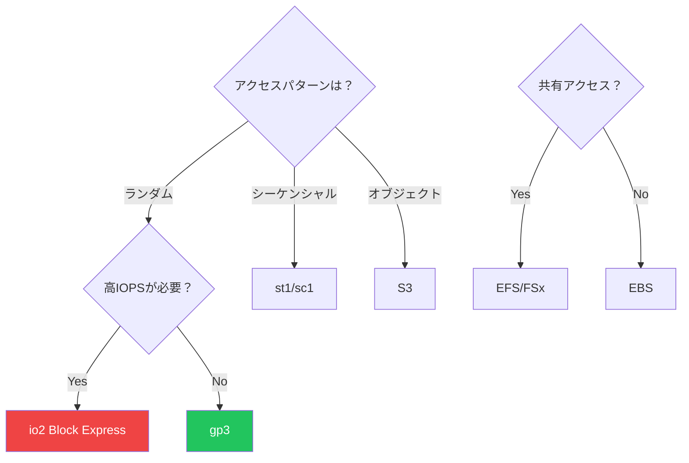

## データベース選択

### データベースタイプ

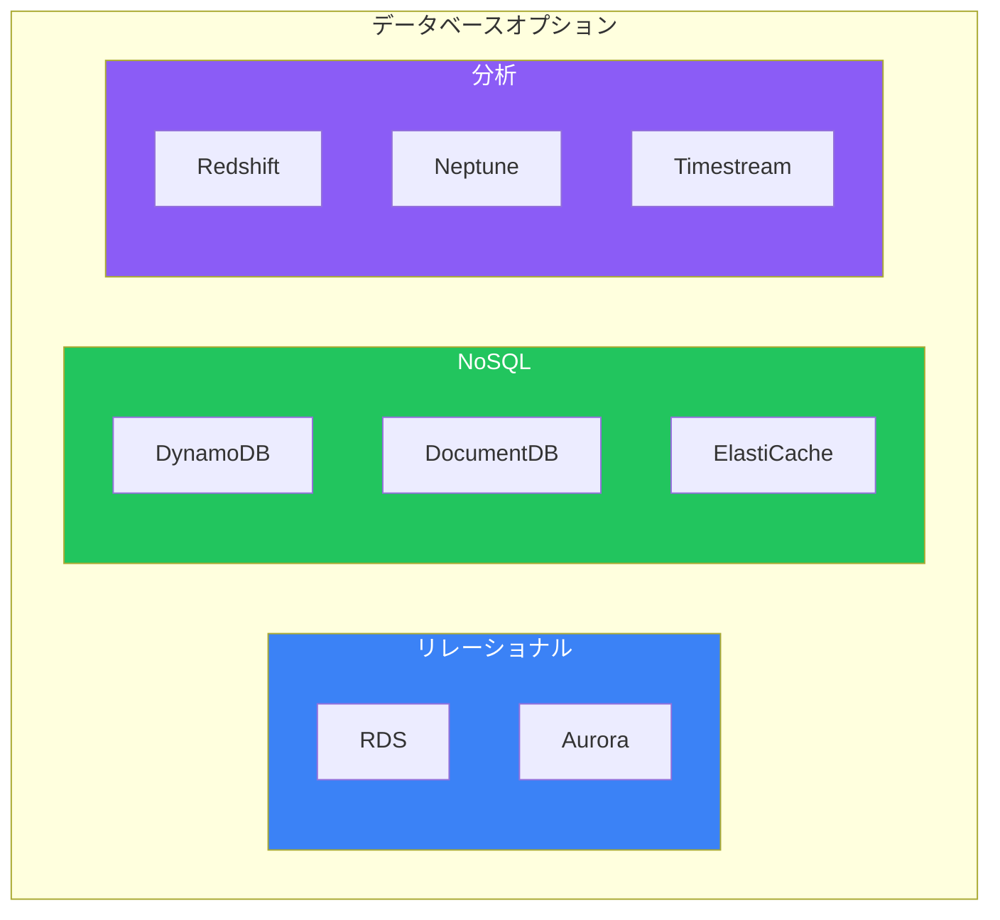

### 選択基準

| 要件 | 推奨DB |
|------|--------|
| ACID、複雑なクエリ | Aurora/RDS |
| 高スケーラビリティ、Key-Value | DynamoDB |
| ドキュメント、MongoDB互換 | DocumentDB |
| キャッシュ、セッション | ElastiCache |
| 分析、OLAP | Redshift |
| グラフデータ | Neptune |
| 時系列データ | Timestream |

### リードレプリカの活用

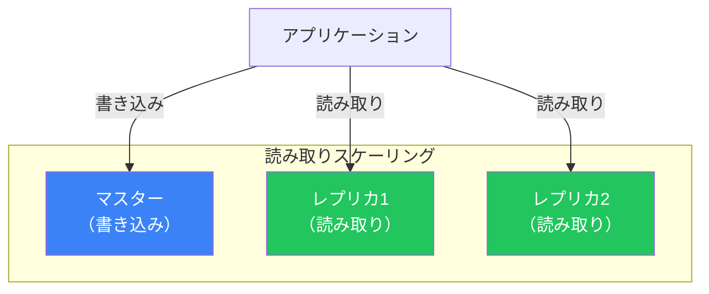

## キャッシング戦略

### キャッシュレイヤー

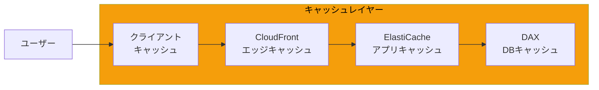

### キャッシュパターン

| パターン | 説明 | 用途 |
|---------|------|------|
| Lazy Loading | 読み取り時にキャッシュ | 汎用 |
| Write Through | 書き込み時にキャッシュ更新 | 一貫性重視 |
| TTL | 有効期限でキャッシュ削除 | 汎用 |
| Cache Aside | アプリがキャッシュ管理 | 柔軟性 |

### ElastiCacheの選択

| 機能 | Redis | Memcached |
|------|-------|-----------|
| データ構造 | 豊富 | シンプル |
| レプリケーション | ✅ | ❌ |
| クラスター | ✅ | ✅ |
| 永続化 | ✅ | ❌ |
| Pub/Sub | ✅ | ❌ |

## グローバル配信

### CloudFront

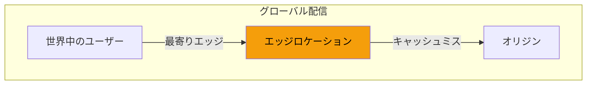

### Lambda@Edge

| 場所 | 用途 |
|------|------|
| Viewer Request | 認証、URL書き換え |
| Origin Request | オリジン選択 |
| Origin Response | ヘッダー追加 |
| Viewer Response | 最終レスポンス加工 |

## モニタリングと最適化

### パフォーマンスメトリクス

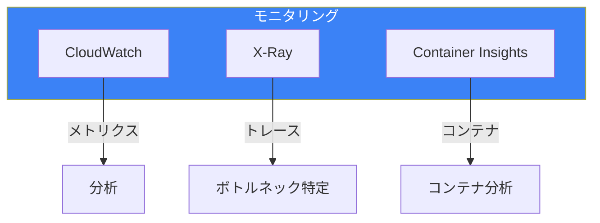

### 主要メトリクス

| レイヤー | メトリクス |
|---------|----------|
| コンピュート | CPU使用率、メモリ使用率 |
| ストレージ | IOPS、スループット、レイテンシー |
| データベース | 接続数、クエリ時間、キャッシュヒット率 |
| ネットワーク | 帯域幅、レイテンシー |

## ベストプラクティス

### 設計チェックリスト

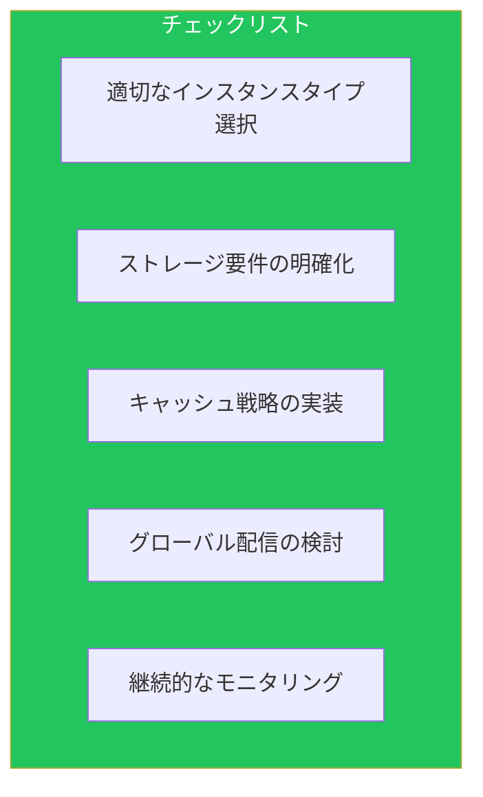

### アンチパターン

| アンチパターン | 推奨 |
|--------------|------|
| オーバープロビジョニング | 適正サイズ化 |
| 単一インスタンス依存 | 分散アーキテクチャ |
| キャッシュなし | 適切なキャッシュレイヤー |
| モニタリング不足 | 継続的な監視と最適化 |

## まとめ

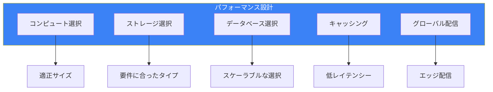

| カテゴリ | ポイント |
|---------|---------|
| コンピュート | ワークロードに適したファミリー |
| ストレージ | アクセスパターンに合ったタイプ |
| データベース | データモデルに適したエンジン |
| キャッシング | 複数レイヤーでのキャッシュ |
| グローバル | エッジロケーションの活用 |

適切なリソース選択と継続的な最適化により、コスト効率の高いパフォーマンスを実現できます。

## 参考資料

- [AWS Well-Architected Framework - Performance Efficiency](https://docs.aws.amazon.com/wellarchitected/latest/performance-efficiency-pillar/)
- [Amazon EC2 Instance Types](https://aws.amazon.com/ec2/instance-types/)
- [Amazon EBS Volume Types](https://docs.aws.amazon.com/AWSEC2/latest/UserGuide/ebs-volume-types.html)
