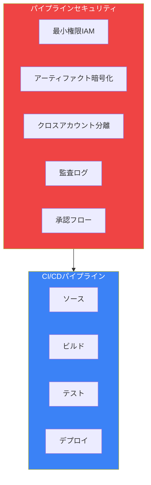
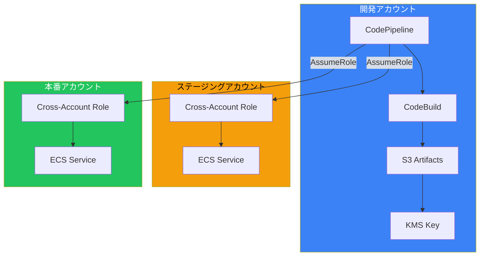
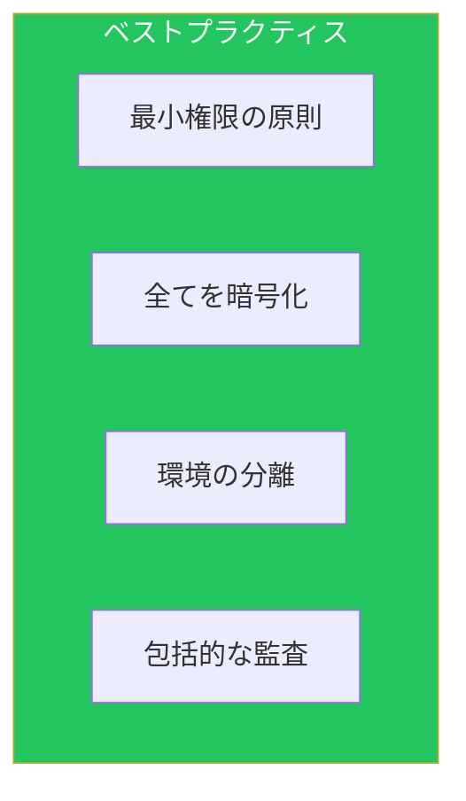

CI/CDパイプラインは攻撃対象となりやすいため、適切なセキュリティ対策が必要です。本記事では、[IAM記事](/blog/aws-iam-deep-dive)で触れなかったパイプライン固有のセキュリティ実装を解説します。

## パイプラインセキュリティ概要



## 最小権限IAM

### CodePipelineサービスロール

```yaml
CodePipelineRole:
  Type: AWS::IAM::Role
  Properties:
    RoleName: codepipeline-service-role
    AssumeRolePolicyDocument:
      Version: '2012-10-17'
      Statement:
        - Effect: Allow
          Principal:
            Service: codepipeline.amazonaws.com
          Action: sts:AssumeRole
    Policies:
      - PolicyName: CodePipelinePolicy
        PolicyDocument:
          Version: '2012-10-17'
          Statement:
            # ソースアクセス（CodeCommit）
            - Effect: Allow
              Action:
                - codecommit:GetBranch
                - codecommit:GetCommit
                - codecommit:UploadArchive
                - codecommit:GetUploadArchiveStatus
                - codecommit:CancelUploadArchive
              Resource: !GetAtt CodeCommitRepo.Arn

            # CodeBuild起動
            - Effect: Allow
              Action:
                - codebuild:BatchGetBuilds
                - codebuild:StartBuild
              Resource: !GetAtt BuildProject.Arn

            # CodeDeploy起動
            - Effect: Allow
              Action:
                - codedeploy:CreateDeployment
                - codedeploy:GetDeployment
                - codedeploy:GetDeploymentConfig
                - codedeploy:GetApplicationRevision
                - codedeploy:RegisterApplicationRevision
              Resource:
                - !Sub arn:aws:codedeploy:${AWS::Region}:${AWS::AccountId}:deploymentgroup:${CodeDeployApp}/*
                - !Sub arn:aws:codedeploy:${AWS::Region}:${AWS::AccountId}:deploymentconfig:*

            # S3アーティファクト
            - Effect: Allow
              Action:
                - s3:GetObject
                - s3:PutObject
                - s3:GetObjectVersion
              Resource: !Sub ${ArtifactBucket.Arn}/*

            # KMS
            - Effect: Allow
              Action:
                - kms:Decrypt
                - kms:GenerateDataKey
              Resource: !GetAtt PipelineKey.Arn
```

### CodeBuildサービスロール

```yaml
CodeBuildRole:
  Type: AWS::IAM::Role
  Properties:
    RoleName: codebuild-service-role
    AssumeRolePolicyDocument:
      Version: '2012-10-17'
      Statement:
        - Effect: Allow
          Principal:
            Service: codebuild.amazonaws.com
          Action: sts:AssumeRole
    Policies:
      - PolicyName: CodeBuildPolicy
        PolicyDocument:
          Version: '2012-10-17'
          Statement:
            # CloudWatch Logs
            - Effect: Allow
              Action:
                - logs:CreateLogGroup
                - logs:CreateLogStream
                - logs:PutLogEvents
              Resource:
                - !Sub arn:aws:logs:${AWS::Region}:${AWS::AccountId}:log-group:/aws/codebuild/${BuildProject}
                - !Sub arn:aws:logs:${AWS::Region}:${AWS::AccountId}:log-group:/aws/codebuild/${BuildProject}:*

            # S3アーティファクト
            - Effect: Allow
              Action:
                - s3:GetObject
                - s3:PutObject
              Resource: !Sub ${ArtifactBucket.Arn}/*

            # ECRプッシュ
            - Effect: Allow
              Action:
                - ecr:GetAuthorizationToken
              Resource: "*"
            - Effect: Allow
              Action:
                - ecr:BatchCheckLayerAvailability
                - ecr:GetDownloadUrlForLayer
                - ecr:BatchGetImage
                - ecr:PutImage
                - ecr:InitiateLayerUpload
                - ecr:UploadLayerPart
                - ecr:CompleteLayerUpload
              Resource: !GetAtt ECRRepository.Arn

            # Secrets Manager（特定シークレットのみ）
            - Effect: Allow
              Action:
                - secretsmanager:GetSecretValue
              Resource:
                - !Ref BuildSecrets
              Condition:
                StringEquals:
                  secretsmanager:VersionStage: AWSCURRENT

            # KMS
            - Effect: Allow
              Action:
                - kms:Decrypt
              Resource: !GetAtt PipelineKey.Arn
```

### 権限境界の適用

```yaml
# 権限境界ポリシー
PipelinePermissionsBoundary:
  Type: AWS::IAM::ManagedPolicy
  Properties:
    ManagedPolicyName: pipeline-permissions-boundary
    PolicyDocument:
      Version: '2012-10-17'
      Statement:
        # 許可される最大権限を定義
        - Effect: Allow
          Action:
            - s3:*
            - ecr:*
            - ecs:*
            - lambda:*
            - cloudformation:*
            - codebuild:*
            - codedeploy:*
          Resource: "*"

        # 禁止アクション
        - Effect: Deny
          Action:
            - iam:CreateUser
            - iam:CreateAccessKey
            - iam:AttachUserPolicy
            - organizations:*
            - account:*
          Resource: "*"

        # 本番環境への直接アクセス禁止
        - Effect: Deny
          Action:
            - rds:DeleteDBInstance
            - rds:DeleteDBCluster
            - dynamodb:DeleteTable
            - s3:DeleteBucket
          Resource: "*"
          Condition:
            StringEquals:
              aws:ResourceTag/Environment: production

# ロールに権限境界を適用
CodeBuildRole:
  Type: AWS::IAM::Role
  Properties:
    PermissionsBoundary: !Ref PipelinePermissionsBoundary
```

## アーティファクト暗号化

### KMS設定

```yaml
PipelineKey:
  Type: AWS::KMS::Key
  Properties:
    Description: Key for CI/CD pipeline artifacts
    EnableKeyRotation: true
    KeyPolicy:
      Version: '2012-10-17'
      Statement:
        - Sid: AllowRootAccess
          Effect: Allow
          Principal:
            AWS: !Sub arn:aws:iam::${AWS::AccountId}:root
          Action: kms:*
          Resource: "*"

        - Sid: AllowCodePipelineUse
          Effect: Allow
          Principal:
            AWS:
              - !GetAtt CodePipelineRole.Arn
              - !GetAtt CodeBuildRole.Arn
          Action:
            - kms:Decrypt
            - kms:GenerateDataKey
            - kms:DescribeKey
          Resource: "*"

        # クロスアカウントアクセス
        - Sid: AllowCrossAccountUse
          Effect: Allow
          Principal:
            AWS:
              - arn:aws:iam::STAGING_ACCOUNT:role/codepipeline-cross-account
              - arn:aws:iam::PROD_ACCOUNT:role/codepipeline-cross-account
          Action:
            - kms:Decrypt
            - kms:DescribeKey
          Resource: "*"

PipelineKeyAlias:
  Type: AWS::KMS::Alias
  Properties:
    AliasName: alias/pipeline-key
    TargetKeyId: !Ref PipelineKey

# 暗号化S3バケット
ArtifactBucket:
  Type: AWS::S3::Bucket
  Properties:
    BucketName: !Sub ${AWS::StackName}-artifacts-${AWS::AccountId}
    BucketEncryption:
      ServerSideEncryptionConfiguration:
        - ServerSideEncryptionByDefault:
            SSEAlgorithm: aws:kms
            KMSMasterKeyID: !GetAtt PipelineKey.Arn
    PublicAccessBlockConfiguration:
      BlockPublicAcls: true
      BlockPublicPolicy: true
      IgnorePublicAcls: true
      RestrictPublicBuckets: true
    VersioningConfiguration:
      Status: Enabled
```

### パイプラインでの暗号化設定

```yaml
Pipeline:
  Type: AWS::CodePipeline::Pipeline
  Properties:
    ArtifactStore:
      Type: S3
      Location: !Ref ArtifactBucket
      EncryptionKey:
        Id: !GetAtt PipelineKey.Arn
        Type: KMS
```

## クロスアカウントデプロイ

### アーキテクチャ



### クロスアカウントロール（ターゲットアカウント）

```yaml
# ステージング/本番アカウントに作成
CrossAccountDeployRole:
  Type: AWS::IAM::Role
  Properties:
    RoleName: codepipeline-cross-account-deploy
    AssumeRolePolicyDocument:
      Version: '2012-10-17'
      Statement:
        - Effect: Allow
          Principal:
            AWS: arn:aws:iam::DEV_ACCOUNT_ID:root
          Action: sts:AssumeRole
          Condition:
            StringEquals:
              sts:ExternalId: !Ref ExternalId
            ArnLike:
              aws:PrincipalArn: arn:aws:iam::DEV_ACCOUNT_ID:role/codepipeline-*
    Policies:
      - PolicyName: DeployPolicy
        PolicyDocument:
          Version: '2012-10-17'
          Statement:
            # ECSデプロイ
            - Effect: Allow
              Action:
                - ecs:UpdateService
                - ecs:DescribeServices
                - ecs:DescribeTaskDefinition
                - ecs:RegisterTaskDefinition
              Resource: "*"

            # CloudFormationデプロイ
            - Effect: Allow
              Action:
                - cloudformation:CreateStack
                - cloudformation:UpdateStack
                - cloudformation:DescribeStacks
                - cloudformation:DeleteStack
              Resource: !Sub arn:aws:cloudformation:${AWS::Region}:${AWS::AccountId}:stack/*

            # S3アーティファクト読み取り
            - Effect: Allow
              Action:
                - s3:GetObject
                - s3:GetObjectVersion
              Resource: arn:aws:s3:::dev-account-artifacts-bucket/*

            # KMS復号化
            - Effect: Allow
              Action:
                - kms:Decrypt
                - kms:DescribeKey
              Resource: arn:aws:kms:ap-northeast-1:DEV_ACCOUNT_ID:key/pipeline-key-id

# S3バケットポリシー（開発アカウント）
ArtifactBucketPolicy:
  Type: AWS::S3::BucketPolicy
  Properties:
    Bucket: !Ref ArtifactBucket
    PolicyDocument:
      Statement:
        - Effect: Allow
          Principal:
            AWS:
              - arn:aws:iam::STAGING_ACCOUNT:role/codepipeline-cross-account-deploy
              - arn:aws:iam::PROD_ACCOUNT:role/codepipeline-cross-account-deploy
          Action:
            - s3:GetObject
            - s3:GetObjectVersion
          Resource: !Sub ${ArtifactBucket.Arn}/*
```

### クロスアカウントパイプライン

```yaml
Pipeline:
  Type: AWS::CodePipeline::Pipeline
  Properties:
    Stages:
      - Name: Source
        Actions:
          - Name: Source
            ActionTypeId:
              Category: Source
              Owner: AWS
              Provider: CodeCommit
              Version: "1"
            Configuration:
              RepositoryName: !Ref RepoName
              BranchName: main
            OutputArtifacts:
              - Name: SourceOutput

      - Name: Build
        Actions:
          - Name: Build
            ActionTypeId:
              Category: Build
              Owner: AWS
              Provider: CodeBuild
              Version: "1"
            Configuration:
              ProjectName: !Ref BuildProject
            InputArtifacts:
              - Name: SourceOutput
            OutputArtifacts:
              - Name: BuildOutput

      - Name: DeployStaging
        Actions:
          - Name: DeployToStaging
            ActionTypeId:
              Category: Deploy
              Owner: AWS
              Provider: ECS
              Version: "1"
            Configuration:
              ClusterName: staging-cluster
              ServiceName: my-service
            InputArtifacts:
              - Name: BuildOutput
            RoleArn: arn:aws:iam::STAGING_ACCOUNT:role/codepipeline-cross-account-deploy

      - Name: Approval
        Actions:
          - Name: ManualApproval
            ActionTypeId:
              Category: Approval
              Owner: AWS
              Provider: Manual
              Version: "1"
            Configuration:
              NotificationArn: !Ref ApprovalTopic
              CustomData: "本番環境へのデプロイを承認してください"

      - Name: DeployProduction
        Actions:
          - Name: DeployToProduction
            ActionTypeId:
              Category: Deploy
              Owner: AWS
              Provider: ECS
              Version: "1"
            Configuration:
              ClusterName: production-cluster
              ServiceName: my-service
            InputArtifacts:
              - Name: BuildOutput
            RoleArn: arn:aws:iam::PROD_ACCOUNT:role/codepipeline-cross-account-deploy
```

## 監査ログ

### CloudTrail設定

```yaml
PipelineTrail:
  Type: AWS::CloudTrail::Trail
  Properties:
    TrailName: pipeline-audit-trail
    S3BucketName: !Ref AuditLogBucket
    IsMultiRegionTrail: true
    EnableLogFileValidation: true
    KMSKeyId: !Ref AuditKMSKey
    EventSelectors:
      - ReadWriteType: All
        IncludeManagementEvents: true
        DataResources:
          - Type: AWS::S3::Object
            Values:
              - !Sub ${ArtifactBucket.Arn}/
    InsightSelectors:
      - InsightType: ApiCallRateInsight
      - InsightType: ApiErrorRateInsight
```

### 監査アラート

```yaml
# 不正なパイプライン変更検出
UnauthorizedPipelineChange:
  Type: AWS::Events::Rule
  Properties:
    EventPattern:
      source:
        - aws.codepipeline
      detail-type:
        - AWS API Call via CloudTrail
      detail:
        eventSource:
          - codepipeline.amazonaws.com
        eventName:
          - UpdatePipeline
          - DeletePipeline
          - PutJobSuccessResult
          - PutJobFailureResult
        userIdentity:
          type:
            - anything-but: AssumedRole
    Targets:
      - Id: AlertSNS
        Arn: !Ref SecurityAlertTopic
      - Id: AlertLambda
        Arn: !GetAtt SecurityAlertFunction.Arn

# ビルドシークレットアクセス監視
SecretsAccessMonitor:
  Type: AWS::Logs::MetricFilter
  Properties:
    LogGroupName: /aws/cloudtrail/pipeline-audit
    FilterPattern: '{ $.eventSource = "secretsmanager.amazonaws.com" && $.eventName = "GetSecretValue" }'
    MetricTransformations:
      - MetricName: SecretsAccessCount
        MetricNamespace: Pipeline/Security
        MetricValue: "1"
        Dimensions:
          - Key: SecretId
            Value: $.requestParameters.secretId
```

### 監査ダッシュボード

```yaml
AuditDashboard:
  Type: AWS::CloudWatch::Dashboard
  Properties:
    DashboardName: pipeline-security-audit
    DashboardBody: !Sub |
      {
        "widgets": [
          {
            "type": "metric",
            "properties": {
              "title": "Pipeline Executions",
              "metrics": [
                ["AWS/CodePipeline", "ExecutionSucceeded", "PipelineName", "${Pipeline}"],
                ["AWS/CodePipeline", "ExecutionFailed", "PipelineName", "${Pipeline}"]
              ],
              "period": 3600
            }
          },
          {
            "type": "log",
            "properties": {
              "title": "Pipeline API Calls",
              "query": "SOURCE '/aws/cloudtrail/pipeline-audit' | filter eventSource = 'codepipeline.amazonaws.com' | stats count(*) by eventName | sort count desc"
            }
          },
          {
            "type": "metric",
            "properties": {
              "title": "Secrets Access",
              "metrics": [
                ["Pipeline/Security", "SecretsAccessCount"]
              ]
            }
          }
        ]
      }
```

## 承認フロー

### マルチステップ承認

```yaml
ApprovalWorkflow:
  Type: AWS::StepFunctions::StateMachine
  Properties:
    Definition:
      StartAt: RequestApproval
      States:
        RequestApproval:
          Type: Task
          Resource: arn:aws:states:::lambda:invoke.waitForTaskToken
          Parameters:
            FunctionName: !Ref RequestApprovalFunction
            Payload:
              taskToken.$: $$.Task.Token
              pipelineExecutionId.$: $.pipelineExecutionId
              approvers:
                - security-team@example.com
                - platform-team@example.com
          TimeoutSeconds: 86400
          Next: CheckApprovalCount

        CheckApprovalCount:
          Type: Choice
          Choices:
            - Variable: $.approvalCount
              NumericGreaterThanEquals: 2
              Next: Approved
          Default: RequestApproval

        Approved:
          Type: Task
          Resource: arn:aws:states:::codepipeline:putApprovalResult
          Parameters:
            pipelineName.$: $.pipelineName
            stageName.$: $.stageName
            actionName.$: $.actionName
            token.$: $.token
            result:
              status: Approved
              summary: Approved by required approvers
          End: true
```

## ベストプラクティス



| カテゴリ | 項目 |
|---------|------|
| IAM | 最小権限 + 権限境界 |
| 暗号化 | KMSで全アーティファクト暗号化 |
| 分離 | クロスアカウントで環境分離 |
| 監査 | CloudTrailで全操作記録 |

## まとめ

| 領域 | 対策 |
|------|------|
| アクセス制御 | 最小権限IAMロール |
| データ保護 | KMS暗号化 |
| 環境分離 | クロスアカウントデプロイ |
| 可視性 | 監査ログと承認フロー |

パイプラインセキュリティを適切に実装することで、安全なCI/CD環境を実現できます。

## 参考資料

- [CodePipeline Security Best Practices](https://docs.aws.amazon.com/codepipeline/latest/userguide/security-best-practices.html)
- [Cross-Account Pipelines](https://docs.aws.amazon.com/codepipeline/latest/userguide/pipelines-create-cross-account.html)
- [KMS for DevOps](https://docs.aws.amazon.com/kms/latest/developerguide/services-codepipeline.html)
