Route 53とGlobal Acceleratorは、グローバルなトラフィック管理とフェイルオーバーを実現するサービスです。それぞれ異なるレイヤーで動作し、組み合わせることで高可用性と低レイテンシーを両立できます。

## Route 53の概要

### Route 53の機能

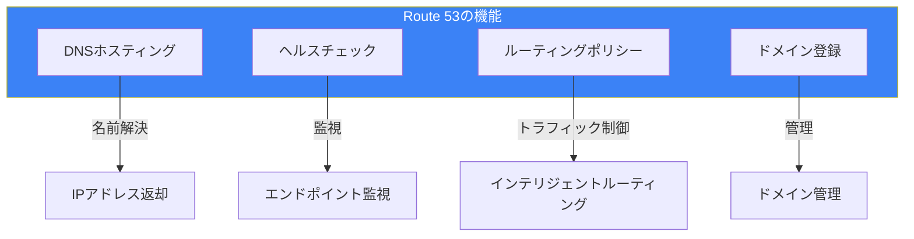

### ホストゾーン

| 種類 | 用途 | アクセス |
|------|------|---------|
| パブリック | インターネット向け | 誰でもクエリ可能 |
| プライベート | VPC内部向け | 関連VPCからのみ |

## ルーティングポリシー

### 7つのルーティングポリシー

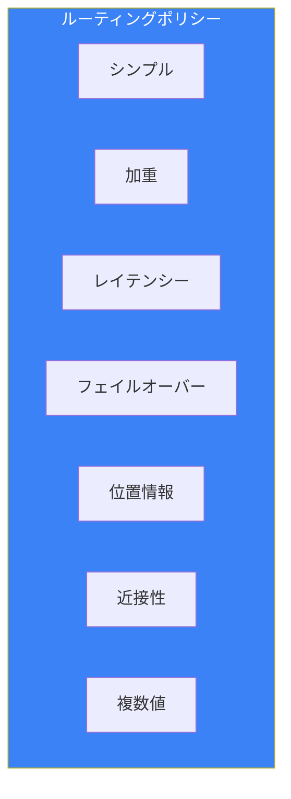

### シンプルルーティング

1つのリソースへのルーティング：

```
example.com → 192.0.2.1
```

### 加重ルーティング

トラフィックを割合で分散：

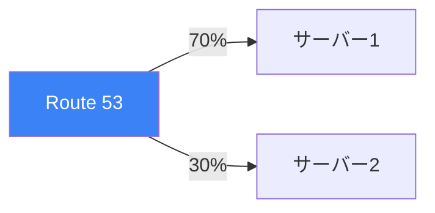

ユースケース：
- A/Bテスト
- カナリアリリース
- 段階的な移行

### レイテンシールーティング

最も低レイテンシーのリージョンへルーティング：

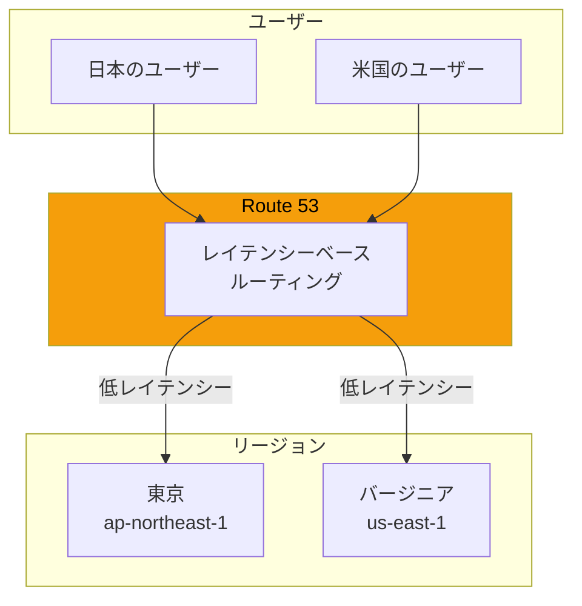

### フェイルオーバールーティング

プライマリ障害時にセカンダリへ切り替え：

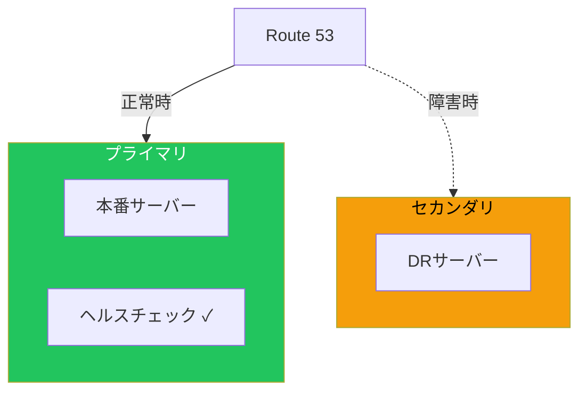

### 位置情報ルーティング

ユーザーの地理的位置に基づくルーティング：

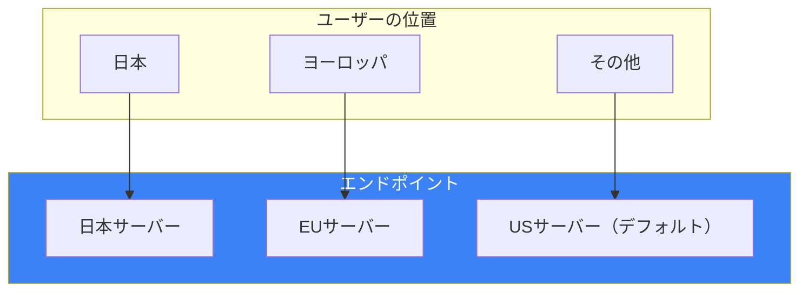

ユースケース：
- コンテンツのローカライズ
- 法規制対応（データの地域制限）
- ライセンス制限

### 近接性ルーティング

地理的な近さに基づき、バイアス値で調整可能：

```
東京: バイアス +25（より多くのトラフィック）
シンガポール: バイアス 0
シドニー: バイアス -10（より少ないトラフィック）
```

### 複数値応答ルーティング

複数のIPアドレスを返却（簡易ロードバランシング）：

```
example.com → [192.0.2.1, 192.0.2.2, 192.0.2.3]
（ヘルスチェックに合格したものだけ返却）
```

## ヘルスチェック

### ヘルスチェックの種類

| 種類 | 監視対象 |
|------|---------|
| エンドポイント | URL、IPアドレス |
| 計算済み | 他のヘルスチェックの組み合わせ |
| CloudWatch | CloudWatchアラームの状態 |

### エンドポイントヘルスチェック

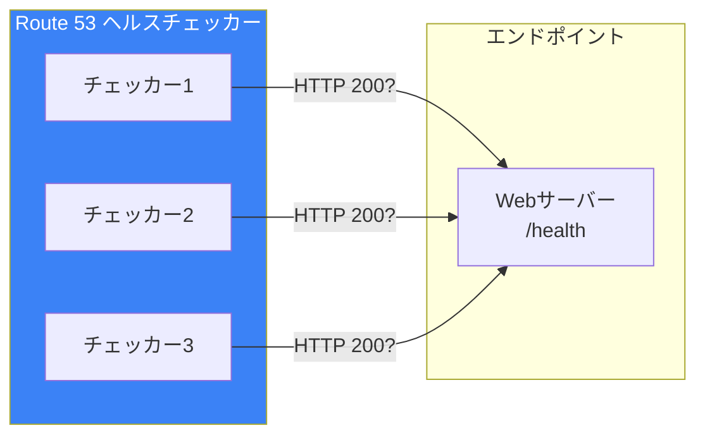

### 設定パラメータ

| パラメータ | 説明 | デフォルト |
|-----------|------|-----------|
| リクエスト間隔 | チェック頻度 | 30秒 |
| 失敗しきい値 | 異常判定の回数 | 3回 |
| 文字列マッチング | レスポンス内容の確認 | なし |
| レイテンシーグラフ | 応答時間の可視化 | 有効 |

### 計算済みヘルスチェック

複数のヘルスチェックを組み合わせ：

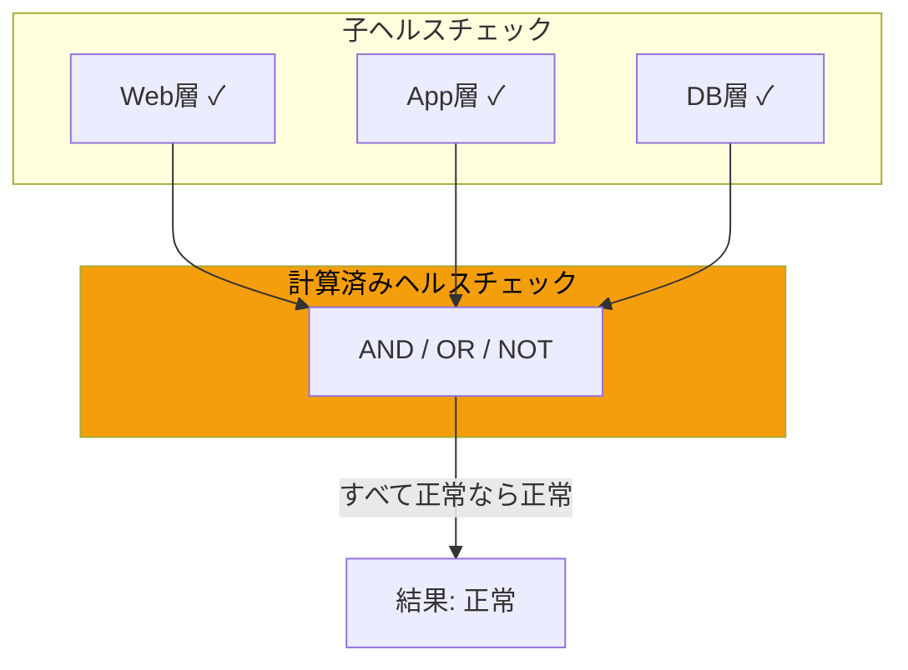

## Global Accelerator

### 概要

Global Acceleratorは、AWSグローバルネットワークを使用してアプリケーションのパフォーマンスと可用性を向上させます。

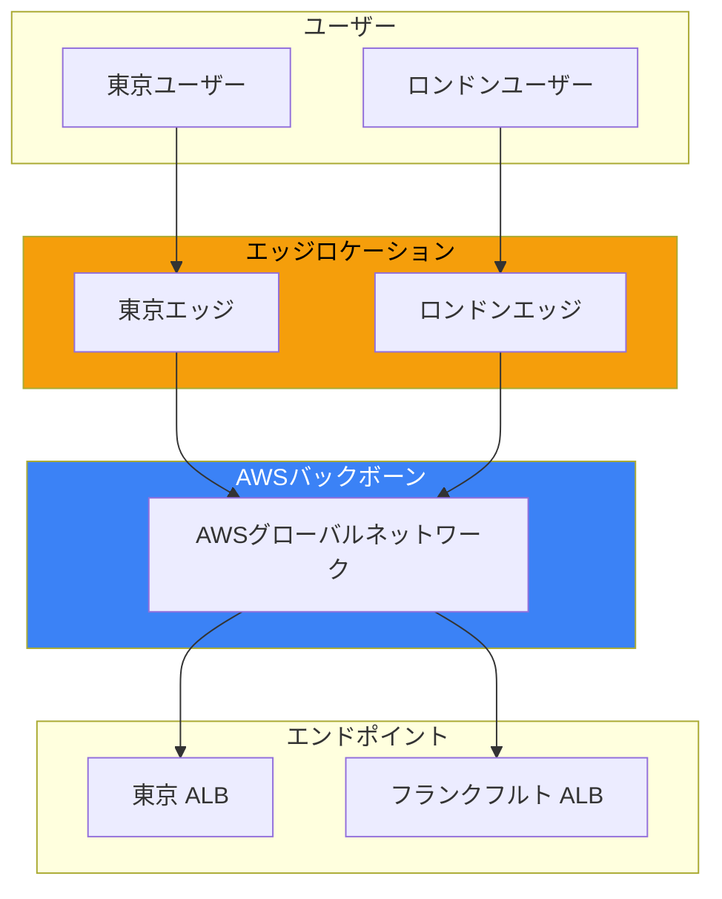

### Route 53 vs Global Accelerator

| 項目 | Route 53 | Global Accelerator |
|------|----------|-------------------|
| レイヤー | DNS（L7） | ネットワーク（L4） |
| IPアドレス | 変動 | 固定（Anycast） |
| キャッシュ | DNSキャッシュあり | なし |
| フェイルオーバー速度 | DNS TTL依存 | 即時（数秒） |
| ユースケース | 一般的なトラフィック管理 | 低レイテンシー要件 |

### Global Acceleratorのコンポーネント

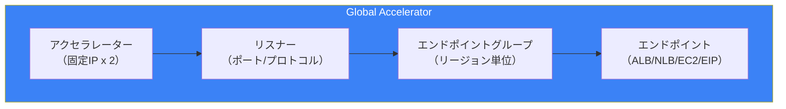

### 設定例

```bash
# アクセラレーターの作成
aws globalaccelerator create-accelerator \
    --name my-accelerator \
    --ip-address-type IPV4 \
    --enabled

# リスナーの作成
aws globalaccelerator create-listener \
    --accelerator-arn arn:aws:globalaccelerator::xxx:accelerator/xxx \
    --port-ranges FromPort=80,ToPort=80 FromPort=443,ToPort=443 \
    --protocol TCP

# エンドポイントグループの作成
aws globalaccelerator create-endpoint-group \
    --listener-arn arn:aws:globalaccelerator::xxx:accelerator/xxx/listener/xxx \
    --endpoint-group-region ap-northeast-1 \
    --endpoint-configurations EndpointId=arn:aws:elasticloadbalancing:ap-northeast-1:xxx:loadbalancer/app/xxx,Weight=100
```

### トラフィックダイヤル

リージョン間でトラフィックを調整：

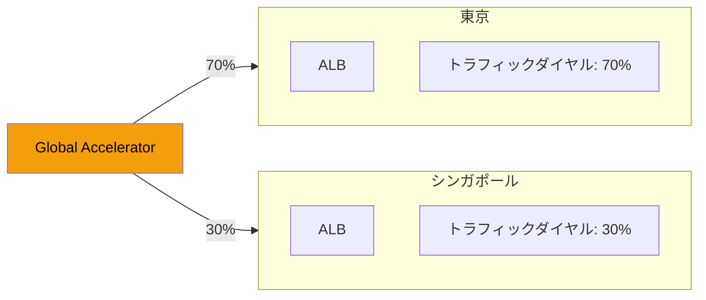

## フェイルオーバー設計

### Route 53によるフェイルオーバー

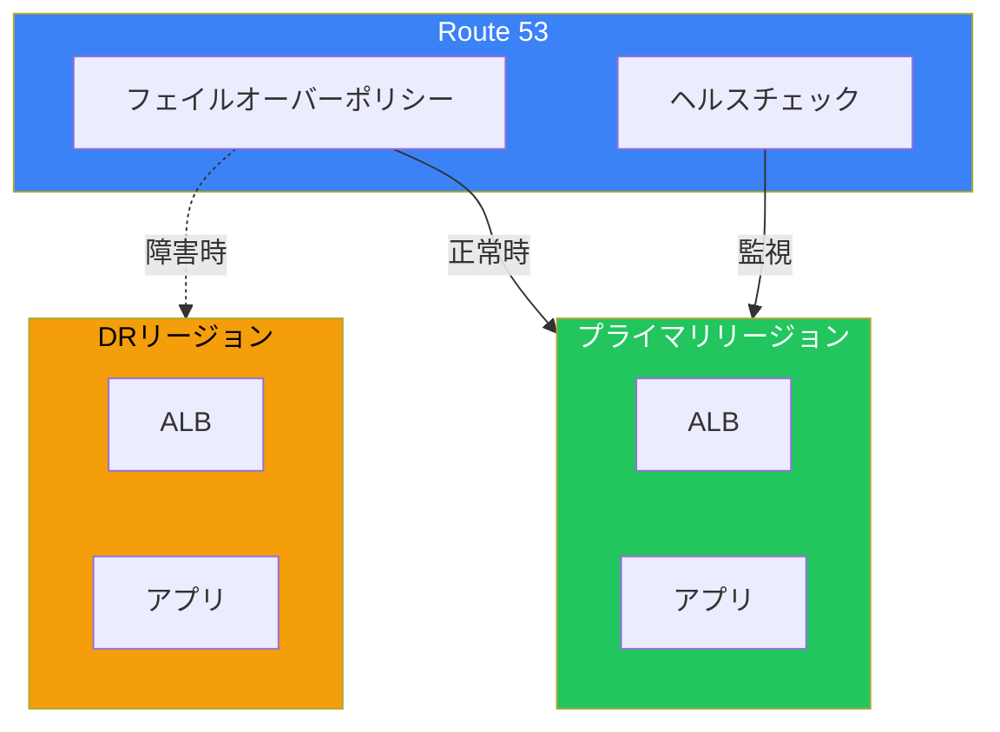

### Global Acceleratorによるフェイルオーバー

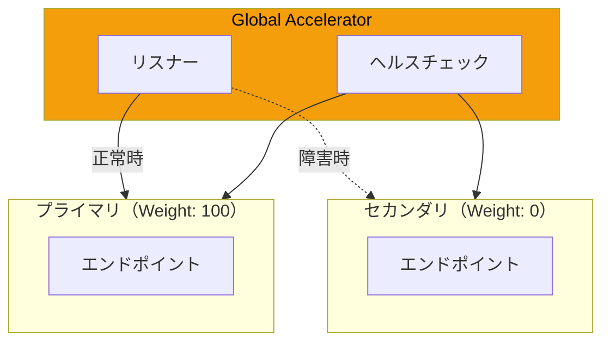

### 組み合わせパターン

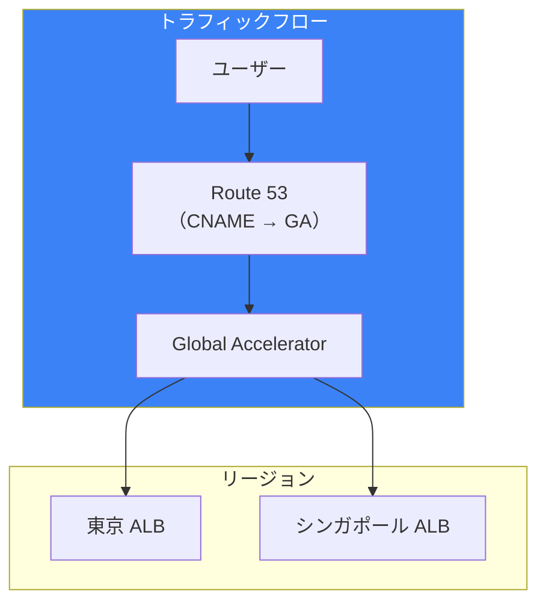

## 料金比較

### Route 53

| 項目 | 料金 |
|------|------|
| ホストゾーン | $0.50/月 |
| クエリ | $0.40/100万クエリ |
| ヘルスチェック | $0.50〜$2.00/月 |

### Global Accelerator

| 項目 | 料金 |
|------|------|
| 固定料金 | $0.025/時間 |
| データ転送 | $0.015〜$0.035/GB |

## ベストプラクティス

### Route 53

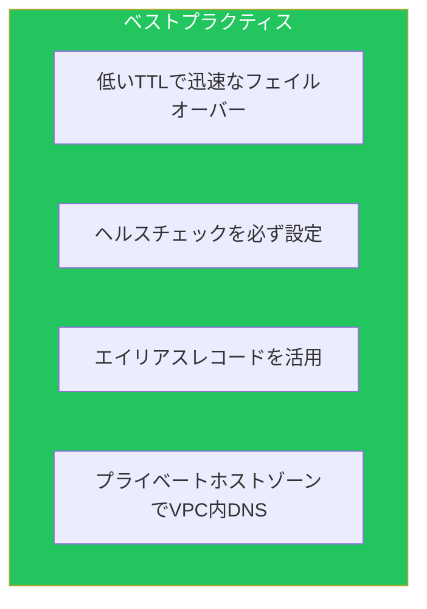

### Global Accelerator

| 項目 | 推奨 |
|------|------|
| ヘルスチェック | カスタムポート/パスを設定 |
| クライアントアフィニティ | 必要な場合のみ有効化 |
| トラフィックダイヤル | 段階的な移行に活用 |

## 選択基準

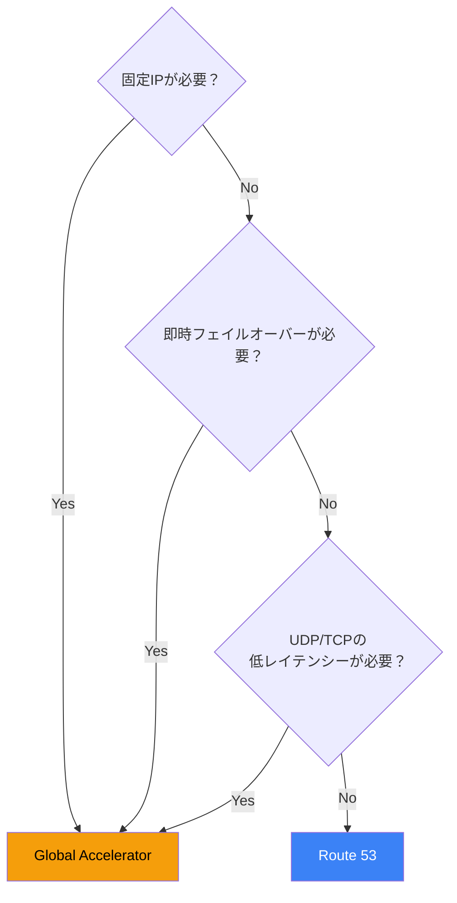

## まとめ

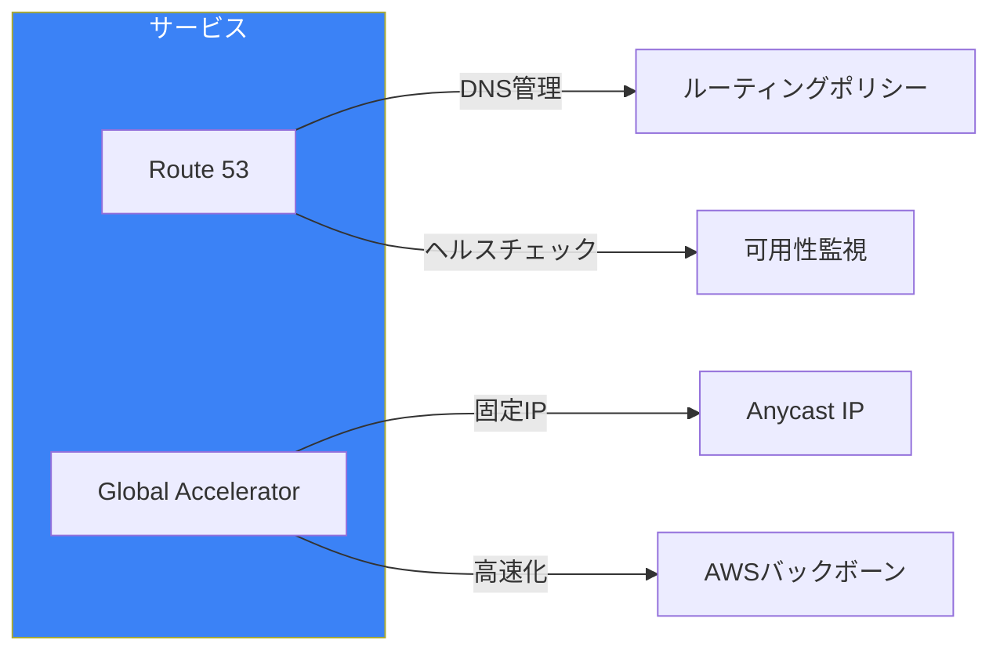

| 機能 | Route 53 | Global Accelerator |
|------|----------|-------------------|
| 主な用途 | DNS管理 | ネットワーク高速化 |
| フェイルオーバー | DNS TTL依存 | 即時 |
| 固定IP | ❌ | ✅ |
| コスト | 低い | 中程度 |

Route 53とGlobal Acceleratorを適切に組み合わせることで、グローバルに分散したアプリケーションの可用性とパフォーマンスを最大化できます。

## 参考資料

- [Amazon Route 53 Developer Guide](https://docs.aws.amazon.com/Route53/latest/DeveloperGuide/)
- [AWS Global Accelerator Developer Guide](https://docs.aws.amazon.com/global-accelerator/latest/dg/)
- [Routing Policy Comparison](https://docs.aws.amazon.com/Route53/latest/DeveloperGuide/routing-policy.html)
