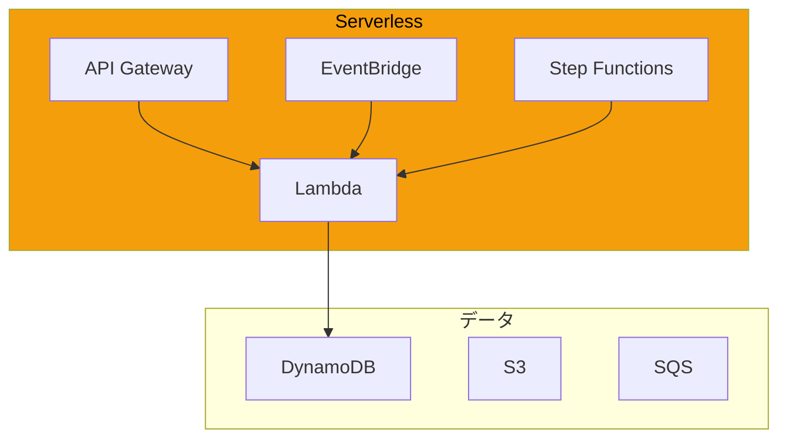
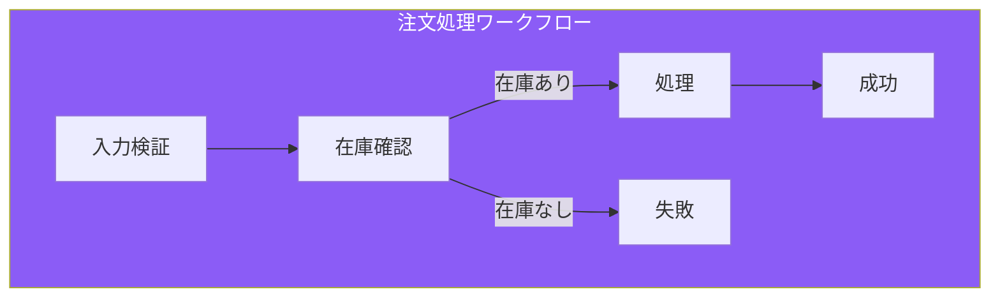
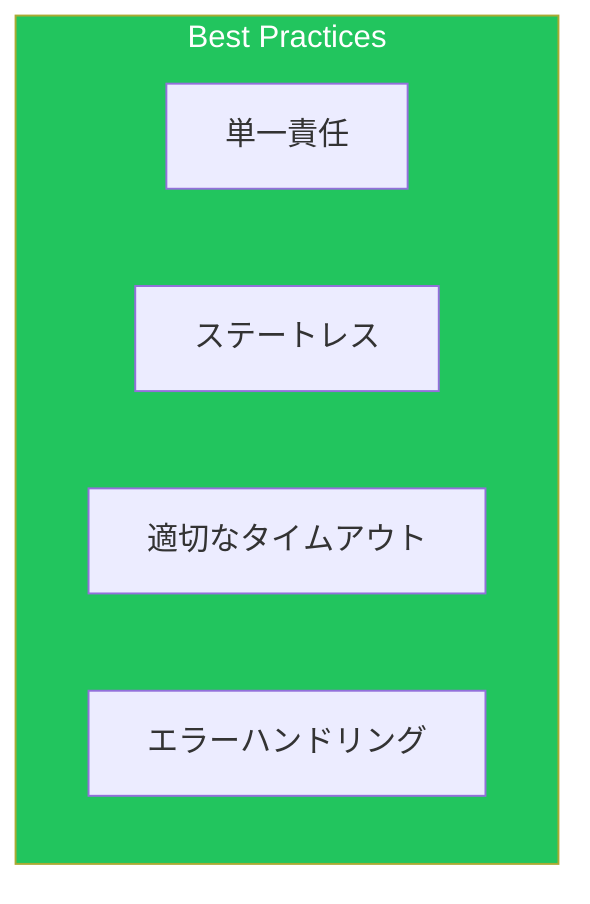

サーバーレスアーキテクチャは、インフラ管理なしでアプリケーションを構築できます。本記事では、実践的なサーバーレスパターンを解説します。

## サーバーレスアーキテクチャ



## Lambda設計パターン

### 関数構成

```python
import json
import boto3
from aws_lambda_powertools import Logger, Tracer, Metrics
from aws_lambda_powertools.event_handler import APIGatewayRestResolver
from aws_lambda_powertools.utilities.typing import LambdaContext

logger = Logger()
tracer = Tracer()
metrics = Metrics()
app = APIGatewayRestResolver()

dynamodb = boto3.resource('dynamodb')
table = dynamodb.Table('my-table')

@app.get("/users/<user_id>")
@tracer.capture_method
def get_user(user_id: str):
    response = table.get_item(Key={'user_id': user_id})
    if 'Item' not in response:
        return {"message": "User not found"}, 404
    return response['Item']

@app.post("/users")
@tracer.capture_method
def create_user():
    body = app.current_event.json_body
    table.put_item(Item=body)
    metrics.add_metric(name="UserCreated", unit="Count", value=1)
    return {"message": "User created"}, 201

@logger.inject_lambda_context
@tracer.capture_lambda_handler
@metrics.log_metrics
def lambda_handler(event: dict, context: LambdaContext):
    return app.resolve(event, context)
```

### SAMテンプレート

```yaml
AWSTemplateFormatVersion: '2010-09-09'
Transform: AWS::Serverless-2016-10-31

Globals:
  Function:
    Timeout: 30
    MemorySize: 256
    Runtime: python3.11
    Tracing: Active
    Environment:
      Variables:
        POWERTOOLS_SERVICE_NAME: my-service
        LOG_LEVEL: INFO

Resources:
  ApiFunction:
    Type: AWS::Serverless::Function
    Properties:
      CodeUri: src/
      Handler: app.lambda_handler
      Policies:
        - DynamoDBCrudPolicy:
            TableName: !Ref Table
      Events:
        GetUser:
          Type: Api
          Properties:
            Path: /users/{user_id}
            Method: get
        CreateUser:
          Type: Api
          Properties:
            Path: /users
            Method: post

  Table:
    Type: AWS::DynamoDB::Table
    Properties:
      BillingMode: PAY_PER_REQUEST
      AttributeDefinitions:
        - AttributeName: user_id
          AttributeType: S
      KeySchema:
        - AttributeName: user_id
          KeyType: HASH
```

### Lambdaレイヤー

```yaml
PowertoolsLayer:
  Type: AWS::Serverless::LayerVersion
  Properties:
    LayerName: powertools-layer
    ContentUri: layers/powertools/
    CompatibleRuntimes:
      - python3.11

CommonLayer:
  Type: AWS::Serverless::LayerVersion
  Properties:
    LayerName: common-layer
    ContentUri: layers/common/

ApiFunction:
  Type: AWS::Serverless::Function
  Properties:
    Layers:
      - !Ref PowertoolsLayer
      - !Ref CommonLayer
```

## API Gateway

### REST API設計

```yaml
RestApi:
  Type: AWS::ApiGateway::RestApi
  Properties:
    Name: my-api
    EndpointConfiguration:
      Types:
        - REGIONAL

UsersResource:
  Type: AWS::ApiGateway::Resource
  Properties:
    RestApiId: !Ref RestApi
    ParentId: !GetAtt RestApi.RootResourceId
    PathPart: users

GetUsersMethod:
  Type: AWS::ApiGateway::Method
  Properties:
    RestApiId: !Ref RestApi
    ResourceId: !Ref UsersResource
    HttpMethod: GET
    AuthorizationType: COGNITO_USER_POOLS
    AuthorizerId: !Ref CognitoAuthorizer
    RequestValidatorId: !Ref RequestValidator
    Integration:
      Type: AWS_PROXY
      IntegrationHttpMethod: POST
      Uri: !Sub arn:aws:apigateway:${AWS::Region}:lambda:path/2015-03-31/functions/${Function.Arn}/invocations

CognitoAuthorizer:
  Type: AWS::ApiGateway::Authorizer
  Properties:
    Name: CognitoAuthorizer
    Type: COGNITO_USER_POOLS
    RestApiId: !Ref RestApi
    IdentitySource: method.request.header.Authorization
    ProviderARNs:
      - !GetAtt UserPool.Arn
```

### HTTP API（軽量版）

```yaml
HttpApi:
  Type: AWS::Serverless::HttpApi
  Properties:
    StageName: prod
    CorsConfiguration:
      AllowOrigins:
        - "https://example.com"
      AllowMethods:
        - GET
        - POST
      AllowHeaders:
        - Content-Type
        - Authorization
    Auth:
      DefaultAuthorizer: OAuth2Authorizer
      Authorizers:
        OAuth2Authorizer:
          AuthorizationScopes:
            - email
          JwtConfiguration:
            issuer: !Sub https://cognito-idp.${AWS::Region}.amazonaws.com/${UserPool}
            audience:
              - !Ref UserPoolClient
```

## Step Functions

### ワークフロー定義



### ASL定義

```json
{
  "Comment": "Order Processing Workflow",
  "StartAt": "ValidateInput",
  "States": {
    "ValidateInput": {
      "Type": "Task",
      "Resource": "arn:aws:lambda:ap-northeast-1:xxx:function:validate",
      "Next": "CheckInventory",
      "Catch": [
        {
          "ErrorEquals": ["ValidationError"],
          "Next": "HandleValidationError"
        }
      ]
    },
    "CheckInventory": {
      "Type": "Task",
      "Resource": "arn:aws:states:::dynamodb:getItem",
      "Parameters": {
        "TableName": "inventory",
        "Key": {
          "product_id": {"S.$": "$.product_id"}
        }
      },
      "Next": "IsInStock",
      "ResultPath": "$.inventory"
    },
    "IsInStock": {
      "Type": "Choice",
      "Choices": [
        {
          "Variable": "$.inventory.Item.quantity.N",
          "NumericGreaterThan": 0,
          "Next": "ProcessOrder"
        }
      ],
      "Default": "OutOfStock"
    },
    "ProcessOrder": {
      "Type": "Parallel",
      "Branches": [
        {
          "StartAt": "UpdateInventory",
          "States": {
            "UpdateInventory": {
              "Type": "Task",
              "Resource": "arn:aws:lambda:ap-northeast-1:xxx:function:updateInventory",
              "End": true
            }
          }
        },
        {
          "StartAt": "SendNotification",
          "States": {
            "SendNotification": {
              "Type": "Task",
              "Resource": "arn:aws:states:::sns:publish",
              "Parameters": {
                "TopicArn": "arn:aws:sns:ap-northeast-1:xxx:orders",
                "Message.$": "$.order"
              },
              "End": true
            }
          }
        }
      ],
      "Next": "Success"
    },
    "Success": {
      "Type": "Succeed"
    },
    "OutOfStock": {
      "Type": "Fail",
      "Error": "OutOfStock",
      "Cause": "Product is out of stock"
    },
    "HandleValidationError": {
      "Type": "Fail",
      "Error": "ValidationError",
      "Cause": "Input validation failed"
    }
  }
}
```

### Express Workflow

```yaml
ExpressStateMachine:
  Type: AWS::Serverless::StateMachine
  Properties:
    Type: EXPRESS
    DefinitionUri: statemachine/definition.asl.json
    Logging:
      Level: ALL
      IncludeExecutionData: true
      Destinations:
        - CloudWatchLogsLogGroup:
            LogGroupArn: !GetAtt LogGroup.Arn
    Tracing:
      Enabled: true
    Events:
      ApiEvent:
        Type: Api
        Properties:
          Path: /process
          Method: post
```

## イベント駆動パターン

### EventBridge連携

```yaml
OrderEventBus:
  Type: AWS::Events::EventBus
  Properties:
    Name: orders

OrderCreatedRule:
  Type: AWS::Events::Rule
  Properties:
    EventBusName: !Ref OrderEventBus
    EventPattern:
      source:
        - orders.api
      detail-type:
        - OrderCreated
    Targets:
      - Id: ProcessOrder
        Arn: !GetAtt ProcessOrderFunction.Arn
      - Id: SendEmail
        Arn: !GetAtt SendEmailFunction.Arn
      - Id: UpdateAnalytics
        Arn: !GetAtt AnalyticsQueue.Arn
        SqsParameters:
          MessageGroupId: orders
```

### イベント発行

```python
import boto3
import json

eventbridge = boto3.client('events')

def publish_order_event(order):
    eventbridge.put_events(
        Entries=[
            {
                'Source': 'orders.api',
                'DetailType': 'OrderCreated',
                'Detail': json.dumps(order),
                'EventBusName': 'orders'
            }
        ]
    )
```

## エラーハンドリング

### DLQ設定

```yaml
ProcessFunction:
  Type: AWS::Serverless::Function
  Properties:
    DeadLetterQueue:
      Type: SQS
      TargetArn: !GetAtt DLQ.Arn
    EventInvokeConfig:
      MaximumEventAgeInSeconds: 300
      MaximumRetryAttempts: 2
      DestinationConfig:
        OnFailure:
          Destination: !GetAtt FailureQueue.Arn
        OnSuccess:
          Destination: !GetAtt SuccessTopic.Arn
```

## ベストプラクティス



| カテゴリ | 項目 |
|---------|------|
| 設計 | 単一責任の関数 |
| パフォーマンス | Provisioned Concurrency |
| 信頼性 | DLQ/リトライ設定 |
| 運用 | X-Rayトレーシング |

## まとめ

| サービス | 用途 |
|---------|------|
| Lambda | コンピュート |
| API Gateway | APIエンドポイント |
| Step Functions | オーケストレーション |
| EventBridge | イベント駆動 |

サーバーレスパターンを活用して、スケーラブルなアプリケーションを構築しましょう。

## 参考資料

- [AWS Lambda Developer Guide](https://docs.aws.amazon.com/lambda/latest/dg/)
- [AWS Step Functions Developer Guide](https://docs.aws.amazon.com/step-functions/latest/dg/)
- [Serverless Application Model](https://docs.aws.amazon.com/serverless-application-model/)
