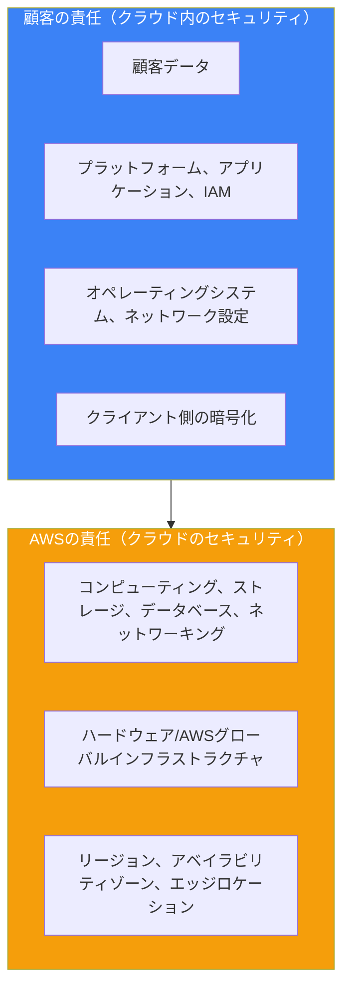
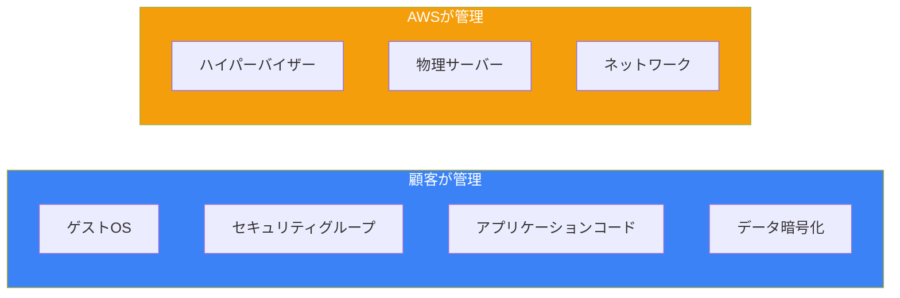
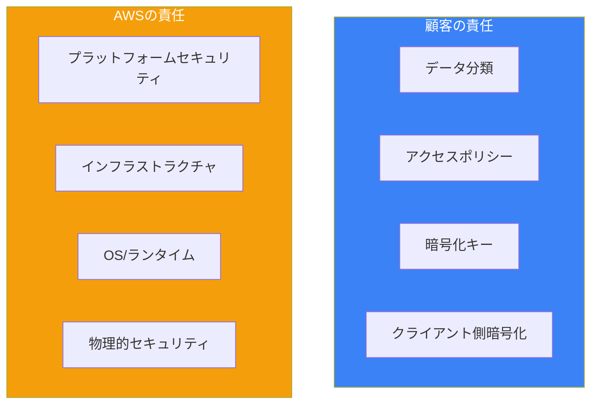
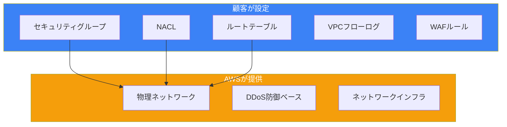
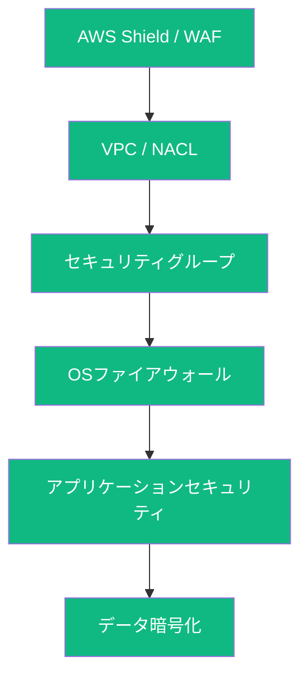

AWS責任共有モデルは、クラウドセキュリティを理解するための基礎的な概念です。AWSと顧客の間でセキュリティの責任を明確に定義しています。

## モデルの理解



## AWSの責任

AWSはすべてのAWSサービスを実行するインフラストラクチャの保護に責任を持ちます：

| コンポーネント | AWSの責任 |
|--------------|----------|
| 物理的セキュリティ | データセンター、施設、環境制御 |
| ハードウェア | サーバー、ストレージデバイス、ネットワーク機器 |
| ソフトウェア | ハイパーバイザー、マネージドサービスの基盤OS |
| ネットワーキング | 物理ネットワークインフラ、DDoS防御 |
| グローバルインフラ | リージョン、AZ、エッジロケーション |

```
AWSが管理するもの:
├── 物理データセンターセキュリティ
├── ハードウェアライフサイクル管理
├── ネットワークインフラストラクチャ
├── ハイパーバイザーと仮想化
└── マネージドサービスプラットフォーム
    ├── RDSデータベースエンジンのパッチ適用
    ├── Lambdaランタイムのメンテナンス
    └── S3インフラストラクチャ
```

## 顧客の責任

顧客はセキュリティ設定と管理に責任を持ちます：

| コンポーネント | 顧客の責任 |
|--------------|-----------|
| データ | 暗号化、分類、アクセス制御 |
| アプリケーション | コードセキュリティ、脆弱性管理 |
| アイデンティティ | IAMユーザー、ロール、ポリシー、MFA |
| オペレーティングシステム | パッチ適用、ハードニング（EC2の場合） |
| ネットワーク | セキュリティグループ、NACL、ルーティング |

## サービスタイプ別の責任

### インフラストラクチャサービス（EC2、VPC）



EC2インスタンスでは、顧客は大きな責任を持ちます：

```bash
# 顧客が管理すべきもの:
# 1. オペレーティングシステムの更新
sudo yum update -y

# 2. セキュリティソフトウェア
sudo yum install -y amazon-ssm-agent

# 3. アプリケーションのパッチ適用
# 4. ファイアウォール設定（セキュリティグループ）
# 5. インスタンス用IAMロール
```

### コンテナサービス（RDS、ECS）

マネージドコンテナサービスでは、AWSがより多くの責任を持ちます：

| 責任 | 担当 |
|-----|-----|
| データベースエンジンのパッチ | AWS |
| OSのパッチ適用 | AWS |
| データベース設定 | 顧客 |
| セキュリティグループ | 顧客 |
| データ暗号化 | 顧客 |
| バックアップ戦略 | 顧客 |

```python
# RDSの例 - 顧客がセキュリティを設定
import boto3

rds = boto3.client('rds')

# 顧客の責任: 暗号化、セキュリティグループ
response = rds.create_db_instance(
    DBInstanceIdentifier='my-database',
    DBInstanceClass='db.t3.micro',
    Engine='mysql',
    MasterUsername='admin',
    MasterUserPassword='secure-password',
    # 顧客が暗号化を有効化
    StorageEncrypted=True,
    KmsKeyId='arn:aws:kms:region:account:key/key-id',
    # 顧客がセキュリティグループを割り当て
    VpcSecurityGroupIds=['sg-12345678'],
    # 顧客がバックアップを設定
    BackupRetentionPeriod=7
)
```

### 抽象サービス（S3、Lambda、DynamoDB）

サーバーレスや抽象サービスでは、AWSがほとんどのインフラを管理します：



```python
# Lambdaの例 - 顧客のインフラ責任は最小限
import boto3

lambda_client = boto3.client('lambda')

# 顧客の責任: コードセキュリティ、IAMロール、環境変数
response = lambda_client.create_function(
    FunctionName='my-function',
    Runtime='python3.12',
    Role='arn:aws:iam::account:role/lambda-role',  # 顧客が管理
    Handler='index.handler',
    Code={'ZipFile': code_bytes},
    Environment={
        'Variables': {
            # シークレットをハードコードしない - Secrets Managerを使用
            'SECRET_ARN': 'arn:aws:secretsmanager:...'
        }
    },
    # 顧客がVPCアクセスを設定可能
    VpcConfig={
        'SubnetIds': ['subnet-123'],
        'SecurityGroupIds': ['sg-123']
    }
)
```

## S3セキュリティの責任

S3は責任共有を明確に示しています：

| 側面 | AWSの責任 | 顧客の責任 |
|-----|----------|-----------|
| インフラ | ストレージの耐久性、可用性 | - |
| アクセス制御 | - | バケットポリシー、ACL、IAM |
| 暗号化 | サーバー側暗号化メカニズム | 暗号化の有効化、キー管理 |
| データ | - | 分類、ライフサイクルポリシー |
| ログ | - | アクセスログ、CloudTrailの有効化 |

```json
// 顧客が管理するS3バケットポリシー
{
  "Version": "2012-10-17",
  "Statement": [
    {
      "Sid": "EnforceEncryption",
      "Effect": "Deny",
      "Principal": "*",
      "Action": "s3:PutObject",
      "Resource": "arn:aws:s3:::my-bucket/*",
      "Condition": {
        "StringNotEquals": {
          "s3:x-amz-server-side-encryption": "aws:kms"
        }
      }
    },
    {
      "Sid": "EnforceHTTPS",
      "Effect": "Deny",
      "Principal": "*",
      "Action": "s3:*",
      "Resource": [
        "arn:aws:s3:::my-bucket",
        "arn:aws:s3:::my-bucket/*"
      ],
      "Condition": {
        "Bool": {
          "aws:SecureTransport": "false"
        }
      }
    }
  ]
}
```

## ネットワークセキュリティの責任



### セキュリティグループ（顧客の責任）

```python
import boto3

ec2 = boto3.client('ec2')

# 顧客がセキュリティグループを作成・管理
response = ec2.create_security_group(
    GroupName='web-server-sg',
    Description='Webサーバー用セキュリティグループ',
    VpcId='vpc-12345678'
)

security_group_id = response['GroupId']

# 顧客がインバウンドルールを定義
ec2.authorize_security_group_ingress(
    GroupId=security_group_id,
    IpPermissions=[
        {
            'IpProtocol': 'tcp',
            'FromPort': 443,
            'ToPort': 443,
            'IpRanges': [{'CidrIp': '0.0.0.0/0'}]
        },
        {
            'IpProtocol': 'tcp',
            'FromPort': 22,
            'ToPort': 22,
            # SSHを既知のIPに制限
            'IpRanges': [{'CidrIp': '10.0.0.0/8'}]
        }
    ]
)
```

## コンプライアンスと監査

### AWSコンプライアンスプログラム

AWSは認証とコンプライアンスプログラムを維持しています：

- SOC 1, SOC 2, SOC 3
- ISO 27001, 27017, 27018
- PCI DSS Level 1
- HIPAA
- FedRAMP

### 顧客のコンプライアンス責任

```python
# AWS Configでコンプライアンスを監視
import boto3

config = boto3.client('config')

# 顧客がコンプライアンスルールを定義
response = config.put_config_rule(
    ConfigRule={
        'ConfigRuleName': 's3-bucket-encryption',
        'Description': 'S3バケットが暗号化されていることを確認',
        'Source': {
            'Owner': 'AWS',
            'SourceIdentifier': 'S3_BUCKET_SERVER_SIDE_ENCRYPTION_ENABLED'
        },
        'Scope': {
            'ComplianceResourceTypes': ['AWS::S3::Bucket']
        }
    }
)
```

## ベストプラクティス

### 1. 責任を理解する

```
使用する各AWSサービスについて:
├── AWSが管理するものを特定
├── 自分が管理すべきものを特定
├── セキュリティコントロールを文書化
└── モニタリングを実装
```

### 2. セキュリティ機能を有効化

```python
# 監査用にCloudTrailを有効化（顧客の責任）
import boto3

cloudtrail = boto3.client('cloudtrail')

response = cloudtrail.create_trail(
    Name='security-audit-trail',
    S3BucketName='my-cloudtrail-logs',
    IsMultiRegionTrail=True,
    EnableLogFileValidation=True,
    KMSKeyId='arn:aws:kms:region:account:key/key-id'
)

cloudtrail.start_logging(Name='security-audit-trail')
```

### 3. 多層防御を実装



## まとめ

| サービスタイプ | AWSの責任 | 顧客の責任 |
|--------------|----------|-----------|
| インフラ（EC2） | ハードウェア、ハイパーバイザー | OS、アプリ、データ、ネットワーク設定 |
| コンテナ（RDS） | OS、エンジンパッチ | データ、暗号化、アクセス |
| 抽象（Lambda、S3） | インフラ全般 | データ、アクセスポリシー、暗号化 |

重要なポイント：

- AWSはクラウドインフラを保護、あなたはその中に置くものを保護
- 責任はサービスタイプ（IaaS vs PaaS vs SaaS）によって異なる
- 常に暗号化、ログ、アクセス制御を有効化
- AWS Artifactを通じてAWSコンプライアンスレポートを使用
- 複数のセキュリティレイヤーで多層防御を実装
- セキュリティ設定を継続的に監視・監査

責任共有モデルの理解は、AWSセキュリティスペシャリティ認定と安全なクラウドアーキテクチャの構築に不可欠です。

## 参考文献

- [AWS Shared Responsibility Model](https://aws.amazon.com/compliance/shared-responsibility-model/)
- [AWS Compliance Programs](https://aws.amazon.com/compliance/programs/)
- Muñoz, Mauricio, et al. *AWS Certified Security Study Guide, 2nd Edition*. Wiley, 2025.
- Book, Adam, and Stuart Scott. *AWS Certified Security – Specialty (SCS-C02) Exam Guide*. Packt, 2024.
