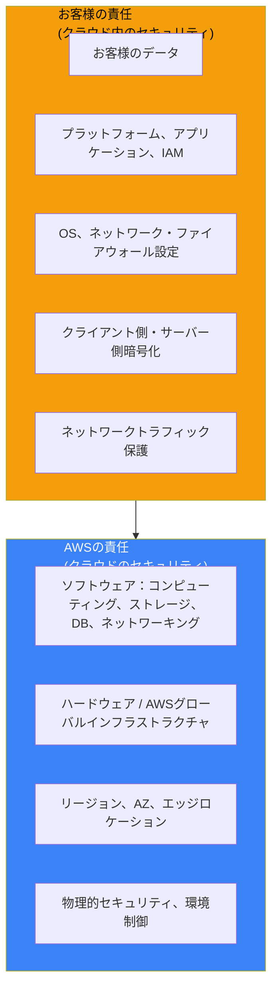
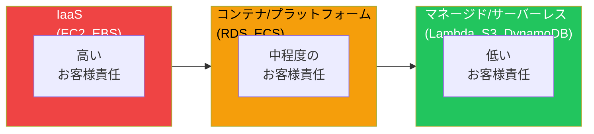
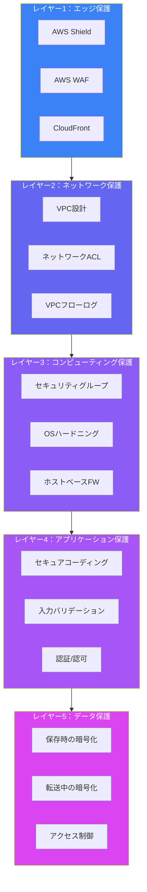

AWS責任共有モデルは、クラウドセキュリティを理解するための基本概念です。AWSのセキュリティサービスや設定に取り組む前に、まずこのモデルを理解する必要があります。このモデルは、クラウドにおけるセキュリティへのアプローチ全体を根本的に形作るものです。

## なぜ責任共有モデルが重要なのか

組織がクラウドに移行する際、「AWSがセキュリティを担当してくれる」という誤解がよく見られます。この誤解は数え切れないほどのデータ侵害やセキュリティインシデントの原因となってきました。実際はより複雑で、クラウドセキュリティはAWSとお客様のパートナーシップなのです。

次のたとえを考えてみてください。AWSは、施錠された入り口、防犯カメラ、火災抑制システムを備えた安全なマンションを提供します。しかし、あなたが部屋のドアを開けっ放しにしたり、見知らぬ人に鍵を渡したりすれば、建物のセキュリティはあなたを侵入から守ることはできません。建物の管理会社（AWS）は構造物を保護し、あなたは自分の部屋を保護するのです。

このモデルが存在する理由は、AWSはあなたのビジネス要件、コンプライアンスニーズ、どのようなデータを保存しているかを知ることができないからです。どのデータが機密であり、誰がアクセスすべきで、どの規制フレームワークが組織に適用されるかを知っているのは、あなただけです。

## 核心概念：クラウドの「OF」と「IN」

このモデルは責任を2つの明確なカテゴリに分けます：

**Security OF the Cloud（クラウドのセキュリティ）** — AWSは、すべてのAWSサービスを実行するインフラストラクチャの保護に責任を負います。これには、ハードウェア、ソフトウェア、ネットワーキング、施設が含まれます。

**Security IN the Cloud（クラウド内のセキュリティ）** — お客様は、使用するサービス内のセキュリティ設定、データ保護、アクセス管理に責任を負います。

## AWSが保護するもの：クラウドのセキュリティ

AWSはインフラストラクチャのセキュリティに年間数十億ドルを投資しています。AWSが何を保護しているかを理解することで、重要な部分にセキュリティの取り組みを集中させることができます。

### 物理的セキュリティ

AWSのデータセンターは世界で最も安全な施設の一つです：

- **場所の秘匿性**：データセンターの場所は公開されていません
- **多層的な境界制御**：フェンス、バリア、警備員、ビデオ監視
- **生体認証アクセス**：スタッフには複数の認証要素が必要
- **訪問者プロトコル**：許可された訪問者への厳格なエスコートポリシー
- **環境制御**：消火設備、空調管理、電源冗長化

AWSデータセンターにセキュリティ監査のために訪問することはできません。代わりに、AWSはAWS Artifactを通じて第三者監査レポートを提供し、SOC 2、ISO 27001、PCI DSSなどの基準への準拠を証明しています。

### ハードウェアとインフラストラクチャ

AWSは完全なハードウェアライフサイクルを管理します：

- **調達**：サーバー、ストレージ、ネットワーク機器の安全なサプライチェーン
- **展開**：機器が稼働する前にハードニングされた設定
- **メンテナンス**：お客様の関与なしにパッチ適用と更新
- **廃棄**：ハードウェア退役時の安全なデータ破壊

ストレージデバイスが寿命に達した場合、AWSはNIST 800-88基準を満たす技術を使用して、お客様のデータが復元できないようにします。

### ネットワークインフラストラクチャ

AWSグローバルネットワークは以下を提供します：

- **DDoS保護**：ネットワークエッジでの自動軽減
- **プライベート接続性**：お客様トラフィック用の分離されたネットワークパス
- **転送中の暗号化**：データセンター間を移動するデータの暗号化
- **ネットワーク監視**：脅威と異常の継続的な監視

### ハイパーバイザーと仮想化

EC2などのサービスでは、AWSがハイパーバイザー層を管理します：

- **分離**：お客様の仮想マシン間の厳格な分離
- **セキュリティパッチ**：お客様のダウンタイムなしの定期的な更新
- **Nitro System**：シリコンレベルでセキュリティを提供するカスタムハードウェア

Nitro Systemは特に重要です。多くの仮想化機能を専用のハードウェアとソフトウェアに移すことで、攻撃対象面を減らし、従来のハイパーバイザーに影響を与える脆弱性のクラスを防ぎます。

## お客様が保護するもの：クラウド内のセキュリティ

お客様の責任は、使用するAWSサービスによって異なります。このバリエーションを理解することは、セキュリティリソースを効果的に配分するために不可欠です。

### サービスモデルのスペクトラム

AWSサービスは、Infrastructure as a Service（IaaS）からフルマネージドサービスまでのスペクトラム上に位置します：

| サービスタイプ | 例 | お客様の責任レベル |
|--------------|----------|------------------------------|
| IaaS | EC2、EBS | 高い - ハイパーバイザー上のほぼすべてを管理 |
| コンテナ/プラットフォーム | RDS、ECS、Elastic Beanstalk | 中程度 - AWSがOSとプラットフォームを管理、データとアクセスは管理 |
| マネージド/サーバーレス | Lambda、S3、DynamoDB | 低い - データとアクセスポリシーに集中 |

これはサーバーレスが「より安全」という意味ではありません。セキュリティモデルが異なるということです。パブリックアクセスポリシーを持つS3バケットは、AWSが基盤インフラストラクチャを管理していても、依然としてお客様の責任です。

### インフラストラクチャサービス：EC2の例

EC2インスタンスを起動すると、重大な責任を受け入れることになります：

**オペレーティングシステム**：AMIを選択し、すべてのOSレベルのセキュリティに責任を負います：
- セキュリティパッチのインストール
- 設定のハードニング
- ローカルユーザーと権限の管理
- ホストベースのファイアウォールの設定

**アプリケーション**：インストールするソフトウェアはすべてお客様の責任です：
- セキュアコーディングプラクティス
- アプリケーションレベルの認証
- 脆弱性管理
- 依存関係の更新

**ネットワーク設定**：インスタンスへのトラフィックの到達方法を制御します：
- セキュリティグループルール（インスタンスレベルのファイアウォール）
- ネットワークACLルール（サブネットレベルのファイアウォール）
- VPCルーティングと接続性

**データ**：保存するすべてのものがお客様の責任です：
- 保存時の暗号化（EBS暗号化、ファイルレベルの暗号化）
- 転送中の暗号化（TLS/SSL）
- アクセス制御と権限
- バックアップとリカバリ戦略

### マネージドサービス：RDSの例

Amazon RDSでは、責任が移行します：

**AWSが管理**：
- データベースエンジンのインストール
- OSのパッチ適用と更新
- ハードウェア障害と交換
- 自動バックアップ（有効な場合）

**お客様が管理**：
- データベースの設定とチューニング
- ユーザーアカウントと権限
- セキュリティグループの設定
- 暗号化設定（有効にする必要があります）
- データの分類と取り扱い
- アプリケーションレベルのクエリとセキュリティ

重要なポイント：AWSがデータベースエンジンを管理していても、アプリケーションのSQLインジェクション脆弱性は依然としてお客様の問題です。AWSは不適切に書かれたアプリケーションコードからお客様を保護することはできません。

### サーバーレスサービス：S3とLambda

S3やLambdaのようなサービスでは、AWSがほぼすべてのインフラストラクチャを管理します：

**AWSが管理**：
- サーバーのプロビジョニングとスケーリング
- オペレーティングシステムとランタイム
- 可用性と耐久性
- データの物理的セキュリティ

**お客様が管理**：
- アクセスポリシー（誰が何にアクセスできるか）
- データ暗号化（キーの選択と管理）
- アプリケーションコード（Lambdaの場合）
- イベント設定とトリガー
- モニタリングとロギングの有効化

### S3セキュリティの現実

S3は責任共有の実践における優れた例です。AWSは世界クラスの耐久性（イレブンナイン）と可用性を提供しますが、最も一般的なS3セキュリティインシデントはお客様が原因です：

- **過度に寛容なバケットポリシー**：誤ってデータを公開
- **無効な暗号化**：サーバー側暗号化を有効にしていない
- **アクセスログの欠如**：誰が何にアクセスしたかの監査証跡がない
- **制御されていないクロスアカウントアクセス**：範囲が広すぎるリソースポリシー

AWSは支援するツール（S3 Block Public Access、Access Analyzer）を提供していますが、有効化と設定はお客様が行う必要があります。

## 共有コントロール：グレーゾーン

一部のセキュリティコントロールはAWSとお客様の間で共有されます：

### パッチ管理

- **AWS**：インフラストラクチャ、ハイパーバイザー、マネージドサービスプラットフォームにパッチを適用
- **お客様**：ゲストオペレーティングシステム、アプリケーション、自己管理データベースにパッチを適用

### 構成管理

- **AWS**：インフラストラクチャデバイスの構成を維持
- **お客様**：オペレーティングシステム、アプリケーション、データベース、セキュリティツールを構成

### 意識向上とトレーニング

- **AWS**：AWS従業員にセキュリティプラクティスをトレーニング
- **お客様**：従業員に安全なAWS使用法をトレーニング

### 物理的・環境的

- **AWS**：データセンターの物理的・環境的セキュリティを提供
- **お客様**：AWSに接続するオンプレミス機器の物理的・環境的セキュリティを提供

## よくある誤解

### 「AWSがデータセキュリティに責任を負う」

誤りです。AWSはストレージインフラストラクチャのセキュリティに責任を負います。保存するものと誰がアクセスできるかはお客様の責任です。暗号化されていないPIIをパブリックS3バケットに保存した場合、それはAWSの失敗ではなく、お客様の失敗です。

### 「マネージドサービスを使えばセキュリティを心配しなくてよい」

誤りです。マネージドサービスは運用負担を軽減しますが、安全に構成する必要があります。弱いデータベース認証情報を持つRDSインスタンスは、AWSが基盤インフラストラクチャをいかに適切に管理しても、依然として脆弱です。

### 「AWSのコンプライアンス認証がワークロードをカバーする」

部分的に正しいです。AWSのコンプライアンス認証（SOC 2、PCI DSS、HIPAA）はAWSインフラストラクチャをカバーします。しかし、ワークロードはインフラストラクチャ部分のコンプライアンスのみを継承します。アプリケーションとデータ処理プラクティスのコンプライアンスは依然として実装し、証明する必要があります。

### 「AWSのセキュリティを監査できない」

ほとんど誤りです。AWSデータセンターの独自の物理監査を実施することはできませんが、AWSはAWS Artifactを通じて広範なコンプライアンス文書を提供しています。AWSのセキュリティコントロールを証明する第三者監査レポート、認証、証明書にアクセスできます。

## 実践でのモデル実装

### ステップ1：サービスを理解する

使用する各AWSサービスについて、以下を文書化します：
- そのサービスでAWSが管理するもの
- 管理しなければならないもの
- 利用可能なセキュリティコントロール
- 利用可能なモニタリングとロギングオプション

### ステップ2：セキュリティ機能を有効にする

多くのAWSセキュリティ機能は利用可能ですが、デフォルトでは有効になっていません：
- S3 Block Public Access（アカウントおよびバケットレベル）
- デフォルトでのEBS暗号化
- RDS暗号化
- CloudTrailロギング
- VPCフローログ

### ステップ3：多層防御を実装する

セキュリティコントロールは階層化すべきです：

### ステップ4：モニタリングと監査

継続的なモニタリングにより、セキュリティコントロールが効果的であることを検証します：
- **AWS CloudTrail**：監査用のAPI呼び出しを記録
- **AWS Config**：構成変更とコンプライアンスを追跡
- **Amazon GuardDuty**：脅威と異常を検出
- **AWS Security Hub**：セキュリティ検出結果を集約

## コンプライアンスへの影響

責任共有モデルを理解することは、コンプライアンスにとって不可欠です：

### コンプライアンス責任

| フレームワーク | AWSの責任 | お客様の責任 |
|-----------|-------------------|---------------------|
| PCI DSS | 物理的セキュリティ、ネットワーク分離 | カード会員データの取り扱い、アクセス制御 |
| HIPAA | インフラストラクチャコントロール | PHI暗号化、アクセスログ、BAA |
| SOC 2 | インフラストラクチャコントロール | アプリケーションコントロール、アクセス管理 |
| GDPR | 準拠リージョンのインフラストラクチャ | データ処理、同意、保持 |

### AWS Artifactの使用

AWS ArtifactはAWSコンプライアンスレポートへのアクセスを提供します：
- SOC 1、2、3レポート
- PCI DSSコンプライアンス証明
- ISO認証
- その他の地域および業界認証

これらのレポートは、AWSが責任共有モデルの自社部分を満たしていることを証明します。お客様の部分をどのように満たしているかは、お客様が証明する必要があります。

## まとめ

AWS責任共有モデルは単なるコンプライアンス概念ではなく、実用的なクラウドセキュリティの基盤です：

- **AWSはクラウドインフラストラクチャを保護**し、お客様はその中に構築・保存するものを保護
- **責任はサービスタイプによって異なる**：IaaSはマネージドサービスよりも多くのお客様の取り組みが必要
- **ほとんどのクラウドセキュリティインシデント**はAWSの障害ではなく、お客様の設定ミス
- **コンプライアンスは共有**：AWS認証はインフラストラクチャをカバーし、アプリケーションとデータはお客様が対応
- **セキュリティ機能は存在する**が、多くの場合、明示的に有効化と設定が必要

このモデルを理解することは、安全なAWSアーキテクチャを構築するための第一歩です。IAM、VPC、暗号化、モニタリングなど、他のすべてのAWSセキュリティトピックは、この基盤の上に構築されています。

## 参考資料

- [AWS責任共有モデル](https://aws.amazon.com/jp/compliance/shared-responsibility-model/)
- [AWS Well-Architected Framework - セキュリティの柱](https://docs.aws.amazon.com/ja_jp/wellarchitected/latest/security-pillar/welcome.html)
- [AWSコンプライアンスプログラム](https://aws.amazon.com/jp/compliance/programs/)
- Crane, Dylan. *AWS Security*. Manning Publications, 2022.
- Muñoz, Mauricio, et al. *Mastering AWS Security, 2nd Edition*. Packt, 2024.
