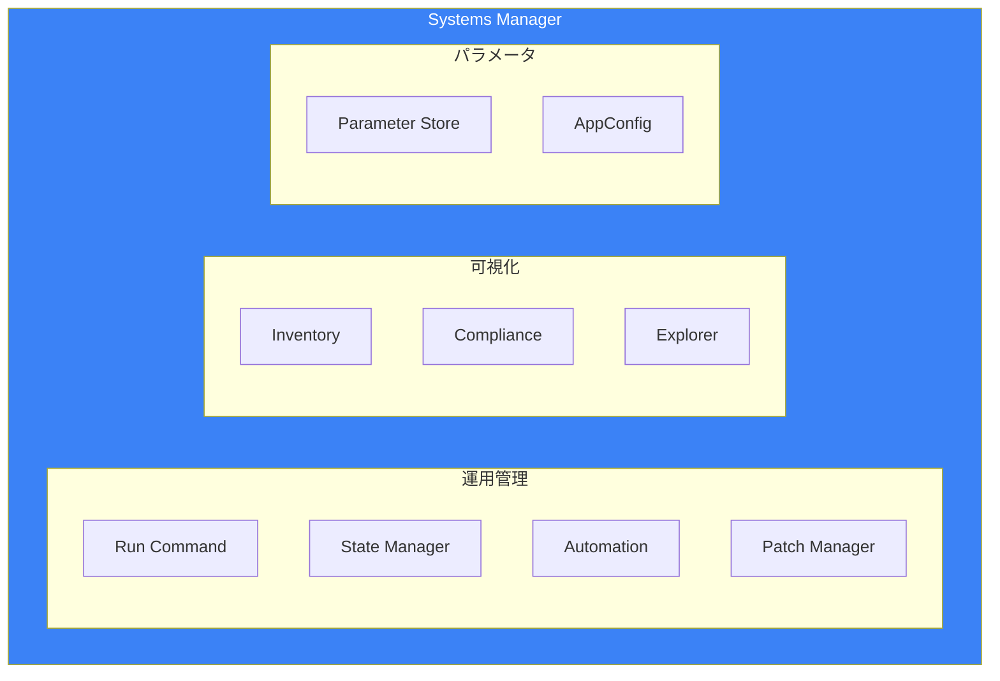
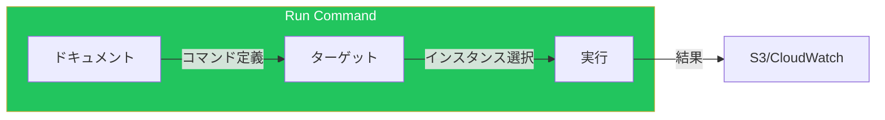
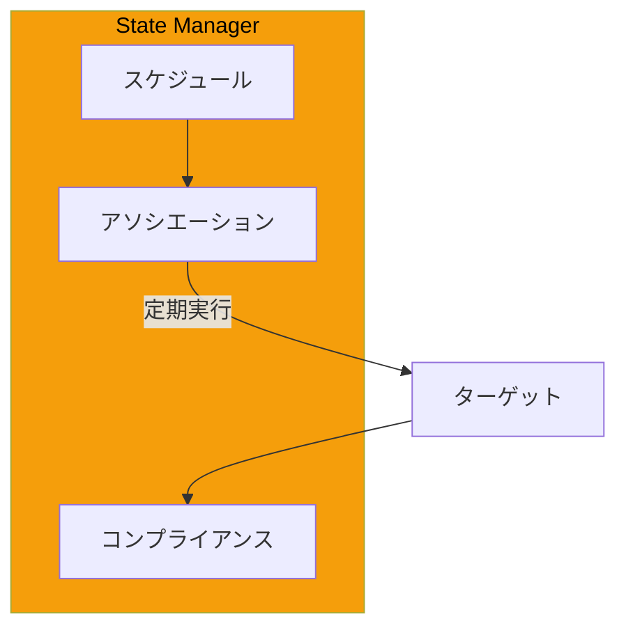
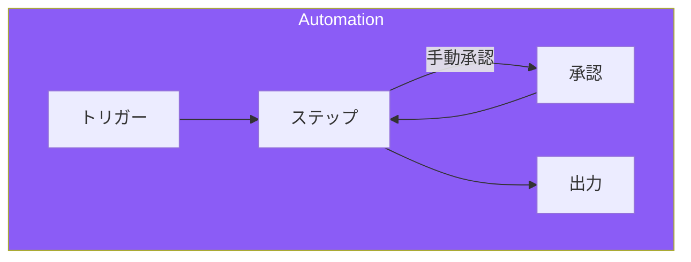
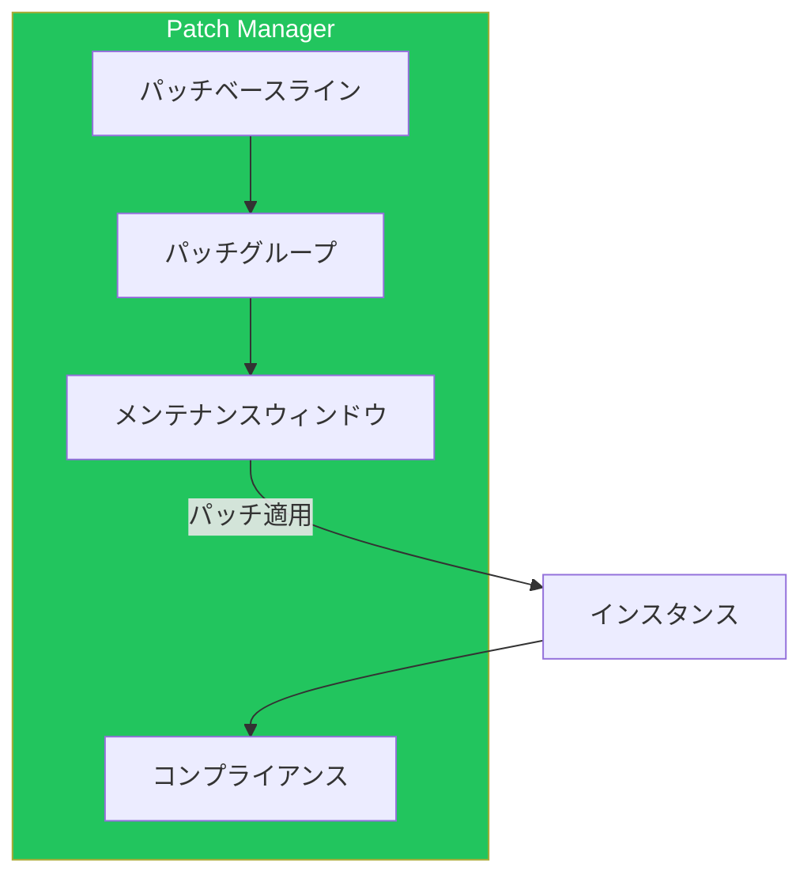
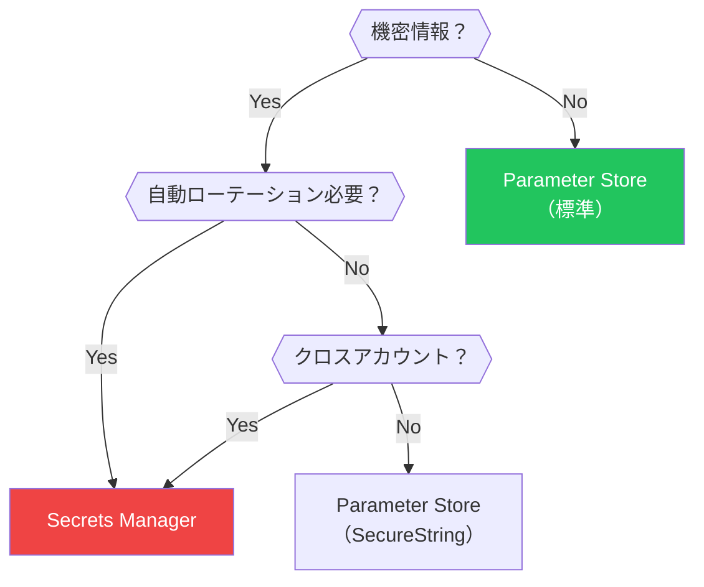
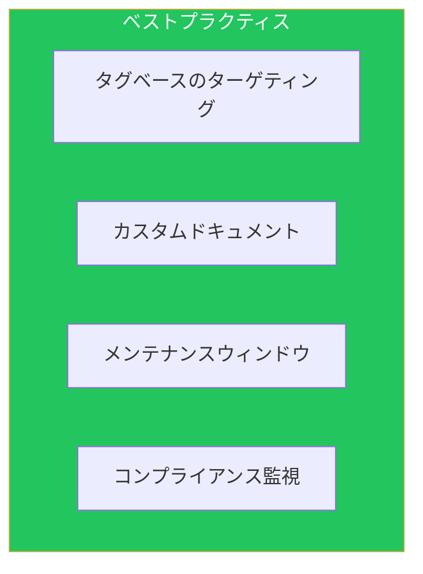

AWS Systems Managerは、AWS環境とオンプレミスの運用を統合管理するサービスです。本記事では、[オペレーショナルエクセレンス記事](/blog/aws-operational-excellence)で触れなかった詳細機能を解説します。

## Systems Manager概要

### 主要機能



## Run Command

### コマンドドキュメント



### AWS提供ドキュメント

| ドキュメント | 用途 |
|-------------|------|
| AWS-RunShellScript | Linuxシェルスクリプト実行 |
| AWS-RunPowerShellScript | PowerShellスクリプト実行 |
| AWS-RunPatchBaseline | パッチ適用 |
| AWS-ConfigureAWSPackage | パッケージインストール |
| AWS-UpdateSSMAgent | エージェント更新 |

### 実行例

```bash
# シェルスクリプト実行
aws ssm send-command \
    --document-name "AWS-RunShellScript" \
    --targets "Key=tag:Environment,Values=production" \
    --parameters '{"commands":["#!/bin/bash","yum update -y","systemctl restart httpd"]}' \
    --timeout-seconds 600 \
    --max-concurrency "50%" \
    --max-errors "10%"

# 結果確認
aws ssm list-command-invocations \
    --command-id "command-id" \
    --details
```

### カスタムドキュメント

```yaml
schemaVersion: '2.2'
description: 'Deploy application'
parameters:
  Version:
    type: String
    description: Application version
  S3Bucket:
    type: String
    description: S3 bucket containing artifacts

mainSteps:
  - action: aws:runShellScript
    name: stopService
    inputs:
      runCommand:
        - systemctl stop myapp || true

  - action: aws:downloadContent
    name: downloadArtifact
    inputs:
      sourceType: S3
      sourceInfo: '{"path":"https://{{S3Bucket}}.s3.amazonaws.com/releases/{{Version}}/app.tar.gz"}'
      destinationPath: /tmp/app.tar.gz

  - action: aws:runShellScript
    name: deployApplication
    inputs:
      runCommand:
        - tar -xzf /tmp/app.tar.gz -C /opt/myapp
        - chown -R myapp:myapp /opt/myapp
        - systemctl start myapp

  - action: aws:runShellScript
    name: validateDeployment
    inputs:
      runCommand:
        - |
          for i in {1..30}; do
            if curl -s http://localhost:8080/health | grep -q "ok"; then
              echo "Application is healthy"
              exit 0
            fi
            sleep 2
          done
          echo "Health check failed"
          exit 1
```

## State Manager

### 概要



### アソシエーション作成

```yaml
# CloudFormation
StateManagerAssociation:
  Type: AWS::SSM::Association
  Properties:
    Name: AWS-ConfigureAWSPackage
    AssociationName: InstallCloudWatchAgent
    Targets:
      - Key: tag:Environment
        Values:
          - production
          - staging
    Parameters:
      action:
        - Install
      name:
        - AmazonCloudWatchAgent
    ScheduleExpression: rate(1 day)
    MaxConcurrency: 50%
    MaxErrors: 10%
    ComplianceSeverity: MEDIUM
    OutputLocation:
      S3Location:
        OutputS3BucketName: !Ref LogBucket
        OutputS3KeyPrefix: state-manager/
```

### 設定管理の例

```yaml
schemaVersion: '2.2'
description: 'Ensure security baseline'
mainSteps:
  - action: aws:runShellScript
    name: configureSSH
    inputs:
      runCommand:
        - |
          # SSH設定の強化
          sed -i 's/#PermitRootLogin yes/PermitRootLogin no/' /etc/ssh/sshd_config
          sed -i 's/#PasswordAuthentication yes/PasswordAuthentication no/' /etc/ssh/sshd_config
          systemctl restart sshd

  - action: aws:runShellScript
    name: configureSysctl
    inputs:
      runCommand:
        - |
          cat <<EOF > /etc/sysctl.d/99-security.conf
          net.ipv4.ip_forward = 0
          net.ipv4.conf.all.accept_redirects = 0
          net.ipv4.conf.default.accept_redirects = 0
          EOF
          sysctl --system

  - action: aws:runShellScript
    name: enableAuditd
    inputs:
      runCommand:
        - yum install -y audit
        - systemctl enable auditd
        - systemctl start auditd
```

## Automation

### Automationドキュメント構造



### アクションタイプ

| アクション | 用途 |
|-----------|------|
| aws:executeScript | Python/PowerShellスクリプト |
| aws:executeAwsApi | AWS API呼び出し |
| aws:runCommand | Run Command実行 |
| aws:approve | 手動承認 |
| aws:branch | 条件分岐 |
| aws:sleep | 待機 |
| aws:changeInstanceState | インスタンス状態変更 |

### 複雑なAutomationドキュメント

```yaml
schemaVersion: '0.3'
description: 'Blue-Green deployment automation'
assumeRole: '{{AutomationAssumeRole}}'
parameters:
  AutomationAssumeRole:
    type: String
  NewAMI:
    type: String
  AutoScalingGroupName:
    type: String
  ApprovalRequired:
    type: String
    default: 'true'

mainSteps:
  - name: createNewLaunchTemplate
    action: aws:executeAwsApi
    inputs:
      Service: ec2
      Api: CreateLaunchTemplateVersion
      LaunchTemplateId: '{{LaunchTemplateId}}'
      SourceVersion: '$Latest'
      LaunchTemplateData:
        ImageId: '{{NewAMI}}'
    outputs:
      - Name: NewVersionNumber
        Selector: $.LaunchTemplateVersion.VersionNumber
        Type: Integer

  - name: updateAutoScalingGroup
    action: aws:executeAwsApi
    inputs:
      Service: autoscaling
      Api: UpdateAutoScalingGroup
      AutoScalingGroupName: '{{AutoScalingGroupName}}'
      LaunchTemplate:
        LaunchTemplateId: '{{LaunchTemplateId}}'
        Version: '{{createNewLaunchTemplate.NewVersionNumber}}'

  - name: startInstanceRefresh
    action: aws:executeAwsApi
    inputs:
      Service: autoscaling
      Api: StartInstanceRefresh
      AutoScalingGroupName: '{{AutoScalingGroupName}}'
      Strategy: Rolling
      Preferences:
        MinHealthyPercentage: 90
        InstanceWarmup: 300
    outputs:
      - Name: InstanceRefreshId
        Selector: $.InstanceRefreshId
        Type: String

  - name: waitForRefreshComplete
    action: aws:waitForAwsResourceProperty
    timeoutSeconds: 3600
    inputs:
      Service: autoscaling
      Api: DescribeInstanceRefreshes
      AutoScalingGroupName: '{{AutoScalingGroupName}}'
      InstanceRefreshIds:
        - '{{startInstanceRefresh.InstanceRefreshId}}'
      PropertySelector: $.InstanceRefreshes[0].Status
      DesiredValues:
        - Successful

  - name: approvalGate
    action: aws:approve
    onFailure: Abort
    inputs:
      NotificationArn: '{{SNSTopicArn}}'
      Message: 'Deployment completed. Please verify and approve.'
      MinRequiredApprovals: 1
      Approvers:
        - '{{ApproverArn}}'
```

### EventBridge連携

```yaml
# Config非準拠時の自動修復
AutoRemediationRule:
  Type: AWS::Events::Rule
  Properties:
    EventPattern:
      source:
        - aws.config
      detail-type:
        - Config Rules Compliance Change
      detail:
        configRuleName:
          - s3-bucket-public-read-prohibited
        newEvaluationResult:
          complianceType:
            - NON_COMPLIANT
    Targets:
      - Id: TriggerRemediation
        Arn: !Sub arn:aws:ssm:${AWS::Region}:${AWS::AccountId}:automation-definition/RemediateS3PublicAccess
        RoleArn: !GetAtt EventBridgeRole.Arn
        InputTransformer:
          InputPathsMap:
            resourceId: $.detail.resourceId
          InputTemplate: '{"BucketName": [<resourceId>]}'
```

## Patch Manager

### パッチベースライン



### カスタムベースライン

```yaml
CustomPatchBaseline:
  Type: AWS::SSM::PatchBaseline
  Properties:
    Name: CustomLinuxBaseline
    Description: Custom patch baseline for production
    OperatingSystem: AMAZON_LINUX_2023
    ApprovalRules:
      PatchRules:
        - PatchFilterGroup:
            PatchFilters:
              - Key: CLASSIFICATION
                Values:
                  - Security
                  - Bugfix
              - Key: SEVERITY
                Values:
                  - Critical
                  - Important
          ApproveAfterDays: 7
          ComplianceLevel: CRITICAL
          EnableNonSecurity: false
        - PatchFilterGroup:
            PatchFilters:
              - Key: CLASSIFICATION
                Values:
                  - Enhancement
          ApproveAfterDays: 14
          ComplianceLevel: MEDIUM
    ApprovedPatches:
      - 'kernel-*'
    RejectedPatches:
      - 'kernel-debug-*'
    RejectedPatchesAction: BLOCK
    GlobalFilters:
      PatchFilters:
        - Key: PRODUCT
          Values:
            - AmazonLinux2023
```

### メンテナンスウィンドウ

```yaml
MaintenanceWindow:
  Type: AWS::SSM::MaintenanceWindow
  Properties:
    Name: WeeklyPatching
    Schedule: cron(0 2 ? * SUN *)  # 毎週日曜2:00
    Duration: 4
    Cutoff: 1
    AllowUnassociatedTargets: false

MaintenanceWindowTarget:
  Type: AWS::SSM::MaintenanceWindowTarget
  Properties:
    WindowId: !Ref MaintenanceWindow
    ResourceType: INSTANCE
    Targets:
      - Key: tag:PatchGroup
        Values:
          - production

MaintenanceWindowTask:
  Type: AWS::SSM::MaintenanceWindowTask
  Properties:
    WindowId: !Ref MaintenanceWindow
    TaskArn: AWS-RunPatchBaseline
    TaskType: RUN_COMMAND
    Targets:
      - Key: WindowTargetIds
        Values:
          - !Ref MaintenanceWindowTarget
    TaskInvocationParameters:
      MaintenanceWindowRunCommandParameters:
        Parameters:
          Operation:
            - Install
          RebootOption:
            - RebootIfNeeded
        CloudWatchOutputConfig:
          CloudWatchLogGroupName: /aws/ssm/patch-manager
          CloudWatchOutputEnabled: true
    Priority: 1
    MaxConcurrency: 25%
    MaxErrors: 10%
```

## Inventory

### インベントリ収集

```yaml
InventoryAssociation:
  Type: AWS::SSM::Association
  Properties:
    Name: AWS-GatherSoftwareInventory
    AssociationName: GatherInventory
    Targets:
      - Key: InstanceIds
        Values:
          - '*'
    ScheduleExpression: rate(12 hours)
    Parameters:
      applications:
        - Enabled
      awsComponents:
        - Enabled
      networkConfig:
        - Enabled
      windowsUpdates:
        - Enabled
      services:
        - Enabled
      customInventory:
        - Enabled
```

### カスタムインベントリ

```bash
# カスタムインベントリの登録
aws ssm put-inventory \
    --instance-id i-1234567890abcdef0 \
    --items '[{
        "TypeName": "Custom:ApplicationConfig",
        "SchemaVersion": "1.0",
        "CaptureTime": "2024-01-15T00:00:00Z",
        "Content": [{
            "ApplicationName": "MyApp",
            "Version": "1.2.3",
            "ConfigFile": "/etc/myapp/config.yaml",
            "LastModified": "2024-01-14T12:00:00Z"
        }]
    }]'
```

## Parameter Store vs Secrets Manager

### 比較

| 機能 | Parameter Store | Secrets Manager |
|------|----------------|-----------------|
| 料金 | 無料（標準）/有料（アドバンスト） | 有料 |
| ローテーション | 手動 | 自動 |
| クロスアカウント | 困難 | 容易 |
| 最大サイズ | 8KB（アドバンスト） | 64KB |
| バージョニング | あり | あり |

### 使い分け



## ベストプラクティス



| カテゴリ | 項目 |
|---------|------|
| 運用 | タグベースでターゲット管理 |
| 自動化 | Automationで複雑なワークフロー |
| パッチ | ベースラインとウィンドウで計画的適用 |
| 可視性 | Inventoryで資産管理 |

## まとめ

| 機能 | 用途 |
|------|------|
| Run Command | アドホックなコマンド実行 |
| State Manager | 継続的な設定管理 |
| Automation | 複雑なワークフロー自動化 |
| Patch Manager | パッチ管理 |
| Inventory | 資産管理 |

Systems Managerの機能を活用することで、大規模環境の運用を効率化できます。

## 参考資料

- [AWS Systems Manager User Guide](https://docs.aws.amazon.com/systems-manager/latest/userguide/)
- [SSM Document Reference](https://docs.aws.amazon.com/systems-manager/latest/userguide/sysman-doc-syntax.html)
- [Automation Actions Reference](https://docs.aws.amazon.com/systems-manager/latest/userguide/automation-actions.html)
