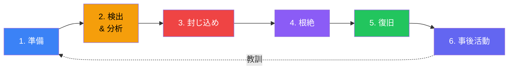
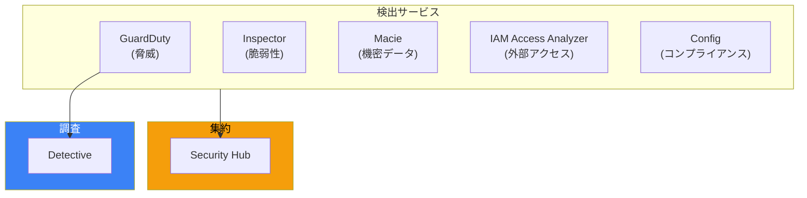

予防は不可欠ですが、予防だけでは不十分です。セキュリティコントロールをどれだけ適切に設定しても、侵害は発生する可能性があります—ゼロデイ脆弱性、ソーシャルエンジニアリング、内部者の脅威、設定ミスを通じて。迅速に回復する組織と壊滅的な被害を受ける組織を分けるのは、脅威を迅速に検出し効果的に対応する能力です。

## なぜ脅威検出が重要なのか

### 侵害の前提

現代のセキュリティ思考は、あなたが侵害されるという前提から始まります。これは悲観主義ではなく、現実主義です。十分な時間とリソースがあれば、決意のある攻撃者は侵入方法を見つけることができます。問題は侵害されるかどうかではなく、それがいつ起きるかを知ることができるかどうかです。

すでに侵害されていると仮定する組織は：
- 予防だけでなく検出に焦点を当てる
- セグメンテーションを通じて爆発半径を制限する
- インシデントが発生する前にインシデント対応を練習する
- 調査のためのフォレンジック能力を維持する

### 検出ウィンドウ

初期侵害から検出までの時間は「滞留時間」と呼ばれます。業界調査は一貫して、滞留時間が数ヶ月単位であることを示しています。この期間中、攻撃者は：
- 永続的なアクセスを確立（バックドア、追加アカウント）
- より価値のあるターゲットに横方向に移動
- アラートをトリガーしないようにゆっくりとデータを流出
- より壊滅的な攻撃の準備

滞留時間を短縮することは、あなたができる最もインパクトのあるセキュリティ改善の1つです。AWSはこの目的のために特別に設計されたサービスを提供しています。

## Amazon GuardDuty：インテリジェントな脅威検出

GuardDutyはAWSのマネージド脅威検出サービスです。複数のソースからデータを継続的に分析し、不審なアクティビティを特定します。

### GuardDutyが分析するもの

GuardDutyは以下を取り込み分析します：

**CloudTrailイベント**：AWSアカウント全体のAPI呼び出し。GuardDutyは異常を探します—異常なAPIパターン、予期しない場所からの呼び出し、または既知の攻撃シグネチャ。

**VPC Flow Logs**：ネットワークトラフィックメタデータ。GuardDutyは偵察活動、既知の悪意のあるIPアドレスとの通信、異常なデータ転送パターンを特定します。

**DNSログ**：ドメイン解決リクエスト。GuardDutyはコマンドアンドコントロールドメインや暗号通貨マイニングプールとの通信を検出します。

**EKS監査ログ**：Kubernetes APIサーバーログ。GuardDutyは不審なコンテナアクティビティ、特権昇格、異常なクラスター動作を特定します。

**S3データイベント**：オブジェクトレベルの操作。GuardDutyはデータ流出を示す可能性のある異常なアクセスパターンを検出します。

### GuardDutyが脅威を検出する方法

GuardDutyは複数の検出方法を使用します：

**シグネチャベースの検出**：既知の攻撃パターンとのマッチング—マルウェアに関連するIPとの通信、暗号通貨マイニング活動、または既知の攻撃技術。

**異常検出**：機械学習が環境の正常な動作のベースラインを確立します。アクティビティが正常から大幅に逸脱すると、GuardDutyは検出結果を生成します。これにより、既知のシグネチャに一致しない新しい攻撃をキャッチします。

**脅威インテリジェンス**：AWSの脅威インテリジェンスとサードパーティフィードとの統合により、既知の悪意のあるインフラとの通信を特定します。

### 検出結果の重大度を理解する

GuardDutyは検出結果を重大度別に分類します：

**クリティカル（9.0以上）**：即時対応が必要。アクティブな侵害またはデータ流出が進行中。すべてを中断して対応。

**高（7.0-8.9）**：迅速な対応が必要な重大な脅威。誤検知ではなく、実際の悪意のあるアクティビティを示している可能性が高い。

**中（4.0-6.9）**：調査が必要な不審なアクティビティ。正当なアクティビティまたは攻撃の初期段階かもしれない。

**低（1.0-3.9）**：潜在的に懸念されるが、しばしば良性。パターンを監視。

### 一般的な検出結果タイプ

GuardDutyが何を検出するかを理解することで、適切に対応できます：

**認証情報関連**：異常な場所からのアクセスキー使用、不審なIPからのコンソールログイン、予期しないパターンでのルートアカウント使用。

**ネットワーク関連**：インスタンスからのポートスキャン、既知の悪意のあるIPとの通信、異常なアウトバウンドトラフィック量。

**インスタンス関連**：暗号通貨マイニングアクティビティ、バックドアのインストール、コマンドアンドコントロールドメインへのDNSクエリ。

**S3関連**：異常なアクセスパターン、予期しないソースからのパブリックバケット変更、大量ダウンロード。

### 誤検知の管理

すべての検出結果が実際の脅威を表すわけではありません。一部の正当なアクティビティがGuardDutyをトリガーします：
- 承認されたペネトレーションテスト
- 内部脆弱性スキャナー
- 異常なトラフィックパターンを持つ開発環境

GuardDutyは既知の良性アクティビティをフィルタリングする抑制ルールを提供します。ただし、抑制は慎重に使用してください—過度の抑制は実際の脅威を見逃す原因になります。

## AWS Security Hub：一元化されたセキュリティ管理

Security HubはAWSサービス全体からセキュリティ検出結果を集約し、セキュリティ体制の統一されたビューを提供します。

### なぜ集約が重要なのか

Security Hubがなければ、セキュリティ検出結果は散在します：
- GuardDuty検出結果はGuardDutyコンソールに
- ConfigコンプライアンスはAWS Configに
- Inspector脆弱性はInspectorに
- IAM Access Analyzer検出結果はIAMに

Security Hubはすべてを単一のダッシュボードに統合します。さらに重要なのは、検出結果を共通フォーマット（AWSセキュリティ検出結果フォーマット）に正規化し、ソースに関係なく一貫した処理を可能にすることです。

### セキュリティ標準

Security Hubは業界ベンチマークに対して環境を評価します：

**AWS基盤セキュリティベストプラクティス**：最も重要なセキュリティ設定をカバーするAWSがキュレーションしたセキュリティコントロール。

**CIS AWSファンデーションベンチマーク**：Center for Internet Securityからの業界標準セキュリティコントロール。

**PCI DSS**：ペイメントカードデータ処理に関連するコントロール。

**NISTサイバーセキュリティフレームワーク**：NISTガイドラインにマッピングされたコントロール。

各標準には数十の自動チェックが含まれています。Security Hubはリソースを継続的に評価し、コンプライアンスステータスを報告します。

### セキュリティスコア

Security Hubはセキュリティスコア—合格したコントロールの割合—を計算します。不完全ではありますが（すべてのコントロールが等しく重要ではない）、スコアは以下を提供します：
- セキュリティ体制の迅速なヘルスチェック
- 時間経過に伴う傾向追跡
- アカウント間の比較（マルチアカウント設定で）

スコアに執着しないでください。ただし、失敗しているコントロール、特にクリティカルまたは高重大度とマークされたものには注意を払ってください。

### クロスアカウント集約

複数のAWSアカウントを持つ組織では、Security Hubの集約機能が不可欠です。指定された管理者アカウントは：
- すべてのメンバーアカウントからの検出結果を表示
- 一貫したセキュリティ標準を適用
- 組織全体のセキュリティ体制を追跡
- 組織全体で脅威に対応

攻撃者はアカウント境界を尊重しないため、この一元化された可視性は重要です—攻撃は1つのアカウントで始まり、他のアカウントにピボットする可能性があります。

## Amazon Detective：セキュリティ調査

GuardDutyが検出結果を生成したら、調査する必要があります。何が起きたのか？攻撃者はどのように侵入したのか？他に何にアクセスしたのか？Detectiveはこれらの質問に答えるために設計されています。

### Detectiveが提供するもの

Detectiveは、CloudTrail、VPC Flow Logs、GuardDuty検出結果から自動的に動作グラフを構築します。このグラフにより：

**関係の可視化**：エンティティ間の接続を確認—どのユーザーがどのリソースにアクセスしたか、どのインスタンスがどのIPアドレスと通信したか、異なるアクティビティがどのように関連するか。

**履歴コンテキスト**：任意のエンティティの「正常」がどのように見えるかを理解。このAPI呼び出しはこのユーザーにとって異常か？このインスタンスはこのIPと以前通信したことがあるか？

**タイムライン分析**：イベントの順序を再構築。不審なアクティビティの前に何が起きたか？その後に何が起きたか？

### Detectiveを使用するタイミング

Detectiveは以下の場合に最も価値があります：
- GuardDuty検出結果を調査して、それが実際の脅威かどうかを判断する
- 確認された侵害の範囲を理解する
- 攻撃者が環境をどのように移動したかを追跡する
- 侵害された可能性のある他のリソースを特定する

Detectiveは人間の調査を置き換えるのではなく、関連データを意味のある方法で提示することで加速します。

### 調査ワークフロー

典型的な調査フロー：
1. GuardDutyが検出結果を生成
2. Security Hubがオンコールセキュリティアナリストにアラート
3. アナリストがDetectiveを開いて調査
4. Detectiveが関連エンティティと履歴動作を表示
5. アナリストが検出結果が実際の脅威を表すかどうかを判断
6. 確認された場合、アナリストがインシデント対応を開始

## 効果的なインシデント対応の構築

検出は効果的に対応できる場合にのみ価値があります。インシデント対応は実践された規律であり、即興の反応ではありません。

### インシデント対応ライフサイクル

効果的なインシデント対応は構造化されたアプローチに従います：

**準備**：インシデントが発生する前に、対応手順を確立し、対応者を指定し、ランブックを作成し、机上演習を通じて練習します。

**検出と分析**：インシデントが発生したことを特定し、その性質と範囲を理解します。

**封じ込め**：インシデントの拡散を止めます。証拠を保存しながら、影響を受けたリソースを分離します。

**根絶**：攻撃者の存在を除去—侵害されたアカウント、マルウェア、バックドア。

**復旧**：検証されたクリーンなシステムで通常の運用を復元します。

**事後活動**：何が起きたかを文書化し、改善点を特定し、手順を更新します。

### 封じ込め戦略

AWSでインシデントに対応する際、一般的な封じ込めアクションには以下が含まれます：

**ネットワーク分離**：セキュリティグループをすべてのトラフィックをブロックする分離グループに置き換えます。侵害されたインスタンスは何とも通信できません—攻撃者とも、正当なシステムとも。

**認証情報の無効化**：認証情報が侵害された場合、直ちにアクセスキーを無効化し、コンソールパスワードを削除し、deny-allポリシーを適用します。単にローテーションするだけではダメです—攻撃者が追加の認証情報を作成している可能性があります。

**リソースの終了**：簡単に置き換え可能なリソースの場合、終了が適切かもしれません。ただし、まずフォレンジック証拠を保存してください。

### フォレンジック保存

封じ込めアクションを取る前に、証拠を保存してください：

**ボリュームのスナップショット**：インスタンスを変更または終了する前にEBSスナップショットを作成します。これらのスナップショットにより、後で分析が可能になります。

**ログのエクスポート**：関連するCloudTrail、VPC Flow Logs、アプリケーションログがアクセス制限されたフォレンジックアカウントに保存されていることを確認します。

**メモリキャプチャ**：可能であれば、マルウェア分析のためにインスタンスメモリをキャプチャします。これには事前にインストールされたツールまたはSSMコマンドが必要です。

**すべてを文書化**：何を観察したか、何のアクションを取ったか、いつ取ったかを記録します。この文書化は事後レビューと潜在的な法的手続きに不可欠です。

### インシデント対応における自動化

手動のインシデント対応はスケールしません。高重大度の検出結果に迅速に対応する必要がある場合、自動化は不可欠です。

AWSは以下を通じて自動応答を可能にします：
- **EventBridgeルール**：特定の検出結果が発生したときにLambda関数をトリガー
- **Step Functions**：複雑な応答ワークフローをオーケストレーション
- **Systems Manager**：影響を受けたインスタンスでコマンドを実行
- **Lambda**：カスタム応答ロジック

典型的な自動応答は：
1. EventBridge経由で高重大度のGuardDuty検出結果を受信
2. 自動的にフォレンジックスナップショットを作成
3. 影響を受けたインスタンスに分離セキュリティグループを適用
4. セキュリティチームに通知を送信
5. ITSMシステムでインシデントチケットを作成

## セキュリティサービスエコシステム

AWSセキュリティサービスは連携して動作します：

**Inspector**はEC2インスタンス、コンテナイメージ、Lambda関数の脆弱性をスキャンします。検出結果はSecurity Hubに流れます。

**Macie**はS3内の機密データを検出・分類します。公開されたPIIや認証情報を見つけると、検出結果がSecurity Hubに流れます。

**IAM Access Analyzer**はアカウントまたは組織外で共有されているリソースを特定します。意図しない外部アクセスの検出結果がSecurity Hubに流れます。

**Config**はルールに対してリソース構成を継続的に評価します。非準拠リソースはSecurity Hubに流れる検出結果を生成します。

**GuardDuty**はアクティブな脅威を検出します。検出結果はSecurity Hubに流れます。

Security Hubはすべてを集約し、単一のガラス窓を提供します。GuardDuty検出結果の詳細な調査には、Detectiveが分析ツールを提供します。

## よくある間違い

### GuardDutyをすべての場所で有効にしない

GuardDutyはすべてのリージョンとアカウントで有効にする必要があります。攻撃者はあなたが監視していないリージョンを標的にします。委任管理者を使用して組織全体でGuardDutyを有効にし、集中管理します。

### 低重大度の検出結果を無視する

低重大度の検出結果はしばしば偵察または初期アクセスの試みを表します。個々の低重大度の検出結果は緊急ではないかもしれませんが、低重大度の検出結果のパターンは進行中の攻撃を示す可能性があります。

### 練習されたインシデント対応がない

ランブックを持っているだけでは不十分です—チームは練習する必要があります。机上演習は手順のギャップ、不明確な責任、欠落した能力を明らかにします。実際に対応する必要がある前に練習してください。

### セーフガードなしの過度な自動化

自動化は強力ですが危険です。検出結果に基づいて自動的にインスタンスを終了すると、誤検知により本番システムを終了する可能性があります。控えめな自動応答（通知、分離）から始め、自信を持ってからより積極的なアクションを追加してください。

### 事後レビューを忘れる

インシデントが解決された後、先に進もうとするプレッシャーがあります。しかし、事後レビューは学びの場です。もっと早く検出できたことは何か？対応が予想より遅くなった原因は何か？どのようなプロセス改善が必要か？

## まとめ

AWSでの脅威検出とインシデント対応には、複数のサービスが連携して動作する必要があります：

| サービス | 目的 | 使用するタイミング |
|---------|-----|-----------------|
| GuardDuty | 脅威検出 | すべての場所で常に有効化 |
| Security Hub | 集約と体制 | すべてのセキュリティ検出結果を一元化 |
| Detective | 調査 | GuardDuty検出結果の詳細な調査 |
| Inspector | 脆弱性スキャン | 継続的な脆弱性評価 |
| Macie | データ検出 | 機密データの露出を特定 |

重要な原則：

- **侵害を前提に**：予防だけでなく検出に焦点を当てる
- **滞留時間を短縮**：より早く検出すれば、攻撃者ができる被害も少なくなる
- **可視性を一元化**：Security Hubで検出結果を集約
- **インシデント前に準備**：定期的に対応手順を練習
- **証拠を保存**：封じ込めアクション前にフォレンジックスナップショット
- **賢く自動化**：控えめに始め、自信を持って自動化を増やす
- **インシデントから学ぶ**：事後レビューが継続的改善を推進

脅威検出は、攻撃者が環境に滞在する時間を短縮することです。インシデント対応は、脅威が検出されたときの被害を最小限に抑えることです。どちらも準備、練習、適切なツールが必要です。AWSはツールを提供します—効果的な検出と対応能力を構築するのはあなたの責任です。

## 参考文献

- [Amazon GuardDuty User Guide](https://docs.aws.amazon.com/guardduty/latest/ug/)
- [AWS Security Hub User Guide](https://docs.aws.amazon.com/securityhub/latest/userguide/)
- [Amazon Detective User Guide](https://docs.aws.amazon.com/detective/latest/userguide/)
- [AWS Security Incident Response Guide](https://docs.aws.amazon.com/whitepapers/latest/aws-security-incident-response-guide/welcome.html)
- Crane, Dylan. *AWS Security*. Manning Publications, 2022.
- Muñoz, Mauricio, et al. *Mastering AWS Security, 2nd Edition*. Packt, 2024.
