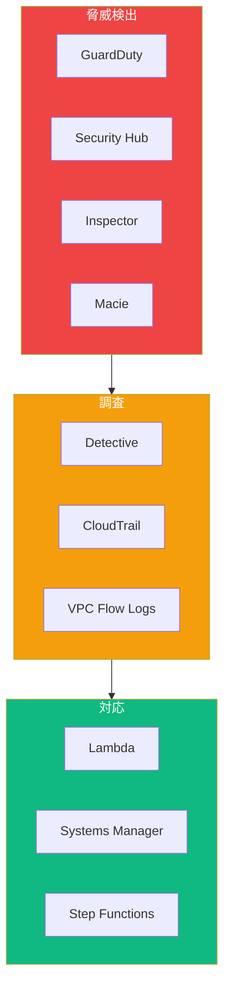
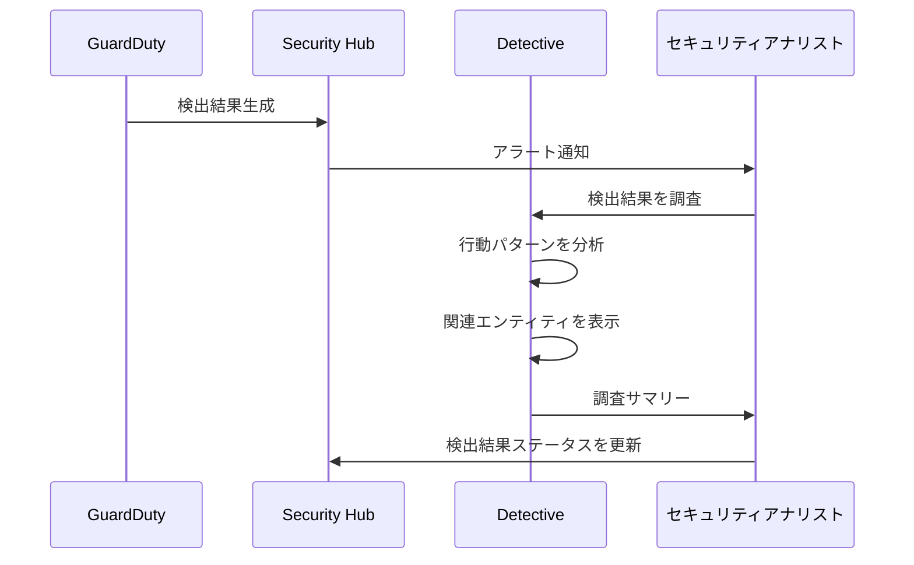
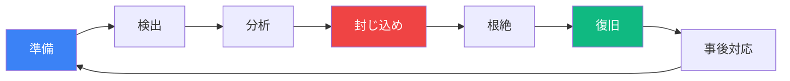

脅威検出とインシデント対応は、AWSセキュリティスペシャリティ認定の重要なドメインです。脅威を検出し、セキュリティインシデントに対応する方法を理解することは、AWS環境を保護するために不可欠です。

## 脅威検出の概要



## Amazon GuardDuty

### GuardDutyの有効化

```python
import boto3

guardduty = boto3.client('guardduty')

# ディテクターを作成
response = guardduty.create_detector(
    Enable=True,
    DataSources={
        'S3Logs': {'Enable': True},
        'Kubernetes': {
            'AuditLogs': {'Enable': True}
        },
        'MalwareProtection': {
            'ScanEc2InstanceWithFindings': {
                'EbsVolumes': {'Enable': True}
            }
        }
    },
    Features=[
        {'Name': 'EKS_AUDIT_LOGS', 'Status': 'ENABLED'},
        {'Name': 'EBS_MALWARE_PROTECTION', 'Status': 'ENABLED'},
        {'Name': 'RDS_LOGIN_EVENTS', 'Status': 'ENABLED'},
        {'Name': 'LAMBDA_NETWORK_LOGS', 'Status': 'ENABLED'}
    ],
    FindingPublishingFrequency='FIFTEEN_MINUTES'
)

detector_id = response['DetectorId']
```

### GuardDuty検出結果タイプ

| カテゴリ | 検出結果タイプ |
|---------|-------------|
| EC2 | Backdoor、CryptoCurrency、Trojan、UnauthorizedAccess |
| IAM | CredentialAccess、DefenseEvasion、Persistence |
| S3 | Exfiltration、Stealth、Discovery |
| Kubernetes | Execution、Impact、CredentialAccess |
| マルウェア | Execution、C&C、Dropper |

### 検出結果の処理

```python
import boto3
import json

guardduty = boto3.client('guardduty')

def get_high_severity_findings(detector_id):
    """高重大度のGuardDuty検出結果を取得"""

    findings = []
    paginator = guardduty.get_paginator('list_findings')

    for page in paginator.paginate(
        DetectorId=detector_id,
        FindingCriteria={
            'Criterion': {
                'severity': {
                    'Gte': 7  # 高重大度（7-8.9）
                },
                'service.archived': {
                    'Eq': ['false']
                }
            }
        },
        SortCriteria={
            'AttributeName': 'severity',
            'OrderBy': 'DESC'
        }
    ):
        finding_ids = page['FindingIds']

        if finding_ids:
            details = guardduty.get_findings(
                DetectorId=detector_id,
                FindingIds=finding_ids
            )
            findings.extend(details['Findings'])

    return findings


def lambda_handler(event, context):
    """EventBridgeからのGuardDuty検出結果を処理"""

    finding = event['detail']

    severity = finding['severity']
    finding_type = finding['type']
    resource = finding['resource']

    # 高重大度 - 即時対応
    if severity >= 7:
        isolate_resource(resource)
        notify_security_team(finding)
        create_incident_ticket(finding)

    # 中重大度 - アラートと調査
    elif severity >= 4:
        notify_security_team(finding)
        schedule_investigation(finding)

    # 低重大度 - ログと監視
    else:
        log_finding(finding)


def isolate_resource(resource):
    """侵害されたリソースを分離"""

    ec2 = boto3.client('ec2')

    if resource['resourceType'] == 'Instance':
        instance_id = resource['instanceDetails']['instanceId']

        # 分離用セキュリティグループを作成
        isolation_sg = create_isolation_security_group()

        # セキュリティグループを置き換え
        ec2.modify_instance_attribute(
            InstanceId=instance_id,
            Groups=[isolation_sg]
        )

        # フォレンジック用スナップショットを作成
        volumes = ec2.describe_volumes(
            Filters=[
                {'Name': 'attachment.instance-id', 'Values': [instance_id]}
            ]
        )

        for volume in volumes['Volumes']:
            ec2.create_snapshot(
                VolumeId=volume['VolumeId'],
                Description=f'フォレンジックスナップショット - {instance_id}'
            )
```

### 検出結果の抑制

```python
# 既知の誤検知を抑制するフィルターを作成
guardduty.create_filter(
    DetectorId=detector_id,
    Name='suppress-internal-scanners',
    Description='承認された脆弱性スキャナーからの検出結果を抑制',
    Action='ARCHIVE',
    Rank=1,
    FindingCriteria={
        'Criterion': {
            'service.action.networkConnectionAction.remoteIpDetails.ipAddressV4': {
                'Eq': ['10.0.1.100', '10.0.1.101']  # スキャナーIP
            },
            'type': {
                'Eq': ['Recon:EC2/PortProbeUnprotectedPort']
            }
        }
    }
)
```

## AWS Security Hub

### Security Hubの有効化

```python
import boto3

securityhub = boto3.client('securityhub')

# Security Hubを有効化
securityhub.enable_security_hub(
    EnableDefaultStandards=True,
    ControlFindingGenerator='SECURITY_CONTROL'
)

# 特定の標準を有効化
securityhub.batch_enable_standards(
    StandardsSubscriptionRequests=[
        {
            'StandardsArn': 'arn:aws:securityhub:::ruleset/cis-aws-foundations-benchmark/v/1.4.0'
        },
        {
            'StandardsArn': 'arn:aws:securityhub:us-east-1::standards/aws-foundational-security-best-practices/v/1.0.0'
        },
        {
            'StandardsArn': 'arn:aws:securityhub:us-east-1::standards/pci-dss/v/3.2.1'
        }
    ]
)
```

### Security Hub統合

```python
# 統合を有効化
integrations = [
    'arn:aws:securityhub:us-east-1::product/aws/guardduty',
    'arn:aws:securityhub:us-east-1::product/aws/inspector',
    'arn:aws:securityhub:us-east-1::product/aws/macie',
    'arn:aws:securityhub:us-east-1::product/aws/config'
]

for integration in integrations:
    securityhub.enable_import_findings_for_product(
        ProductArn=integration
    )
```

### Security Hub検出結果の処理

```python
def get_critical_findings():
    """クリティカルおよび高重大度の検出結果を取得"""

    findings = []
    paginator = securityhub.get_paginator('get_findings')

    for page in paginator.paginate(
        Filters={
            'SeverityLabel': [
                {'Value': 'CRITICAL', 'Comparison': 'EQUALS'},
                {'Value': 'HIGH', 'Comparison': 'EQUALS'}
            ],
            'WorkflowStatus': [
                {'Value': 'NEW', 'Comparison': 'EQUALS'}
            ],
            'RecordState': [
                {'Value': 'ACTIVE', 'Comparison': 'EQUALS'}
            ]
        },
        SortCriteria=[
            {'Field': 'SeverityNormalized', 'SortOrder': 'desc'}
        ]
    ):
        findings.extend(page['Findings'])

    return findings


def update_finding_workflow(finding_id, status):
    """検出結果のワークフローステータスを更新"""

    securityhub.batch_update_findings(
        FindingIdentifiers=[
            {
                'Id': finding_id,
                'ProductArn': finding['ProductArn']
            }
        ],
        Workflow={'Status': status},  # NEW, NOTIFIED, RESOLVED, SUPPRESSED
        Note={
            'Text': f'ステータスを{status}に更新',
            'UpdatedBy': 'security-automation'
        }
    )
```

### カスタムインサイト

```python
# カスタムインサイトを作成
securityhub.create_insight(
    Name='最も検出結果の多いリソース トップ10',
    Filters={
        'SeverityLabel': [
            {'Value': 'CRITICAL', 'Comparison': 'EQUALS'},
            {'Value': 'HIGH', 'Comparison': 'EQUALS'}
        ],
        'WorkflowStatus': [
            {'Value': 'NEW', 'Comparison': 'EQUALS'}
        ]
    },
    GroupByAttribute='ResourceId'
)

# 失敗したコンプライアンスチェックのインサイト
securityhub.create_insight(
    Name='失敗したCISベンチマークコントロール',
    Filters={
        'ComplianceStatus': [
            {'Value': 'FAILED', 'Comparison': 'EQUALS'}
        ],
        'GeneratorId': [
            {'Value': 'cis-aws-foundations-benchmark', 'Comparison': 'PREFIX'}
        ]
    },
    GroupByAttribute='GeneratorId'
)
```

## Amazon Detective

### Detectiveの有効化

```python
import boto3

detective = boto3.client('detective')

# 動作グラフを作成
response = detective.create_graph(
    Tags={'Environment': 'Production'}
)

graph_arn = response['GraphArn']

# メンバーアカウントを追加
detective.create_members(
    GraphArn=graph_arn,
    Accounts=[
        {'AccountId': '111122223333', 'EmailAddress': 'security@company.com'},
        {'AccountId': '444455556666', 'EmailAddress': 'security@company.com'}
    ]
)
```

### 調査ワークフロー



### Detectiveで調査

```python
def investigate_finding(finding):
    """Detectiveを使用してGuardDuty検出結果を調査"""

    detective = boto3.client('detective')

    # 調査詳細を取得
    # Detectiveはコンソールでビジュアル分析を提供

    # インジケーターで検索
    indicators = detective.list_indicators(
        GraphArn=graph_arn,
        InvestigationId=finding['service']['detectorId'],
        IndicatorType='TTP_OBSERVED'  # 戦術、技術、手順
    )

    # 関連エンティティを取得
    entity_id = finding['resource']['instanceDetails']['instanceId']

    # エンティティの調査をリスト
    investigations = detective.list_investigations(
        GraphArn=graph_arn,
        FilterCriteria={
            'EntityArn': {
                'Value': f'arn:aws:ec2:us-east-1:123456789012:instance/{entity_id}'
            }
        }
    )

    return investigations
```

## インシデント対応計画

### インシデント対応フェーズ



### 自動インシデント対応

```python
import boto3
import json

def create_incident_response_automation():
    """インシデント対応用Step Functionsステートマシンを作成"""

    sfn = boto3.client('stepfunctions')

    definition = {
        'Comment': 'インシデント対応自動化',
        'StartAt': 'ClassifyIncident',
        'States': {
            'ClassifyIncident': {
                'Type': 'Task',
                'Resource': 'arn:aws:lambda:us-east-1:123456789012:function:classify-incident',
                'Next': 'RouteBySeverity'
            },
            'RouteBySeverity': {
                'Type': 'Choice',
                'Choices': [
                    {
                        'Variable': '$.severity',
                        'StringEquals': 'CRITICAL',
                        'Next': 'CriticalResponse'
                    },
                    {
                        'Variable': '$.severity',
                        'StringEquals': 'HIGH',
                        'Next': 'HighResponse'
                    }
                ],
                'Default': 'StandardResponse'
            },
            'CriticalResponse': {
                'Type': 'Parallel',
                'Branches': [
                    {
                        'StartAt': 'IsolateResource',
                        'States': {
                            'IsolateResource': {
                                'Type': 'Task',
                                'Resource': 'arn:aws:lambda:...:function:isolate-resource',
                                'End': True
                            }
                        }
                    },
                    {
                        'StartAt': 'NotifySecurityTeam',
                        'States': {
                            'NotifySecurityTeam': {
                                'Type': 'Task',
                                'Resource': 'arn:aws:lambda:...:function:notify-team',
                                'End': True
                            }
                        }
                    },
                    {
                        'StartAt': 'CreateForensicSnapshot',
                        'States': {
                            'CreateForensicSnapshot': {
                                'Type': 'Task',
                                'Resource': 'arn:aws:lambda:...:function:create-snapshot',
                                'End': True
                            }
                        }
                    }
                ],
                'Next': 'CreateIncidentTicket'
            },
            'HighResponse': {
                'Type': 'Task',
                'Resource': 'arn:aws:lambda:...:function:high-severity-response',
                'Next': 'CreateIncidentTicket'
            },
            'StandardResponse': {
                'Type': 'Task',
                'Resource': 'arn:aws:lambda:...:function:standard-response',
                'End': True
            },
            'CreateIncidentTicket': {
                'Type': 'Task',
                'Resource': 'arn:aws:lambda:...:function:create-ticket',
                'End': True
            }
        }
    }

    sfn.create_state_machine(
        name='incident-response',
        definition=json.dumps(definition),
        roleArn='arn:aws:iam::123456789012:role/step-functions-role'
    )
```

### EC2インスタンスの分離

```python
import boto3

def isolate_ec2_instance(instance_id, vpc_id):
    """侵害されたEC2インスタンスを分離"""

    ec2 = boto3.client('ec2')

    # 分離用セキュリティグループを作成（インバウンド/アウトバウンドなし）
    isolation_sg = ec2.create_security_group(
        GroupName=f'isolation-{instance_id}',
        Description='インシデント対応用分離セキュリティグループ',
        VpcId=vpc_id
    )

    sg_id = isolation_sg['GroupId']

    # デフォルトのアウトバウンドルールを削除
    ec2.revoke_security_group_egress(
        GroupId=sg_id,
        IpPermissions=[
            {
                'IpProtocol': '-1',
                'IpRanges': [{'CidrIp': '0.0.0.0/0'}]
            }
        ]
    )

    # 現在のセキュリティグループを取得
    instance = ec2.describe_instances(InstanceIds=[instance_id])
    current_sgs = [sg['GroupId'] for sg in
                   instance['Reservations'][0]['Instances'][0]['SecurityGroups']]

    # 元のセキュリティグループをタグ付け
    ec2.create_tags(
        Resources=[instance_id],
        Tags=[
            {'Key': 'OriginalSecurityGroups', 'Value': ','.join(current_sgs)},
            {'Key': 'IsolatedAt', 'Value': str(datetime.now())},
            {'Key': 'IncidentStatus', 'Value': 'ISOLATED'}
        ]
    )

    # 分離用セキュリティグループを適用
    ec2.modify_instance_attribute(
        InstanceId=instance_id,
        Groups=[sg_id]
    )

    return sg_id
```

### 認証情報のローテーション

```python
import boto3

def rotate_compromised_credentials(user_name):
    """侵害されたIAMユーザーの認証情報をローテーション"""

    iam = boto3.client('iam')

    # アクセスキーをリストして無効化
    keys = iam.list_access_keys(UserName=user_name)

    for key in keys['AccessKeyMetadata']:
        # キーを無効化
        iam.update_access_key(
            UserName=user_name,
            AccessKeyId=key['AccessKeyId'],
            Status='Inactive'
        )

        # 追跡用にタグ付け
        iam.tag_user(
            UserName=user_name,
            Tags=[
                {
                    'Key': f'DeactivatedKey-{key["AccessKeyId"]}',
                    'Value': str(datetime.now())
                }
            ]
        )

    # ログインプロファイル（コンソールアクセス）を削除
    try:
        iam.delete_login_profile(UserName=user_name)
    except iam.exceptions.NoSuchEntityException:
        pass

    # MFAデバイスをリストして削除
    mfa_devices = iam.list_mfa_devices(UserName=user_name)

    for device in mfa_devices['MFADevices']:
        iam.deactivate_mfa_device(
            UserName=user_name,
            SerialNumber=device['SerialNumber']
        )

    # deny-allポリシーをアタッチ
    deny_policy = {
        'Version': '2012-10-17',
        'Statement': [
            {
                'Effect': 'Deny',
                'Action': '*',
                'Resource': '*'
            }
        ]
    }

    iam.put_user_policy(
        UserName=user_name,
        PolicyName='DenyAll-IncidentResponse',
        PolicyDocument=json.dumps(deny_policy)
    )

    return {'status': 'credentials_rotated', 'user': user_name}
```

## フォレンジック分析

### フォレンジックスナップショットの作成

```python
def create_forensic_snapshot(instance_id):
    """調査用フォレンジックスナップショットを作成"""

    ec2 = boto3.client('ec2')

    # アタッチされたボリュームを取得
    instance = ec2.describe_instances(InstanceIds=[instance_id])
    volumes = instance['Reservations'][0]['Instances'][0]['BlockDeviceMappings']

    snapshots = []

    for volume in volumes:
        volume_id = volume['Ebs']['VolumeId']

        snapshot = ec2.create_snapshot(
            VolumeId=volume_id,
            Description=f'インシデントのフォレンジックスナップショット - {instance_id}',
            TagSpecifications=[
                {
                    'ResourceType': 'snapshot',
                    'Tags': [
                        {'Key': 'Purpose', 'Value': 'Forensics'},
                        {'Key': 'SourceInstance', 'Value': instance_id},
                        {'Key': 'CreatedAt', 'Value': str(datetime.now())}
                    ]
                }
            ]
        )

        snapshots.append(snapshot['SnapshotId'])

    # フォレンジックアカウントにコピー
    for snapshot_id in snapshots:
        ec2.modify_snapshot_attribute(
            SnapshotId=snapshot_id,
            Attribute='createVolumePermission',
            OperationType='add',
            UserIds=['forensic-account-id']
        )

    return snapshots
```

## まとめ

| サービス | 目的 | 主な機能 |
|---------|-----|---------|
| GuardDuty | 脅威検出 | MLベース、継続的モニタリング |
| Security Hub | セキュリティ体制 | 集約、標準、インサイト |
| Detective | 調査 | 行動分析、可視化 |
| Inspector | 脆弱性スキャン | EC2、ECR、Lambdaスキャン |
| Macie | データ検出 | PII検出、S3セキュリティ |

重要なポイント：

- すべてのアカウントとリージョンでGuardDutyを有効化
- 中央可視性のためにSecurity Hubで検出結果を集約
- インシデントの詳細調査にはDetectiveを使用
- LambdaとStep Functionsでインシデント対応を自動化
- 修復前にフォレンジックスナップショットを作成
- 侵害されたリソースを即座に分離
- 侵害されたアカウントの認証情報をローテーション
- すべてのインシデントを文書化し、改善のためにレビュー

脅威検出とインシデント対応は、AWSセキュリティスペシャリティ認定と強力なセキュリティ体制の維持に不可欠です。

## 参考文献

- [Amazon GuardDuty User Guide](https://docs.aws.amazon.com/guardduty/latest/ug/)
- [AWS Security Hub User Guide](https://docs.aws.amazon.com/securityhub/latest/userguide/)
- [Amazon Detective User Guide](https://docs.aws.amazon.com/detective/latest/userguide/)
- Muñoz, Mauricio, et al. *AWS Certified Security Study Guide, 2nd Edition*. Wiley, 2025.
- Book, Adam, and Stuart Scott. *AWS Certified Security – Specialty (SCS-C02) Exam Guide*. Packt, 2024.
