AWS Transit Gatewayは、複数のVPCとオンプレミスネットワークを一元的に接続するリージョナルネットワークハブです。従来のVPCピアリングの複雑さを解消し、スケーラブルなネットワークアーキテクチャを実現します。

## なぜTransit Gatewayが必要か

### VPCピアリングの限界

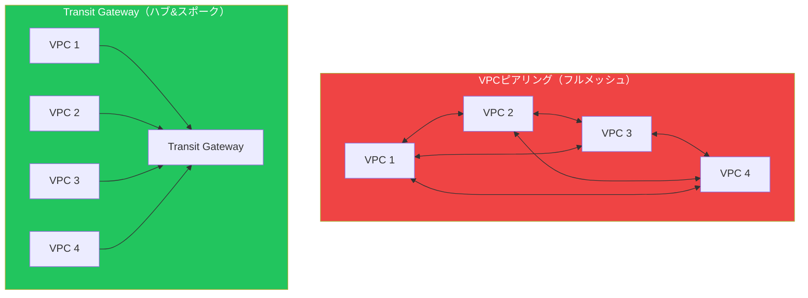

### 接続数の比較

| VPC数 | ピアリング接続数 | TGWアタッチメント数 |
|-------|----------------|-------------------|
| 4 | 6 | 4 |
| 10 | 45 | 10 |
| 50 | 1,225 | 50 |
| 100 | 4,950 | 100 |

n個のVPCをフルメッシュで接続するには n×(n-1)/2 の接続が必要ですが、Transit Gatewayならn個のアタッチメントで済みます。

## Transit Gatewayの基本概念

### コンポーネント

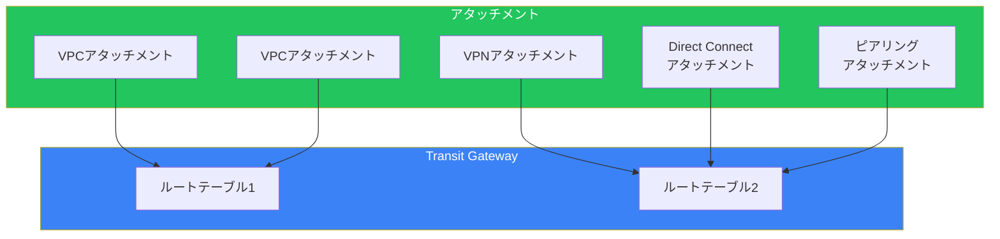

### 用語の整理

| コンポーネント | 説明 |
|--------------|------|
| **Transit Gateway** | リージョナルなネットワークハブ |
| **アタッチメント** | TGWへの接続（VPC、VPN、DX、ピアリング） |
| **ルートテーブル** | トラフィックのルーティングを制御 |
| **関連付け** | アタッチメントとルートテーブルの紐付け |
| **伝播** | アタッチメントからルートを自動追加 |

## アタッチメントの種類

### VPCアタッチメント

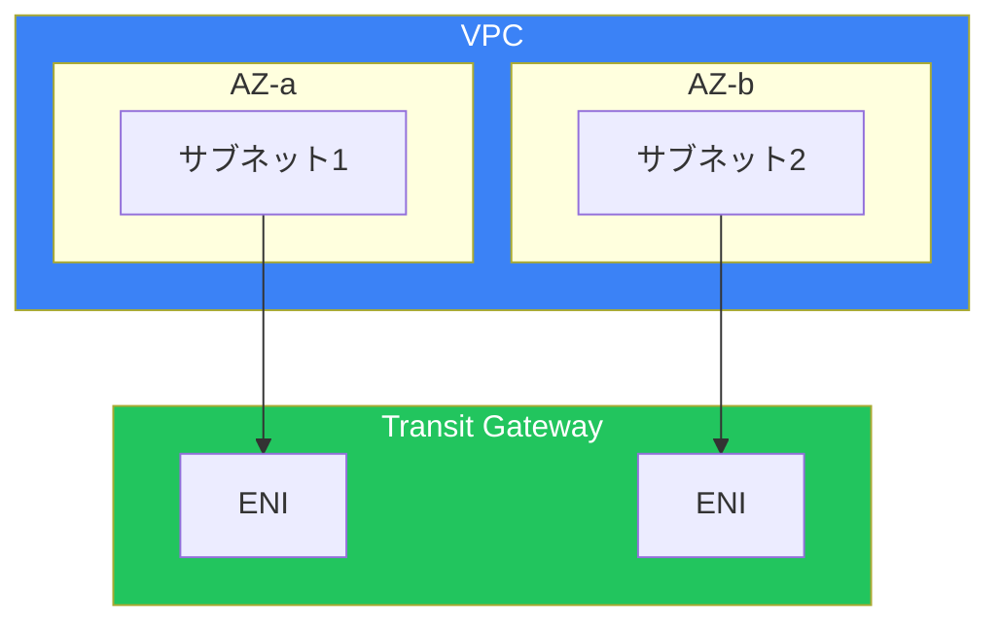

**重要**: 各AZにサブネットを指定する必要があります。高可用性のために複数AZを使用してください。

### VPNアタッチメント

Site-to-Site VPN接続をTransit Gatewayに直接終端：

```bash
# VPNアタッチメントの作成
aws ec2 create-vpn-connection \
    --type ipsec.1 \
    --customer-gateway-id cgw-xxx \
    --transit-gateway-id tgw-xxx \
    --options TunnelOptions=[{PreSharedKey=xxx}]
```

### Direct Connectアタッチメント

Direct Connect Gateway経由でTransit Gatewayに接続：

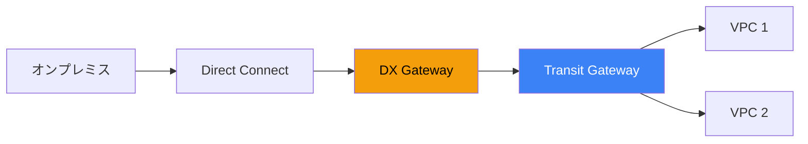

### ピアリングアタッチメント

異なるリージョンのTransit Gateway同士を接続：

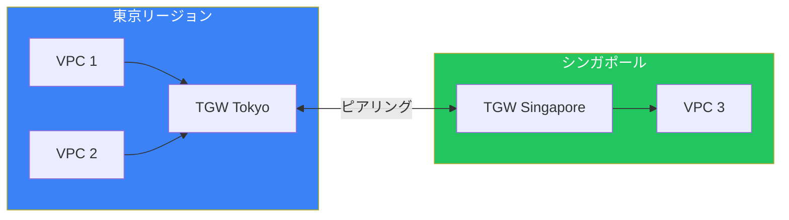

## ルーティング

### ルートテーブルの概念

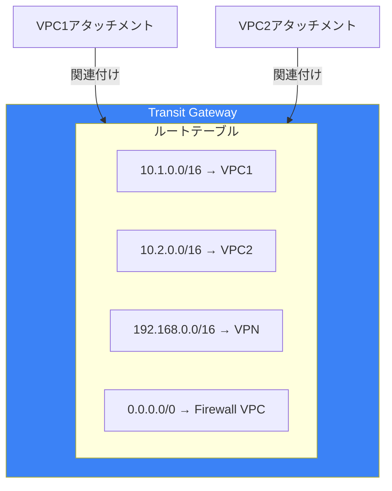

### 関連付けと伝播

| 機能 | 説明 |
|------|------|
| **関連付け（Association）** | アタッチメントのトラフィックがどのルートテーブルを使用するか |
| **伝播（Propagation）** | アタッチメントのCIDRを自動的にルートテーブルに追加 |

### ルーティング設計パターン

#### パターン1: フラットルーティング

すべてのVPCが相互に通信可能：

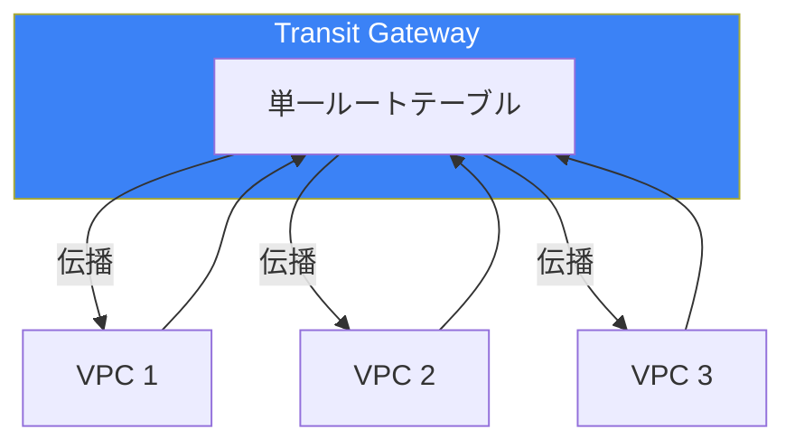

#### パターン2: セグメント化

環境ごとにルートテーブルを分離：

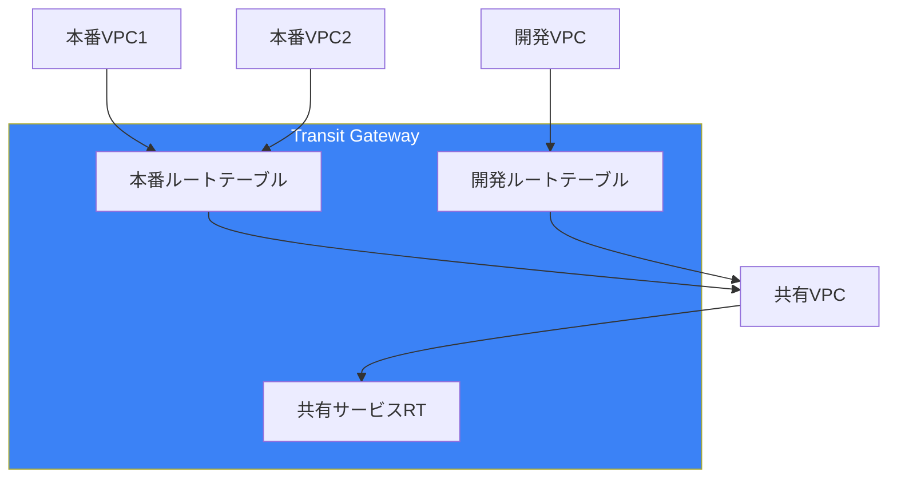

#### パターン3: Inspection VPC

すべてのトラフィックをファイアウォール経由：

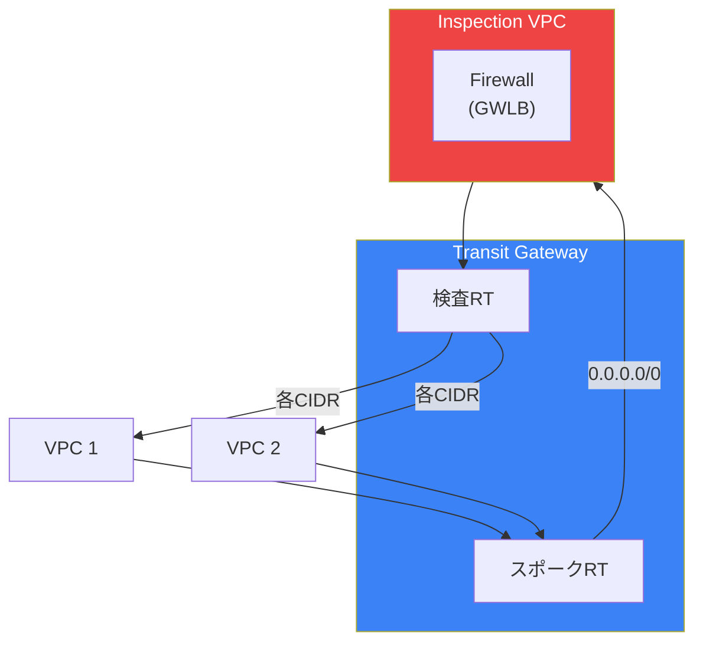

## マルチリージョン設計

### Inter-Region Peering

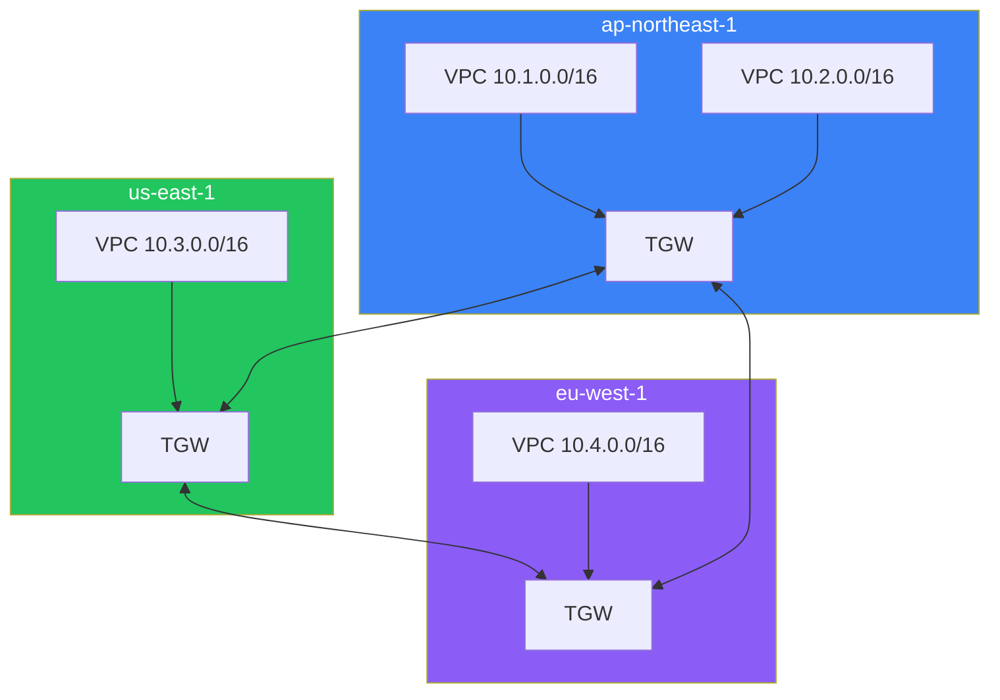

### ルーティング設定

各リージョンのルートテーブルに他リージョンへのルートを追加：

```bash
# 東京リージョンのルートテーブルに追加
aws ec2 create-transit-gateway-route \
    --transit-gateway-route-table-id tgw-rtb-tokyo \
    --destination-cidr-block 10.3.0.0/16 \
    --transit-gateway-attachment-id tgw-attach-peering-us
```

## Network Manager

### 概要

AWS Network Managerは、グローバルネットワークを可視化・監視するサービスです。

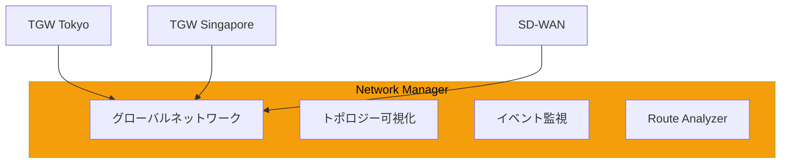

### 主要機能

| 機能 | 説明 |
|------|------|
| **トポロジーマップ** | ネットワーク構成を視覚化 |
| **イベントダッシュボード** | 接続状態の変化を監視 |
| **Route Analyzer** | ルーティングの分析・検証 |
| **CloudWatch統合** | メトリクスとアラーム |

## RAM（Resource Access Manager）との連携

### マルチアカウントでのTGW共有

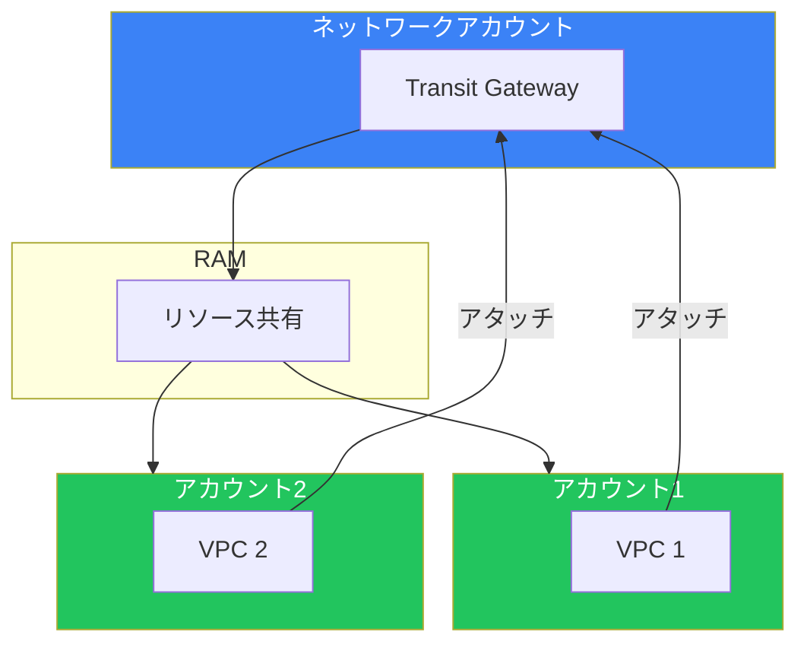

### 設定手順

```bash
# 1. ネットワークアカウントでRAM共有を作成
aws ram create-resource-share \
    --name "transit-gateway-share" \
    --resource-arns arn:aws:ec2:ap-northeast-1:111111111111:transit-gateway/tgw-xxx \
    --principals arn:aws:organizations::111111111111:organization/o-xxx

# 2. 各アカウントからアタッチメントを作成
aws ec2 create-transit-gateway-vpc-attachment \
    --transit-gateway-id tgw-xxx \
    --vpc-id vpc-xxx \
    --subnet-ids subnet-xxx subnet-yyy
```

## 料金

### 料金体系

| 項目 | 料金（東京リージョン） |
|------|----------------------|
| アタッチメント時間 | $0.07/時間 |
| データ処理 | $0.02/GB |
| ピアリングアタッチメント | $0.07/時間 |
| ピアリングデータ転送 | リージョン間転送料金 |

### コスト最適化のポイント

- 不要なアタッチメントは削除
- 大量データ転送はDirect Connect検討
- 同一AZ内通信を優先（データ転送料金削減）

## ベストプラクティス

### 設計チェックリスト

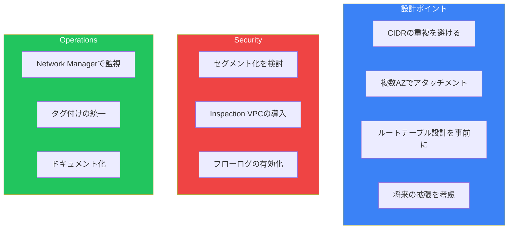

### よくある間違い

| 間違い | 正しい対応 |
|--------|----------|
| 単一AZのアタッチメント | 複数AZで冗長化 |
| CIDRの重複 | 事前にIP計画を策定 |
| 過度に複雑なルーティング | シンプルな設計を優先 |
| 監視の欠如 | VPCフローログとNetwork Manager |

## まとめ

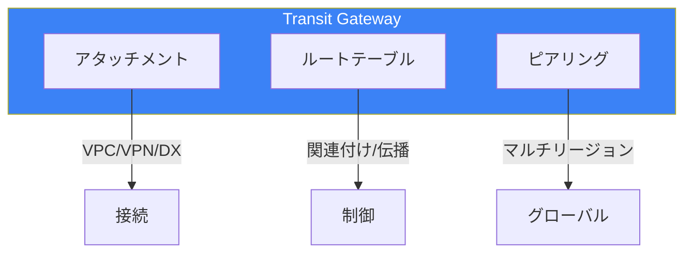

| コンポーネント | 用途 | 重要度 |
|--------------|------|--------|
| VPCアタッチメント | VPC接続 | ★★★ |
| ルートテーブル | トラフィック制御 | ★★★ |
| ピアリング | マルチリージョン | ★★☆ |
| Network Manager | 監視・可視化 | ★★☆ |

Transit Gatewayは、大規模なマルチVPC環境に不可欠なコンポーネントです。適切なルーティング設計により、スケーラブルで管理しやすいネットワークを実現できます。

## 参考資料

- [AWS Transit Gateway Guide](https://docs.aws.amazon.com/vpc/latest/tgw/)
- [Transit Gateway Design Best Practices](https://docs.aws.amazon.com/vpc/latest/tgw/tgw-best-design-practices.html)
- [Network Manager User Guide](https://docs.aws.amazon.com/network-manager/latest/userguide/)
