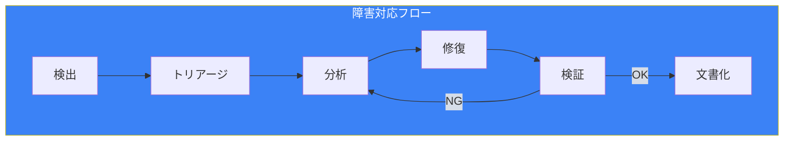
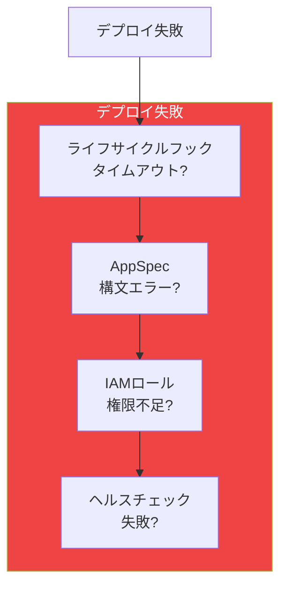
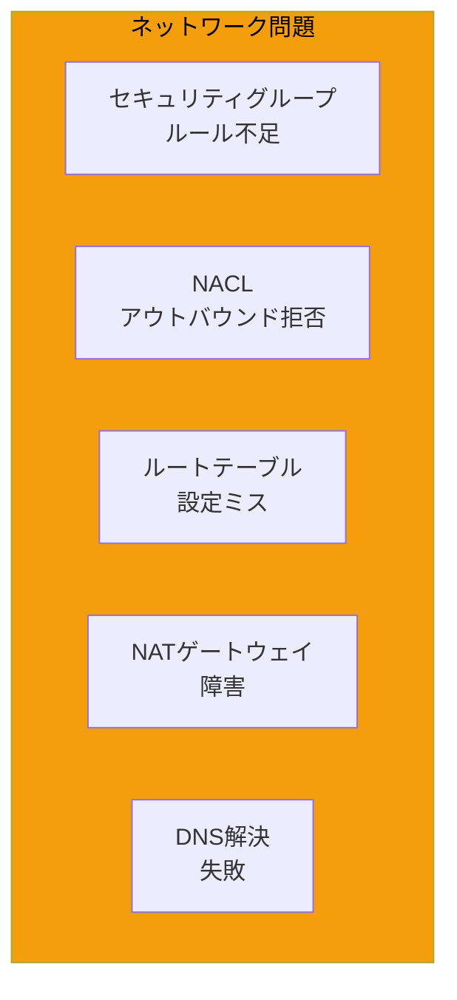
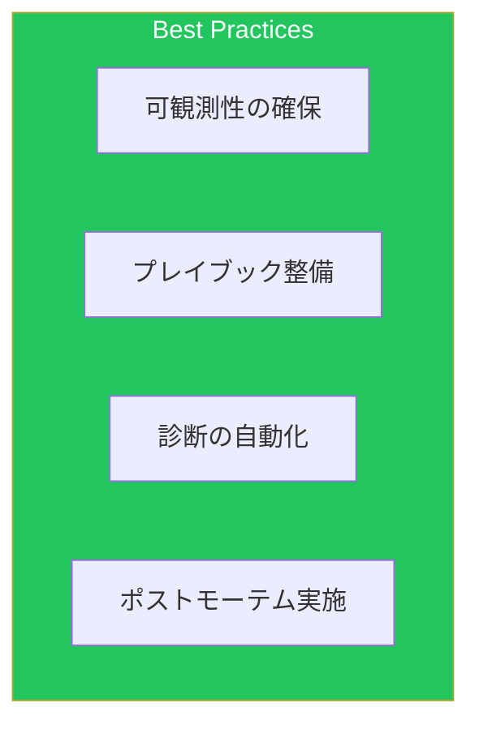

AWSでの障害対応は、適切なツールと手法を知ることで効率化できます。本記事では、実践的なトラブルシューティングパターンを解説します。

## トラブルシューティングフロー



## CloudWatch Logs分析

### Logs Insightsクエリ

```sql
-- エラーパターンの特定
fields @timestamp, @message, @logStream
| filter @message like /(?i)(error|exception|failed|timeout)/
| stats count(*) as error_count by bin(5m)
| sort error_count desc

-- Lambda関数のエラー詳細
fields @timestamp, @requestId, @message
| filter @type = "REPORT"
| filter @duration > 10000 or @maxMemoryUsed / @memorySize > 0.9
| sort @timestamp desc
| limit 50

-- API Gatewayのエラー分析
fields @timestamp, httpMethod, path, status, responseLatency, errorMessage
| filter status >= 400
| stats count(*) as errors,
        avg(responseLatency) as avg_latency
  by status, path
| sort errors desc

-- ECSタスク停止理由
fields @timestamp, @message
| filter @message like /STOPPED/
| parse @message /stoppedReason: (?<reason>[^,]+)/
| stats count(*) as count by reason
| sort count desc

-- VPCフローログでの拒否分析
fields @timestamp, srcAddr, dstAddr, srcPort, dstPort, action
| filter action = "REJECT"
| stats count(*) as reject_count by srcAddr, dstAddr, dstPort
| sort reject_count desc
| limit 20
```

### ログ相関分析

```sql
-- リクエストIDによるログ追跡
fields @timestamp, @message, @logStream
| filter @message like /request-id-12345/
| sort @timestamp

-- トレースIDでの分散追跡
fields @timestamp, @message, @logStream
| parse @message /trace_id=(?<trace_id>\S+)/
| filter trace_id = "1-abc123-def456"
| sort @timestamp

-- 時間範囲でのエラー急増検出
fields @timestamp, @message
| filter @message like /ERROR/
| stats count(*) as error_count by bin(1m)
| filter error_count > 100
```

## デプロイ失敗診断

### CodeDeployトラブルシューティング



### デプロイログの確認

```bash
# デプロイメント詳細
aws deploy get-deployment --deployment-id d-XXXXXXXXX

# ライフサイクルイベントログ
aws deploy get-deployment-target \
    --deployment-id d-XXXXXXXXX \
    --target-id i-XXXXXXXXX

# EC2インスタンスのCodeDeployエージェントログ
# /var/log/aws/codedeploy-agent/codedeploy-agent.log

# スクリプトログ
# /opt/codedeploy-agent/deployment-root/<deployment-group>/<deployment-id>/logs/scripts.log
```

### ECSデプロイ失敗診断

```bash
# サービスイベント確認
aws ecs describe-services \
    --cluster my-cluster \
    --services my-service \
    --query 'services[0].events[0:10]'

# タスク停止理由
aws ecs describe-tasks \
    --cluster my-cluster \
    --tasks arn:aws:ecs:ap-northeast-1:xxx:task/xxx \
    --query 'tasks[0].{stoppedReason:stoppedReason,stopCode:stopCode}'

# コンテナ終了コード
aws ecs describe-tasks \
    --cluster my-cluster \
    --tasks arn:aws:ecs:ap-northeast-1:xxx:task/xxx \
    --query 'tasks[0].containers[*].{name:name,exitCode:exitCode,reason:reason}'
```

### デプロイ失敗の一般的原因

| 原因 | 診断方法 | 解決策 |
|------|---------|--------|
| ヘルスチェック失敗 | ALB Target Groupヘルスステータス確認 | ヘルスチェックパス/タイムアウト調整 |
| コンテナ起動失敗 | タスク停止理由確認 | イメージ/設定の確認 |
| リソース不足 | クラスターキャパシティ確認 | スケールアウト/リソース調整 |
| 権限エラー | タスクロール/実行ロール確認 | IAMポリシー修正 |

## Lambda障害診断

### エラーパターン

```python
import json
import boto3
from datetime import datetime, timedelta

logs_client = boto3.client('logs')
lambda_client = boto3.client('lambda')

def analyze_lambda_errors(function_name, hours=24):
    """Lambda関数のエラーパターンを分析"""

    # CloudWatch Logs Insightsクエリ
    query = """
    fields @timestamp, @message, @requestId
    | filter @message like /ERROR/ or @message like /Exception/
    | parse @message /(?<error_type>\w+Exception|\w+Error)/
    | stats count(*) as count by error_type
    | sort count desc
    """

    log_group = f"/aws/lambda/{function_name}"

    response = logs_client.start_query(
        logGroupName=log_group,
        startTime=int((datetime.now() - timedelta(hours=hours)).timestamp()),
        endTime=int(datetime.now().timestamp()),
        queryString=query
    )

    # クエリ完了を待機
    query_id = response['queryId']
    while True:
        result = logs_client.get_query_results(queryId=query_id)
        if result['status'] == 'Complete':
            return result['results']
        time.sleep(1)

def get_invocation_errors(function_name, hours=1):
    """直近の呼び出しエラーを取得"""

    cloudwatch = boto3.client('cloudwatch')

    response = cloudwatch.get_metric_data(
        MetricDataQueries=[
            {
                'Id': 'errors',
                'MetricStat': {
                    'Metric': {
                        'Namespace': 'AWS/Lambda',
                        'MetricName': 'Errors',
                        'Dimensions': [
                            {'Name': 'FunctionName', 'Value': function_name}
                        ]
                    },
                    'Period': 300,
                    'Stat': 'Sum'
                }
            },
            {
                'Id': 'throttles',
                'MetricStat': {
                    'Metric': {
                        'Namespace': 'AWS/Lambda',
                        'MetricName': 'Throttles',
                        'Dimensions': [
                            {'Name': 'FunctionName', 'Value': function_name}
                        ]
                    },
                    'Period': 300,
                    'Stat': 'Sum'
                }
            }
        ],
        StartTime=datetime.now() - timedelta(hours=hours),
        EndTime=datetime.now()
    )

    return response['MetricDataResults']
```

### Lambda一般的エラー

| エラー | 原因 | 解決策 |
|--------|------|--------|
| Task timed out | 処理時間超過 | タイムアウト延長/処理最適化 |
| Out of memory | メモリ不足 | メモリ設定増加 |
| Connection timeout | VPC/NAT設定 | VPCエンドポイント追加 |
| Permission denied | IAMロール | ポリシー追加 |

## ネットワーク問題診断

### VPCフローログ分析

```sql
-- 拒否されたトラフィック
fields @timestamp, srcAddr, dstAddr, srcPort, dstPort, protocol, action
| filter action = "REJECT"
| stats count(*) as rejects by srcAddr, dstAddr, dstPort
| sort rejects desc
| limit 50

-- 特定IPからのトラフィック
fields @timestamp, srcAddr, dstAddr, srcPort, dstPort, action, bytes
| filter srcAddr = "10.0.1.50"
| sort @timestamp desc
| limit 100

-- プロトコル別トラフィック量
fields @timestamp, protocol, bytes
| stats sum(bytes) as total_bytes by protocol
| sort total_bytes desc
```

### 接続性テスト

```bash
# VPC Reachability Analyzer
aws ec2 create-network-insights-path \
    --source eni-source \
    --destination eni-dest \
    --protocol TCP \
    --destination-port 443

aws ec2 start-network-insights-analysis \
    --network-insights-path-id nip-xxx

aws ec2 describe-network-insights-analyses \
    --network-insights-analysis-ids nia-xxx

# セキュリティグループルール確認
aws ec2 describe-security-groups \
    --group-ids sg-xxx \
    --query 'SecurityGroups[0].IpPermissions'

# NACLルール確認
aws ec2 describe-network-acls \
    --filters "Name=vpc-id,Values=vpc-xxx"
```

### 一般的なネットワーク問題



## パフォーマンス問題診断

### X-Rayトレース分析

```python
import boto3
from datetime import datetime, timedelta

xray = boto3.client('xray')

def analyze_slow_traces(service_name, threshold_seconds=3):
    """遅いトレースを分析"""

    # 遅いトレースを検索
    response = xray.get_trace_summaries(
        StartTime=datetime.now() - timedelta(hours=1),
        EndTime=datetime.now(),
        FilterExpression=f'service(id(name: "{service_name}")) AND responsetime > {threshold_seconds}'
    )

    slow_traces = []
    for trace in response.get('TraceSummaries', []):
        # 詳細トレース取得
        detail = xray.batch_get_traces(TraceIds=[trace['Id']])

        for t in detail.get('Traces', []):
            segments = []
            for segment in t.get('Segments', []):
                doc = json.loads(segment['Document'])
                segments.append({
                    'name': doc.get('name'),
                    'duration': doc.get('end_time', 0) - doc.get('start_time', 0),
                    'error': doc.get('error'),
                    'fault': doc.get('fault')
                })

            slow_traces.append({
                'trace_id': trace['Id'],
                'duration': trace.get('Duration'),
                'segments': sorted(segments, key=lambda x: x['duration'], reverse=True)
            })

    return slow_traces

def get_service_bottlenecks(hours=1):
    """サービス間のボトルネックを特定"""

    response = xray.get_service_graph(
        StartTime=datetime.now() - timedelta(hours=hours),
        EndTime=datetime.now()
    )

    bottlenecks = []
    for service in response.get('Services', []):
        summary = service.get('SummaryStatistics', {})
        if summary.get('FaultStatistics', {}).get('TotalCount', 0) > 0:
            bottlenecks.append({
                'service': service.get('Name'),
                'type': service.get('Type'),
                'total_requests': summary.get('TotalCount'),
                'fault_rate': summary.get('FaultStatistics', {}).get('TotalCount', 0) / summary.get('TotalCount', 1),
                'avg_response_time': summary.get('TotalResponseTime', 0) / summary.get('TotalCount', 1)
            })

    return sorted(bottlenecks, key=lambda x: x['fault_rate'], reverse=True)
```

### RDSパフォーマンス診断

```sql
-- Performance Insightsクエリ（PostgreSQL）
-- 待機イベント分析
SELECT
    wait_event_type,
    wait_event,
    count(*) as occurrences
FROM pg_stat_activity
WHERE state = 'active'
GROUP BY wait_event_type, wait_event
ORDER BY occurrences DESC;

-- 長時間実行クエリ
SELECT
    pid,
    now() - pg_stat_activity.query_start AS duration,
    query,
    state
FROM pg_stat_activity
WHERE (now() - pg_stat_activity.query_start) > interval '5 minutes'
AND state != 'idle'
ORDER BY duration DESC;

-- インデックス使用率
SELECT
    schemaname,
    relname,
    seq_scan,
    idx_scan,
    n_live_tup,
    round(100.0 * idx_scan / (seq_scan + idx_scan), 2) as idx_usage_pct
FROM pg_stat_user_tables
WHERE seq_scan + idx_scan > 0
ORDER BY idx_usage_pct ASC;
```

## 障害対応プレイブック

### Step Functions Runbook

```json
{
  "Comment": "Incident Response Runbook",
  "StartAt": "ClassifyIncident",
  "States": {
    "ClassifyIncident": {
      "Type": "Task",
      "Resource": "arn:aws:lambda:ap-northeast-1:xxx:function:classify-incident",
      "ResultPath": "$.classification",
      "Next": "DetermineResponse"
    },
    "DetermineResponse": {
      "Type": "Choice",
      "Choices": [
        {
          "Variable": "$.classification.severity",
          "StringEquals": "critical",
          "Next": "CriticalResponse"
        },
        {
          "Variable": "$.classification.severity",
          "StringEquals": "high",
          "Next": "HighResponse"
        }
      ],
      "Default": "StandardResponse"
    },
    "CriticalResponse": {
      "Type": "Parallel",
      "Branches": [
        {
          "StartAt": "PageOnCall",
          "States": {
            "PageOnCall": {
              "Type": "Task",
              "Resource": "arn:aws:states:::sns:publish",
              "Parameters": {
                "TopicArn": "arn:aws:sns:ap-northeast-1:xxx:critical-alerts",
                "Message.$": "$.incident"
              },
              "End": true
            }
          }
        },
        {
          "StartAt": "CollectDiagnostics",
          "States": {
            "CollectDiagnostics": {
              "Type": "Task",
              "Resource": "arn:aws:lambda:ap-northeast-1:xxx:function:collect-diagnostics",
              "End": true
            }
          }
        },
        {
          "StartAt": "CreateIncidentChannel",
          "States": {
            "CreateIncidentChannel": {
              "Type": "Task",
              "Resource": "arn:aws:lambda:ap-northeast-1:xxx:function:create-slack-channel",
              "End": true
            }
          }
        }
      ],
      "Next": "MonitorRecovery"
    },
    "MonitorRecovery": {
      "Type": "Task",
      "Resource": "arn:aws:states:::lambda:invoke.waitForTaskToken",
      "Parameters": {
        "FunctionName": "monitor-recovery",
        "Payload": {
          "incident.$": "$.incident",
          "taskToken.$": "$$.Task.Token"
        }
      },
      "TimeoutSeconds": 3600,
      "Next": "DocumentIncident"
    },
    "DocumentIncident": {
      "Type": "Task",
      "Resource": "arn:aws:lambda:ap-northeast-1:xxx:function:create-postmortem",
      "End": true
    }
  }
}
```

## ベストプラクティス



| カテゴリ | 項目 |
|---------|------|
| 準備 | ログ/メトリクス/トレースを事前設定 |
| 対応 | プレイブックに従った対応 |
| 分析 | 根本原因分析の実施 |
| 改善 | ポストモーテムで再発防止 |

## まとめ

| 領域 | ツール |
|------|--------|
| ログ分析 | CloudWatch Logs Insights |
| 分散トレース | X-Ray |
| ネットワーク | VPCフローログ、Reachability Analyzer |
| パフォーマンス | Performance Insights、X-Ray |

体系的なトラブルシューティング手法を身につけることで、障害対応時間を短縮できます。

## 参考資料

- [CloudWatch Logs Insights](https://docs.aws.amazon.com/AmazonCloudWatch/latest/logs/AnalyzingLogData.html)
- [X-Ray Troubleshooting](https://docs.aws.amazon.com/xray/latest/devguide/xray-troubleshooting.html)
- [VPC Troubleshooting](https://docs.aws.amazon.com/vpc/latest/userguide/troubleshooting.html)
