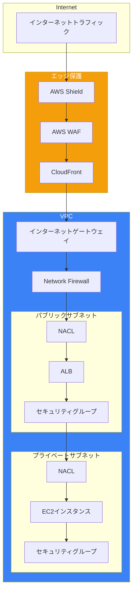
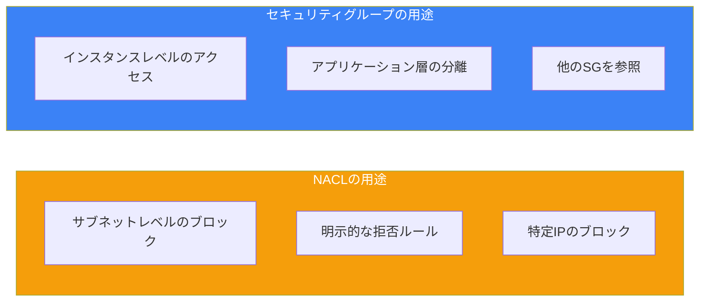
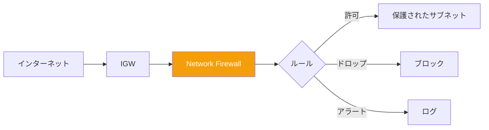
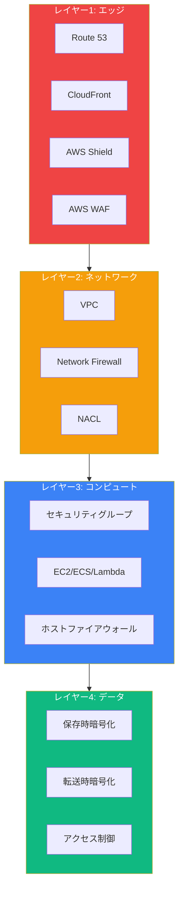

AWS Virtual Private Cloud（VPC）セキュリティは、AWSセキュリティスペシャリティ認定の重要なドメインです。ネットワークセキュリティコントロールを理解することで、安全で分離された環境を構築できます。

## VPCセキュリティの概要



## セキュリティグループ vs NACL

### 比較

| 機能 | セキュリティグループ | NACL |
|-----|-------------------|------|
| レベル | インスタンス/ENI | サブネット |
| 状態 | ステートフル | ステートレス |
| ルール | 許可のみ | 許可と拒否 |
| 評価 | 全ルールを評価 | 順番に評価 |
| デフォルト | すべてのインバウンドを拒否 | すべてを許可 |
| 関連付け | インスタンスに複数 | サブネットに1つ |

### セキュリティグループ（ステートフル）

```python
import boto3

ec2 = boto3.client('ec2')

# セキュリティグループを作成
response = ec2.create_security_group(
    GroupName='web-server-sg',
    Description='Webサーバーセキュリティグループ',
    VpcId='vpc-12345678'
)

sg_id = response['GroupId']

# インバウンドルールを追加
ec2.authorize_security_group_ingress(
    GroupId=sg_id,
    IpPermissions=[
        {
            'IpProtocol': 'tcp',
            'FromPort': 443,
            'ToPort': 443,
            'IpRanges': [{'CidrIp': '0.0.0.0/0', 'Description': 'どこからでもHTTPS'}]
        },
        {
            'IpProtocol': 'tcp',
            'FromPort': 80,
            'ToPort': 80,
            'IpRanges': [{'CidrIp': '0.0.0.0/0', 'Description': 'どこからでもHTTP'}]
        }
    ]
)

# 別のセキュリティグループを参照
ec2.authorize_security_group_ingress(
    GroupId=sg_id,
    IpPermissions=[
        {
            'IpProtocol': 'tcp',
            'FromPort': 3306,
            'ToPort': 3306,
            'UserIdGroupPairs': [
                {
                    'GroupId': 'sg-app-servers',
                    'Description': 'アプリサーバーからMySQL'
                }
            ]
        }
    ]
)
```

### ネットワークACL（ステートレス）

```python
import boto3

ec2 = boto3.client('ec2')

# NACLを作成
nacl = ec2.create_network_acl(VpcId='vpc-12345678')
nacl_id = nacl['NetworkAcl']['NetworkAclId']

# インバウンドルールを追加（両方向を指定する必要あり）
# ルール100: HTTPSインバウンドを許可
ec2.create_network_acl_entry(
    NetworkAclId=nacl_id,
    RuleNumber=100,
    Protocol='6',  # TCP
    RuleAction='allow',
    Egress=False,
    CidrBlock='0.0.0.0/0',
    PortRange={'From': 443, 'To': 443}
)

# ルール200: 応答用のエフェメラルポートを許可
ec2.create_network_acl_entry(
    NetworkAclId=nacl_id,
    RuleNumber=200,
    Protocol='6',
    RuleAction='allow',
    Egress=False,
    CidrBlock='0.0.0.0/0',
    PortRange={'From': 1024, 'To': 65535}
)

# アウトバウンドルール
# ルール100: HTTPSアウトバウンドを許可
ec2.create_network_acl_entry(
    NetworkAclId=nacl_id,
    RuleNumber=100,
    Protocol='6',
    RuleAction='allow',
    Egress=True,
    CidrBlock='0.0.0.0/0',
    PortRange={'From': 443, 'To': 443}
)

# ルール200: 応答用のエフェメラルポートを許可
ec2.create_network_acl_entry(
    NetworkAclId=nacl_id,
    RuleNumber=200,
    Protocol='6',
    RuleAction='allow',
    Egress=True,
    CidrBlock='0.0.0.0/0',
    PortRange={'From': 1024, 'To': 65535}
)
```

### 使い分け



## VPCエンドポイント

### ゲートウェイエンドポイント（S3、DynamoDB）

```python
import boto3

ec2 = boto3.client('ec2')

# S3用ゲートウェイエンドポイントを作成
response = ec2.create_vpc_endpoint(
    VpcId='vpc-12345678',
    ServiceName='com.amazonaws.us-east-1.s3',
    VpcEndpointType='Gateway',
    RouteTableIds=['rtb-12345678']
)

endpoint_id = response['VpcEndpoint']['VpcEndpointId']
```

### ゲートウェイエンドポイントポリシー

```json
{
  "Version": "2012-10-17",
  "Statement": [
    {
      "Sid": "RestrictToSpecificBucket",
      "Effect": "Allow",
      "Principal": "*",
      "Action": [
        "s3:GetObject",
        "s3:PutObject"
      ],
      "Resource": "arn:aws:s3:::my-private-bucket/*"
    },
    {
      "Sid": "DenyOtherBuckets",
      "Effect": "Deny",
      "Principal": "*",
      "Action": "s3:*",
      "Resource": "*",
      "Condition": {
        "StringNotEquals": {
          "s3:ResourceAccount": "123456789012"
        }
      }
    }
  ]
}
```

### インターフェースエンドポイント（PrivateLink）

```python
import boto3

ec2 = boto3.client('ec2')

# Secrets Manager用インターフェースエンドポイントを作成
response = ec2.create_vpc_endpoint(
    VpcId='vpc-12345678',
    ServiceName='com.amazonaws.us-east-1.secretsmanager',
    VpcEndpointType='Interface',
    SubnetIds=['subnet-private-1', 'subnet-private-2'],
    SecurityGroupIds=['sg-endpoint'],
    PrivateDnsEnabled=True
)
```

### エンドポイントセキュリティの比較

| 機能 | ゲートウェイエンドポイント | インターフェースエンドポイント |
|-----|------------------------|--------------------------|
| サービス | S3、DynamoDB | ほとんどのAWSサービス |
| コスト | 無料 | 時間課金 + データ転送 |
| DNS | ルートテーブルエントリ | プライベートDNS |
| セキュリティ | エンドポイントポリシー | セキュリティグループ + ポリシー |
| HA | 組み込み | マルチAZデプロイ |

## AWS Network Firewall



### ファイアウォール設定

```python
import boto3

network_firewall = boto3.client('network-firewall')

# ステートレスルールグループを作成
stateless_rules = network_firewall.create_rule_group(
    RuleGroupName='block-bad-ips',
    Type='STATELESS',
    Capacity=100,
    RuleGroup={
        'RulesSource': {
            'StatelessRulesAndCustomActions': {
                'StatelessRules': [
                    {
                        'RuleDefinition': {
                            'MatchAttributes': {
                                'Sources': [
                                    {'AddressDefinition': '192.0.2.0/24'}
                                ]
                            },
                            'Actions': ['aws:drop']
                        },
                        'Priority': 1
                    }
                ]
            }
        }
    }
)

# ドメインフィルタリング付きステートフルルールグループを作成
stateful_rules = network_firewall.create_rule_group(
    RuleGroupName='allow-domains',
    Type='STATEFUL',
    Capacity=100,
    RuleGroup={
        'RulesSource': {
            'RulesSourceList': {
                'Targets': [
                    '.amazonaws.com',
                    '.github.com'
                ],
                'TargetTypes': ['HTTP_HOST', 'TLS_SNI'],
                'GeneratedRulesType': 'ALLOWLIST'
            }
        }
    }
)
```

### Suricataルール

```python
# Suricataルール付きステートフルルールグループを作成
suricata_rules = network_firewall.create_rule_group(
    RuleGroupName='intrusion-detection',
    Type='STATEFUL',
    Capacity=100,
    RuleGroup={
        'RulesSource': {
            'RulesString': '''
# SQLインジェクション試行をブロック
drop http any any -> any any (msg:"SQL Injection"; content:"SELECT"; nocase; content:"FROM"; nocase; sid:1000001; rev:1;)

# 不審なユーザーエージェントをアラート
alert http any any -> any any (msg:"Suspicious UA"; http.user_agent; content:"sqlmap"; nocase; sid:1000002; rev:1;)
'''
        }
    }
)
```

## AWS WAF

### Web ACL設定

```python
import boto3

wafv2 = boto3.client('wafv2')

# Web ACLを作成
response = wafv2.create_web_acl(
    Name='api-protection',
    Scope='REGIONAL',  # または 'CLOUDFRONT'
    DefaultAction={'Allow': {}},
    Rules=[
        {
            'Name': 'AWS-AWSManagedRulesCommonRuleSet',
            'Priority': 1,
            'Statement': {
                'ManagedRuleGroupStatement': {
                    'VendorName': 'AWS',
                    'Name': 'AWSManagedRulesCommonRuleSet'
                }
            },
            'OverrideAction': {'None': {}},
            'VisibilityConfig': {
                'SampledRequestsEnabled': True,
                'CloudWatchMetricsEnabled': True,
                'MetricName': 'CommonRules'
            }
        },
        {
            'Name': 'AWS-AWSManagedRulesSQLiRuleSet',
            'Priority': 2,
            'Statement': {
                'ManagedRuleGroupStatement': {
                    'VendorName': 'AWS',
                    'Name': 'AWSManagedRulesSQLiRuleSet'
                }
            },
            'OverrideAction': {'None': {}},
            'VisibilityConfig': {
                'SampledRequestsEnabled': True,
                'CloudWatchMetricsEnabled': True,
                'MetricName': 'SQLiRules'
            }
        },
        {
            'Name': 'RateLimit',
            'Priority': 3,
            'Statement': {
                'RateBasedStatement': {
                    'Limit': 2000,
                    'AggregateKeyType': 'IP'
                }
            },
            'Action': {'Block': {}},
            'VisibilityConfig': {
                'SampledRequestsEnabled': True,
                'CloudWatchMetricsEnabled': True,
                'MetricName': 'RateLimit'
            }
        }
    ],
    VisibilityConfig={
        'SampledRequestsEnabled': True,
        'CloudWatchMetricsEnabled': True,
        'MetricName': 'api-protection'
    }
)
```

### カスタムルール

```python
# ジオブロッキングルール
geo_rule = {
    'Name': 'GeoBlock',
    'Priority': 0,
    'Statement': {
        'GeoMatchStatement': {
            'CountryCodes': ['RU', 'CN', 'KP']
        }
    },
    'Action': {'Block': {}},
    'VisibilityConfig': {
        'SampledRequestsEnabled': True,
        'CloudWatchMetricsEnabled': True,
        'MetricName': 'GeoBlock'
    }
}

# IPセットブロッキング
ip_set = wafv2.create_ip_set(
    Name='blocked-ips',
    Scope='REGIONAL',
    IPAddressVersion='IPV4',
    Addresses=['192.0.2.0/24', '198.51.100.0/24']
)

ip_block_rule = {
    'Name': 'BlockedIPs',
    'Priority': 1,
    'Statement': {
        'IPSetReferenceStatement': {
            'ARN': ip_set['Summary']['ARN']
        }
    },
    'Action': {'Block': {}},
    'VisibilityConfig': {
        'SampledRequestsEnabled': True,
        'CloudWatchMetricsEnabled': True,
        'MetricName': 'BlockedIPs'
    }
}
```

## AWS Shield

### Shield Standard vs Advanced

| 機能 | Standard | Advanced |
|-----|----------|----------|
| コスト | 無料 | $3,000/月 |
| 保護 | レイヤー3/4 DDoS | レイヤー3/4/7 DDoS |
| レスポンスチーム | - | 24/7 DRTアクセス |
| コスト保護 | - | DDoSコスト保護 |
| WAF統合 | - | 保護リソースのWAF無料 |
| 可視性 | CloudWatch | リアルタイムメトリクス |

### Shield Advanced保護

```python
import boto3

shield = boto3.client('shield')

# リソースの保護を作成
shield.create_protection(
    Name='ALB-Protection',
    ResourceArn='arn:aws:elasticloadbalancing:region:account:loadbalancer/app/my-alb/xxx'
)

# プロアクティブエンゲージメントを有効化
shield.enable_proactive_engagement()

# ヘルスチェックを関連付け
shield.associate_health_check(
    ProtectionId='protection-id',
    HealthCheckArn='arn:aws:route53:::healthcheck/xxx'
)
```

## VPCフローログ

### フローログを有効化

```python
import boto3

ec2 = boto3.client('ec2')

# CloudWatchへのフローログを作成
response = ec2.create_flow_logs(
    ResourceIds=['vpc-12345678'],
    ResourceType='VPC',
    TrafficType='ALL',  # ACCEPT、REJECT、または ALL
    LogDestinationType='cloud-watch-logs',
    LogGroupName='/aws/vpc/flow-logs',
    DeliverLogsPermissionArn='arn:aws:iam::account:role/flow-logs-role',
    MaxAggregationInterval=60,
    LogFormat='${version} ${account-id} ${interface-id} ${srcaddr} ${dstaddr} ${srcport} ${dstport} ${protocol} ${packets} ${bytes} ${start} ${end} ${action} ${log-status} ${vpc-id} ${subnet-id} ${instance-id} ${tcp-flags} ${type} ${pkt-srcaddr} ${pkt-dstaddr}'
)

# S3へのフローログを作成
response = ec2.create_flow_logs(
    ResourceIds=['vpc-12345678'],
    ResourceType='VPC',
    TrafficType='REJECT',
    LogDestinationType='s3',
    LogDestination='arn:aws:s3:::my-flow-logs-bucket/vpc-logs/'
)
```

### Athenaでフローログを分析

```sql
-- VPCフローログ用テーブルを作成
CREATE EXTERNAL TABLE vpc_flow_logs (
    version INT,
    account_id STRING,
    interface_id STRING,
    srcaddr STRING,
    dstaddr STRING,
    srcport INT,
    dstport INT,
    protocol INT,
    packets BIGINT,
    bytes BIGINT,
    start_time BIGINT,
    end_time BIGINT,
    action STRING,
    log_status STRING
)
PARTITIONED BY (dt STRING)
ROW FORMAT DELIMITED
FIELDS TERMINATED BY ' '
LOCATION 's3://my-flow-logs-bucket/vpc-logs/';

-- 拒否されたトラフィックを検索
SELECT srcaddr, dstaddr, dstport, COUNT(*) as count
FROM vpc_flow_logs
WHERE action = 'REJECT'
GROUP BY srcaddr, dstaddr, dstport
ORDER BY count DESC
LIMIT 10;

-- トップトーカーを検索
SELECT srcaddr, SUM(bytes) as total_bytes
FROM vpc_flow_logs
WHERE action = 'ACCEPT'
GROUP BY srcaddr
ORDER BY total_bytes DESC
LIMIT 10;
```

## 多層防御アーキテクチャ



## ベストプラクティス

### 1. 最小権限のネットワークアクセス

```python
# ❌ 悪い例: すべてのトラフィックを許可
ec2.authorize_security_group_ingress(
    GroupId=sg_id,
    IpPermissions=[{
        'IpProtocol': '-1',
        'IpRanges': [{'CidrIp': '0.0.0.0/0'}]
    }]
)

# ✅ 良い例: 特定のポートとソース
ec2.authorize_security_group_ingress(
    GroupId=sg_id,
    IpPermissions=[{
        'IpProtocol': 'tcp',
        'FromPort': 443,
        'ToPort': 443,
        'UserIdGroupPairs': [{'GroupId': 'sg-alb'}]
    }]
)
```

### 2. AWSサービスにはVPCエンドポイントを使用

```python
# トラフィックをAWSネットワーク内に保持
endpoints = [
    'com.amazonaws.us-east-1.s3',
    'com.amazonaws.us-east-1.dynamodb',
    'com.amazonaws.us-east-1.secretsmanager',
    'com.amazonaws.us-east-1.kms'
]

for service in endpoints:
    ec2.create_vpc_endpoint(
        VpcId='vpc-12345678',
        ServiceName=service,
        VpcEndpointType='Interface' if 'secretsmanager' in service else 'Gateway'
    )
```

### 3. すべてのVPCでフローログを有効化

```python
# すべてのVPCで有効化
vpcs = ec2.describe_vpcs()

for vpc in vpcs['Vpcs']:
    ec2.create_flow_logs(
        ResourceIds=[vpc['VpcId']],
        ResourceType='VPC',
        TrafficType='ALL',
        LogDestinationType='s3',
        LogDestination='arn:aws:s3:::central-flow-logs/'
    )
```

## まとめ

| コントロール | レベル | ユースケース |
|------------|-------|------------|
| セキュリティグループ | インスタンス | アプリケーションレベルのアクセス制御 |
| NACL | サブネット | サブネットレベルのブロック、明示的拒否 |
| VPCエンドポイント | VPC | プライベートAWSサービスアクセス |
| Network Firewall | VPC | ディープパケットインスペクション、IDS/IPS |
| AWS WAF | アプリケーション | レイヤー7保護、OWASPルール |
| AWS Shield | エッジ | DDoS保護 |
| VPCフローログ | VPC | トラフィック分析、フォレンジック |

重要なポイント：

- ステートフルなインスタンスレベルのアクセス制御にはセキュリティグループを使用
- ステートレスなサブネットレベルのブロックにはNACLを使用
- AWSトラフィックをプライベートに保つためにVPCエンドポイントを実装
- 高度な検査にはNetwork Firewallをデプロイ
- すべての公開リソースでAWS WAFを有効化
- 可視性とコンプライアンスのためにVPCフローログを有効化
- 複数のレイヤーで多層防御を構築

VPCセキュリティは、AWSセキュリティスペシャリティ試験と本番ワークロードの保護に不可欠です。

## 参考文献

- [VPC Security](https://docs.aws.amazon.com/vpc/latest/userguide/VPC_Security.html)
- [AWS Network Firewall](https://docs.aws.amazon.com/network-firewall/)
- [AWS WAF Developer Guide](https://docs.aws.amazon.com/waf/)
- Muñoz, Mauricio, et al. *AWS Certified Security Study Guide, 2nd Edition*. Wiley, 2025.
- Book, Adam, and Stuart Scott. *AWS Certified Security – Specialty (SCS-C02) Exam Guide*. Packt, 2024.
