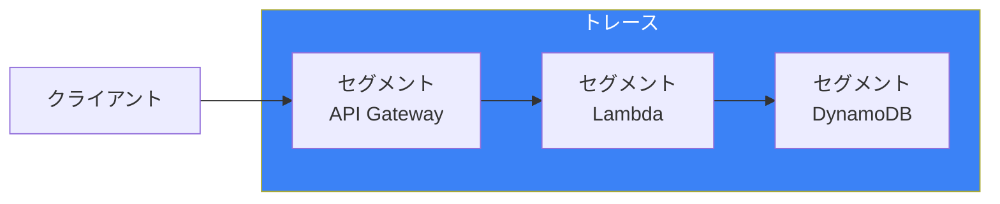
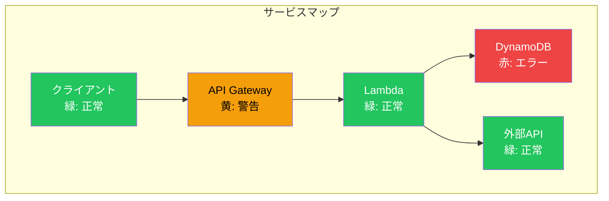
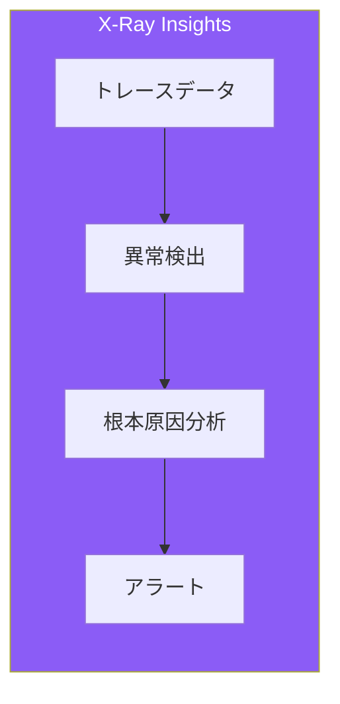
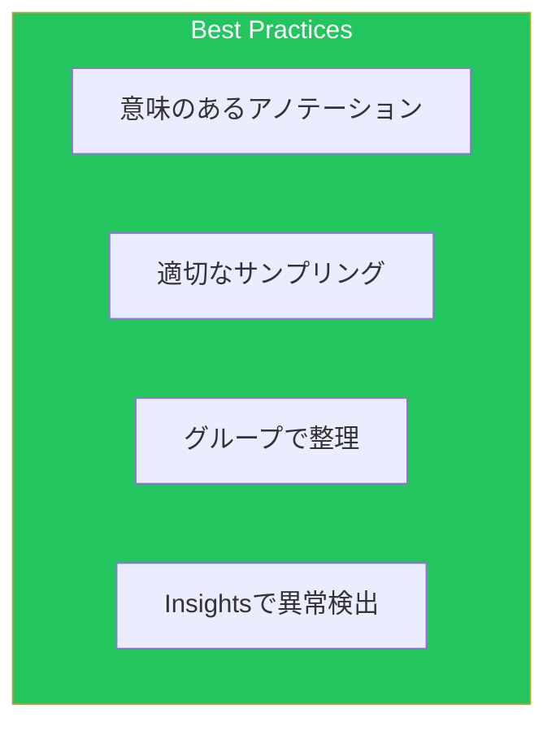

AWS X-Rayは、分散アプリケーションのリクエストフローを可視化するサービスです。本記事では、効果的なトレーシング実装と分析手法を解説します。

## 分散トレーシングの概念



### トレース構造

| 用語 | 説明 |
|------|------|
| トレース | 1つのリクエストの全体フロー |
| セグメント | サービスごとの処理単位 |
| サブセグメント | セグメント内の詳細な処理 |
| アノテーション | 検索可能なキー値ペア |
| メタデータ | 追加情報（検索不可） |

## SDK計装

### Python計装

```python
from aws_xray_sdk.core import xray_recorder
from aws_xray_sdk.core import patch_all
import boto3

# 自動パッチ（boto3, requests, mysqlなど）
patch_all()

# DynamoDBクライアント（自動的にトレースされる）
dynamodb = boto3.resource('dynamodb')
table = dynamodb.Table('my-table')

@xray_recorder.capture('process_order')
def process_order(order_id):
    # サブセグメント作成
    subsegment = xray_recorder.begin_subsegment('validate_order')
    try:
        # アノテーション（検索可能）
        subsegment.put_annotation('order_id', order_id)
        subsegment.put_annotation('order_type', 'standard')

        # メタデータ（詳細情報）
        subsegment.put_metadata('order_details', {
            'items': ['item1', 'item2'],
            'total': 1000
        })

        # ビジネスロジック
        result = validate_order(order_id)

    except Exception as e:
        subsegment.add_exception(e)
        raise
    finally:
        xray_recorder.end_subsegment()

    return result

def lambda_handler(event, context):
    # Lambda環境では自動的にセグメントが作成される
    order_id = event.get('order_id')

    # カスタムサブセグメント
    with xray_recorder.in_subsegment('fetch_order') as subsegment:
        response = table.get_item(Key={'order_id': order_id})
        subsegment.put_annotation('found', 'Item' in response)

    return process_order(order_id)
```

### Node.js計装

```javascript
const AWSXRay = require('aws-xray-sdk-core');
const AWS = AWSXRay.captureAWS(require('aws-sdk'));

// HTTP/HTTPSリクエストをキャプチャ
AWSXRay.captureHTTPsGlobal(require('http'));
AWSXRay.captureHTTPsGlobal(require('https'));

const dynamodb = new AWS.DynamoDB.DocumentClient();

exports.handler = async (event) => {
    const segment = AWSXRay.getSegment();

    // カスタムサブセグメント
    const subsegment = segment.addNewSubsegment('processOrder');

    try {
        // アノテーション追加
        subsegment.addAnnotation('orderId', event.orderId);
        subsegment.addAnnotation('environment', process.env.ENV);

        // メタデータ追加
        subsegment.addMetadata('request', event);

        // DynamoDB操作（自動トレース）
        const result = await dynamodb.get({
            TableName: 'orders',
            Key: { order_id: event.orderId }
        }).promise();

        // 外部API呼び出し（自動トレース）
        const response = await fetch('https://api.example.com/verify');

        subsegment.addMetadata('response', result);
        return result.Item;

    } catch (error) {
        subsegment.addError(error);
        throw error;
    } finally {
        subsegment.close();
    }
};
```

### Java計装

```java
import com.amazonaws.xray.AWSXRay;
import com.amazonaws.xray.entities.Subsegment;
import com.amazonaws.xray.handlers.TracingHandler;

public class OrderService {

    private final DynamoDbClient dynamoDb;

    public OrderService() {
        // X-Ray計装付きDynamoDBクライアント
        this.dynamoDb = DynamoDbClient.builder()
            .overrideConfiguration(c -> c.addExecutionInterceptor(
                new TracingInterceptor()))
            .build();
    }

    public Order processOrder(String orderId) {
        // サブセグメント作成
        Subsegment subsegment = AWSXRay.beginSubsegment("processOrder");
        try {
            // アノテーション
            subsegment.putAnnotation("orderId", orderId);

            // ビジネスロジック
            Order order = fetchOrder(orderId);
            validateOrder(order);

            // メタデータ
            subsegment.putMetadata("order", order);

            return order;

        } catch (Exception e) {
            subsegment.addException(e);
            throw e;
        } finally {
            AWSXRay.endSubsegment();
        }
    }
}
```

## Lambda Powertools統合

```python
from aws_lambda_powertools import Tracer
from aws_lambda_powertools.utilities.typing import LambdaContext

tracer = Tracer(service="order-service")

@tracer.capture_lambda_handler
def lambda_handler(event: dict, context: LambdaContext):
    order_id = event.get('order_id')

    # アノテーション追加
    tracer.put_annotation(key="order_id", value=order_id)

    order = get_order(order_id)
    result = process_order(order)

    return {"statusCode": 200, "body": result}

@tracer.capture_method
def get_order(order_id: str) -> dict:
    """このメソッドは自動的にサブセグメントとして記録される"""
    tracer.put_metadata(key="order_id", value=order_id)

    # DynamoDB操作
    response = table.get_item(Key={'order_id': order_id})
    return response.get('Item')

@tracer.capture_method
def process_order(order: dict) -> str:
    # カスタムサブセグメント
    with tracer.provider.in_subsegment("validate") as subsegment:
        subsegment.put_annotation("validation_type", "full")
        validate(order)

    return "processed"
```

## サンプリングルール

### サンプリング設定

```json
{
  "version": 2,
  "default": {
    "fixed_target": 1,
    "rate": 0.05
  },
  "rules": [
    {
      "description": "High priority APIs",
      "host": "*",
      "http_method": "*",
      "url_path": "/api/orders/*",
      "fixed_target": 10,
      "rate": 0.10,
      "service_name": "order-service",
      "service_type": "AWS::Lambda::Function"
    },
    {
      "description": "Error traces",
      "host": "*",
      "http_method": "*",
      "url_path": "*",
      "fixed_target": 100,
      "rate": 1.0,
      "attributes": {
        "http.status_code": "5*"
      }
    },
    {
      "description": "Health checks - minimal sampling",
      "host": "*",
      "http_method": "GET",
      "url_path": "/health",
      "fixed_target": 0,
      "rate": 0.0
    }
  ]
}
```

### CloudFormation定義

```yaml
SamplingRule:
  Type: AWS::XRay::SamplingRule
  Properties:
    SamplingRule:
      RuleName: order-api-rule
      Priority: 1000
      FixedRate: 0.1
      ReservoirSize: 10
      ServiceName: order-service
      ServiceType: AWS::Lambda::Function
      Host: "*"
      HTTPMethod: "*"
      URLPath: "/api/orders/*"
      Version: 1

HighPrioritySamplingRule:
  Type: AWS::XRay::SamplingRule
  Properties:
    SamplingRule:
      RuleName: critical-transactions
      Priority: 100
      FixedRate: 1.0
      ReservoirSize: 100
      ServiceName: "*"
      ServiceType: "*"
      Host: "*"
      HTTPMethod: "POST"
      URLPath: "/api/payments/*"
      Version: 1
```

## サービスマップ

### サービスマップの読み方



### グループ設定

```yaml
XRayGroup:
  Type: AWS::XRay::Group
  Properties:
    GroupName: production-services
    FilterExpression: |
      service(id(name: "order-service")) AND
      annotation.environment = "production"
    InsightsConfiguration:
      InsightsEnabled: true
      NotificationsEnabled: true

ErrorGroup:
  Type: AWS::XRay::Group
  Properties:
    GroupName: error-traces
    FilterExpression: |
      error = true OR fault = true
    InsightsConfiguration:
      InsightsEnabled: true
```

## X-Ray Insights

### 異常検出



### Insights設定

```yaml
# グループでInsightsを有効化
InsightsGroup:
  Type: AWS::XRay::Group
  Properties:
    GroupName: insights-enabled-group
    FilterExpression: "service(id(type: \"AWS::Lambda::Function\"))"
    InsightsConfiguration:
      InsightsEnabled: true
      NotificationsEnabled: true

# SNS通知設定
InsightsNotification:
  Type: AWS::Events::Rule
  Properties:
    EventPattern:
      source:
        - aws.xray
      detail-type:
        - X-Ray Insight Update
    Targets:
      - Id: SendToSNS
        Arn: !Ref AlertTopic
```

## トレース分析クエリ

### フィルター式

```bash
# エラートレースの検索
annotation.order_id = "12345" AND error = true

# 特定サービスの遅延トレース
service(id(name: "order-service")) AND responsetime > 5

# 特定ユーザーのトレース
annotation.user_id = "user123" AND service(id(type: "AWS::Lambda::Function"))

# 障害トレースの詳細
fault = true AND service(id(name: "payment-service"))

# 特定期間の高レイテンシ
responsetime > 3 AND annotation.environment = "production"
```

### AWS CLI分析

```bash
# トレースサマリーの取得
aws xray get-trace-summaries \
    --start-time $(date -d '1 hour ago' -u +%Y-%m-%dT%H:%M:%SZ) \
    --end-time $(date -u +%Y-%m-%dT%H:%M:%SZ) \
    --filter-expression 'fault = true'

# 特定トレースの詳細取得
aws xray batch-get-traces \
    --trace-ids 1-12345678-abcdef123456789

# サービスグラフの取得
aws xray get-service-graph \
    --start-time $(date -d '1 hour ago' -u +%Y-%m-%dT%H:%M:%SZ) \
    --end-time $(date -u +%Y-%m-%dT%H:%M:%SZ) \
    --group-name production-services
```

## ECS/EKS統合

### ECSサイドカー設定

```yaml
TaskDefinition:
  Type: AWS::ECS::TaskDefinition
  Properties:
    Family: my-app
    NetworkMode: awsvpc
    ContainerDefinitions:
      - Name: app
        Image: !Sub ${AWS::AccountId}.dkr.ecr.${AWS::Region}.amazonaws.com/my-app:latest
        Essential: true
        Environment:
          - Name: AWS_XRAY_DAEMON_ADDRESS
            Value: "localhost:2000"
        DependsOn:
          - ContainerName: xray-daemon
            Condition: START

      - Name: xray-daemon
        Image: amazon/aws-xray-daemon
        Essential: true
        PortMappings:
          - ContainerPort: 2000
            Protocol: udp
        Cpu: 32
        MemoryReservation: 256
        LogConfiguration:
          LogDriver: awslogs
          Options:
            awslogs-group: /ecs/xray-daemon
            awslogs-region: !Ref AWS::Region
            awslogs-stream-prefix: xray
```

### EKS DaemonSet

```yaml
apiVersion: apps/v1
kind: DaemonSet
metadata:
  name: xray-daemon
  namespace: kube-system
spec:
  selector:
    matchLabels:
      app: xray-daemon
  template:
    metadata:
      labels:
        app: xray-daemon
    spec:
      serviceAccountName: xray-daemon
      containers:
        - name: xray-daemon
          image: amazon/aws-xray-daemon
          ports:
            - containerPort: 2000
              protocol: UDP
          resources:
            requests:
              cpu: 50m
              memory: 64Mi
            limits:
              cpu: 100m
              memory: 128Mi
          env:
            - name: AWS_REGION
              value: ap-northeast-1
      hostNetwork: true
---
apiVersion: v1
kind: Service
metadata:
  name: xray-daemon
  namespace: kube-system
spec:
  selector:
    app: xray-daemon
  ports:
    - port: 2000
      protocol: UDP
  clusterIP: None
```

## API Gateway統合

### トレーシング有効化

```yaml
RestApi:
  Type: AWS::ApiGateway::RestApi
  Properties:
    Name: my-api

Stage:
  Type: AWS::ApiGateway::Stage
  Properties:
    RestApiId: !Ref RestApi
    StageName: prod
    TracingEnabled: true
    MethodSettings:
      - HttpMethod: "*"
        ResourcePath: "/*"
        DataTraceEnabled: true
        LoggingLevel: INFO
        MetricsEnabled: true
```

## ベストプラクティス



| カテゴリ | 項目 |
|---------|------|
| 計装 | 重要な操作にアノテーション付与 |
| サンプリング | 優先度に応じたルール設計 |
| 分析 | グループでサービス整理 |
| 運用 | Insightsで自動異常検出 |

## まとめ

| 機能 | 用途 |
|------|------|
| セグメント/サブセグメント | リクエストフローの可視化 |
| アノテーション | 検索可能なメタデータ |
| サンプリング | トレース量の制御 |
| Insights | 自動異常検出と根本原因分析 |

X-Rayを活用することで、マイクロサービスアーキテクチャのパフォーマンス問題を効率的に特定できます。

## 参考資料

- [AWS X-Ray Developer Guide](https://docs.aws.amazon.com/xray/latest/devguide/)
- [X-Ray SDK for Python](https://docs.aws.amazon.com/xray/latest/devguide/xray-sdk-python.html)
- [Lambda Powertools Tracer](https://docs.powertools.aws.dev/lambda/python/latest/core/tracer/)
