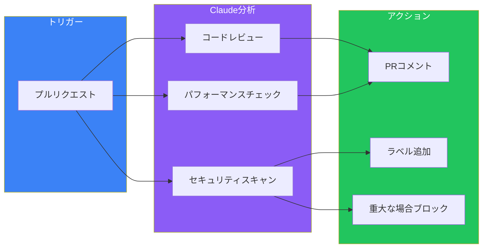
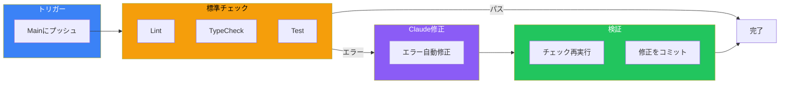

Claude Codeは対話型の開発ツールだけではありません—CI/CDパイプラインでプログラム的に実行でき、大規模なAI駆動の自動化を可能にします。ヘッドレスモードを使用して、コードレビュー、リントエラーの修正、ドキュメント生成、Issue分類などを自動化できます。

## ヘッドレスモードを理解する

ヘッドレスモードは、`-p`（または`--print`）フラグを使用してClaude Codeを非対話的に実行します。対話型セッションの代わりに、プロンプトを直接渡します：

```bash
claude -p "このPRの変更を要約して"
```

Claudeはプロンプトを処理し、必要なツールを実行し、結果を返します—すべて人間の介入なしで。

### 基本的な使用方法

```bash
# シンプルなクエリ
claude -p "認証モジュールは何をしている？"

# ツール権限付き
claude -p "src/のリントエラーを修正して" --allowedTools "Read,Edit,Bash(npm run lint)"

# 出力形式指定
claude -p "エクスポートされた関数をすべてリスト" --output-format json
```

## 出力形式

ヘッドレスモードは異なる自動化ニーズに対応する複数の出力形式をサポートします：

### プレーンテキスト（デフォルト）
```bash
claude -p "READMEを要約して" --output-format text
```

PRコメントに表示するのに最適な人間が読めるテキストを返します。

### メタデータ付きJSON
```bash
claude -p "コードを分析して" --output-format json
```

結果、セッションID、使用量メトリクスを含む構造化JSONを返します：

```json
{
  "result": "認証モジュールはJWTトークンを使用して...",
  "session_id": "abc123",
  "usage": {
    "input_tokens": 1500,
    "output_tokens": 450
  }
}
```

### スキーマ付き構造化JSON
```bash
claude -p "auth.tsから関数名を抽出して" \
  --output-format json \
  --json-schema '{"type":"object","properties":{"functions":{"type":"array","items":{"type":"string"}}}}'
```

指定したJSONスキーマに準拠した出力を強制します—自動化スクリプトでのパースに最適。

### ストリームJSON
```bash
claude -p "レポートを生成して" --output-format stream-json
```

リアルタイム処理用の改行区切りJSONを返します。

## ツール権限

デフォルトでは、Claude Codeはファイルを変更したりコマンドを実行するツールを使用できません。特定の権限を付与するには`--allowedTools`を使用：

```bash
claude -p "TypeScriptエラーを修正して" \
  --allowedTools "Read,Edit,Bash(npm run typecheck)"
```

### 権限パターン

```bash
# 特定のツールを許可
--allowedTools "Read,Edit,Write"

# 特定のbashコマンドを許可
--allowedTools "Bash(npm run lint),Bash(npm run test)"

# globパターンでbashを許可
--allowedTools "Bash(git diff:*),Bash(git log:*)"
```

### 安全性の考慮事項

**権限は保守的に。** CI/CD環境では：

- タスクに絶対必要なツールのみを許可
- 可能な限り読み取り専用操作を優先
- 無制限の`Bash`アクセスを避ける
- ワイルドカードではなく特定のコマンドパターンを使用

## GitHub Actions連携

### 自動コードレビュー

```yaml
name: AI Code Review

on:
  pull_request:
    types: [opened, synchronize]

jobs:
  review:
    runs-on: ubuntu-latest
    steps:
      - uses: actions/checkout@v4
        with:
          fetch-depth: 0

      - name: Install Claude Code
        run: npm install -g @anthropic-ai/claude-code

      - name: Run AI Review
        env:
          ANTHROPIC_API_KEY: ${{ secrets.ANTHROPIC_API_KEY }}
        run: |
          # diffを取得
          git diff origin/main...HEAD > changes.diff

          # Claudeレビューを実行
          claude -p "このdiffを以下の観点でレビューして：
          1. 潜在的なバグ
          2. セキュリティ脆弱性
          3. パフォーマンス問題
          4. コードスタイル違反

          行番号と提案を具体的に。

          $(cat changes.diff)" \
            --output-format json > review.json

      - name: Post Review Comment
        uses: actions/github-script@v7
        with:
          script: |
            const review = require('./review.json');
            github.rest.issues.createComment({
              owner: context.repo.owner,
              repo: context.repo.repo,
              issue_number: context.issue.number,
              body: `## AIコードレビュー\n\n${review.result}`
            });
```

### 自動リント修正

```yaml
name: Auto-fix Lint Errors

on:
  push:
    branches: [main]

jobs:
  lint-fix:
    runs-on: ubuntu-latest
    steps:
      - uses: actions/checkout@v4

      - name: Setup Node
        uses: actions/setup-node@v4
        with:
          node-version: '20'

      - name: Install Dependencies
        run: npm ci

      - name: Install Claude Code
        run: npm install -g @anthropic-ai/claude-code

      - name: Fix Lint Errors
        env:
          ANTHROPIC_API_KEY: ${{ secrets.ANTHROPIC_API_KEY }}
        run: |
          claude -p "npm run lintを実行し、見つかったエラーを修正して。
          修正後、再度lintを実行してすべてのエラーが解決されたことを確認。" \
            --allowedTools "Read,Edit,Bash(npm run lint)"

      - name: Commit Fixes
        run: |
          git config user.name "github-actions[bot]"
          git config user.email "github-actions[bot]@users.noreply.github.com"
          git add -A
          git diff --staged --quiet || git commit -m "fix: auto-fix lint errors"
          git push
```

### Issue分類

```yaml
name: Issue Triage

on:
  issues:
    types: [opened]

jobs:
  triage:
    runs-on: ubuntu-latest
    steps:
      - uses: actions/checkout@v4

      - name: Install Claude Code
        run: npm install -g @anthropic-ai/claude-code

      - name: Analyze Issue
        env:
          ANTHROPIC_API_KEY: ${{ secrets.ANTHROPIC_API_KEY }}
        id: analyze
        run: |
          claude -p "このGitHub issueを分析して以下を提案：
          1. 適切なラベル（bug、feature、documentationなど）
          2. 優先度（high、medium、low）
          3. 関連しそうなファイル/コードベースの領域

          Issueタイトル: ${{ github.event.issue.title }}
          Issue本文: ${{ github.event.issue.body }}" \
            --output-format json \
            --json-schema '{
              "type": "object",
              "properties": {
                "labels": {"type": "array", "items": {"type": "string"}},
                "priority": {"type": "string"},
                "files": {"type": "array", "items": {"type": "string"}}
              }
            }' > analysis.json

      - name: Apply Labels
        uses: actions/github-script@v7
        with:
          script: |
            const analysis = require('./analysis.json');
            await github.rest.issues.addLabels({
              owner: context.repo.owner,
              repo: context.repo.repo,
              issue_number: context.issue.number,
              labels: analysis.structured_output.labels
            });
```

## CI/CDアーキテクチャパターン

### レビューパイプライン



### 修正パイプライン



## セッション管理

複数ステップのワークフローでは、コマンド間で会話コンテキストを維持：

```bash
# 最初のステップ: 分析
result=$(claude -p "この出力のテスト失敗を分析: $(npm run test 2>&1)" \
  --output-format json)

session_id=$(echo $result | jq -r '.session_id')

# 2番目のステップ: 修正（会話を継続）
claude -p "特定した問題を修正して" \
  --resume "$session_id" \
  --allowedTools "Read,Edit"

# 3番目のステップ: 検証
claude -p "テストを再実行して修正を確認" \
  --resume "$session_id" \
  --allowedTools "Bash(npm run test)"
```

## カスタムシステムプロンプト

特定のCI/CDタスク用にClaudeの動作をカスタマイズ：

### デフォルトプロンプトに追加
```bash
claude -p "このコードをレビュー" \
  --append-system-prompt "あなたはセキュリティ重視のコードレビュアーです。
  潜在的なセキュリティ脆弱性の特定を優先してください。"
```

### デフォルトプロンプトを置き換え
```bash
claude -p "このコードを分析" \
  --system-prompt "あなたはパフォーマンス最適化の専門家です。
  パフォーマンス関連の問題のみに焦点を当ててください。スタイルやフォーマットは無視。"
```

## ベストプラクティス

### ジョブを高速に保つ

レビュージョブは最大3-5分を目標：

```yaml
- name: Run AI Review
  timeout-minutes: 5
  run: |
    claude -p "重大な問題のみのクイックレビュー" \
      --max-output-tokens 1000
```

### 品質ゲートを使用

AI修正後に標準チェックを必須化：

```yaml
- name: AI Fix
  run: claude -p "エラーを修正" --allowedTools "Read,Edit,Bash(npm run fix)"

- name: Verify Build
  run: npm run build

- name: Verify Tests
  run: npm run test

- name: Verify Lint
  run: npm run lint
```

### 失敗を優雅に処理

```yaml
- name: AI Review
  id: review
  continue-on-error: true
  run: claude -p "コードをレビュー" --output-format json > review.json

- name: Fallback Comment
  if: steps.review.outcome == 'failure'
  run: echo "AIレビューは利用できません" > review.json
```

### スコープを制限

1つのステップでClaudeに多くを求めすぎない：

```bash
# 悪い: 広すぎる
claude -p "すべてをレビューしてすべての問題を修正"

# 良い: 焦点を絞る
claude -p "src/api/でSQLインジェクションの脆弱性をチェック"
```

### APIキーを安全に

APIキーをハードコードしない。シークレット管理を使用：

```yaml
env:
  ANTHROPIC_API_KEY: ${{ secrets.ANTHROPIC_API_KEY }}
```

## 一般的なユースケース

| ユースケース | トリガー | 必要な権限 |
|-------------|---------|-----------|
| コードレビュー | PRオープン | 読み取りのみ |
| リント修正 | mainへプッシュ | Read、Edit、Bash(lint) |
| テスト分析 | テスト失敗 | 読み取りのみ |
| ドキュメント | リリースタグ | Read、Write |
| Issue分類 | Issueオープン | 読み取りのみ |
| 依存関係更新 | スケジュール | Read、Edit、Bash |

## 制限と考慮事項

### 認証

一部の環境では対話型ログインが必要です。CI環境に適切なAPIキー設定があることを確認。

### コスト管理

Claude API呼び出しにはコストがかかります。以下を実装：
- ジョブごとのトークン制限
- ジョブ頻度制限
- コスト監視とアラート

### 決定性

AI出力は実行ごとに異なる可能性があります。重要なパイプラインでは：
- 構造化出力スキーマを使用
- 検証チェックを実装
- フォールバック動作を用意

## まとめ

ヘッドレスモードはClaude CodeをCI/CD自動化ツールに変えます：

| コンポーネント | 目的 | 主要フラグ |
|--------------|------|-----------|
| `-p`フラグ | 非対話型実行 | 必須 |
| `--allowedTools` | 権限制御 | 安全性 |
| `--output-format` | 構造化出力 | 統合 |
| `--resume` | 複数ステップワークフロー | コンテキスト |
| `--json-schema` | 予測可能な出力 | パース |

主要な原則：

- **権限は保守的に**: 必要なものだけを付与
- **ジョブは焦点を絞る**: Claude呼び出しごとに1つのタスク
- **変更後に検証**: 常に標準チェックを実行
- **失敗を優雅に処理**: フォールバック動作を用意
- **コストを監視**: CIでのAPI使用量を追跡

CI/CDでのClaude Codeは、静的解析を超えたインテリジェントな自動化を可能にします—セマンティックにコードをレビューし、コンテキストに応じて問題を修正し、理解を持って分類します。

## 参考資料

- [Claude Code Headless Mode Documentation](https://code.claude.com/docs/en/headless)
- [GitHub Actions Documentation](https://docs.github.com/en/actions)
- [Claude Code Best Practices](https://www.anthropic.com/engineering/claude-code-best-practices)
