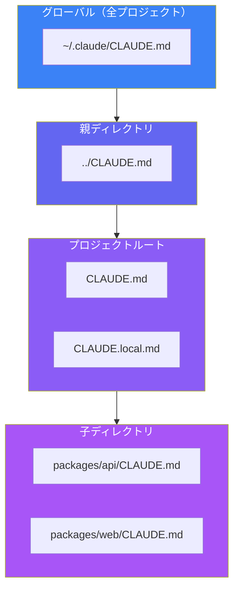
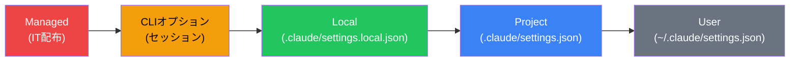

Claude Codeは適切に設定することで、劇的に効果的になります。すぐに使い始めることもできますが、CLAUDE.mdファイルと設定を整えることで、汎用的なAIアシスタントから、プロジェクトを真に理解する開発パートナーへと変貌します。

## なぜ設定が重要なのか

すべての開発プロジェクトには、固有の規約、ツール、制約があります。設定なしでは、Claude Codeは以下について何も知らない状態で各セッションを開始します：

- プロジェクト構造と重要なファイル
- コードスタイルと命名規則
- テストフレームワークとコマンド
- ビルドとデプロイのプロセス
- チーム固有のガイドライン

設定に投資することで、これらの詳細を繰り返し説明する必要がなくなります。Claude Codeは起動時に設定を読み込み、最初のプロンプトからすべてのやり取りがより生産的になります。

## CLAUDE.mdを理解する

CLAUDE.mdは、Claude Codeがセッション開始時に自動的に読み込む特別なドキュメントファイルです。Claudeのシステムプロンプトの一部となり、プロジェクトに関する永続的なコンテキストを提供します。

### 何を含めるべきか

CLAUDE.mdは、人間とClaude両方がすぐに理解する必要があるドキュメントと考えてください：

**プロジェクトコンテキスト**
```markdown
# プロジェクト概要
これはApp Routerを使用したNext.js 14のECプラットフォームです。
主要ディレクトリ：
- `src/app/` - ルートとページ
- `src/components/` - Reactコンポーネント
- `src/lib/` - ユーティリティ関数とAPIクライアント
```

**コードスタイルガイドライン**
```markdown
## コードスタイル
- フックを使用した関数コンポーネント
- default exportよりnamed exportを優先
- TypeScript strictモード使用
- 2スペースインデント
- セミコロンなし（Prettier設定済み）
```

**よく使うコマンド**
```markdown
## コマンド
- `npm run dev` - 開発サーバー起動
- `npm run build` - 本番ビルド
- `npm run test` - Jestテスト実行
- `npm run lint` - ESLintチェック
```

**テスト指示**
```markdown
## テスト
- コンポーネントテストにはReact Testing Libraryを使用
- 外部APIコールはMSWでモック
- テストはソースと同じ場所の`__tests__`ディレクトリに配置
- `npm run test:coverage`でカバレッジレポート
```

**重要な警告**
```markdown
## 重要な注意事項
- `.env.local`は絶対にコミットしない - 本番シークレットを含む
- `legacy/`ディレクトリは非推奨 - 変更禁止
- コミット前に必ず`npm run typecheck`を実行
```

### ファイル配置の階層

Claude Codeは複数のCLAUDE.mdファイルをサポートし、異なるレベルでコンテキストを整理できます：



| 配置場所 | 目的 | チームと共有？ |
|----------|------|----------------|
| `~/.claude/CLAUDE.md` | 全プロジェクト共通の個人設定 | いいえ |
| `../CLAUDE.md` | モノレポレベルのコンテキスト | はい |
| `CLAUDE.md` | プロジェクト固有のコンテキスト | はい（gitにコミット） |
| `CLAUDE.local.md` | 個人的なオーバーライド | いいえ（gitignore） |
| `packages/*/CLAUDE.md` | パッケージ固有のコンテキスト | はい |

### CLAUDE.mdの更新

CLAUDE.mdは2つの方法で更新できます：

**手動編集**: ファイルを開いて直接内容を追加。

**`#`キーの使用**: Claude Code内で`#`を押すと、Claudeが自動的にCLAUDE.mdに追加する指示を与えられます：

```
# パッケージ管理にはnpmではなくpnpmを常に使用する
```

このアプローチは、作業中に決定事項を記録するのに便利で、将来のセッションでも確実に維持されます。

## 設定ファイル

CLAUDE.md以外に、Claude CodeはJSON設定ファイルを使用してより構造化された設定を行います。

### 設定の階層



優先度の高い設定が低いものを上書きします。これにより：
- ITチームがmanaged設定でセキュリティポリシーを強制
- 開発者がプロジェクト設定をローカルでオーバーライド
- チームがプロジェクト設定で共通設定を共有

### 基本的な設定構造

```json
{
  "permissions": {
    "allow": [],
    "ask": [],
    "deny": []
  },
  "env": {},
  "model": "claude-sonnet-4-5-20250929",
  "hooks": {}
}
```

## パーミッション管理

パーミッションは、Claude Codeが使用できるツールを制御します。適切なパーミッション設定は、生産性と安全性のバランスを取ります。

### パーミッションルール

**allow**: Claudeは確認なしでこれらのツールを使用できます。
```json
{
  "permissions": {
    "allow": [
      "Bash(npm run lint)",
      "Bash(npm run test:*)",
      "Bash(git diff:*)",
      "Read(src/**)",
      "Edit(src/**)"
    ]
  }
}
```

**ask**: Claudeはこれらのツール使用前に確認を求めます。
```json
{
  "permissions": {
    "ask": [
      "Bash(git push:*)",
      "Bash(npm publish:*)"
    ]
  }
}
```

**deny**: Claudeはリクエストされてもこれらのツールを使用できません。
```json
{
  "permissions": {
    "deny": [
      "Read(./.env)",
      "Read(./.env.*)",
      "Read(./secrets/**)",
      "Bash(curl:*)",
      "Bash(rm -rf:*)"
    ]
  }
}
```

### パーミッションパターン

パーミッションは柔軟なマッチングのためにglobパターンをサポートします：

| パターン | マッチ対象 |
|---------|---------|
| `Bash(npm run:*)` | 任意のnpm runコマンド |
| `Read(src/**)` | src内のすべてのファイル（再帰的） |
| `Edit(*.ts)` | カレントディレクトリのTypeScriptファイル |
| `Bash(git diff:*)` | 任意のgit diffコマンド |

### 推奨セキュリティ設定

```json
{
  "permissions": {
    "allow": [
      "Bash(npm run lint)",
      "Bash(npm run test)",
      "Bash(npm run build)",
      "Bash(git status)",
      "Bash(git diff:*)",
      "Bash(git log:*)",
      "Read(src/**)",
      "Edit(src/**)",
      "Read(tests/**)",
      "Edit(tests/**)"
    ],
    "deny": [
      "Read(.env)",
      "Read(.env.*)",
      "Read(secrets/**)",
      "Read(**/*credentials*)",
      "Bash(curl:*)",
      "Bash(wget:*)",
      "WebFetch"
    ]
  }
}
```

## 環境変数

Claude Codeは一貫したセッションセットアップのために環境変数設定をサポートします：

```json
{
  "env": {
    "NODE_ENV": "development",
    "DEBUG": "true",
    "API_BASE_URL": "http://localhost:3000"
  }
}
```

### 便利な環境変数

| 変数 | 目的 | 例 |
|------|------|-----|
| `ANTHROPIC_MODEL` | デフォルトモデル | `claude-sonnet-4-5-20250929` |
| `BASH_DEFAULT_TIMEOUT_MS` | コマンドタイムアウト | `30000` |
| `MAX_MCP_OUTPUT_TOKENS` | MCP出力制限 | `25000` |
| `DISABLE_TELEMETRY` | テレメトリ無効化 | `1` |

## 帰属設定

Claude Codeの貢献をどのように帰属表示するかを制御します：

```json
{
  "attribution": {
    "commit": "Co-Authored-By: Claude <noreply@anthropic.com>",
    "pr": "Generated with Claude Code"
  }
}
```

帰属を非表示にする場合：
```json
{
  "attribution": {
    "commit": "",
    "pr": ""
  }
}
```

## 完全な設定例

すべての要素を組み合わせた包括的な例：

**CLAUDE.md**
```markdown
# ECプラットフォーム

## 概要
TypeScriptを使用したNext.js 14 ECプラットフォーム。

## 主要パス
- `src/app/` - App Routerページ
- `src/components/` - Reactコンポーネント
- `src/lib/api/` - APIクライアント
- `prisma/` - データベーススキーマ

## コマンド
- `pnpm dev` - 開発サーバー（ポート3000）
- `pnpm build` - 本番ビルド
- `pnpm test` - テスト実行
- `pnpm db:push` - スキーマ変更をプッシュ

## コードスタイル
- フック付き関数コンポーネント
- named export優先
- バリデーションにはZodを使用
- デフォルトでServer Components

## 重要
- コミット前に`pnpm typecheck`を実行
- `src/lib/legacy/`は変更禁止
- テストではMSWを使用してStripeをモック
```

**`.claude/settings.json`**
```json
{
  "permissions": {
    "allow": [
      "Bash(pnpm:*)",
      "Bash(git diff:*)",
      "Bash(git status)",
      "Bash(git log:*)",
      "Read(src/**)",
      "Edit(src/**)",
      "Read(prisma/**)",
      "Edit(prisma/**)"
    ],
    "deny": [
      "Read(.env*)",
      "Read(secrets/**)",
      "Bash(curl:*)",
      "Bash(wget:*)"
    ]
  },
  "env": {
    "NODE_ENV": "development"
  },
  "model": "claude-sonnet-4-5-20250929"
}
```

## ベストプラクティス

### CLAUDE.mdは簡潔に

CLAUDE.mdはClaudeのプロンプトの一部となり、コンテキストウィンドウのスペースを消費します。Claudeが頻繁に必要とする情報に焦点を当てます：

- 必須のコマンドとパス
- 重要な規約
- 避けるべき一般的な落とし穴

すべてを文書化しようとせず、詳細な情報は外部ドキュメントへのリンクで対応します。

### 反復と改善

設定は進化すべきです。Claudeに繰り返し説明していることに気づいたら：

1. `#`キーでCLAUDE.mdに追加
2. 指示を確認し改善
3. 変更をコミットしてチームに共有

### シークレットは含めない

CLAUDE.mdや設定ファイルに機密情報を絶対に入れないでください：

- APIキーとトークン
- データベース接続文字列
- パスワードと認証情報
- セキュリティ脆弱性の詳細

これらのファイルはバージョン管理にコミットされたり、プロンプトの一部になる可能性があります。

### ローカルオーバーライドを使用

チームに影響を与えるべきではない個人設定には：

- 個人的な指示用に`CLAUDE.local.md`を作成
- 個人設定用に`.claude/settings.local.json`を使用
- これらを`.gitignore`に追加

## まとめ

効果的なClaude Code設定は開発体験を変革します：

| 設定 | 目的 | 配置場所 |
|------|------|---------|
| CLAUDE.md | プロジェクトコンテキストとガイドライン | プロジェクトルート |
| settings.json | パーミッションと動作 | `.claude/`ディレクトリ |
| 環境変数 | ランタイム設定 | settingsの`env` |
| ローカルオーバーライド | 個人設定 | `.local`バリアント |

主要な原則：

- **事前に投資**: 良い設定はすべてのセッションで配当を生む
- **焦点を絞る**: Claudeが頻繁に必要とするものだけを含める
- **継続的に改善**: 何が効果的かを発見しながら改善
- **シークレットを保護**: 設定ファイルに機密データを含めない
- **チームと共有**: 共有設定をバージョン管理にコミット

適切に設定されたClaude Code環境は、プロジェクトをすでに理解している同僚と作業しているような感覚です—なぜなら、実際に理解しているからです。

## 参考資料

- [Claude Code Settings Documentation](https://code.claude.com/docs/en/settings)
- [Claude Code Best Practices](https://www.anthropic.com/engineering/claude-code-best-practices)
