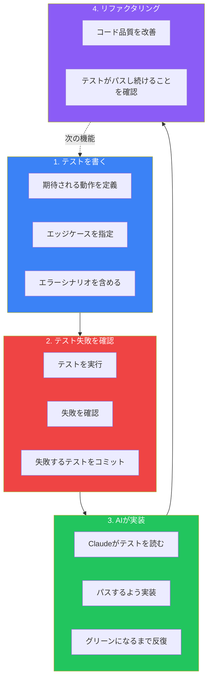

テスト駆動開発（TDD）とClaude Codeは強力な組み合わせです。テストを先に書くと、Claude Codeが実装できる曖昧さのない仕様が作成されます。このアプローチは誤解を劇的に減らし、最初の試行でより高品質なコードを生成します。

## なぜTDDはAIとより良く機能するか

従来のAI開発は、曖昧さに悩まされることが多いです。Claude Codeに「ユーザー登録機能を実装して」と依頼すると、多くの解釈が可能です：

- どのバリデーションルールが適用される？
- エラーはどう処理すべき？
- 戻り値の型は？
- どのエッジケースが重要？

自然言語は不正確です。テストは正確です。テストを先に書くと：

```typescript
describe('registerUser', () => {
  it('should create a user with valid email and password', async () => {
    const result = await registerUser({
      email: 'test@example.com',
      password: 'SecurePass123!'
    });
    expect(result.success).toBe(true);
    expect(result.user.email).toBe('test@example.com');
  });

  it('should reject passwords shorter than 8 characters', async () => {
    const result = await registerUser({
      email: 'test@example.com',
      password: 'short'
    });
    expect(result.success).toBe(false);
    expect(result.error).toBe('Password must be at least 8 characters');
  });
});
```

「registerUser」が何をすべきかに曖昧さはありません。Claude Codeには実装すべき正確なターゲットがあります。

## Claude CodeでのTDDワークフロー



### ステップ1: テストを先に書く

期待される動作を定義する包括的なテストを書きます：

```
calculateShippingという関数のテストを書いて：
- 商品と配送先を含む注文オブジェクトを受け取る
- $100以上の注文は送料無料を返す
- $100未満のスタンダード配送は$5.99を返す
- エクスプレス配送は$15.99を返す
- 空の注文はエラーをスロー
- 無効な配送先はエラーをスロー

JestとTypeScriptを使用。関数はまだ実装しないで。
```

Claude Codeがテストを生成：

```typescript
// src/__tests__/calculateShipping.test.ts
import { calculateShipping, ShippingType } from '../calculateShipping';

describe('calculateShipping', () => {
  const validDestination = { country: 'US', zipCode: '10001' };

  describe('free shipping', () => {
    it('should return $0 for orders over $100', () => {
      const order = {
        items: [{ price: 150, quantity: 1 }],
        destination: validDestination
      };
      expect(calculateShipping(order, ShippingType.STANDARD)).toBe(0);
    });

    it('should return $0 for orders exactly $100', () => {
      const order = {
        items: [{ price: 100, quantity: 1 }],
        destination: validDestination
      };
      expect(calculateShipping(order, ShippingType.STANDARD)).toBe(0);
    });
  });

  describe('standard shipping', () => {
    it('should return $5.99 for orders under $100', () => {
      const order = {
        items: [{ price: 50, quantity: 1 }],
        destination: validDestination
      };
      expect(calculateShipping(order, ShippingType.STANDARD)).toBe(5.99);
    });
  });

  describe('express shipping', () => {
    it('should return $15.99 for express shipping', () => {
      const order = {
        items: [{ price: 50, quantity: 1 }],
        destination: validDestination
      };
      expect(calculateShipping(order, ShippingType.EXPRESS)).toBe(15.99);
    });

    it('should apply free shipping threshold to express orders', () => {
      const order = {
        items: [{ price: 150, quantity: 1 }],
        destination: validDestination
      };
      expect(calculateShipping(order, ShippingType.EXPRESS)).toBe(0);
    });
  });

  describe('error handling', () => {
    it('should throw an error for empty orders', () => {
      const order = { items: [], destination: validDestination };
      expect(() => calculateShipping(order, ShippingType.STANDARD))
        .toThrow('Order must contain at least one item');
    });

    it('should throw an error for invalid destination', () => {
      const order = {
        items: [{ price: 50, quantity: 1 }],
        destination: { country: '', zipCode: '' }
      };
      expect(() => calculateShipping(order, ShippingType.STANDARD))
        .toThrow('Invalid destination');
    });
  });
});
```

### ステップ2: テスト失敗を確認

実装前に、テストが期待通りに失敗することを確認：

```
テストを実行して失敗することを確認して。まだcalculateShippingを
実装していないので、すべてのテストが失敗するはず。
```

このステップで検証すること：
- テストが構文的に正しい
- テストが壊れた実装をキャッチする
- 正しいことをテストしている

失敗を確認後：

```
テストをコミット。メッセージ: "test: add calculateShipping tests"
```

失敗するテストをコミットすることで、チェックポイントを作成し意図を文書化します。

### ステップ3: Claudeに実装させる

次にClaude Codeに実装を依頼：

```
すべてのテストをパスするようにcalculateShipping関数を実装して。
まずテストファイルを読んで、正確な要件を理解して。
```

Claude Codeはテストを読んで実装：

```typescript
// src/calculateShipping.ts
export enum ShippingType {
  STANDARD = 'STANDARD',
  EXPRESS = 'EXPRESS'
}

interface OrderItem {
  price: number;
  quantity: number;
}

interface Destination {
  country: string;
  zipCode: string;
}

interface Order {
  items: OrderItem[];
  destination: Destination;
}

const FREE_SHIPPING_THRESHOLD = 100;
const STANDARD_SHIPPING_RATE = 5.99;
const EXPRESS_SHIPPING_RATE = 15.99;

export function calculateShipping(
  order: Order,
  shippingType: ShippingType
): number {
  // Validate order
  if (order.items.length === 0) {
    throw new Error('Order must contain at least one item');
  }

  // Validate destination
  if (!order.destination.country || !order.destination.zipCode) {
    throw new Error('Invalid destination');
  }

  // Calculate order total
  const orderTotal = order.items.reduce(
    (sum, item) => sum + item.price * item.quantity,
    0
  );

  // Free shipping for orders at or above threshold
  if (orderTotal >= FREE_SHIPPING_THRESHOLD) {
    return 0;
  }

  // Apply shipping rate based on type
  return shippingType === ShippingType.EXPRESS
    ? EXPRESS_SHIPPING_RATE
    : STANDARD_SHIPPING_RATE;
}
```

### ステップ4: テストを実行して反復

```
テストを実行してパスするか確認して。
```

テストがパスすれば完了！そうでなければClaude Codeが反復：

```
$100以上のエクスプレス配送のテストが失敗している。
テストの期待に合うよう実装を修正して。
```

### ステップ5: 自信を持ってリファクタリング

テストがパスしたら、テストがリグレッションをキャッチすることを知りつつリファクタリング：

```
calculateShippingをより読みやすくリファクタリングして。
各変更後にテストを実行してまだパスすることを確認して。
```

## オーバーフィッティングを防ぐ

AI駆動TDDの微妙なリスクは「オーバーフィッティング」—実装がテストをパスするが正しく一般化されない状態です。例えば、Claudeが期待値をハードコードする可能性があります。

### 独立した検証を使用

Anthropicは、作成と検証に別々のClaudeインスタンスを使用することを推奨しています：

```
テストに基づいてcalculateShippingを実装した。
新鮮なレビュアーとして、実装を批判的に検査して：
- 明示的にテストされていないケースを処理できる？
- オーバーフィッティングを示唆するハードコードされた値はある？
- この実装は実際の注文で機能する？
```

### プロパティベーステストを追加

例ベースのテストをプロパティベースのテストで補完：

```typescript
import fc from 'fast-check';

describe('calculateShipping properties', () => {
  it('should never return negative shipping', () => {
    fc.assert(
      fc.property(
        fc.array(fc.record({ price: fc.float({ min: 0 }), quantity: fc.integer({ min: 1 }) })),
        (items) => {
          if (items.length === 0) return true; // Skip empty orders
          const order = { items, destination: { country: 'US', zipCode: '10001' } };
          const shipping = calculateShipping(order, ShippingType.STANDARD);
          return shipping >= 0;
        }
      )
    );
  });

  it('should give free shipping for any order over threshold', () => {
    fc.assert(
      fc.property(
        fc.float({ min: 100.01, max: 10000 }),
        (price) => {
          const order = {
            items: [{ price, quantity: 1 }],
            destination: { country: 'US', zipCode: '10001' }
          };
          return calculateShipping(order, ShippingType.STANDARD) === 0;
        }
      )
    );
  });
});
```

## 異なるシナリオでのTDD

### APIエンドポイント

```
POST /api/users エンドポイントのテストを書いて：
- 有効なデータでユーザーを作成し201を返す
- 必須フィールドが欠けている場合400を返す
- 重複メールの場合409を返す
- 無効なメール形式の場合422を返す

supertestとjestを使用。エンドポイントはまだ実装しないで。
```

### Reactコンポーネント

```
LoginFormコンポーネントのテストを書いて：
- メールとパスワード入力をレンダリング
- 無効な入力でバリデーションエラーを表示
- ローディング中は送信ボタンを無効化
- フォームが有効な場合onSubmitを認証情報で呼び出す
- ログイン失敗時にエラーメッセージを表示

React Testing Libraryを使用。コンポーネントはまだ実装しないで。
```

### データベース操作

```
UserRepositoryクラスのテストを書いて：
- ユーザーを作成し作成されたレコードを返す
- メールでユーザーを検索
- ユーザープロフィールフィールドを更新
- ユーザーをソフトデリート（deletedAtを設定）
- 存在しないユーザーにはNotFoundErrorをスロー

テスト用にインメモリSQLiteデータベースを使用。まだ実装しないで。
```

## Claude CodeでのTDDの利点

### 曖昧さの削減

テストは解釈の違いを排除します。関数はパスするかしないかのどちらかです。

### より速い反復

実装がテストに失敗した場合、Claude Codeは曖昧な説明ではなく、何が間違っているかについて具体的なフィードバックを得ます。

### 組み込みドキュメント

テストは期待される動作の実行可能なドキュメントとして機能します。

### 変更への自信

将来の変更は、テストがリグレッションをキャッチすることを知りつつ行えます。

### より良いコード設計

テストを先に書くことで、実装開始前に設計上の問題が明らかになることが多いです。

## よくある落とし穴

### 実装に依存しすぎたテスト

**悪い例**: 内部実装の詳細をテスト
```typescript
it('should use the calculateTotal helper function', () => {
  // これはテストを実装に結合してしまう
});
```

**良い例**: 観察可能な動作をテスト
```typescript
it('should return the sum of all item prices', () => {
  const total = calculateOrderTotal(items);
  expect(total).toBe(150);
});
```

### エッジケース不足

ハッピーパスだけをテストしない：

```
エッジケースのテストを追加して：
- 非常に大きな注文の場合は？
- 浮動小数点精度の問題は？
- 数量がゼロの場合は？
- 負の価格は？
```

### 各変更後にテストを実行しない

```
今テストを実行して、最新の変更が何も壊していないか確認して。
```

これを各修正後の習慣にしましょう。

## まとめ

Claude CodeでのTDDは強力なフィードバックループを作成します：

| フェーズ | アクション | 利点 |
|---------|----------|------|
| **テストを書く** | 期待される動作を正確に定義 | 曖昧さを排除 |
| **失敗を確認** | テストが問題をキャッチすることを確認 | テストの正しさを検証 |
| **実装** | Claudeにテストをパスするよう実装させる | AIへの正確なターゲット |
| **リファクタリング** | テストのセーフティネットで改善 | 自信を持って改善 |

主要な原則：

- **テストは仕様**: コードが何をすべきかを正確に定義
- **失敗するテストをコミット**: 実装前にチェックポイントを作成
- **独立した検証**: オーバーフィッティングをキャッチするため別のレビューを使用
- **エッジケースが重要**: ハッピーパスだけをテストしない
- **素早く反復**: 各変更後にテストを実行

TDDはClaude Codeをコードジェネレーターから仕様実装者に変えます。明確なテストを提供すると、Claude Codeは最初から正しく動作する実装を提供します。

## 参考資料

- [Claude Code Best Practices](https://www.anthropic.com/engineering/claude-code-best-practices)
- [Test-Driven Development by Example](https://www.oreilly.com/library/view/test-driven-development/0321146530/) - Kent Beck
