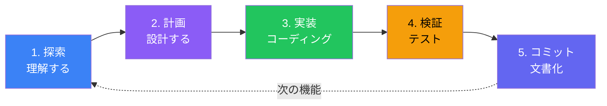

多くの開発者は準備なしにClaude Codeに「機能Xを実装して」と依頼し、すぐにコーディングを始めてしまいます。このアプローチは、実装のズレ、コンテキストの無駄遣い、フラストレーションのたまる修正の繰り返しにつながります。解決策は、各フェーズでClaude Codeの強みを活かす構造化されたワークフローです。

## 「とりあえずコード」の問題

すぐにClaude Codeに実装を依頼すると：

- Claudeが既存のコードベース構造を誤解する可能性
- 実装の選択が確立されたパターンと衝突する可能性
- コードが書かれた後にのみ問題を発見
- 実装の詳細でコンテキストウィンドウが埋まり、軌道修正が制限される

結果として、許容できるが最適ではないコードになり、大幅な修正が必要になることが多いです。最悪の場合、要件を根本的に誤解したコードになります。

## 探索→計画→実装→コミットのワークフロー

Anthropicが推奨するワークフローは、開発を異なるフェーズに分け、それぞれで異なる目標を最適化します：



このワークフローにより、Claude Codeはコードを書く前に理解を深め、コミット前に検証します。

## フェーズ1: 探索

探索フェーズでは、変更を加えずにClaude Codeのコードベース理解を構築します。

### やるべきこと

Claude Codeに関連ファイルを読み込んで分析させます：

```
認証モジュールを読んで、ユーザーセッションがどのように管理されているか説明して。
まだコードは書かないで。
```

```
src/app/api/のAPIルートを見て、使われているパターンを説明して。
変更を加える前に理解したい。
```

```
prisma/schema.prismaのデータベーススキーマを調べて、
User、Order、Productモデル間の関係を説明して。
```

### なぜ重要か

探索はいくつかの目標を達成します：

1. **コンテキスト構築**: Claudeは仮定ではなく実際のコードを読む
2. **パターン認識**: Claudeは従うべき規約を識別
3. **依存関係マッピング**: Claudeは何が何に接続しているかを理解
4. **リスク識別**: コーディング前に潜在的な問題が浮上

### 探索プロンプト

| 目標 | プロンプト |
|------|--------|
| 構造を理解 | "ディレクトリ構造を説明して、各主要フォルダの内容を教えて" |
| パターンを学ぶ | "このコードベースでエラーハンドリングがどう行われているか例を見せて" |
| 依存関係を見つける | "Userモデルを変更すると、どのファイルに影響がある？" |
| 規約を識別 | "Reactコンポーネントにはどのような命名規則が使われている？" |

### 良い探索の兆候

探索後、Claudeは以下ができるべきです：
- 具体的なファイルと行番号を参照
- 既存パターンを例とともに説明
- 新しいコードがどこに配置されるべきかを特定
- 統合ポイントを予測

## フェーズ2: 計画

理解が確立されたら、コードを書く前に具体的な実装計画を作成します。

### やるべきこと

Claudeに計画を作成させます。必要に応じて拡張思考を使用：

```
認証モジュールを理解したので、Googleログイン用のOAuth2サポートを
追加する計画を作成して。慎重に考えて。
```

```
分析に基づいて、ショッピングカート機能を追加する計画を立てて。
以下を考慮して：
- カート状態はどこに置くべきか
- 既存の商品システムとどう統合するか
- どのAPIエンドポイントが必要か
```

### 計画を文書化

重要な機能については、計画をGitHub issueやMarkdownファイルとして文書化します：

```
OAuth2サポートの実装計画を説明するGitHub issueを作成して。
以下を含めて：
- 変更の概要
- 作成/変更するファイル
- 追加する依存関係
- テストアプローチ
```

これにより、後で参照できるポイントが作成され、コンテキストをクリアする必要がある場合にも役立ちます。

### 計画の構造

良い計画には以下が含まれます：

```markdown
## 概要
何を実装し、なぜ実装するかの簡潔な説明。

## 変更するファイル
- `src/lib/auth.ts` - OAuth2プロバイダー設定を追加
- `src/app/api/auth/[...nextauth]/route.ts` - Googleプロバイダーを追加

## 作成するファイル
- `src/lib/oauth-providers.ts` - OAuth2プロバイダー設定
- `src/components/GoogleLoginButton.tsx` - ログインUIコンポーネント

## 依存関係
- `next-auth` - インストール済み、設定が必要
- `@auth/google-provider` - 新しい依存関係

## 実装ステップ
1. 環境変数にGoogle OAuth認証情報を設定
2. NextAuth設定にGoogleプロバイダーを追加
3. ログインボタンコンポーネントを作成
4. コールバックルートハンドリングを追加
5. Googleプロファイルデータ用にセッション型を更新

## テストアプローチ
- プロバイダー設定のユニットテスト
- OAuthフローの統合テスト（モックレスポンス使用）
- 完全なログインフローのE2Eテスト
```

### 計画のレビュー

進める前に計画をレビューします：

- あなたの理解と一致しているか？
- スコープと複雑さは適切か？
- 見落としている考慮事項はないか？

何かおかしいと思ったら、今話し合ってください—この段階での変更はコストが低いです。

## フェーズ3: 実装

探索が完了し計画が承認されたら、実装を開始します。

### やるべきこと

計画を参照し、段階的に実装します：

```
issue #123の計画に従って、ステップ1を実装して：
Google OAuth認証情報を設定。
```

```
次にステップ2を実装して：NextAuth設定にGoogleプロバイダーを追加。
src/lib/auth.tsの既存の認証設定を参照して。
```

### 実装の原則

**計画に従う**: スコープクリープに抵抗します。計画を変更すべきことを発見したら、実装を一時停止し、まず計画を更新します。

**段階的に実装**: 1つのステップを完了し、動作を確認してから次に進みます。すべてを一度に実装しないでください。

**パターンを維持**: 探索中に発見した規約に従います。コードベースがnamed exportを使用しているなら、default exportを導入しないでください。

**継続的に検証**: 各変更後、関連コマンドを実行：
```
TypeScriptコンパイラを実行して型エラーをチェックして。
```
```
認証関連のテストを実行して。
```

### 軌道修正

実装が期待から外れた場合：

- **Escapeを押す**でClaude応答を中断
- **Escapeを2回押す**で前のプロンプトを編集
- 必要に応じてClaudeに**変更を元に戻す**よう依頼
- 大きくずれた場合は**/clear**でコンテキストをリセット

## フェーズ4: 検証

コミット前に、実装が正しく動作することを検証します。

### やるべきこと

包括的なチェックを実行：

```
完全なテストスイートを実行して、失敗があれば修正して。
```

```
リンターを実行して、問題があれば修正して。
```

```
strictモードでTypeScriptコンパイラを実行して、エラーを解決して。
```

### 検証チェックリスト

| チェック | コマンド例 |
|----------|-----------|
| 型安全性 | `npm run typecheck` |
| リンティング | `npm run lint` |
| ユニットテスト | `npm run test` |
| ビルド | `npm run build` |
| E2Eテスト | `npm run test:e2e` |

### 手動検証

UI変更の場合、視覚的に検証：

```
開発サーバーを起動して、Googleログインボタンを手動でテストできるようにして。
```

何か正しく見えない場合、反復：

```
ログインボタンの位置がずれている。ヘッダーの中央に配置されるべき。
スタイリングを修正して。
```

## フェーズ5: コミット

実装が検証されたら、適切に文書化されたコミットを作成します。

### やるべきこと

```
説明的なメッセージでGoogle OAuth実装のコミットを作成して。
```

Claude Codeは何がなぜ変更されたかを理解しているため、コミットメッセージが得意です：

```
feat(auth): add Google OAuth2 login support

- Configure Google provider in NextAuth
- Add GoogleLoginButton component with loading states
- Handle OAuth callback and session management
- Add comprehensive test coverage for OAuth flow

Implements #123
```

### プルリクエスト作成

機能ブランチの場合、プルリクエストを作成：

```
この機能ブランチのプルリクエストを作成して。
変更の要約とテスト手順を含めて。
```

## ワークフローのバリエーション

### クイックフィックス

シンプルで明確な変更の場合、ワークフローを圧縮：

```
ログインボタンにタイポがある - "Sing In"が"Sign In"になっていない。
修正してコミットして。
```

小さく明らかな修正には、広範な探索や計画は不要です。

### 大規模機能

複雑な機能の場合、計画フェーズを拡張：

```
これは大規模な機能。実装計画の前に、
リスクと不明点を特定しよう：
- 不確実な部分は？
- 何が問題になりそう？
- 決定すべきアーキテクチャ上の決定はある？
```

主要コンポーネントのサブプランを作成し、別々のユニットとして実装します。

### リファクタリング

リファクタリングでは、探索フェーズを重視：

```
決済処理モジュールをリファクタリングしたい。
まず、現在の実装のすべての使用箇所をマップして。
何かを変更する前に全体の影響を理解する必要がある。
```

## 避けるべきアンチパターン

### 探索をスキップ

**問題**: Claudeは読んでいないコードについて仮定を立てる。

**解決策**: 実装前に必ずClaudeに関連コードを読ませる。

### 曖昧な計画

**問題**: 「ユーザー認証を追加」は計画ではない。

**解決策**: 計画は、どの開発者でも従えるほど具体的であるべき。

### 検証を無視

**問題**: テストを実行せずにコミット。

**解決策**: 検証はオプションではない。すべてのコミット前にビルド、リント、テスト。

### コンテキスト過負荷

**問題**: 1セッションで実装しすぎるとコンテキストが埋まる。

**解決策**: 頻繁にコミット、主要機能間で`/clear`を使用、文書化された計画を参照。

## まとめ

探索→計画→実装→コミットのワークフローは、Claude Codeをコードジェネレーターから開発パートナーへと変革します：

| フェーズ | 目標 | 主要アクション |
|---------|------|---------------|
| **探索** | 理解を構築 | コードを読む、パターン識別、依存関係マッピング |
| **計画** | 解決策を設計 | 詳細な計画作成、issue/ファイルに文書化 |
| **実装** | 段階的に実装 | 計画に従う、パターン維持、継続的検証 |
| **検証** | 品質を確保 | テスト、リント、型チェック、手動テスト実行 |
| **コミット** | 変更を文書化 | 説明的なコミットとプルリクエスト作成 |

主要な原則：

- **実装前に理解**: 探索がずれたコードを防ぐ
- **計画は安価、書き直しは高価**: 事前に計画に投資
- **段階的実装**: ステップを個別に完了し検証
- **継続的検証**: すべて書き終わった後ではなく、早期に問題を発見
- **進みながら文書化**: 計画とコミットが価値ある成果物を作成

このワークフローには規律が必要ですが、結果を劇的に改善します。探索と計画に投資した時間は、手戻りの削減と高品質な実装を通じて何倍にもなって回収されます。

## 参考資料

- [Claude Code Best Practices](https://www.anthropic.com/engineering/claude-code-best-practices)
- [Claude Code Documentation](https://code.claude.com/docs/en/overview)
