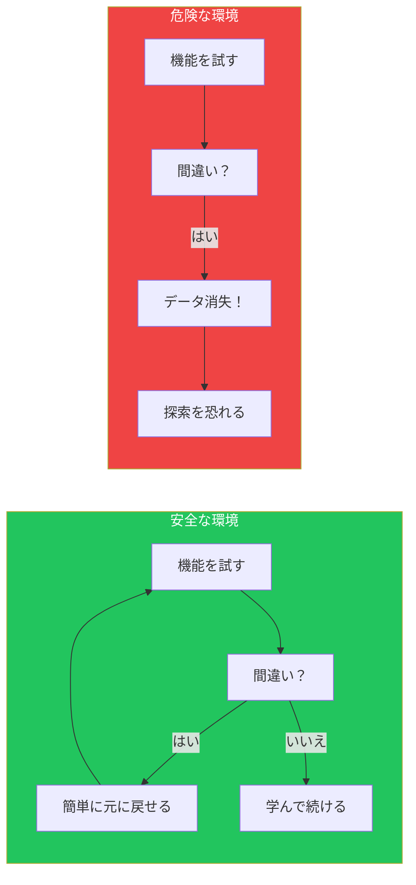
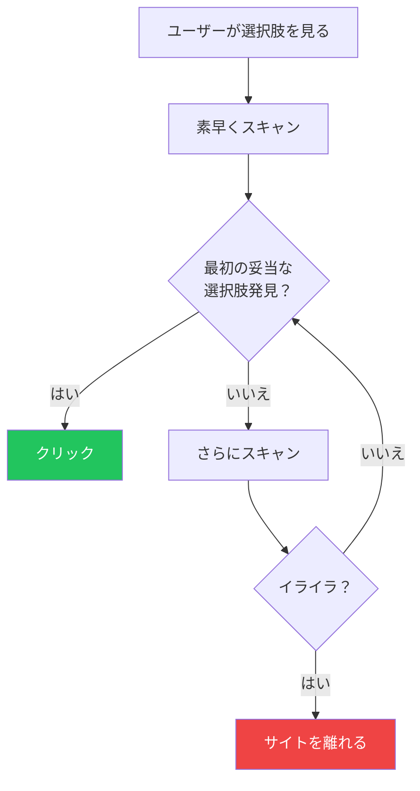
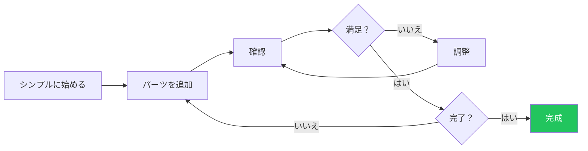

## はじめに

ユーザーがどのように考え、行動するかを理解することは、効果的なインターフェースを作成するための基本です。ユーザーは白紙の状態でソフトウェアに向き合うわけではありません。彼らは期待、習慣、認知的な制限を持っており、それらが体験に深く影響します。

この記事では、「Designing Interfaces」（Jenifer Tidwell他著）の研究に基づいて、インターフェース設計に影響を与える主要な認知・行動パターンを探ります。

## 主要な認知パターン

### Safe Exploration（安全な探索）

ユーザーは探索を通じて学びます。取り返しのつかない結果を恐れることなく、自由にクリックできると感じる必要があります。



**設計への示唆：**

```tsx
// 元に戻す機能で安全な探索を可能に
function DocumentEditor() {
  const [history, setHistory] = useState<string[]>([]);

  const saveToHistory = (content: string) => {
    setHistory(prev => [...prev, content]);
  };

  const undo = () => {
    if (history.length > 1) {
      setHistory(prev => prev.slice(0, -1));
    }
  };

  return (
    <div>
      <Editor onChange={saveToHistory} />
      <Button onClick={undo} disabled={history.length <= 1}>
        元に戻す
      </Button>
      {/* アクションが取り消し可能であることを明示 */}
      <span className="text-gray-500">
        すべての変更は元に戻せます
      </span>
    </div>
  );
}
```

### Instant Gratification（即時の満足）

ユーザーは即座の結果を求めます。価値を早く見せるほど、ユーザーのエンゲージメントは高まります。

| 遅延 | ユーザーの認識 | 設計の対応 |
|-----|--------------|----------|
| 0-100ms | 瞬時 | 直接操作 |
| 100-300ms | わずかな遅延 | 微妙なフィードバック |
| 300ms-1秒 | 顕著 | ローディング表示 |
| 1-10秒 | 中断的 | プログレスバー + メッセージ |
| 10秒以上 | 離脱リスク | バックグラウンド処理 |

```tsx
// 楽観的更新で即時の満足を提供
function LikeButton({ postId, initialLiked }) {
  const [liked, setLiked] = useState(initialLiked);
  const [isPending, startTransition] = useTransition();

  const handleLike = () => {
    // 楽観的更新 - 即時フィードバック
    setLiked(!liked);

    // 実際のAPI呼び出しはバックグラウンドで
    startTransition(async () => {
      try {
        await toggleLike(postId);
      } catch {
        // 失敗時は元に戻す
        setLiked(liked);
      }
    });
  };

  return (
    <button onClick={handleLike} className={liked ? 'text-red-500' : ''}>
      {liked ? '❤️' : '🤍'} {isPending && '...'}
    </button>
  );
}
```

### Satisficing（満足化）

ユーザーは最適化しません。十分に良さそうに見える最初の選択肢を選びます。これは限られた時間と注意力を考えると合理的な戦略です。



**設計への示唆：**
- 最も可能性の高い選択肢を最初に配置
- 「最良」の選択肢を視覚的に目立たせる
- 重要なオプションをドロップダウンに隠さない

```tsx
// 満足化に合わせた設計
function PlanSelector({ plans }) {
  // おすすめを最初に並べ替え
  const sortedPlans = [...plans].sort((a, b) =>
    b.isRecommended - a.isRecommended
  );

  return (
    <div className="grid gap-4">
      {sortedPlans.map((plan, index) => (
        <PlanCard
          key={plan.id}
          plan={plan}
          // 最初の（おすすめ）プランを視覚的に目立たせる
          variant={index === 0 ? 'featured' : 'default'}
        />
      ))}
    </div>
  );
}
```

### Changes in Midstream（途中での変更）

ユーザーはタスクの途中で頻繁に考えを変えたり、アプローチを変更したりします。良いインターフェースはこれを優雅に受け入れます。

```tsx
// 途中での変更をサポート
function CheckoutFlow() {
  const [step, setStep] = useState(1);
  const [data, setData] = useState({});

  return (
    <div>
      {/* 完了したステップに戻れるようにする */}
      <StepIndicator
        currentStep={step}
        completedSteps={Object.keys(data)}
        onStepClick={(s) => setStep(s)} // 簡単に戻れる
      />

      {/* ステップを切り替えてもデータを保持 */}
      {step === 1 && <ShippingForm data={data.shipping} />}
      {step === 2 && <PaymentForm data={data.payment} />}
      {step === 3 && <ReviewForm data={data} />}

      {/* 入力済みの内容を常に表示 */}
      <aside>
        <h3>選択内容</h3>
        <OrderSummary data={data} editable />
      </aside>
    </div>
  );
}
```

### Deferred Choices（選択の先送り）

ユーザーはオプションの決定をスキップして後で戻りたい—または永遠に戻らないこともあります。

```tsx
// 選択の先送りを許可
function OnboardingFlow() {
  return (
    <div>
      <h2>体験をカスタマイズ</h2>

      <PreferenceForm>
        {/* オプションフィールドを明確に */}
        <Field name="theme" label="テーマ" optional>
          <Select defaultValue="system">
            <Option value="system">システムデフォルト</Option>
            <Option value="light">ライト</Option>
            <Option value="dark">ダーク</Option>
          </Select>
        </Field>

        {/* 常にスキップオプションを提供 */}
        <div className="flex gap-4">
          <Button type="submit">設定を保存</Button>
          <Button variant="ghost" onClick={skip}>
            今はスキップ
          </Button>
        </div>

        {/* 後で変更できることを伝える */}
        <p className="text-sm text-gray-500">
          設定はいつでも変更できます
        </p>
      </PreferenceForm>
    </div>
  );
}
```

### Incremental Construction（段階的な構築）

ユーザーは複雑な成果物を少しずつ構築し、進めながら改良します。



**設計への示唆：**
- 部分的な完成をサポート
- 作業中の状態を明確に表示
- 未完成の作業の保存を許可
- プレビュー機能を提供

```tsx
// 段階的な構築をサポート
function FormBuilder() {
  const [fields, setFields] = useState([]);
  const [isDraft, setIsDraft] = useState(true);

  return (
    <div className="flex">
      {/* 作業エリア */}
      <div className="flex-1">
        <DraftIndicator isDraft={isDraft} />
        <FieldList fields={fields} onReorder={setFields} />
        <AddFieldButton onClick={addField} />
      </div>

      {/* ライブプレビュー */}
      <aside className="w-80">
        <h3>プレビュー</h3>
        <FormPreview fields={fields} />
      </aside>

      {/* 自動保存で段階的作業をサポート */}
      <AutoSave data={fields} />
    </div>
  );
}
```

### Habituation（習慣化）

繰り返しの操作は自動的になります。ユーザーは頻繁に使う機能に対してマッスルメモリーを発達させます。

| 頻度 | ユーザーの状態 | 設計の対応 |
|-----|--------------|----------|
| 初回使用 | 学習中 | 明確なラベル、ガイダンス |
| 時々 | 想起中 | 一貫した配置 |
| 頻繁 | 自動化 | キーボードショートカット |
| エキスパート | 最適化 | コマンドパレット、マクロ |

```tsx
// 一貫したパターンで習慣化をサポート
function ActionBar() {
  return (
    <div className="flex gap-2">
      {/* 主要アクションは常に同じ位置 */}
      <Button variant="primary" shortcut="⌘S">
        保存
      </Button>

      {/* 副次アクションは一貫した順序 */}
      <Button shortcut="⌘Z">元に戻す</Button>
      <Button shortcut="⌘⇧Z">やり直し</Button>

      {/* ショートカットを表示して習慣化を促進 */}
      <Tooltip content="⌘K でコマンドパレット">
        <Button>その他のアクション...</Button>
      </Tooltip>
    </div>
  );
}
```

### Spatial Memory（空間記憶）

ユーザーは物の場所を覚えます。UI要素を移動すると、この記憶が壊れ、フラストレーションを引き起こします。

```tsx
// 空間記憶を保持
function Dashboard({ widgets }) {
  const [layout, setLayout] = useState(() => {
    // localStorageから保存されたレイアウトを読み込み
    return localStorage.getItem('dashboard-layout')
      || generateDefaultLayout(widgets);
  });

  // ユーザーが並べ替えたら、その設定を保持
  const handleLayoutChange = (newLayout) => {
    setLayout(newLayout);
    localStorage.setItem('dashboard-layout', newLayout);
  };

  return (
    <GridLayout
      layout={layout}
      onLayoutChange={handleLayoutChange}
      // アイテムはユーザーが置いた場所に留まる
      isDraggable
      isResizable
    >
      {widgets.map(widget => (
        <Widget key={widget.id} {...widget} />
      ))}
    </GridLayout>
  );
}
```

### Prospective Memory（展望的記憶）

ユーザーは後で何かをする意図を設定します。それを覚えておく手助けをしましょう。

```tsx
// 展望的記憶をサポート
function ArticleReader({ article }) {
  const [reminders, setReminders] = useState([]);

  return (
    <article>
      {/* 後で戻るためにマークできるように */}
      <BookmarkButton
        onBookmark={() => addBookmark(article.id)}
      />

      {/* 「後で読む」パターンをサポート */}
      <Button
        onClick={() => addToReadingList(article.id)}
        variant="ghost"
      >
        📚 後で読む
      </Button>

      {/* リマインダーの設定を許可 */}
      <ReminderButton
        options={['明日', '来週', 'カスタム...']}
        onSet={(time) => setReminder(article.id, time)}
      />

      <Content>{article.body}</Content>
    </article>
  );
}
```

### Streamlined Repetition（効率化された繰り返し）

ユーザーが同じアクションを何度も繰り返す必要がある場合は、簡単にしましょう。

```tsx
// 繰り返しアクションを効率化
function PhotoUploader() {
  return (
    <div>
      {/* 繰り返しタスク用のバッチ操作 */}
      <BatchActions>
        <Button onClick={selectAll}>すべて選択</Button>
        <Button onClick={deleteSelected}>選択を削除</Button>
        <Button onClick={tagSelected}>選択にタグ付け</Button>
      </BatchActions>

      {/* ドラッグ&ドロップで簡単に複数アップロード */}
      <DropZone
        multiple
        onDrop={handleFiles}
      >
        ここに写真をドロップ、またはクリックして選択
      </DropZone>

      {/* バッチ操作の進捗を表示 */}
      <UploadProgress items={uploadQueue} />

      {/* 最後に使った設定を記憶 */}
      <Settings
        defaultAlbum={lastUsedAlbum}
        defaultPrivacy={lastUsedPrivacy}
      />
    </div>
  );
}
```

## これらのパターンに合わせた設計

### パターン一覧表

| パターン | ユーザーのニーズ | 設計ソリューション |
|---------|--------------|----------------|
| Safe Exploration | 恐れずに試す | 元に戻す、確認ダイアログ |
| Instant Gratification | 今すぐ結果を見る | 楽観的更新、進捗表示 |
| Satisficing | 素早く十分な選択 | おすすめオプションを目立たせる |
| Changes in Midstream | 方向転換 | 状態保持、簡単なナビゲーション |
| Deferred Choices | 後で決める | スキップオプション、良いデフォルト |
| Incremental Construction | 徐々に構築 | 自動保存、プレビュー、部分状態 |
| Habituation | 繰り返しによる効率化 | 一貫した配置、ショートカット |
| Spatial Memory | 場所を覚える | 安定したレイアウト、ユーザー設定 |
| Prospective Memory | 意図を覚える | ブックマーク、リマインダー、リスト |
| Streamlined Repetition | 多くを素早く | バッチ操作、キーボードショートカット |

### 実装チェックリスト

```markdown
## 認知パターンチェックリスト

### Safe Exploration（安全な探索）
- [ ] 破壊的なアクションには元に戻す機能
- [ ] 不可逆なアクションには確認
- [ ] アクションの結果を明確に表示

### Instant Gratification（即時の満足）
- [ ] インタラクションに100ms以内の応答
- [ ] 300ms以上にはローディング表示
- [ ] 適切な場所で楽観的更新

### Satisficing（満足化）
- [ ] 最良のオプションを視覚的に目立たせる
- [ ] 重要なオプションを隠さない
- [ ] ラベルは明確で曖昧でない

### Changes in Midstream（途中での変更）
- [ ] フローで簡単に戻れる
- [ ] ナビゲーション時に状態を保持
- [ ] サイドパネルで現在の選択を表示

### Deferred Choices（選択の先送り）
- [ ] オプションフィールドにマーク
- [ ] スキップボタンを用意
- [ ] 良いデフォルト値を提供

### Habituation（習慣化）
- [ ] UI要素を一貫した位置に
- [ ] よく使うアクションにキーボードショートカット
- [ ] プラットフォームの慣例に従う

### Spatial Memory（空間記憶）
- [ ] レイアウトをセッション間で保持
- [ ] 要素が予期せず移動しない
- [ ] ユーザーのカスタマイズを保存
```

## まとめ

これらの認知パターンは恣意的な好みではありません。人間が情報を処理し、環境と対話する方法の根本的な側面です。これらのパターンに合わせて設計することで、強制的ではなく自然に感じられるインターフェースを作成できます。

重要な洞察は、ユーザーは最適なアルゴリズムを処理する機械ではないということです。彼らは限られた注意力、既存の習慣、様々な忍耐レベルを持った人間です。彼らがいる場所で—あなたが望む場所ではなく—出迎えることが、優れたインターフェース設計の基盤です。

## 参考文献

- Tidwell, Jenifer, et al. "Designing Interfaces" (3rd Edition)
- Norman, Don. "The Design of Everyday Things"
- Kahneman, Daniel. "Thinking, Fast and Slow"
- Nielsen Norman Group - Mental Models
