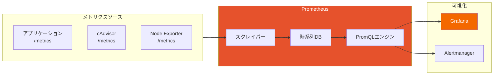
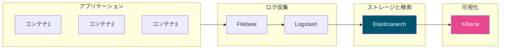

効果的な監視とロギングは、本番環境でコンテナを運用するために不可欠です。この記事では、コンテナ化されたアプリケーションの可視性を高めるためのツールとプラクティスを解説します。

## なぜコンテナ監視が重要か

コンテナは一時的で動的であるため、従来の監視アプローチでは不十分です：

| 課題 | 従来のアプローチ | コンテナの現実 |
|------|----------------|---------------|
| ライフサイクル | 長寿命サーバー | 短命コンテナ |
| スケール | 固定インフラ | 動的スケーリング |
| ディスカバリ | 静的IP | 動的IPと名前 |
| ログ | ディスク上のファイル | stdout/stderrストリーム |

## Dockerネイティブロギング

### コンテナログの基本

```bash
# コンテナログを表示
docker logs mycontainer

# リアルタイムでログを追跡
docker logs -f mycontainer

# タイムスタンプを表示
docker logs -t mycontainer

# 最後のN行を表示
docker logs --tail 100 mycontainer

# 指定時間以降のログを表示
docker logs --since 2025-01-18T10:00:00 mycontainer
docker logs --since 30m mycontainer
```

### ロギングドライバー

Dockerは複数のロギングドライバーをサポートしています：

```bash
# 現在のロギングドライバーを確認
docker info | grep "Logging Driver"

# 特定のドライバーで実行
docker run -d --log-driver json-file --log-opt max-size=10m nginx
```

| ドライバー | 説明 | 最適な用途 |
|----------|------|----------|
| `json-file` | デフォルト、JSON形式 | 開発、小規模デプロイ |
| `syslog` | Syslogデーモン | 従来のLinuxロギング |
| `journald` | Systemd journal | systemdベースのシステム |
| `fluentd` | Fluentdコレクター | 集中ロギング |
| `awslogs` | AWS CloudWatch | AWSデプロイ |
| `gcplogs` | Google Cloud Logging | GCPデプロイ |

### Docker Composeでのロギング設定

```yaml
services:
  app:
    image: myapp
    logging:
      driver: json-file
      options:
        max-size: "10m"
        max-file: "3"
        labels: "app,environment"
        tag: "{{.Name}}/{{.ID}}"

  # Fluentdロギング
  api:
    image: myapi
    logging:
      driver: fluentd
      options:
        fluentd-address: localhost:24224
        tag: "docker.{{.Name}}"
```

## Docker Statsでのコンテナメトリクス

```bash
# 全コンテナのリアルタイム統計
docker stats

# 特定のコンテナの統計
docker stats container1 container2

# ワンタイム統計（ストリーミングなし）
docker stats --no-stream

# カスタムフォーマット
docker stats --format "table {{.Name}}\t{{.CPUPerc}}\t{{.MemUsage}}\t{{.NetIO}}"
```

出力：
```
CONTAINER ID   NAME      CPU %     MEM USAGE / LIMIT     MEM %     NET I/O           BLOCK I/O
abc123         web       0.50%     50.5MiB / 512MiB      9.86%     1.2MB / 500kB     0B / 0B
def456         db        2.30%     256MiB / 1GiB         25.00%    500kB / 100kB     10MB / 5MB
```

## cAdvisorでのコンテナメトリクス

cAdvisor（Container Advisor）は、詳細なリソース使用量とパフォーマンスメトリクスを提供します。

### cAdvisorの実行

```yaml
# docker-compose.yml
services:
  cadvisor:
    image: gcr.io/cadvisor/cadvisor:latest
    container_name: cadvisor
    ports:
      - "8080:8080"
    volumes:
      - /:/rootfs:ro
      - /var/run:/var/run:ro
      - /sys:/sys:ro
      - /var/lib/docker/:/var/lib/docker:ro
      - /dev/disk/:/dev/disk:ro
    privileged: true
```

`http://localhost:8080`でUIにアクセスすると以下が確認できます：
- CPU、メモリ、ネットワーク、ファイルシステムメトリクス
- コンテナごとのリソース使用量
- コンテナのヘルス情報

## Prometheusでのメトリクス収集

### Prometheusアーキテクチャ



### Prometheus設定

```yaml
# prometheus.yml
global:
  scrape_interval: 15s
  evaluation_interval: 15s

alerting:
  alertmanagers:
    - static_configs:
        - targets: ['alertmanager:9093']

scrape_configs:
  # Prometheus自身
  - job_name: 'prometheus'
    static_configs:
      - targets: ['localhost:9090']

  # cAdvisorメトリクス
  - job_name: 'cadvisor'
    static_configs:
      - targets: ['cadvisor:8080']

  # アプリケーションメトリクス
  - job_name: 'app'
    static_configs:
      - targets: ['app:3000']

  # Dockerデーモンメトリクス
  - job_name: 'docker'
    static_configs:
      - targets: ['host.docker.internal:9323']
```

### Prometheusスタック用Docker Compose

```yaml
services:
  prometheus:
    image: prom/prometheus:latest
    ports:
      - "9090:9090"
    volumes:
      - ./prometheus.yml:/etc/prometheus/prometheus.yml
      - prometheus_data:/prometheus
    command:
      - '--config.file=/etc/prometheus/prometheus.yml'
      - '--storage.tsdb.path=/prometheus'

  grafana:
    image: grafana/grafana:latest
    ports:
      - "3000:3000"
    environment:
      GF_SECURITY_ADMIN_PASSWORD: admin
    volumes:
      - grafana_data:/var/lib/grafana

  cadvisor:
    image: gcr.io/cadvisor/cadvisor:latest
    ports:
      - "8080:8080"
    volumes:
      - /:/rootfs:ro
      - /var/run:/var/run:ro
      - /sys:/sys:ro
      - /var/lib/docker/:/var/lib/docker:ro

  alertmanager:
    image: prom/alertmanager:latest
    ports:
      - "9093:9093"
    volumes:
      - ./alertmanager.yml:/etc/alertmanager/alertmanager.yml

volumes:
  prometheus_data:
  grafana_data:
```

## Grafanaダッシュボード

### 監視すべき一般的なコンテナメトリクス

| メトリクス | 説明 | アラート閾値 |
|----------|------|-------------|
| CPU使用率 | コンテナのCPU割合 | > 80% |
| メモリ使用率 | コンテナのメモリ使用量 | > 85% |
| ネットワークI/O | 送受信バイト | 異常検知 |
| ディスクI/O | 読み書き操作 | アプリによる |
| コンテナ再起動 | 再起動回数 | 5分で3回以上 |

### サンプルPromQLクエリ

```promql
# コンテナCPU使用率
sum(rate(container_cpu_usage_seconds_total{name!=""}[5m])) by (name) * 100

# コンテナメモリ使用率
container_memory_usage_bytes{name!=""} / container_spec_memory_limit_bytes{name!=""} * 100

# ネットワーク受信レート
rate(container_network_receive_bytes_total{name!=""}[5m])

# コンテナ再起動カウント
changes(container_start_time_seconds{name!=""}[1h])
```

## ELK Stackでのログ集約

### アーキテクチャ



### ELK用Docker Compose

```yaml
services:
  elasticsearch:
    image: docker.elastic.co/elasticsearch/elasticsearch:8.11.0
    environment:
      - discovery.type=single-node
      - xpack.security.enabled=false
      - "ES_JAVA_OPTS=-Xms512m -Xmx512m"
    volumes:
      - elasticsearch_data:/usr/share/elasticsearch/data
    ports:
      - "9200:9200"

  logstash:
    image: docker.elastic.co/logstash/logstash:8.11.0
    volumes:
      - ./logstash.conf:/usr/share/logstash/pipeline/logstash.conf
    ports:
      - "5044:5044"
    depends_on:
      - elasticsearch

  kibana:
    image: docker.elastic.co/kibana/kibana:8.11.0
    ports:
      - "5601:5601"
    environment:
      ELASTICSEARCH_HOSTS: http://elasticsearch:9200
    depends_on:
      - elasticsearch

  filebeat:
    image: docker.elastic.co/beats/filebeat:8.11.0
    user: root
    volumes:
      - ./filebeat.yml:/usr/share/filebeat/filebeat.yml:ro
      - /var/lib/docker/containers:/var/lib/docker/containers:ro
      - /var/run/docker.sock:/var/run/docker.sock:ro
    depends_on:
      - logstash

volumes:
  elasticsearch_data:
```

### Filebeat設定

```yaml
# filebeat.yml
filebeat.inputs:
  - type: container
    paths:
      - '/var/lib/docker/containers/*/*.log'
    processors:
      - add_docker_metadata:
          host: "unix:///var/run/docker.sock"

output.logstash:
  hosts: ["logstash:5044"]

logging.level: info
```

## アプリケーションレベルのロギング

### 構造化ロギング（Node.js）

```javascript
const winston = require('winston');

const logger = winston.createLogger({
  level: 'info',
  format: winston.format.combine(
    winston.format.timestamp(),
    winston.format.json()
  ),
  defaultMeta: { service: 'my-service' },
  transports: [
    new winston.transports.Console()
  ]
});

// 使用例
logger.info('User logged in', { userId: '123', action: 'login' });
```

### 構造化ロギング（Python）

```python
import logging
import json

class JSONFormatter(logging.Formatter):
    def format(self, record):
        log_record = {
            'timestamp': self.formatTime(record),
            'level': record.levelname,
            'message': record.getMessage(),
            'service': 'my-service'
        }
        return json.dumps(log_record)

handler = logging.StreamHandler()
handler.setFormatter(JSONFormatter())
logger = logging.getLogger()
logger.addHandler(handler)
logger.setLevel(logging.INFO)
```

## ヘルスチェックとアラート

### コンテナヘルスチェック

```dockerfile
HEALTHCHECK --interval=30s --timeout=3s --start-period=5s --retries=3 \
  CMD curl -f http://localhost:3000/health || exit 1
```

```yaml
# docker-compose.yml
services:
  app:
    healthcheck:
      test: ["CMD", "curl", "-f", "http://localhost:3000/health"]
      interval: 30s
      timeout: 10s
      retries: 3
      start_period: 40s
```

### Alertmanager設定

```yaml
# alertmanager.yml
global:
  smtp_smarthost: 'smtp.gmail.com:587'
  smtp_from: 'alerts@example.com'

route:
  group_by: ['alertname']
  group_wait: 30s
  group_interval: 5m
  repeat_interval: 1h
  receiver: 'email-notifications'

receivers:
  - name: 'email-notifications'
    email_configs:
      - to: 'team@example.com'

  - name: 'slack-notifications'
    slack_configs:
      - api_url: 'https://hooks.slack.com/services/xxx'
        channel: '#alerts'
```

### アラートルール

```yaml
# alert_rules.yml
groups:
  - name: container_alerts
    rules:
      - alert: ContainerHighCPU
        expr: sum(rate(container_cpu_usage_seconds_total{name!=""}[5m])) by (name) > 0.8
        for: 5m
        labels:
          severity: warning
        annotations:
          summary: "{{ $labels.name }}でCPU使用率が高い"

      - alert: ContainerHighMemory
        expr: container_memory_usage_bytes{name!=""} / container_spec_memory_limit_bytes{name!=""} > 0.85
        for: 5m
        labels:
          severity: warning
        annotations:
          summary: "{{ $labels.name }}でメモリ使用率が高い"

      - alert: ContainerRestarting
        expr: changes(container_start_time_seconds{name!=""}[15m]) > 3
        labels:
          severity: critical
        annotations:
          summary: "コンテナ{{ $labels.name }}が頻繁に再起動"
```

## ベストプラクティス

### 1. ログを集中化

```yaml
services:
  app:
    logging:
      driver: fluentd
      options:
        fluentd-address: fluentd:24224
```

### 2. 構造化ロギングを使用

```json
{
  "timestamp": "2025-01-18T10:00:00Z",
  "level": "info",
  "service": "api",
  "message": "Request processed",
  "requestId": "abc123",
  "duration": 45
}
```

### 3. 監視付きでリソース制限を設定

```yaml
services:
  app:
    deploy:
      resources:
        limits:
          memory: 512M
          cpus: '0.5'
```

### 4. 主要メトリクスを監視

| カテゴリ | メトリクス |
|---------|----------|
| リソース | CPU、メモリ、ディスク、ネットワーク |
| アプリケーション | レスポンス時間、エラー率、スループット |
| ビジネス | アクティブユーザー、トランザクション、売上 |

## まとめ

| ツール | 目的 | 最適な用途 |
|--------|------|----------|
| Docker logs | 基本的なログ表示 | 開発 |
| cAdvisor | コンテナメトリクス | リソース監視 |
| Prometheus | メトリクス収集 | 時系列データ |
| Grafana | 可視化 | ダッシュボード |
| ELK Stack | ログ集約 | 検索と分析 |
| Alertmanager | アラート | インシデント対応 |

## 重要なポイント

1. **集中ロギングを使用** - ローカルコンテナログに依存しない
2. **コンテナリソースを監視** - CPU、メモリ、ネットワーク、ディスク
3. **ヘルスチェックを実装** - 問題を早期に検出
4. **アラートを設定** - ユーザーより先に通知を受け取る
5. **構造化ロギングを使用** - 解析しやすいJSON形式
6. **適切にログを保持** - ストレージコストとデバッグニーズのバランス

## 次のステップ

次の記事では、自動化されたビルド、テスト、デプロイのためのDocker CI/CDパイプラインを解説します。

## 参考文献

- Docker Deep Dive, 5th Edition - Nigel Poulton
- The Ultimate Docker Container Book, 3rd Edition - Dr. Gabriel N. Schenker
- [Prometheusドキュメント](https://prometheus.io/docs/)
- [Grafanaドキュメント](https://grafana.com/docs/)
