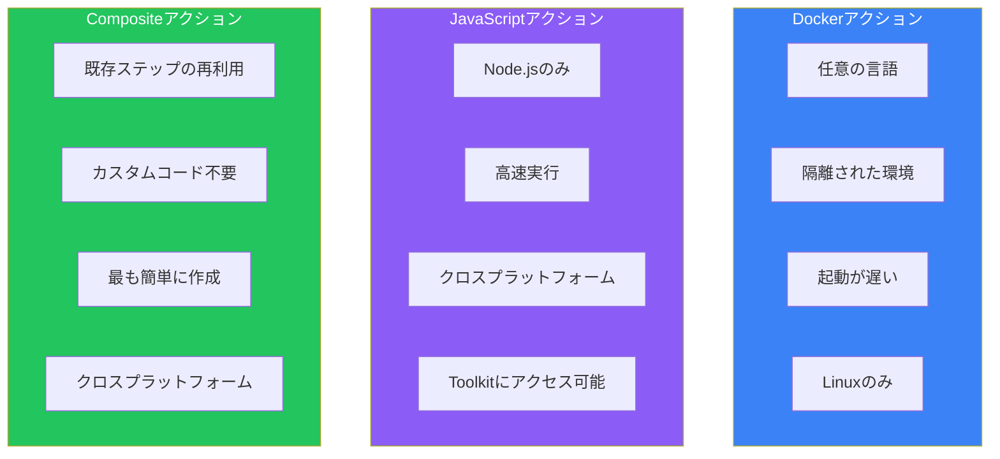
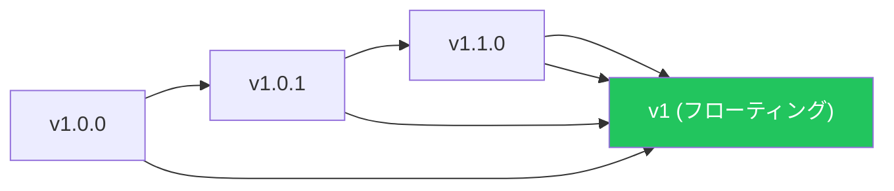

## はじめに

GitHub Marketplaceには数千の事前ビルドされたアクションがありますが、ワークフローに特有のカスタム機能が必要な場合があります。GitHub Actionsは3種類のカスタムアクションをサポートしています：

- **Dockerコンテナアクション**: Dockerコンテナ内で実行
- **JavaScriptアクション**: ランナー上で直接実行
- **Compositeアクション**: 複数のステップを1つのアクションに統合

この記事では、各タイプの作成方法を解説します。

## アクションタイプの比較



| タイプ | 最適なケース | プラットフォーム | 起動速度 |
|-------|-------------|----------------|---------|
| Docker | 複雑な依存関係、任意の言語 | Linuxのみ | 遅い |
| JavaScript | パフォーマンス重視、クロスプラットフォーム | すべて | 速い |
| Composite | 既存ステップのバンドル | すべて | 速い |

## action.ymlファイル

すべてのアクションには`action.yml`（または`action.yaml`）メタデータファイルが必要です：

```yaml
name: 'My Custom Action'
description: 'このアクションが何をするかの簡単な説明'
author: 'Your Name'

branding:
  icon: 'check-circle'
  color: 'green'

inputs:
  my-input:
    description: '入力パラメータ'
    required: true
    default: 'default value'

outputs:
  my-output:
    description: '出力値'

runs:
  # このセクションはアクションタイプによって異なる
  using: 'node20'  # または 'docker' または 'composite'
```

## Dockerコンテナアクション

### Dockerアクションを使うべき場合

- 特定のツールや依存関係が必要
- JavaScript以外の言語を使用
- 完全に隔離された再現可能な環境が必要

### Dockerアクションの作成

**ディレクトリ構造：**

```
my-docker-action/
├── action.yml
├── Dockerfile
├── entrypoint.sh
└── README.md
```

**action.yml：**

```yaml
name: 'Docker Greeting Action'
description: 'Dockerコンテナを使用して挨拶する'
author: 'Your Name'

inputs:
  who-to-greet:
    description: '誰に挨拶するか'
    required: true
    default: 'World'

outputs:
  greeting-time:
    description: '挨拶した時刻'

runs:
  using: 'docker'
  image: 'Dockerfile'
  args:
    - ${{ inputs.who-to-greet }}
```

**Dockerfile：**

```dockerfile
FROM alpine:3.19

RUN apk add --no-cache bash

COPY entrypoint.sh /entrypoint.sh
RUN chmod +x /entrypoint.sh

ENTRYPOINT ["/entrypoint.sh"]
```

**entrypoint.sh：**

```bash
#!/bin/bash

WHO_TO_GREET=$1
GREETING_TIME=$(date -u +"%Y-%m-%dT%H:%M:%SZ")

echo "Hello, $WHO_TO_GREET!"

# 環境ファイルを使用して出力を設定
echo "greeting-time=$GREETING_TIME" >> $GITHUB_OUTPUT
```

### Dockerアクションの使用

```yaml
- name: Greet someone
  uses: ./my-docker-action
  with:
    who-to-greet: 'GitHub User'

- name: Show greeting time
  run: echo "Greeted at ${{ steps.greet.outputs.greeting-time }}"
```

## JavaScriptアクション

### JavaScriptアクションを使うべき場合

- 高速な実行が必要
- クロスプラットフォームサポートが必要
- GitHub Actions Toolkitを使用したい

### JavaScriptアクションの作成

**ディレクトリ構造：**

```
my-js-action/
├── action.yml
├── index.js
├── package.json
└── node_modules/  (コミットまたはコンパイル)
```

**action.yml：**

```yaml
name: 'JavaScript Greeting Action'
description: 'JavaScriptを使用して挨拶する'

inputs:
  who-to-greet:
    description: '誰に挨拶するか'
    required: true
    default: 'World'

  uppercase:
    description: '挨拶を大文字に変換'
    required: false
    default: 'false'

outputs:
  greeting-time:
    description: '挨拶した時刻'

runs:
  using: 'node20'
  main: 'dist/index.js'
```

**package.json：**

```json
{
  "name": "my-js-action",
  "version": "1.0.0",
  "main": "index.js",
  "scripts": {
    "build": "ncc build index.js -o dist"
  },
  "dependencies": {
    "@actions/core": "^1.10.0",
    "@actions/github": "^6.0.0"
  },
  "devDependencies": {
    "@vercel/ncc": "^0.38.0"
  }
}
```

**index.js：**

```javascript
const core = require('@actions/core');
const github = require('@actions/github');

async function run() {
  try {
    // 入力を取得
    const whoToGreet = core.getInput('who-to-greet', { required: true });
    const uppercase = core.getInput('uppercase') === 'true';

    // 挨拶を生成
    let greeting = `Hello, ${whoToGreet}!`;
    if (uppercase) {
      greeting = greeting.toUpperCase();
    }

    // 挨拶をログ出力
    console.log(greeting);

    // 現在時刻を取得
    const time = new Date().toISOString();

    // 出力を設定
    core.setOutput('greeting-time', time);

    // コンテキスト情報にアクセス
    const payload = github.context.payload;
    console.log(`Event: ${github.context.eventName}`);
    console.log(`Ref: ${github.context.ref}`);

    // アノテーションを作成
    core.notice(`Greeted ${whoToGreet} at ${time}`);

  } catch (error) {
    core.setFailed(error.message);
  }
}

run();
```

### アクションのビルド

```bash
npm install
npm run build  # @vercel/nccを使用してバンドル
```

### Actions Toolkitの機能

| パッケージ | 用途 |
|----------|------|
| `@actions/core` | 入力、出力、ログ、シークレット |
| `@actions/github` | GitHub APIクライアント、コンテキスト |
| `@actions/exec` | シェルコマンドの実行 |
| `@actions/io` | ファイルシステム操作 |
| `@actions/tool-cache` | ツールのダウンロードとキャッシュ |
| `@actions/artifact` | アーティファクトのアップロード/ダウンロード |
| `@actions/cache` | キャッシュ管理 |

## Compositeアクション

### Compositeアクションを使うべき場合

- 複数のステップを再利用可能なユニットにバンドル
- カスタムコードが不要
- 複雑なワークフローを簡素化

### Compositeアクションの作成

**action.yml：**

```yaml
name: 'Setup and Test Node Project'
description: 'Node.jsをセットアップし、依存関係をインストールし、テストを実行'

inputs:
  node-version:
    description: '使用するNode.jsバージョン'
    required: false
    default: '20'

  working-directory:
    description: 'package.jsonを含むディレクトリ'
    required: false
    default: '.'

  run-lint:
    description: 'リンティングを実行するかどうか'
    required: false
    default: 'true'

outputs:
  coverage-percentage:
    description: 'テストカバレッジのパーセンテージ'
    value: ${{ steps.coverage.outputs.percentage }}

runs:
  using: 'composite'
  steps:
    - name: Setup Node.js
      uses: actions/setup-node@v4
      with:
        node-version: ${{ inputs.node-version }}
        cache: 'npm'
        cache-dependency-path: ${{ inputs.working-directory }}/package-lock.json

    - name: Install dependencies
      shell: bash
      working-directory: ${{ inputs.working-directory }}
      run: npm ci

    - name: Run linting
      if: inputs.run-lint == 'true'
      shell: bash
      working-directory: ${{ inputs.working-directory }}
      run: npm run lint

    - name: Run tests with coverage
      shell: bash
      working-directory: ${{ inputs.working-directory }}
      run: npm test -- --coverage

    - name: Extract coverage
      id: coverage
      shell: bash
      working-directory: ${{ inputs.working-directory }}
      run: |
        COVERAGE=$(cat coverage/coverage-summary.json | jq '.total.lines.pct')
        echo "percentage=$COVERAGE" >> $GITHUB_OUTPUT
```

### Compositeアクションの使用

```yaml
jobs:
  test:
    runs-on: ubuntu-latest
    steps:
      - uses: actions/checkout@v4

      - name: Setup and Test
        id: test
        uses: ./my-composite-action
        with:
          node-version: '20'
          run-lint: 'true'

      - name: Report coverage
        run: echo "Coverage: ${{ steps.test.outputs.coverage-percentage }}%"
```

## アクションの公開

### パブリックリポジトリへ

1. アクション用のパブリックリポジトリを作成
2. セマンティックバージョニングでタグを付ける：

```bash
git tag -a v1.0.0 -m "Release v1.0.0"
git push origin v1.0.0

# メジャーバージョンタグを作成
git tag -fa v1 -m "Update v1 to v1.0.0"
git push origin v1 --force
```

3. ユーザーはアクションを参照できます：

```yaml
- uses: owner/action-name@v1
- uses: owner/action-name@v1.0.0
- uses: owner/action-name@main
```

### GitHub Marketplaceへ

1. `action.yml`に`name`、`description`、`branding`があることを確認
2. リポジトリに移動して「Draft a release」をクリック
3. 「Publish this Action to the GitHub Marketplace」をチェック
4. リリースの詳細を入力して公開

### バージョニングのベストプラクティス



| タグ | 目的 | 更新頻度 |
|-----|------|---------|
| `v1.2.3` | 特定バージョン | なし（不変） |
| `v1.2` | マイナーバージョン | パッチリリース時 |
| `v1` | メジャーバージョン | マイナー/パッチリリース時 |
| `main` | 最新の開発版 | 継続的 |

## ローカルアクション

プライベート使用のためにリポジトリ内にアクションを保存：

```
.github/
├── actions/
│   ├── setup-environment/
│   │   └── action.yml
│   └── deploy/
│       └── action.yml
└── workflows/
    └── ci.yml
```

相対パスでローカルアクションを参照：

```yaml
- uses: ./.github/actions/setup-environment
  with:
    environment: production
```

## ベストプラクティス

### 1. エラーを適切に処理

```javascript
// JavaScript
try {
  await doSomething();
} catch (error) {
  core.setFailed(`Action failed: ${error.message}`);
}
```

```bash
# Docker/Bash
set -e  # エラー時に終了
trap 'echo "Error on line $LINENO"' ERR
```

### 2. 明確なログを提供

```javascript
core.debug('詳細なデバッグ情報');
core.info('一般的な情報');
core.warning('警告メッセージ');
core.error('エラーメッセージ');

// ログのグループ化
core.startGroup('依存関係をインストール中');
// ... インストールログ
core.endGroup();
```

### 3. 徹底したドキュメント

READMEに含めるべき内容：
- アクションの機能
- すべての入力と出力
- 使用例
- 要件と制限事項

### 4. アクションをテスト

テストワークフローを作成：

```yaml
name: Test Action

on:
  push:
    paths:
      - 'action.yml'
      - 'src/**'
      - '.github/workflows/test-action.yml'

jobs:
  test:
    runs-on: ubuntu-latest
    steps:
      - uses: actions/checkout@v4

      - name: Run action
        id: test
        uses: ./
        with:
          input-param: 'test-value'

      - name: Verify output
        run: |
          if [ "${{ steps.test.outputs.result }}" != "expected" ]; then
            echo "Test failed!"
            exit 1
          fi
```

## まとめ

| 項目 | Docker | JavaScript | Composite |
|-----|--------|------------|-----------|
| 言語 | 任意 | Node.js | N/A |
| 速度 | 遅い | 速い | 速い |
| プラットフォーム | Linux | すべて | すべて |
| 依存関係 | イメージにバンドル | distにバンドル | 既存アクションを使用 |
| 最適なケース | 複雑な環境 | パフォーマンス | ステップの再利用 |

ニーズに基づいてアクションタイプを選択してください：複雑な環境にはDocker、パフォーマンスにはJavaScript、既存アクションの組み合わせにはCompositeを使用します。

## 参考資料

- Manning - GitHub Actions in Action, Chapter 4
- O'Reilly - Learning GitHub Actions, Chapter 11
- Packt - GitHub Actions Cookbook, Chapter 3
- GitHub Docs - Creating Actions
