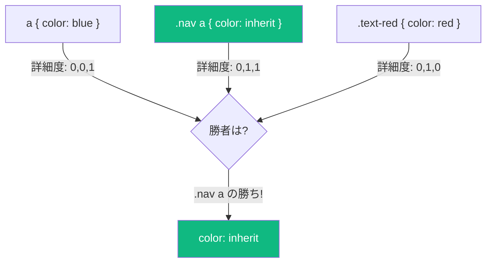
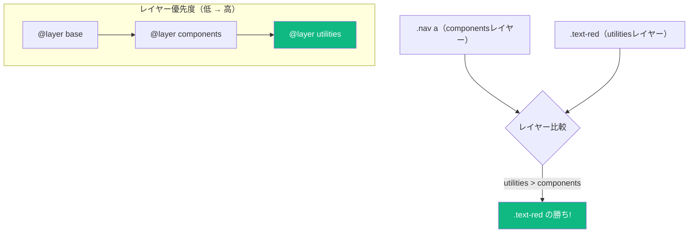

CSSの詳細度戦争は長年開発者を悩ませてきました。シンプルなスタイルを書いても、他のルールがより高い詳細度を持っているために適用されない。セレクタを追加し、後でさらに追加する必要が出てくる。最終的には `!important` が忍び込んでくる。

**CSS Cascade Layers**（`@layer`）は、セレクタの詳細度に関係なく、どのスタイルグループが優先されるかを明示的に制御することでこの問題を解決します。

## 詳細度の問題

よくあるシナリオを考えてみましょう：

```css
/* ベーススタイル */
a {
  color: blue;
}

/* コンポーネントスタイル */
.nav a {
  color: inherit;
}

/* ユーティリティクラス */
.text-red {
  color: red;
}
```

`.nav` 内の `.text-red` クラスを持つリンクは何色でしょうか？答えは `red` ではなく `inherit` です。`.nav a` は `.text-red`（0,1,0）よりも高い詳細度（0,1,1）を持っているからです。



レイヤーがなければ、詳細度を上げるか `!important` を使う必要があり、どちらも保守の悪夢につながります。

## Cascade Layersの登場

Cascade Layersを使うと、明示的な優先順位を持つ名前付きレイヤーにスタイルをグループ化できます：

```css
/* レイヤーの順序を定義（最初が最低優先度） */
@layer base, components, utilities;

@layer base {
  a {
    color: blue;
  }
}

@layer components {
  .nav a {
    color: inherit;
  }
}

@layer utilities {
  .text-red {
    color: red;
  }
}
```

これで `utilities` レイヤーは `components` よりも高い優先度を持つため、**詳細度に関係なく** `.text-red` が勝ちます：



## レイヤーの定義

### レイヤー順序の宣言

すべてのレイヤーを最初に宣言して順序を確立できます：

```css
/* 最初に列挙されたレイヤーが最低優先度 */
@layer reset, base, theme, components, utilities;
```

### スタイル付きのレイヤー作成

```css
@layer base {
  /* ここにスタイル */
}

/* またはインライン構文 */
@layer utilities {
  .hidden { display: none; }
  .visible { display: block; }
}
```

### 匿名レイヤー

名前のないレイヤーも作成できますが、管理が難しくなります：

```css
@layer {
  /* 匿名レイヤー */
}
```

### ネストされたレイヤー

より細かい制御のためにレイヤーをネストできます：

```css
@layer components {
  @layer buttons {
    .btn { /* ... */ }
  }

  @layer cards {
    .card { /* ... */ }
  }
}

/* ドット記法でネストされたレイヤーを参照 */
@layer components.buttons {
  .btn-primary { /* ... */ }
}
```

## レイヤーの優先度ルール

レイヤーの優先度を理解することが重要です：

1. **レイヤーなしのスタイルはレイヤー付きスタイルに勝つ** — どのレイヤーにも属さないスタイルが最高優先度
2. **後のレイヤーは前のレイヤーに勝つ** — `@layer a, b, c` では、レイヤー `c` が最高優先度
3. **レイヤー内では通常の詳細度ルールが適用される**

```css
@layer base, components;

@layer base {
  .foo { color: blue; }  /* 低いレイヤー */
}

@layer components {
  .foo { color: green; } /* 高いレイヤー - 勝ち! */
}

/* レイヤーなしスタイル - 最高優先度 */
.foo { color: red; }     /* 両方のレイヤーに勝つ! */
```

## `revert-layer` キーワード

`revert-layer` キーワードは前のレイヤーの値にロールバックします：

```css
@layer base, components, utilities;

@layer base {
  a { color: blue; }
}

@layer components {
  .nav a { color: inherit; }
}

@layer utilities {
  .reset-color {
    color: revert-layer; /* componentsレイヤーの値に戻る */
  }
}
```

## 推奨されるレイヤー構成

プロジェクトの典型的なレイヤー構造：

```css
@layer reset, base, theme, layout, components, utilities;

/* 1. Reset - ブラウザデフォルトの正規化 */
@layer reset {
  *, *::before, *::after {
    box-sizing: border-box;
  }

  body {
    margin: 0;
  }
}

/* 2. Base - 要素のデフォルト */
@layer base {
  body {
    font-family: system-ui, sans-serif;
    line-height: 1.5;
  }

  a {
    color: var(--link-color);
  }
}

/* 3. Theme - デザイントークンとカスタムプロパティ */
@layer theme {
  :root {
    --link-color: #0066cc;
    --text-color: #333;
    --bg-color: #fff;
  }
}

/* 4. Layout - ページ構造 */
@layer layout {
  .container {
    max-width: 1200px;
    margin: 0 auto;
  }

  .grid {
    display: grid;
    gap: 1rem;
  }
}

/* 5. Components - UIコンポーネント */
@layer components {
  .btn {
    padding: 0.5rem 1rem;
    border-radius: 4px;
  }

  .card {
    padding: 1rem;
    border: 1px solid #eee;
  }
}

/* 6. Utilities - 単一目的クラス（最高優先度） */
@layer utilities {
  .hidden { display: none; }
  .text-center { text-align: center; }
  .mt-4 { margin-top: 1rem; }
}
```

## レイヤーへのスタイルのインポート

外部スタイルシートをレイヤーに直接インポートできます：

```css
/* サードパーティCSSを低優先度レイヤーにインポート */
@import url("normalize.css") layer(reset);
@import url("bootstrap.css") layer(framework);

/* より高い優先度のレイヤーに自分のスタイル */
@layer framework, components, utilities;

@layer components {
  /* フレームワークのスタイルを簡単にオーバーライド */
  .btn {
    border-radius: 8px;
  }
}
```

これはサードパーティCSSを管理する上で非常に強力です。自分のレイヤーが優先されるため、サードパーティの詳細度はもう問題になりません。

## レイヤーと !important

`!important` フラグはレイヤーの順序を逆転させます：

```css
@layer base, components;

@layer base {
  .foo { color: blue !important; }  /* !importantで高い優先度 */
}

@layer components {
  .foo { color: red !important; }   /* !importantで低い優先度 */
}
```

`!important` を使うと、前のレイヤーが勝ちます。これは、ユーザースタイルシートの `!important` 宣言が作者スタイルシートに勝つというCSSの原則を維持しています。

## ブラウザサポート

Cascade Layersは優れたサポートがあります：

- Chrome 99+
- Firefox 97+
- Safari 15.4+
- Edge 99+

古いブラウザ向けには `@supports` を使用できます：

```css
@supports at-rule(@layer) {
  @layer base, components;

  @layer base {
    /* レイヤー付きスタイル */
  }
}

/* レイヤーサポートのないブラウザ用フォールバック */
@supports not at-rule(@layer) {
  /* 従来のカスケードベースのスタイル */
}
```

## 実践的なヒント

### 1. 常にレイヤー順序を最初に宣言

```css
/* 良い - 明示的な順序 */
@layer reset, base, components, utilities;

/* その後、任意の順序でレイヤーを定義 */
@layer utilities { /* ... */ }
@layer base { /* ... */ }
```

### 2. ユーティリティを最高レイヤーに

ユーティリティクラスは常に勝つべきです：

```css
@layer components, utilities;

@layer utilities {
  .sr-only { /* スクリーンリーダー専用 - 常に適用されるべき */ }
  .hidden { display: none !important; }
}
```

### 3. サードパーティCSSにレイヤーを使用

```css
@import "vendor.css" layer(vendor);

@layer vendor, custom;

@layer custom {
  /* あなたのオーバーライドは常に勝つ */
}
```

## まとめ

- Cascade Layers（`@layer`）は詳細度に関係なくスタイルの優先度を制御できる
- 後のレイヤーは前のレイヤーより高い優先度を持つ
- レイヤーなしスタイルはすべてのレイヤー付きスタイルに勝つ
- `revert-layer` を使って前のレイヤーの値にフォールバック
- `!important` はレイヤーの優先度を逆転させる
- サードパーティCSSを低優先度レイヤーにインポートして簡単にオーバーライド
- モダンブラウザで十分にサポート（2022年以降）

Cascade LayersはCSSアーキテクチャに正気をもたらします。レイヤーの優先度を明示的に宣言することで、詳細度戦争を排除し、スタイルシートをより予測可能で保守しやすくします。

## 参考文献

- [MDN: @layer](https://developer.mozilla.org/en-US/docs/Web/CSS/@layer)
- Grant, Keith. *CSS in Depth*, 2nd Edition. Manning Publications, 2024.
- [CSS Cascading and Inheritance Level 5](https://www.w3.org/TR/css-cascade-5/)
