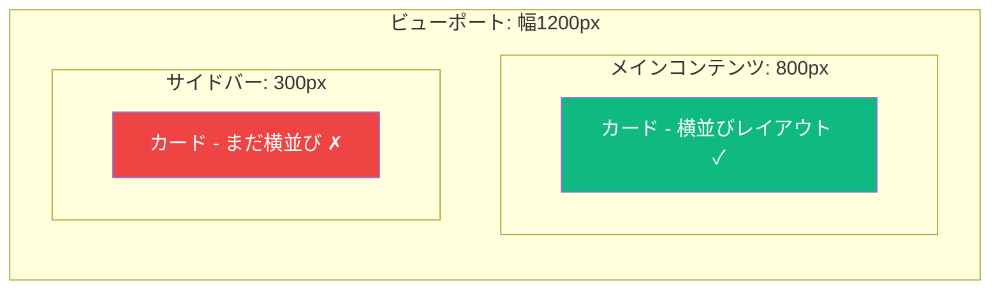
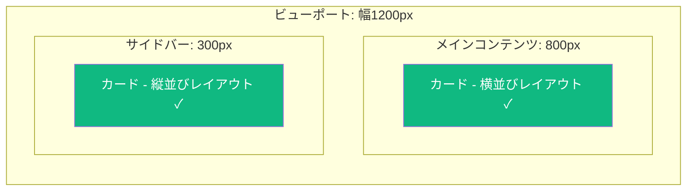

長年、レスポンシブWebデザインはビューポートのサイズに基づいてレイアウトを調整するために**メディアクエリ**に依存してきました。しかし、根本的な問題が常にありました：コンポーネントをウィンドウのサイズではなく、*コンテナのサイズ*に応じて変化させたい場合はどうすればよいのでしょうか？

そこで登場するのが**CSS Container Queries**です。これは最も要望の多かったCSS機能の1つで、真に再利用可能でレスポンシブなコンポーネントを構築することを可能にします。

## メディアクエリの問題点

異なるコンテキストで使用したいカードコンポーネントを考えてみましょう：

```css
/* メディアクエリアプローチ - ビューポート依存 */
@media (min-width: 768px) {
  .card {
    display: flex;
    flex-direction: row;
  }
}
```

これはカードがビューポートのほとんどを占める場合には機能します。しかし、同じカードを狭いサイドバーに配置するとどうなるでしょうか？メディアクエリはカードに利用可能なスペースではなく、**ビューポートの幅**に基づいて発火します。



ビューポートが広くても、サイドバー内のカードはコンテナに収まらない横並びレイアウトを強制されます。

## Container Queriesの登場

Container Queriesは、ビューポートではなく**コンテナのサイズ**に基づいて要素をスタイリングすることでこの問題を解決します：

```css
/* コンテナを定義 */
.card-container {
  container-type: inline-size;
}

/* コンテナのサイズをクエリ */
@container (min-width: 400px) {
  .card {
    display: flex;
    flex-direction: row;
  }
}
```

これでカードは実際に利用可能なスペースに応答します：



## コンテナの設定

### `container-type` プロパティ

Container Queriesを使用するには、まずどの要素がコンテナとして機能するかを定義する必要があります：

```css
.container {
  container-type: inline-size;
}
```

`container-type` プロパティは以下の値を受け付けます：

| 値 | 説明 |
|-------|-------------|
| `normal` | デフォルト。クエリコンテナではない |
| `inline-size` | インライン軸（横書きでは幅）でのクエリを有効化 |
| `size` | インライン軸とブロック軸の両方でクエリを有効化 |

レスポンシブレイアウトでは幅ベースのクエリが最も有用なため、通常は `inline-size` を使用します。

### コンテナの命名

ネストされたコンテナがある場合、特定のものをターゲットにするために名前を付けることができます：

```css
.sidebar {
  container-type: inline-size;
  container-name: sidebar;
}

.main-content {
  container-type: inline-size;
  container-name: main;
}

/* 特定のコンテナをターゲット */
@container sidebar (min-width: 300px) {
  .widget {
    /* サイドバーコンテキスト用のスタイル */
  }
}

@container main (min-width: 600px) {
  .widget {
    /* メインコンテンツ用のスタイル */
  }
}
```

### ショートハンド

`container-type` と `container-name` を `container` ショートハンドで組み合わせることができます：

```css
.sidebar {
  container: sidebar / inline-size;
  /* 以下と同等:
     container-name: sidebar;
     container-type: inline-size;
  */
}
```

## Container Queriesの記述

Container Queriesはメディアクエリに似た構文で `@container` アットルールを使用します：

```css
/* 基本的な幅クエリ */
@container (min-width: 400px) {
  .card { /* ... */ }
}

/* 名前付きコンテナクエリ */
@container sidebar (min-width: 300px) {
  .widget { /* ... */ }
}

/* 範囲構文（モダンブラウザ） */
@container (300px <= width <= 600px) {
  .card { /* ... */ }
}

/* 条件の組み合わせ */
@container (min-width: 400px) and (max-width: 800px) {
  .card { /* ... */ }
}
```

## コンテナクエリ単位

CSSはビューポート単位に似たコンテナ相対単位も提供しています：

| 単位 | 説明 |
|------|-------------|
| `cqw` | コンテナの幅の1% |
| `cqh` | コンテナの高さの1% |
| `cqi` | コンテナのインラインサイズの1% |
| `cqb` | コンテナのブロックサイズの1% |
| `cqmin` | `cqi` または `cqb` の小さい方 |
| `cqmax` | `cqi` または `cqb` の大きい方 |

これらはコンテナ内の流動的なタイポグラフィに便利です：

```css
.card-container {
  container-type: inline-size;
}

.card-title {
  /* フォントサイズがコンテナ幅に応じてスケール */
  font-size: clamp(1rem, 4cqi, 2rem);
}
```

## 実践例：レスポンシブカードコンポーネント

実際のレスポンシブカードを構築してみましょう：

```css
/* コンテナの設定 */
.card-wrapper {
  container-type: inline-size;
}

/* 基本カードスタイル（モバイルファースト） */
.card {
  display: grid;
  gap: 1rem;
  padding: 1rem;
  border-radius: 8px;
  background: white;
  box-shadow: 0 2px 4px rgba(0, 0, 0, 0.1);
}

.card-image {
  aspect-ratio: 16 / 9;
  object-fit: cover;
  border-radius: 4px;
}

.card-title {
  font-size: clamp(1rem, 3cqi, 1.5rem);
}

/* 中サイズコンテナ：横並びレイアウト */
@container (min-width: 400px) {
  .card {
    grid-template-columns: 150px 1fr;
    align-items: start;
  }

  .card-image {
    aspect-ratio: 1;
  }
}

/* 大サイズコンテナ：拡張レイアウト */
@container (min-width: 600px) {
  .card {
    grid-template-columns: 200px 1fr;
    padding: 1.5rem;
    gap: 1.5rem;
  }
}
```

```html
<div class="card-wrapper">
  <article class="card">
    
    <div class="card-content">
      <h2 class="card-title">カードタイトル</h2>
      <p>カードの説明...</p>
    </div>
  </article>
</div>
```

## スタイルクエリ（実験的機能）

Container Queriesはサイズだけでなく、**カスタムプロパティの値**もクエリできます：

```css
.card-wrapper {
  container-type: inline-size;
  --theme: light;
}

/* カスタムプロパティに基づくスタイルクエリ */
@container style(--theme: dark) {
  .card {
    background: #1a1a1a;
    color: white;
  }
}
```

これはまだ実験的ですが、強力なテーマ設定の可能性を開きます。

## ブラウザサポート

Container Queriesは2024年時点で優れたブラウザサポートがあります：

- Chrome 105+
- Firefox 110+
- Safari 16+
- Edge 105+

古いブラウザ向けには、プログレッシブエンハンスメントアプローチを使用できます：

```css
/* Container Queryサポートのないブラウザ用フォールバック */
.card {
  display: block;
}

/* サポートブラウザ用の拡張レイアウト */
@supports (container-type: inline-size) {
  .card-wrapper {
    container-type: inline-size;
  }

  @container (min-width: 400px) {
    .card {
      display: flex;
    }
  }
}
```

## ベストプラクティス

1. **すべてをコンテナにしない** — コンポーネントレベルのレスポンシブ性が実際に必要な場所でのみContainer Queriesを使用する

2. **コンテインメントに注意** — `container-type: inline-size` はレイアウトコンテインメントを作成し、子要素のサイズに影響を与える可能性がある

3. **メディアクエリと組み合わせる** — ページレベルのレイアウトにはメディアクエリを、コンポーネントレベルの適応にはContainer Queriesを使用する

4. **意味のあるコンテナ名を使用** — コンテナをネストする場合、名前を付けるとコードの保守性が向上する

5. **モバイルファーストで始める** — 小さいコンテナ用の基本スタイルを書き、`min-width` クエリで複雑さを追加する

## まとめ

- Container Queriesはビューポートではなくコンテナのサイズに基づいて要素をスタイリングできる
- `container-type: inline-size` を使用してクエリコンテナを定義する
- `@container` ルールを使用してサイズベースのスタイル変更を記述する
- コンテナクエリ単位（`cqw`、`cqi` など）はコンテナ内の流動的なサイズ設定を可能にする
- スタイルクエリはカスタムプロパティの値にマッチできる（実験的）
- Container Queriesはモダンブラウザで十分にサポートされている

Container Queriesはコンポーネントベースのデザインにとって革新的な機能です。コンテキストに適応する、真にポータブルで再利用可能なコンポーネントを構築でき、デザインシステムをより堅牢で保守しやすくします。

## 参考文献

- [MDN: CSS Container Queries](https://developer.mozilla.org/en-US/docs/Web/CSS/CSS_containment/Container_queries)
- Grant, Keith. *CSS in Depth*, 2nd Edition. Manning Publications, 2024.
- Attardi, Joe. *Modern CSS*. Apress, 2025.
