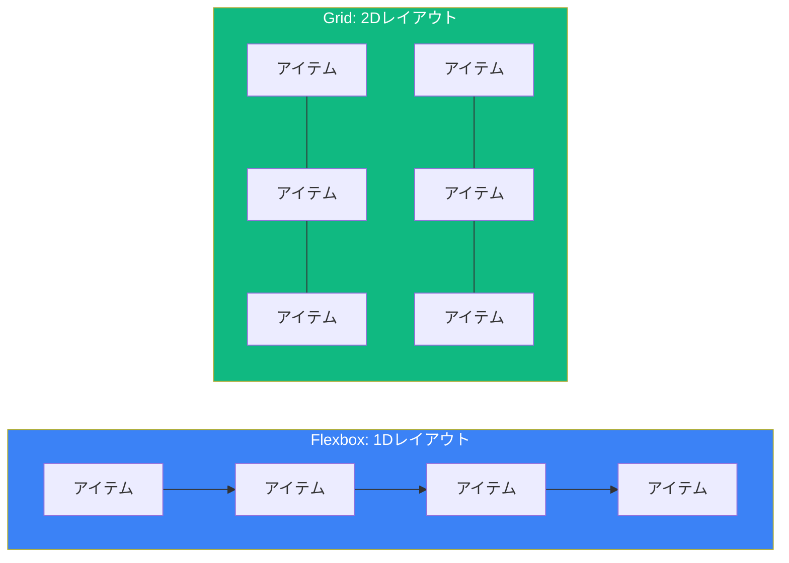
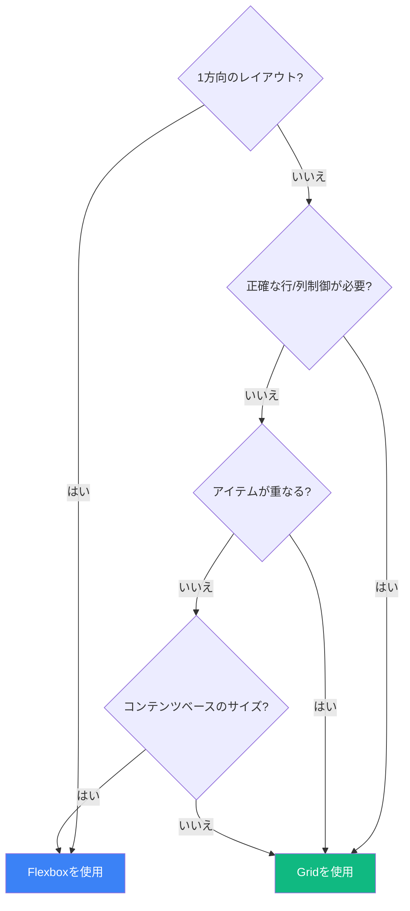

CSS GridとFlexboxはどちらも強力なレイアウトシステムであり、どちらを選ぶべきか開発者を悩ませることがよくあります。良いニュースは、これらは競合するものではなく、異なるユースケース向けに設計された補完的なツールだということです。

## 核心的な違い

基本的な違いはシンプルです：

- **Flexbox** は**1次元**レイアウト用（行または列）
- **Grid** は**2次元**レイアウト用（行と列）



しかし、このルールだけでは全体像は分かりません。より深く掘り下げてみましょう。

## Flexboxを使うべき時

### 1. ナビゲーションメニュー

Flexboxは単一軸に沿ったアイテム配置に優れています：

```css
.nav {
  display: flex;
  gap: 1rem;
  justify-content: space-between;
}

.nav-item {
  flex: 0 0 auto; /* 伸縮しない */
}
```

### 2. コンテンツのセンタリング

センタリングにはFlexboxが最適です：

```css
.centered {
  display: flex;
  justify-content: center; /* 水平方向 */
  align-items: center;     /* 垂直方向 */
  min-height: 100vh;
}
```

### 3. 未知またはダイナミックなサイズのアイテム

アイテムがコンテンツに基づいてサイズを決めるべき場合：

```css
.tags {
  display: flex;
  flex-wrap: wrap;
  gap: 0.5rem;
}

.tag {
  /* 各タグはコンテンツに合わせてサイズ */
  padding: 0.25rem 0.75rem;
}
```

### 4. アイテム間のスペース配分

アイテムを比例的に伸縮させたい場合：

```css
.split-view {
  display: flex;
}

.sidebar {
  flex: 0 0 250px; /* 固定幅 */
}

.main {
  flex: 1;         /* 残りのスペースを取る */
}
```

### 5. アイテムの並べ替え

Flexboxは並べ替えを簡単にします：

```css
.card-footer {
  display: flex;
}

.card-footer .primary-action {
  order: 2; /* 末尾に移動 */
}
```

## Gridを使うべき時

### 1. ページレイアウト

Gridはページ全体の構造に最適です：

```css
.page {
  display: grid;
  grid-template-areas:
    "header header"
    "sidebar main"
    "footer footer";
  grid-template-columns: 250px 1fr;
  grid-template-rows: auto 1fr auto;
  min-height: 100vh;
}

.header { grid-area: header; }
.sidebar { grid-area: sidebar; }
.main { grid-area: main; }
.footer { grid-area: footer; }
```

### 2. カードグリッド

行と列の両方にアイテムが必要な場合：

```css
.card-grid {
  display: grid;
  grid-template-columns: repeat(auto-fill, minmax(300px, 1fr));
  gap: 1.5rem;
}
```

### 3. 重なる要素

Gridではアイテムが同じセルを占有できます：

```css
.hero {
  display: grid;
  place-items: center;
}

.hero > * {
  grid-area: 1 / 1; /* すべての子が同じセルに */
}

.hero-image {
  width: 100%;
}

.hero-content {
  z-index: 1; /* 画像の上に */
  color: white;
}
```

### 4. 複雑な配置

アイテムが正確な配置を必要とする場合：

```css
.dashboard {
  display: grid;
  grid-template-columns: repeat(4, 1fr);
  grid-template-rows: repeat(3, 200px);
  gap: 1rem;
}

.widget-large {
  grid-column: span 2;
  grid-row: span 2;
}

.widget-wide {
  grid-column: span 2;
}
```

### 5. フォームレイアウト

Gridはラベルと入力フィールドを美しく整列させます：

```css
.form {
  display: grid;
  grid-template-columns: auto 1fr;
  gap: 1rem;
  align-items: center;
}

/* ラベルは1列目、入力は2列目 */
```

## 判断フレームワーク

このフローチャートを使って決定しましょう：



## 両方を組み合わせて使う

最良のレイアウトは両方を組み合わせることが多いです。全体構造にGrid、コンポーネントの詳細にFlexbox：

```css
/* ページレイアウトにGrid */
.page {
  display: grid;
  grid-template-columns: 250px 1fr;
  grid-template-rows: auto 1fr auto;
}

/* ヘッダーコンテンツにFlexbox */
.header {
  display: flex;
  justify-content: space-between;
  align-items: center;
  padding: 1rem;
}

/* ナビゲーションにFlexbox */
.nav {
  display: flex;
  gap: 1rem;
}

/* メインコンテンツのカードにGrid */
.content {
  display: grid;
  grid-template-columns: repeat(auto-fill, minmax(280px, 1fr));
  gap: 1rem;
  padding: 1rem;
}

/* 各カード内にFlexbox */
.card {
  display: flex;
  flex-direction: column;
}

.card-footer {
  margin-top: auto; /* 下部に押し込む */
  display: flex;
  justify-content: space-between;
}
```

## 一般的なパターン

### ホーリーグレイルレイアウト（Grid）

```css
.holy-grail {
  display: grid;
  grid-template:
    "header header header" auto
    "nav main aside" 1fr
    "footer footer footer" auto
    / 200px 1fr 200px;
  min-height: 100vh;
}
```

### 等しい高さのカード（Grid）

```css
.card-row {
  display: grid;
  grid-template-columns: repeat(3, 1fr);
  gap: 1rem;
}
/* すべてのカードが自動的に等しい高さ */
```

### 柔軟なカードコンテンツ（Flexbox）

```css
.card {
  display: flex;
  flex-direction: column;
  height: 100%;
}

.card-body {
  flex: 1; /* スペースを埋めるために伸びる */
}

.card-footer {
  margin-top: auto; /* 常に下部に */
}
```

### レスポンシブサイドバー（両方）

```css
.layout {
  display: grid;
  grid-template-columns: 1fr;
}

@media (min-width: 768px) {
  .layout {
    grid-template-columns: 250px 1fr;
  }
}

.sidebar-nav {
  display: flex;
  flex-direction: column;
  gap: 0.5rem;
}
```

## パフォーマンスの考慮事項

GridとFlexboxはどちらもモダンブラウザで高度に最適化されています。ただし：

- **Flexbox** はシンプルな1次元レイアウトでわずかに高速な場合がある
- **Grid** は複雑なレイアウトをネストされたFlexboxよりも効率的に処理
- 深くネストされたフレックスコンテナは避け、複雑な構造にはGridを使用

## まとめ表

| ユースケース | Flexbox | Grid |
|----------|---------|------|
| ナビゲーションバー | ✓ | |
| コンテンツのセンタリング | ✓ | ✓ |
| カードグリッド | | ✓ |
| フォームレイアウト | | ✓ |
| ページレイアウト | | ✓ |
| スペース配分 | ✓ | |
| 未知のアイテムサイズ | ✓ | |
| 重なるアイテム | | ✓ |
| 垂直センタリング | ✓ | ✓ |
| アイテムの並べ替え | ✓ | |

## まとめ

- **Flexbox**: 1次元、コンテンツアウトアプローチ
- **Grid**: 2次元、レイアウトインアプローチ
- 1方向に流れるコンポーネントにはFlexboxを使用
- 行と列を持つ構造化されたレイアウトにはGridを使用
- 両方を組み合わせる：構造にGrid、詳細にFlexbox
- 一方のツールを他方の仕事に無理に使わない

最良のCSSレイアウトは、両方のシステムをそれぞれが輝く場所で活用します。GridとFlexboxは競合相手ではなく、柔軟で保守しやすいレイアウトを作成するパートナーです。

## 参考文献

- [MDN: CSS Grid Layout](https://developer.mozilla.org/en-US/docs/Web/CSS/CSS_grid_layout)
- [MDN: CSS Flexible Box Layout](https://developer.mozilla.org/en-US/docs/Web/CSS/CSS_flexible_box_layout)
- Grant, Keith. *CSS in Depth*, 2nd Edition. Manning Publications, 2024.
- Attardi, Joe. *Modern CSS*. Apress, 2025.
