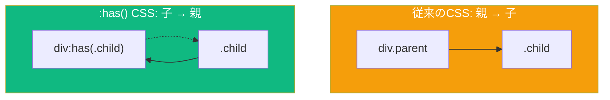

数十年間、CSS開発者は「親セレクタ」を望んできました — 要素が含む内容に基づいてその要素をスタイリングする方法です。従来のCSSセレクタは下方向にしか機能しません：親に基づいて子を選択できますが、その逆はできませんでした。

**`:has()` 擬似クラス**はすべてを変えます。これは「20年間待ち望んでいたCSS機能」とも呼ばれています。

## :has() とは？

`:has()` 擬似クラスは、指定されたセレクタに一致する要素を少なくとも1つ含む要素を選択します：

```css
/* を含む<a>を選択 */
a:has(img) {
  display: block;
  border: none;
}

/* 無効な入力を含む<form>を選択 */
form:has(input:invalid) {
  border: 2px solid red;
}
```



## 基本構文

`:has()` セレクタは引数として相対セレクタリストを取ります：

```css
/* 要素が別の要素を含む */
parent:has(child) { }

/* 要素が特定のクラスを持つ要素を含む */
div:has(.highlight) { }

/* 要素が特定の状態の要素を含む */
form:has(input:focus) { }

/* 複数の条件（OR論理） */
article:has(img, video) { }
```

## 実際のユースケース

### 1. バリデーション状態に基づくフォームスタイリング

最も実用的な使い方の1つはフォームバリデーションのフィードバックです：

```css
/* いずれかのフィールドが無効な場合、フォーム全体をハイライト */
form:has(:invalid) {
  background-color: #fff5f5;
  border-left: 4px solid #e53e3e;
}

/* すべての必須フィールドが有効な場合のスタイル */
form:has(:required:valid):not(:has(:required:invalid)) {
  background-color: #f0fff4;
  border-left: 4px solid #38a169;
}

/* フォームが有効な場合のみ送信ボタンを有効化 */
form:has(:invalid) button[type="submit"] {
  opacity: 0.5;
  pointer-events: none;
}
```

### 2. オプション要素を持つカードレイアウト

コンテンツに基づいてカードを異なるスタイルにします：

```css
/* 画像を持つカードは異なるレイアウト */
.card:has(img) {
  grid-template-rows: 200px 1fr;
}

.card:not(:has(img)) {
  grid-template-rows: 1fr;
  padding-top: 2rem;
}

/* 注目カード（内部に.featuredクラスを持つ） */
.card:has(.featured) {
  border: 2px solid gold;
  box-shadow: 0 4px 12px rgba(255, 215, 0, 0.3);
}
```

### 3. アクティブ状態を持つナビゲーション

子リンクがアクティブな場合に親ナビゲーション項目をハイライト：

```css
/* 現在のページリンクを含むナビ項目をスタイル */
nav li:has(a[aria-current="page"]) {
  background-color: #edf2f7;
  border-radius: 4px;
}

/* 子が選択されている場合のドロップダウン親 */
.dropdown:has(.selected) > .dropdown-toggle {
  font-weight: bold;
  color: #2b6cb0;
}
```

### 4. 数量クエリ

子要素の数に基づいてスタイルを適用：

```css
/* 多くのアイテムを持つグリッドは異なるレイアウト */
.gallery:has(> :nth-child(6)) {
  grid-template-columns: repeat(3, 1fr);
}

/* 少ないアイテムを持つグリッド */
.gallery:not(:has(> :nth-child(6))) {
  grid-template-columns: repeat(2, 1fr);
}

/* 1つのアイテムのみを持つリスト */
ul:has(> li:only-child) {
  list-style: none;
  padding-left: 0;
}
```

### 5. 兄弟セレクションの強化

`:has()` は兄弟コンビネータとも連携できます：

```css
/* サブ見出しが続く見出しをスタイル */
h1:has(+ .subheading) {
  margin-bottom: 0.25rem;
}

/* 関連するinputがフォーカスされている場合のlabel */
label:has(+ input:focus) {
  color: #3182ce;
  font-weight: bold;
}

/* inputに内容がある場合のコンテナ */
.input-group:has(input:not(:placeholder-shown)) label {
  transform: translateY(-100%);
  font-size: 0.75rem;
}
```

## :has() と他のセレクタの組み合わせ

### :not() との組み合わせ

```css
/* 別の段落が続かない段落 */
p:not(:has(+ p)) {
  margin-bottom: 2rem;
}

/* 見出しを持たないセクション */
section:not(:has(h1, h2, h3)) {
  padding-top: 1rem;
}
```

### :is() と :where() との組み合わせ

```css
/* メディア要素を含む記事 */
article:has(:is(img, video, iframe, canvas)) {
  container-type: inline-size;
}

/* インタラクティブな子を持つヘッダー */
header:has(:where(button, a, input)) {
  position: sticky;
  top: 0;
}
```

## パフォーマンスの考慮事項

`:has()` は、祖先が一致するかどうかを判断するためにブラウザが子孫を確認する必要があるため、計算コストが高くなる可能性があります。いくつかのヒント：

```css
/* 避ける: 非常に広いセレクタ */
:has(.some-class) { } /* ドキュメント全体をチェック */

/* 推奨: 特定の要素にスコープ */
.container:has(.some-class) { }

/* 避ける: 深い子孫チェック */
main:has(div div div .deep-element) { }

/* 推奨: 直接の子または浅いチェック */
main:has(> section > .element) { }
```

## ブラウザサポート

`:has()` は優れたモダンブラウザサポートがあります：

- Chrome 105+
- Firefox 121+
- Safari 15.4+
- Edge 105+

古いブラウザ向けには、機能検出を使用します：

```css
/* フォールバックスタイル */
.card {
  border: 1px solid #ccc;
}

/* :has()サポートブラウザ用の拡張スタイル */
@supports selector(:has(*)) {
  .card:has(.featured) {
    border: 2px solid gold;
  }
}
```

## 一般的なパターン

### キャプション付きfigureのスタイリング

```css
/* キャプション付きfigureはマージン調整 */
figure:has(figcaption) {
  margin-bottom: 2rem;
}

figure:has(figcaption) img {
  margin-bottom: 0.5rem;
}

/* キャプションなしのfigure */
figure:not(:has(figcaption)) {
  margin-bottom: 1rem;
}
```

### フォームフィールドのフォーカス状態

```css
/* フローティングラベルパターン */
.field {
  position: relative;
}

.field label {
  position: absolute;
  top: 50%;
  transform: translateY(-50%);
  transition: all 0.2s;
}

.field:has(input:focus) label,
.field:has(input:not(:placeholder-shown)) label {
  top: 0;
  font-size: 0.75rem;
  color: #3182ce;
}
```

### コンテンツに基づくダークモード

```css
/* コードブロック用の自動ダークモード */
.content:has(pre code) {
  --bg-color: #1a202c;
  --text-color: #e2e8f0;
}
```

## まとめ

- `:has()` は子孫要素に基づいて要素を選択する（「親セレクタ」）
- フォームバリデーション、条件付きレイアウト、動的スタイリングに使用
- `:not()`、`:is()`、`:where()` と組み合わせて強力な選択が可能
- 非常に広いセレクタではパフォーマンスに注意
- モダンブラウザで十分にサポート（2024年以降）

`:has()` セレクタはCSSで可能なことを根本的に変えます。以前はJavaScriptが必要だったパターン — フォームの有効性に基づくスタイリングやカードの内容に基づくスタイリングなど — が今や純粋なCSSで可能です。すべてのCSS開発者のツールキットに属する強力なツールです。

## 参考文献

- [MDN: :has() 擬似クラス](https://developer.mozilla.org/en-US/docs/Web/CSS/:has)
- Grant, Keith. *CSS in Depth*, 2nd Edition. Manning Publications, 2024.
- Attardi, Joe. *Modern CSS*. Apress, 2025.
