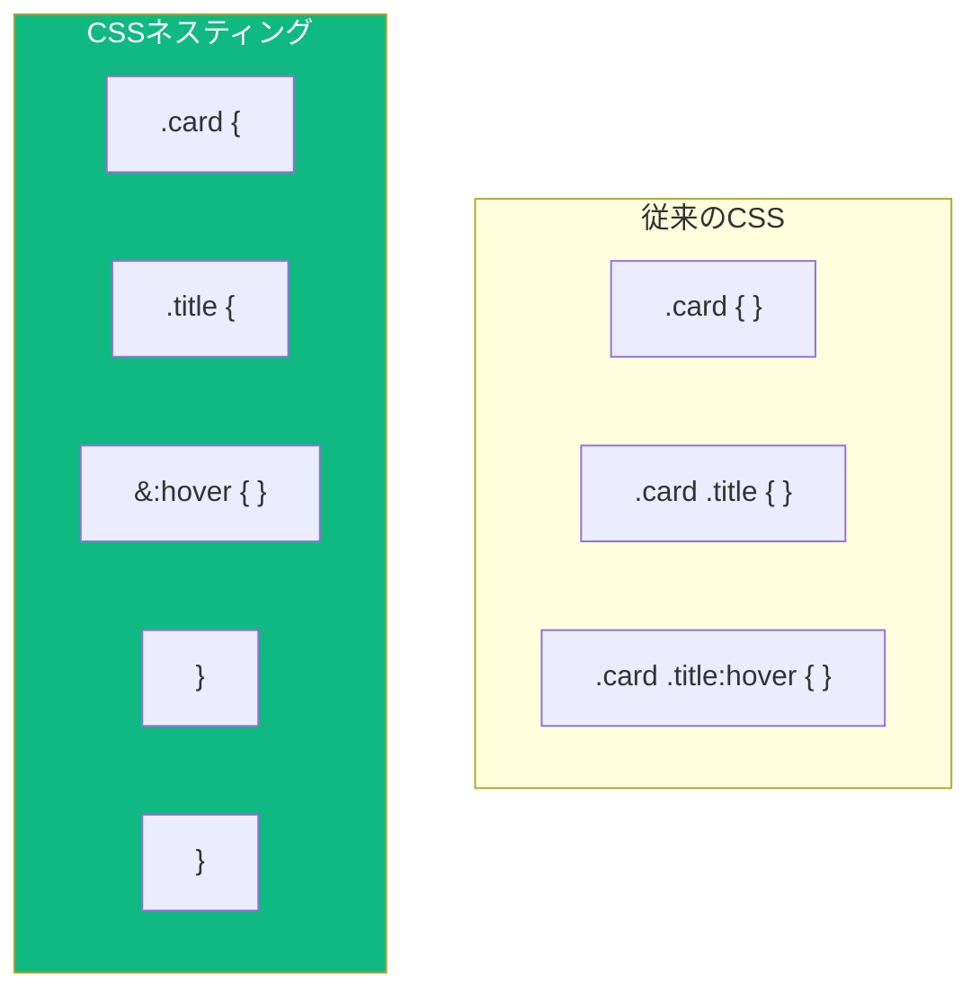

長年、開発者がSassやLessなどのCSSプリプロセッサを使う主な理由の1つは**ネスティング**でした。ネストされたセレクタを書くことは自然に感じられ、関連するスタイルをまとめて保持できます。今では、ネイティブCSSがネスティングをサポートしており、ビルドツールなしで使用できます。

## CSSネスティングとは？

CSSネスティングは、親セレクタの中に子セレクタを書くことを可能にします：

```css
/* 従来のCSS */
.card {
  padding: 1rem;
}
.card .title {
  font-size: 1.5rem;
}
.card .title:hover {
  color: blue;
}

/* CSSネスティング使用 */
.card {
  padding: 1rem;

  .title {
    font-size: 1.5rem;

    &:hover {
      color: blue;
    }
  }
}
```

ネストされたバージョンはより読みやすく、セレクタ間の関係を明確に示しています。



## ネスティングセレクタ（&）

`&` 文字は親セレクタを表します。場合によっては必須で、他の場合はオプションです。

### & が必須の場合

擬似クラスや擬似要素を追加する場合は `&` が必要です：

```css
.button {
  background: blue;

  /* 擬似クラスには&が必要 */
  &:hover {
    background: darkblue;
  }

  &:focus {
    outline: 2px solid orange;
  }

  /* 擬似要素には&が必要 */
  &::before {
    content: "→ ";
  }

  /* 他のセレクタとの組み合わせ */
  &.primary {
    background: green;
  }
}
```

### & がオプションの場合

子孫セレクタ（子要素の選択）の場合、`&` はオプションです：

```css
.card {
  /* これらは同等 */
  .title { font-weight: bold; }
  & .title { font-weight: bold; }
}
```

どちらも `.card .title { font-weight: bold; }` にコンパイルされます。

### ネストされたセレクタの後に & を配置

別のセレクタの後に `&` を配置して、関係を逆転させることができます：

```css
.title {
  font-size: 1rem;

  /* .titleが.heroの中にある場合 */
  .hero & {
    font-size: 2rem;
  }
}
```

これは以下にコンパイルされます：
```css
.title { font-size: 1rem; }
.hero .title { font-size: 2rem; }
```

## 複数のセレクタのネスト

### セレクタリスト

複数のセレクタを一度にネストできます：

```css
.card {
  h1, h2, h3 {
    margin-top: 0;
  }

  &:hover, &:focus {
    box-shadow: 0 4px 8px rgba(0, 0, 0, 0.1);
  }
}
```

### 複合セレクタ

セレクタを組み合わせる場合は `&` を使用します：

```css
.button {
  /* .button.primary */
  &.primary {
    background: blue;
  }

  /* .button.secondary */
  &.secondary {
    background: gray;
  }

  /* .button[disabled] */
  &[disabled] {
    opacity: 0.5;
  }
}
```

## アットルールのネスト

強力な機能の1つは、`@media` などのアットルールをセレクタ内にネストすることです：

```css
.sidebar {
  width: 100%;

  @media (min-width: 768px) {
    width: 300px;
  }

  @media (min-width: 1024px) {
    width: 400px;
  }
}
```

これは以下にコンパイルされます：
```css
.sidebar { width: 100%; }
@media (min-width: 768px) { .sidebar { width: 300px; } }
@media (min-width: 1024px) { .sidebar { width: 400px; } }
```

これにより、コンポーネントのすべてのスタイルをまとめて保持でき、複数のメディアクエリブロックに散らばることがありません。

### コンテナクエリのネスト

同じことがコンテナクエリでも機能します：

```css
.card {
  display: block;

  @container (min-width: 400px) {
    display: flex;
  }
}
```

### @supportsのネスト

```css
.grid {
  display: flex;
  flex-wrap: wrap;

  @supports (display: grid) {
    display: grid;
    grid-template-columns: repeat(3, 1fr);
  }
}
```

## 深いネスト：注意して使用

ネスティングは強力ですが、深くなりすぎることは避けましょう：

```css
/* 避ける: 深すぎるネスト */
.page {
  .header {
    .nav {
      .menu {
        .item {
          .link {
            color: blue;
          }
        }
      }
    }
  }
}
```

これは上書きが難しい過度に詳細なセレクタを作成します。ネストは最大2〜3レベルに抑えましょう：

```css
/* 改善: フラットな構造 */
.nav-menu {
  display: flex;

  .item {
    padding: 0.5rem;
  }

  .link {
    color: blue;

    &:hover {
      color: darkblue;
    }
  }
}
```

## Sassネスティングとの比較

Sassに慣れている場合、CSSネスティングは非常に似ています：

| 機能 | Sass | CSSネスティング |
|---------|------|-------------|
| 子孫ネスト | `.parent { .child { } }` | `.parent { .child { } }` |
| 擬似クラス | `&:hover { }` | `&:hover { }` |
| 複合セレクタ | `&.class { }` | `&.class { }` |
| 後の親参照 | `.context & { }` | `.context & { }` |
| ネストされたメディアクエリ | `@media { }` | `@media { }` |
| プロパティネスト | `font: { size: 1rem; }` | サポートなし |
| 文字列補間 | `#{$var}` | サポートなし |

主な違いは、CSSネスティングがプロパティネストやセレクタ内での変数補間をサポートしていないことです。

## 実践例：コンポーネントスタイリング

ネスティングでスタイリングされた完全なコンポーネント：

```css
.card {
  background: white;
  border-radius: 8px;
  box-shadow: 0 2px 4px rgba(0, 0, 0, 0.1);
  overflow: hidden;

  /* 画像エリア */
  .image {
    aspect-ratio: 16 / 9;
    object-fit: cover;
  }

  /* コンテンツエリア */
  .content {
    padding: 1rem;
  }

  /* タイトルスタイル */
  .title {
    margin: 0 0 0.5rem;
    font-size: 1.25rem;

    &:hover {
      color: var(--primary-color);
    }
  }

  /* 説明文 */
  .description {
    color: #666;
    line-height: 1.6;
  }

  /* アクション付きフッター */
  .footer {
    display: flex;
    justify-content: space-between;
    padding: 1rem;
    border-top: 1px solid #eee;
  }

  /* インタラクティブ状態 */
  &:hover {
    box-shadow: 0 4px 12px rgba(0, 0, 0, 0.15);
  }

  /* バリアント */
  &.featured {
    border: 2px solid gold;
  }

  /* レスポンシブ調整 */
  @media (min-width: 768px) {
    display: grid;
    grid-template-columns: 200px 1fr;

    .image {
      aspect-ratio: 1;
    }
  }
}
```

## ブラウザサポート

CSSネスティングはモダンブラウザで十分にサポートされています：

- Chrome 120+
- Firefox 117+
- Safari 17.2+
- Edge 120+

古いブラウザ向けには、PostCSSとネスティングプラグインなどのビルドツールを使用するか、引き続きSassを使用することを検討してください。

```css
/* 機能検出 */
@supports selector(&) {
  .card {
    .title {
      /* ネストされたスタイル */
    }
  }
}
```

## ベストプラクティス

1. **ネストの深さを制限** — 詳細度の問題を避けるため、ネストは最大2〜3レベルに抑える

2. **明確さのために & を明示的に使用** — オプションの場合でも、`&` は関係をより明確にできる

3. **関連するスタイルをグループ化** — 擬似クラスとメディアクエリは変更するプロパティの近くに配置

4. **すべてをネストしない** — 独立したコンポーネントは独自のトップレベルセレクタを持つべき

5. **出力CSSを考慮** — ネストは完全なセレクタに展開されることを覚えておく；深くネストされたルールは長く詳細なセレクタを作成する

## まとめ

- CSSネスティングは親セレクタ内に子セレクタを書くことを可能にする
- `&` ネスティングセレクタは親を参照する
- `@media` などのアットルールはセレクタ内にネストできる
- 詳細度の問題を避けるためネストは浅く保つ（2〜3レベル）
- 構文はSassに似ているため、移行は簡単
- モダンブラウザで十分にサポート（2024年以降）

ネイティブCSSネスティングは、プリプロセッサを使用する最大の理由の1つを排除します。標準CSSのままでスタイルシートをより整理され、保守しやすくします。

## 参考文献

- [MDN: CSSネスティング](https://developer.mozilla.org/en-US/docs/Web/CSS/CSS_nesting)
- Grant, Keith. *CSS in Depth*, 2nd Edition. Manning Publications, 2024.
- [CSS Nesting Module](https://www.w3.org/TR/css-nesting-1/)
