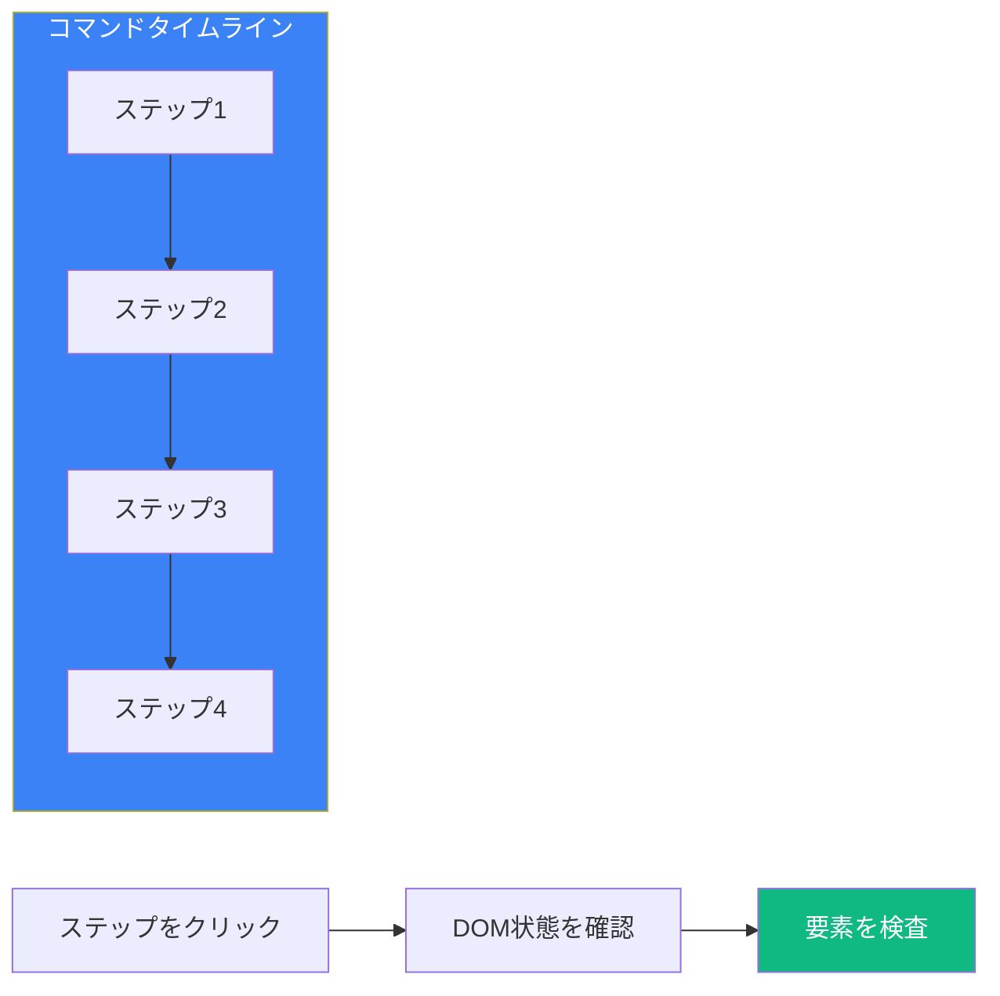

Cypressは他のテストフレームワークとは一線を画す優れたデバッグ機能を提供します。これらのツールを理解することで、失敗するテストを素早く特定して修正できるようになります。

## タイムトラベルデバッグ



### タイムトラベルの仕組み

Cypress Test Runnerでテストを実行すると、各コマンドがその時点でのDOMのスナップショットを作成します。任意のコマンドにホバーまたはクリックすると、そのステップでのページの正確な状態を確認できます。

```javascript
// これらの各コマンドがスナップショットを作成
cy.visit('/login');                    // スナップショット1
cy.get('[data-testid="email"]')        // スナップショット2
  .type('user@example.com');           // スナップショット3
cy.get('[data-testid="submit"]')       // スナップショット4
  .click();                            // スナップショット5
cy.url()                               // スナップショット6
  .should('include', '/dashboard');    // スナップショット7
```

### 変更前/変更後の状態

DOMを変更するコマンドの場合、Cypressは「変更前」と「変更後」の両方の状態を表示します：

- コマンドにホバー → 「変更後」の状態を表示
- コマンドをピン留め → 「変更前」と「変更後」を切り替え

## コマンドログ

### コマンドログの読み方

```javascript
// コマンドログが表示する内容：
// - コマンド名（GET、CLICK、TYPE）
// - 使用されたセレクターまたは値
// - 生成されたサブジェクト
// - 行われたアサーション
// - 所要時間

cy.get('[data-testid="users"]')    // GET [data-testid="users"]
  .find('.user')                    // FIND .user
  .should('have.length', 5)         // ASSERT expected 5 got 5
  .first()                          // FIRST
  .click();                         // CLICK
```

### コマンドログの状態

| 状態 | 色 | 意味 |
|------|------|------|
| Pending | グレー | コマンドはキューに入っている |
| Running | 青 | コマンドは実行中 |
| Passed | 緑 | コマンドは成功 |
| Failed | 赤 | コマンドまたはアサーションが失敗 |

## cy.pause()の使用

テストの実行を一時停止して現在の状態を検査：

```javascript
it('ステップごとにデバッグ', () => {
  cy.visit('/dashboard');

  cy.pause(); // テストはここで一時停止 - DOMを検査

  cy.get('[data-testid="sidebar"]').click();

  cy.pause(); // サイドバーの状態を確認するために再度一時停止

  cy.get('[data-testid="menu-item"]').should('be.visible');
});
```

一時停止中にできること：
- DOM内の要素を検査
- ネットワークリクエストを確認
- ブラウザDevToolsを使用
- 1コマンドずつ進む

## cy.debug()の使用

ブラウザDevToolsをトリガーするデバッガーステートメントを挿入：

```javascript
it('ブラウザデバッガーを使用', () => {
  cy.visit('/users');

  cy.get('[data-testid="user-list"]')
    .debug()  // DevToolsデバッガーを開く
    .find('.user')
    .should('have.length.gt', 0);
});
```

`.debug()`コマンドは：
- 現在のサブジェクトをコンソールにログ
- ブラウザのデバッガーをトリガー
- 生成された値の検査を許可

## コンソールログ

### cy.log()の使用

コマンドログにカスタムメッセージを追加：

```javascript
it('進捗をログ', () => {
  cy.log('ユーザー作成テストを開始');

  cy.visit('/users/new');
  cy.log('フォームに入力中');

  cy.get('[data-testid="name"]').type('John');
  cy.get('[data-testid="email"]').type('john@example.com');

  cy.log('フォームを送信');
  cy.get('[data-testid="submit"]').click();

  cy.log('ユーザーが作成されたことを確認');
  cy.url().should('include', '/users/');
});
```

### .then()でconsole.logを使用

```javascript
cy.get('[data-testid="user-id"]')
  .invoke('text')
  .then((text) => {
    console.log('ユーザーID:', text);
    // テストを続行
  });

// またはサブジェクトを直接ログ
cy.get('.item')
  .then(($el) => {
    console.log('要素:', $el);
    console.log('テキスト:', $el.text());
    console.log('クラス:', $el.attr('class'));
  });
```

## ネットワークリクエストの検査

### DevToolsでの表示

```javascript
it('APIコールを検査', () => {
  // 実行前にDevToolsのNetworkタブを開く

  cy.intercept('GET', '/api/users').as('getUsers');

  cy.visit('/users');

  cy.wait('@getUsers').then((interception) => {
    console.log('リクエスト:', interception.request);
    console.log('レスポンス:', interception.response);
  });
});
```

### インターセプトのデバッグ

```javascript
cy.intercept('POST', '/api/users', (req) => {
  console.log('リクエストボディ:', req.body);
  console.log('リクエストヘッダー:', req.headers);

  req.continue((res) => {
    console.log('レスポンスステータス:', res.statusCode);
    console.log('レスポンスボディ:', res.body);
  });
}).as('createUser');
```

## よくあるデバッグシナリオ

### 要素が見つからない

```javascript
// 問題：cy.get()が要素を見つけられない
cy.get('[data-testid="submit"]'); // エラー：タイムアウト

// デバッグ手順：
// 1. 要素が存在するか確認
cy.get('body').then(($body) => {
  console.log('送信ボタンが存在:', $body.find('[data-testid="submit"]').length > 0);
});

// 2. セレクターのタイプミスを確認
cy.get('[data-testid]').then(($els) => {
  $els.each((i, el) => {
    console.log('見つかったtestid:', el.getAttribute('data-testid'));
  });
});

// 3. 非同期コンテンツを待機
cy.get('[data-testid="submit"]', { timeout: 10000 });
```

### アサーションの失敗

```javascript
// 問題：should()アサーションが失敗
cy.get('.count').should('have.text', '5'); // エラー：expected "3" to equal "5"

// デバッグ：実際の値をログ
cy.get('.count')
  .invoke('text')
  .then((text) => {
    console.log('実際のテキスト:', text);
    console.log('テキストの長さ:', text.length);
    console.log('トリム後:', text.trim());
  });
```

### タイミングの問題

```javascript
// 問題：要素が一瞬表示されて消える
cy.get('[data-testid="toast"]').should('be.visible'); // 失敗

// デバッグ：長いタイムアウトを追加して状態をログ
cy.get('[data-testid="toast"]', { timeout: 10000 })
  .should(($el) => {
    console.log('トーストが表示:', $el.is(':visible'));
    console.log('トーストのテキスト:', $el.text());
  });

// またはcy.pause()でその瞬間をキャッチ
cy.pause();
cy.get('[data-testid="toast"]').should('be.visible');
```

## スクリーンショットとビデオ

### 失敗時の自動スクリーンショット

```javascript
// cypress.config.js
module.exports = defineConfig({
  e2e: {
    screenshotOnRunFailure: true,
    screenshotsFolder: 'cypress/screenshots',
  },
});
```

### 手動スクリーンショット

```javascript
it('デバッグ用にスクリーンショットを撮影', () => {
  cy.visit('/dashboard');
  cy.screenshot('dashboard-loaded');

  cy.get('[data-testid="sidebar"]').click();
  cy.screenshot('sidebar-opened');

  // スクリーンショットはcypress/screenshots/に保存
});
```

### ビデオ録画

```javascript
// cypress.config.js
module.exports = defineConfig({
  e2e: {
    video: true,
    videoCompression: 32,
    videosFolder: 'cypress/videos',
  },
});
```

## テスト分離のデバッグ

### 状態の漏れを特定

```javascript
describe('状態共有の問題があるテスト', () => {
  it('最初のテストが状態を変更', () => {
    cy.visit('/');
    localStorage.setItem('user', 'admin');
    // テスト成功
  });

  it('2番目のテストはクリーンな状態を期待', () => {
    cy.visit('/');
    // 前のテストからのlocalStorageに'user'があるため失敗
    cy.get('[data-testid="login-button"]').should('exist');
  });
});

// 修正：beforeEachで状態をリセット
describe('適切に分離されたテスト', () => {
  beforeEach(() => {
    cy.clearLocalStorage();
    cy.clearCookies();
  });

  it('最初のテスト', () => {
    // ...
  });

  it('2番目のテストはクリーンな状態', () => {
    // ...
  });
});
```

## CIでのデバッグ

### デバッグ情報の追加

```javascript
// cypress/support/e2e.js
Cypress.on('fail', (error, runnable) => {
  console.log('テスト失敗:', runnable.title);
  console.log('エラー:', error.message);
  console.log('スタック:', error.stack);

  // 追加のコンテキストをログ
  cy.url().then((url) => console.log('失敗時のURL:', url));

  throw error; // テストを失敗させるために再スロー
});
```

### 環境固有のデバッグ

```javascript
// CIでより多くのログを追加
if (Cypress.env('CI')) {
  Cypress.on('command:start', ({ name, args }) => {
    console.log(`コマンド: ${name}`, args);
  });
}
```

## ベストプラクティス

### 1. 説明的なログを使用

```javascript
it('新しい注文を作成', () => {
  cy.log('**ステップ1：商品ページに移動**');
  cy.visit('/products');

  cy.log('**ステップ2：カートにアイテムを追加**');
  cy.get('[data-testid="product-1"]').click();
  cy.get('[data-testid="add-to-cart"]').click();

  cy.log('**ステップ3：チェックアウト**');
  cy.get('[data-testid="checkout"]').click();

  cy.log('**ステップ4：注文作成を確認**');
  cy.url().should('include', '/orders/');
});
```

### 2. 一度に1つずつデバッグ

```javascript
// 1つの長いテストの代わりに
it('複雑なフロー', () => {
  // 50行のコード
});

// より小さく焦点を絞ったテストに分割
it('カートにアイテムを追加', () => { /* ... */ });
it('チェックアウトに進む', () => { /* ... */ });
it('支払いを完了', () => { /* ... */ });
```

### 3. 条件付きデバッグを使用

```javascript
// インタラクティブモードでのみデバッグ
if (Cypress.config('isInteractive')) {
  cy.pause();
}

// 開発環境でのみログ
if (Cypress.env('DEBUG')) {
  cy.log('デバッグ情報:', someValue);
}
```

## まとめ

| ツール | 用途 |
|--------|------|
| タイムトラベル | 各ステップでのDOMを表示 |
| コマンドログ | コマンド実行フローを確認 |
| `cy.pause()` | 手動検査のためにテストを停止 |
| `cy.debug()` | ブラウザデバッガーを開く |
| `cy.log()` | ログにカスタムメッセージを追加 |
| `.then()` + `console.log` | コンソールに値をログ |
| スクリーンショット | ビジュアル状態をキャプチャ |
| ビデオ | テスト実行全体を録画 |

重要なポイント：

- タイムトラベルを使用して各コマンドでのDOM状態を確認
- コマンドログのコマンドをクリックしてピン留めして検査
- `cy.pause()`を使用して停止し、ページを手動で検査
- `cy.debug()`を使用して特定の時点でブラウザDevToolsを開く
- `.then()`と`console.log()`で値をログしてデバッグ
- 重要なポイントでスクリーンショットを撮影してビジュアルデバッグ
- CIデバッグのためにビデオ録画を有効化
- 状態の漏れの問題を避けるためにテストを適切に分離

Cypressのデバッグツールにより、テストが失敗する理由を理解し、問題を素早く修正することがはるかに容易になります。

## 参考文献

- [Cypress Debugging Guide](https://docs.cypress.io/guides/guides/debugging)
- [Cypress Test Runner](https://docs.cypress.io/guides/core-concepts/cypress-app)
- Mwaura, Waweru. *End-to-End Web Testing with Cypress*. Packt, 2021.
