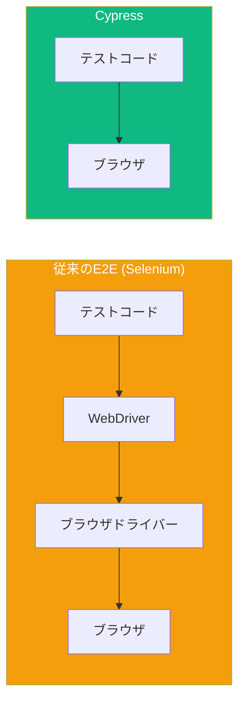

CypressはWebアプリケーション専用に構築された最新のエンドツーエンドテストフレームワークです。Seleniumとは異なり、Cypressはブラウザ内で直接実行され、より高速なテストと優れたデバッグ機能を提供します。

## なぜCypressか？



Cypressの利点：
- **ブラウザ内で実行** - WebDriver不要、DOMに直接アクセス
- **タイムトラベル** - 各テストステップのスナップショットを確認
- **自動待機** - 明示的な待機が不要
- **リアルタイムリロード** - ファイル保存時にテストが再実行
- **組み込みデバッグ** - 一時停止、検査、ステップ実行

## インストール

### 新規プロジェクト作成

```bash
mkdir cypress-demo && cd cypress-demo
npm init -y
npm install cypress --save-dev
```

### Cypressを開く

```bash
npx cypress open
```

Cypress Launchpadが開き、以下が可能です：
1. E2EテストまたはコンポーネントテストI を選択
2. ブラウザを選択
3. 最初のspecファイルを作成

### プロジェクト構造

初期化後、Cypressは以下を作成します：

```
cypress/
├── e2e/              # テストファイル
├── fixtures/         # テストデータ（JSONファイル）
├── support/
│   ├── commands.js   # カスタムコマンド
│   └── e2e.js        # サポートファイル（テスト前に実行）
└── cypress.config.js # 設定
```

## 設定

```javascript
// cypress.config.js
const { defineConfig } = require('cypress');

module.exports = defineConfig({
  e2e: {
    baseUrl: 'http://localhost:3000',
    viewportWidth: 1280,
    viewportHeight: 720,
    defaultCommandTimeout: 10000,
    video: false,
    screenshotOnRunFailure: true,
  },
});
```

## テスト構造

### 基本的なテストファイル

```javascript
// cypress/e2e/homepage.cy.js
describe('ホームページ', () => {
  beforeEach(() => {
    cy.visit('/');
  });

  it('ウェルカムメッセージを表示', () => {
    cy.contains('Welcome').should('be.visible');
  });

  it('ナビゲーションが動作する', () => {
    cy.get('nav').find('a').should('have.length.at.least', 3);
  });
});
```

### テストの整理

```javascript
describe('機能', () => {
  // すべてのテスト前に1回実行
  before(() => {
    // セットアップ：DB初期化、ログインなど
  });

  // 各テスト前に実行
  beforeEach(() => {
    cy.visit('/');
  });

  // 各テスト後に実行
  afterEach(() => {
    // 必要に応じてクリーンアップ
  });

  // すべてのテスト後に1回実行
  after(() => {
    // 最終クリーンアップ
  });

  it('テストケース1', () => {
    // テストコード
  });

  it('テストケース2', () => {
    // テストコード
  });

  // 関連するテストをグループ化
  context('ユーザーがログインしている場合', () => {
    beforeEach(() => {
      cy.login();
    });

    it('ダッシュボードを表示', () => {
      // テストコード
    });
  });
});
```

## コアコマンド

### ナビゲーション

```javascript
// URLにアクセス
cy.visit('/');
cy.visit('https://example.com');
cy.visit('/login', {
  timeout: 30000,
  onBeforeLoad: (win) => {
    // ページロード前にwindowを変更
  },
});

// 戻る/進む
cy.go('back');
cy.go('forward');
cy.go(-1); // 戻る
cy.go(1);  // 進む

// ページリロード
cy.reload();
cy.reload(true); // ハードリロード（キャッシュクリア）
```

### 要素の選択

```javascript
// セレクターで
cy.get('.button');
cy.get('#email');
cy.get('[data-testid="submit"]');
cy.get('input[type="email"]');

// コンテンツで
cy.contains('送信');
cy.contains('button', '送信'); // "送信"を含むbutton
cy.contains('.form', 'メール'); // "メール"を含む.formクラスの要素

// 要素内を検索
cy.get('.form').find('input');
cy.get('.list').children();
cy.get('.item').parent();
cy.get('.item').siblings();
cy.get('.active').first();
cy.get('.item').last();
cy.get('.item').eq(2); // 3番目のアイテム（0始まり）
```

### アクション

```javascript
// クリック
cy.get('button').click();
cy.get('button').dblclick();
cy.get('button').rightclick();
cy.get('.item').click({ force: true }); // 隠れた要素を強制クリック

// 入力
cy.get('input').type('Hello');
cy.get('input').type('Hello{enter}'); // 入力してEnter
cy.get('input').type('{selectall}{backspace}'); // 入力をクリア
cy.get('input').clear(); // 入力フィールドをクリア
cy.get('input').clear().type('新しい値');

// 特殊キー
cy.get('input').type('{enter}');
cy.get('input').type('{esc}');
cy.get('input').type('{ctrl+a}');
cy.get('input').type('{shift+tab}');

// フォームコントロール
cy.get('select').select('option-value');
cy.get('select').select(['option1', 'option2']); // 複数選択
cy.get('[type="checkbox"]').check();
cy.get('[type="checkbox"]').uncheck();
cy.get('[type="radio"]').check('value');

// その他のアクション
cy.get('.item').trigger('mouseover');
cy.get('.slider').trigger('mousedown');
cy.get('input').focus();
cy.get('input').blur();
cy.scrollTo('bottom');
cy.get('.container').scrollTo(0, 500);
```

## アサーション

### 暗黙的アサーション（should）

```javascript
// 可視性
cy.get('.button').should('be.visible');
cy.get('.modal').should('not.be.visible');
cy.get('.toast').should('exist');
cy.get('.error').should('not.exist');

// コンテンツ
cy.get('h1').should('have.text', 'Welcome');
cy.get('p').should('contain', 'Hello');
cy.get('p').should('include.text', 'world');

// 属性
cy.get('input').should('have.value', 'test@example.com');
cy.get('button').should('have.attr', 'disabled');
cy.get('a').should('have.attr', 'href', '/about');
cy.get('.active').should('have.class', 'selected');

// 状態
cy.get('button').should('be.enabled');
cy.get('input').should('be.disabled');
cy.get('[type="checkbox"]').should('be.checked');
cy.get('[type="checkbox"]').should('not.be.checked');
cy.get('input').should('be.focused');

// 長さ
cy.get('.items').should('have.length', 5);
cy.get('.items').should('have.length.gt', 3);
cy.get('.items').should('have.length.at.least', 2);

// CSS
cy.get('.box').should('have.css', 'background-color', 'rgb(255, 0, 0)');

// アサーションのチェーン
cy.get('input')
  .should('be.visible')
  .and('have.value', '')
  .and('have.attr', 'placeholder', 'メールを入力');
```

### 明示的アサーション（expect）

```javascript
cy.get('.items').then(($items) => {
  expect($items).to.have.length(5);
  expect($items.first()).to.contain('最初のアイテム');
});

cy.url().then((url) => {
  expect(url).to.include('/dashboard');
});
```

## DOMの操作

### 要素プロパティの取得

```javascript
// テキスト取得
cy.get('h1').invoke('text').then((text) => {
  expect(text).to.equal('Welcome');
});

// 属性取得
cy.get('a').invoke('attr', 'href').then((href) => {
  expect(href).to.include('/about');
});

// 値取得
cy.get('input').invoke('val').should('eq', 'test');

// CSSプロパティ取得
cy.get('.box').invoke('css', 'width').then((width) => {
  expect(parseInt(width)).to.be.greaterThan(100);
});
```

### WindowとDocument

```javascript
// windowにアクセス
cy.window().then((win) => {
  expect(win.localStorage.getItem('token')).to.exist;
});

// documentにアクセス
cy.document().then((doc) => {
  expect(doc.contentType).to.eq('text/html');
});

// タイトル取得
cy.title().should('include', 'My App');

// URL取得
cy.url().should('include', '/dashboard');
cy.location('pathname').should('eq', '/dashboard');
cy.location('search').should('include', '?page=1');
```

## 実践例：ログインテスト

```javascript
// cypress/e2e/login.cy.js
describe('ログイン', () => {
  beforeEach(() => {
    cy.visit('/login');
  });

  it('有効な資格情報でログイン', () => {
    cy.get('[data-testid="email"]').type('user@example.com');
    cy.get('[data-testid="password"]').type('password123');
    cy.get('[data-testid="submit"]').click();

    // ダッシュボードにリダイレクト
    cy.url().should('include', '/dashboard');
    cy.get('[data-testid="welcome"]').should('contain', 'おかえりなさい');
  });

  it('無効な資格情報でエラーを表示', () => {
    cy.get('[data-testid="email"]').type('user@example.com');
    cy.get('[data-testid="password"]').type('wrongpassword');
    cy.get('[data-testid="submit"]').click();

    // エラーでログインページに留まる
    cy.url().should('include', '/login');
    cy.get('[data-testid="error"]')
      .should('be.visible')
      .and('contain', '資格情報が無効です');
  });

  it('必須フィールドを検証', () => {
    cy.get('[data-testid="submit"]').click();

    cy.get('[data-testid="email-error"]')
      .should('be.visible')
      .and('contain', 'メールは必須です');
  });
});
```

## テストの実行

### コマンドライン

```bash
# Cypress GUIを開く
npx cypress open

# すべてのテストをヘッドレスで実行
npx cypress run

# 特定のspecファイルを実行
npx cypress run --spec "cypress/e2e/login.cy.js"

# 特定のブラウザで実行
npx cypress run --browser chrome
npx cypress run --browser firefox

# ヘッドありブラウザで実行
npx cypress run --headed
```

### Package.jsonスクリプト

```json
{
  "scripts": {
    "cy:open": "cypress open",
    "cy:run": "cypress run",
    "cy:run:chrome": "cypress run --browser chrome",
    "test:e2e": "start-server-and-test start http://localhost:3000 cy:run"
  }
}
```

## まとめ

| 概念 | 説明 |
|------|------|
| `cy.visit()` | URLにナビゲート |
| `cy.get()` | セレクターで要素を選択 |
| `cy.contains()` | テキストコンテンツで要素を選択 |
| `cy.click()` | 要素をクリック |
| `cy.type()` | 入力にタイプ |
| `.should()` | 要素の状態をアサート |
| `describe/it` | テストを整理 |

重要なポイント：

- Cypressはより高速で信頼性の高いテストのためにブラウザ内で直接実行
- セレクターには`cy.get()`、テキストコンテンツには`cy.contains()`を使用
- `.should()`でコマンドをチェーンしてアサーション
- Cypressは要素とアサーションを自動的に待機
- テスト状態のセットアップには`beforeEach`を使用
- `npx cypress open`（GUI）または`npx cypress run`（CLI）でテストを実行

Cypressは直感的なAPIと優れた開発者体験でE2Eテストを身近なものにします。

## 参考文献

- [Cypress Documentation](https://docs.cypress.io/)
- [Cypress Best Practices](https://docs.cypress.io/guides/references/best-practices)
- Mwaura, Waweru. *End-to-End Web Testing with Cypress*. Packt, 2021.
