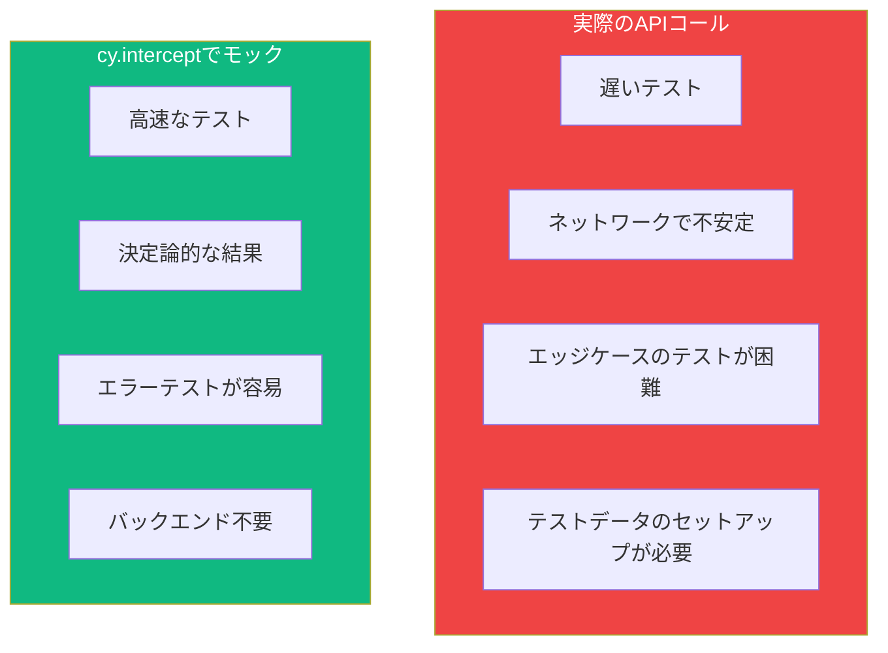

`cy.intercept()`はCypressの最も強力な機能の1つで、ネットワークリクエストをインターセプトして制御できます。これにより、より高速なテスト、決定論的なレスポンス、実際のAPIでは再現が難しいエッジケースのテストが可能になります。

## なぜネットワークリクエストをモックするのか？



## cy.interceptの基本的な使い方

### GETリクエストのインターセプト

```javascript
// インターセプトしてレスポンスをスタブ
cy.intercept('GET', '/api/users', {
  body: [
    { id: 1, name: 'Alice' },
    { id: 2, name: 'Bob' },
  ],
});

cy.visit('/users');
cy.get('.user').should('have.length', 2);
```

### URLパターンマッチング

```javascript
// 完全一致URL
cy.intercept('GET', '/api/users');

// Globパターン
cy.intercept('GET', '/api/users/*');
cy.intercept('GET', '/api/*/comments');
cy.intercept('GET', '**/users');

// 正規表現パターン
cy.intercept('GET', /\/api\/users\/\d+/);

// クエリパラメータ付き（glob）
cy.intercept('GET', '/api/users?page=*');
```

### メソッドショートカット

```javascript
// 明示的なメソッド
cy.intercept('GET', '/api/users', { body: [] });
cy.intercept('POST', '/api/users', { statusCode: 201 });
cy.intercept('PUT', '/api/users/*', { statusCode: 200 });
cy.intercept('DELETE', '/api/users/*', { statusCode: 204 });

// 任意のメソッド
cy.intercept('/api/users'); // すべてのメソッドにマッチ
```

## レスポンスのスタブ

### 静的レスポンス

```javascript
// JSONボディを返す
cy.intercept('GET', '/api/users', {
  body: [{ id: 1, name: 'Alice' }],
});

// 完全なレスポンスオブジェクト
cy.intercept('GET', '/api/users', {
  statusCode: 200,
  body: [{ id: 1, name: 'Alice' }],
  headers: {
    'Content-Type': 'application/json',
    'X-Custom-Header': 'value',
  },
});
```

### フィクスチャの使用

```javascript
// cypress/fixtures/users.json
// [{ "id": 1, "name": "Alice" }, { "id": 2, "name": "Bob" }]

// フィクスチャをレスポンスとして読み込む
cy.intercept('GET', '/api/users', { fixture: 'users.json' });

// ステータスコード付き
cy.intercept('GET', '/api/users', {
  statusCode: 200,
  fixture: 'users.json',
});

// ネストしたフィクスチャ
cy.intercept('GET', '/api/users', { fixture: 'api/users/list.json' });
```

### ルートハンドラーで動的レスポンス

```javascript
// 動的にレスポンスを変更
cy.intercept('GET', '/api/users', (req) => {
  req.reply({
    statusCode: 200,
    body: [{ id: 1, name: 'Dynamic User' }],
  });
});

// リクエストデータにアクセス
cy.intercept('POST', '/api/users', (req) => {
  const { name, email } = req.body;

  req.reply({
    statusCode: 201,
    body: { id: Date.now(), name, email },
  });
});

// 条件付きレスポンス
cy.intercept('GET', '/api/users/*', (req) => {
  const userId = req.url.split('/').pop();

  if (userId === '999') {
    req.reply({ statusCode: 404, body: { error: 'Not found' } });
  } else {
    req.reply({ body: { id: userId, name: 'User ' + userId } });
  }
});
```

## リクエストの待機

### エイリアスの使用

```javascript
// エイリアスを作成
cy.intercept('GET', '/api/users').as('getUsers');

cy.visit('/users');

// リクエストを待機
cy.wait('@getUsers');

// ロード後にアサート
cy.get('.user').should('have.length', 2);
```

### リクエスト/レスポンスデータへのアクセス

```javascript
cy.intercept('POST', '/api/users').as('createUser');

cy.get('[data-testid="name"]').type('John');
cy.get('[data-testid="submit"]').click();

cy.wait('@createUser').then((interception) => {
  // リクエストにアクセス
  expect(interception.request.body).to.have.property('name', 'John');
  expect(interception.request.headers).to.have.property('authorization');

  // レスポンスにアクセス
  expect(interception.response.statusCode).to.equal(201);
  expect(interception.response.body).to.have.property('id');
});
```

### 待機とアサーション

```javascript
cy.intercept('GET', '/api/users').as('getUsers');

cy.visit('/users');

// 1ステップで待機とアサート
cy.wait('@getUsers').its('response.statusCode').should('eq', 200);

// 複数のアサーション
cy.wait('@getUsers').should((interception) => {
  expect(interception.response.body).to.have.length.greaterThan(0);
  expect(interception.response.headers['content-type']).to.include('application/json');
});
```

### 複数回の待機

```javascript
cy.intercept('GET', '/api/items/*').as('getItem');

// ページネーション - 各ページリクエストを待機
cy.wait('@getItem');
cy.get('.next-page').click();
cy.wait('@getItem');
cy.get('.next-page').click();
cy.wait('@getItem');

// または特定の回数を待機
cy.intercept('POST', '/api/analytics').as('analytics');
cy.wait(['@analytics', '@analytics', '@analytics']); // 3回のコールを待機
```

## エラーテスト

### ネットワークエラー

```javascript
// ネットワーク障害をシミュレート
cy.intercept('GET', '/api/users', { forceNetworkError: true });

cy.visit('/users');
cy.get('[data-testid="error"]').should('contain', 'ネットワークエラー');
```

### HTTPエラーレスポンス

```javascript
// 404 Not Found
cy.intercept('GET', '/api/users/999', {
  statusCode: 404,
  body: { error: 'ユーザーが見つかりません' },
});

// 500 Server Error
cy.intercept('GET', '/api/users', {
  statusCode: 500,
  body: { error: '内部サーバーエラー' },
});

// 401 Unauthorized
cy.intercept('GET', '/api/users', {
  statusCode: 401,
  body: { error: '認証が必要です' },
});

// 422 Validation Error
cy.intercept('POST', '/api/users', {
  statusCode: 422,
  body: {
    errors: {
      email: ['このメールアドレスは既に使用されています'],
      name: ['名前は必須です'],
    },
  },
});
```

### エラーUIのテスト

```javascript
describe('エラーハンドリング', () => {
  it('500でエラーメッセージを表示', () => {
    cy.intercept('GET', '/api/users', {
      statusCode: 500,
      body: { error: 'Server error' },
    });

    cy.visit('/users');

    cy.get('[data-testid="error-message"]')
      .should('be.visible')
      .and('contain', '問題が発生しました');

    cy.get('[data-testid="retry-button"]').should('be.visible');
  });

  it('404でNot Foundページを表示', () => {
    cy.intercept('GET', '/api/users/999', { statusCode: 404 });

    cy.visit('/users/999');

    cy.get('[data-testid="not-found"]').should('be.visible');
  });
});
```

## レスポンスの遅延

### 遅いネットワークのシミュレート

```javascript
// レスポンスを2秒遅延
cy.intercept('GET', '/api/users', {
  body: [{ id: 1, name: 'Alice' }],
  delay: 2000,
});

// ローディング状態をテスト
cy.visit('/users');
cy.get('[data-testid="loading"]').should('be.visible');
cy.get('[data-testid="loading"]').should('not.exist');
cy.get('.user').should('have.length', 1);
```

### ローディング状態のテスト

```javascript
it('フェッチ中にローディングスピナーを表示', () => {
  cy.intercept('GET', '/api/users', {
    body: [],
    delay: 1000,
  });

  cy.visit('/users');

  // 最初はローディングが表示
  cy.get('[data-testid="spinner"]').should('be.visible');

  // データロード後にローディングが消える
  cy.get('[data-testid="spinner"]').should('not.exist');
  cy.get('[data-testid="empty-state"]').should('be.visible');
});
```

## リクエストの変更

### 送信リクエストの変更

```javascript
cy.intercept('GET', '/api/users', (req) => {
  // ヘッダーを追加
  req.headers['X-Custom-Header'] = 'test-value';

  // 実際のサーバーに続行（スタブなし）
  req.continue();
});

// クエリパラメータを変更
cy.intercept('GET', '/api/users*', (req) => {
  req.url = req.url + '&limit=100';
  req.continue();
});
```

### レスポンスの変更

```javascript
cy.intercept('GET', '/api/users', (req) => {
  req.continue((res) => {
    // レスポンスボディを変更
    res.body = res.body.map((user) => ({
      ...user,
      name: user.name.toUpperCase(),
    }));

    // ヘッダーを変更
    res.headers['X-Modified'] = 'true';
  });
});
```

## リクエストのスパイ

### スタブなしでスパイ

```javascript
// 変更なしでリクエストを監視
cy.intercept('POST', '/api/analytics').as('analytics');

cy.visit('/');
cy.get('button').click();

cy.wait('@analytics').then((interception) => {
  expect(interception.request.body).to.deep.include({
    event: 'button_click',
  });
});
```

### リクエストボディのアサート

```javascript
cy.intercept('POST', '/api/users').as('createUser');

cy.get('[data-testid="name"]').type('John Doe');
cy.get('[data-testid="email"]').type('john@example.com');
cy.get('[data-testid="submit"]').click();

cy.wait('@createUser').its('request.body').should('deep.equal', {
  name: 'John Doe',
  email: 'john@example.com',
});
```

## テストパターン

### 認証フロー

```javascript
describe('認証', () => {
  it('ログインしてトークンを保存', () => {
    cy.intercept('POST', '/api/login', {
      body: { token: 'fake-jwt-token', user: { id: 1, name: 'John' } },
    }).as('login');

    cy.visit('/login');
    cy.get('[data-testid="email"]').type('john@example.com');
    cy.get('[data-testid="password"]').type('password');
    cy.get('[data-testid="submit"]').click();

    cy.wait('@login');
    cy.url().should('include', '/dashboard');
  });

  it('認証済みリクエストでトークンを送信', () => {
    cy.window().then((win) => {
      win.localStorage.setItem('token', 'fake-jwt-token');
    });

    cy.intercept('GET', '/api/profile', (req) => {
      expect(req.headers).to.have.property('authorization', 'Bearer fake-jwt-token');
      req.reply({ body: { id: 1, name: 'John' } });
    }).as('getProfile');

    cy.visit('/profile');
    cy.wait('@getProfile');
  });
});
```

### ページネーション

```javascript
describe('ページネーション', () => {
  it('スクロールで追加アイテムを読み込む', () => {
    cy.intercept('GET', '/api/items?page=1', {
      fixture: 'items-page1.json',
    }).as('page1');

    cy.intercept('GET', '/api/items?page=2', {
      fixture: 'items-page2.json',
    }).as('page2');

    cy.visit('/items');
    cy.wait('@page1');
    cy.get('.item').should('have.length', 10);

    cy.scrollTo('bottom');
    cy.wait('@page2');
    cy.get('.item').should('have.length', 20);
  });
});
```

## まとめ

| 機能 | 使い方 |
|------|--------|
| `cy.intercept(method, url)` | リクエストをインターセプト |
| `{ body, statusCode }` | レスポンスをスタブ |
| `{ fixture: 'file.json' }` | フィクスチャからレスポンス |
| `{ delay: 1000 }` | 遅いネットワークをシミュレート |
| `{ forceNetworkError: true }` | ネットワーク障害をシミュレート |
| `.as('alias')` | 待機用のエイリアスを作成 |
| `cy.wait('@alias')` | リクエストを待機 |
| `req.continue()` | サーバーに通過 |

重要なポイント：

- テストでネットワークリクエストを制御するには`cy.intercept()`を使用
- より高速で決定論的なテストのためにレスポンスをスタブ
- 複雑なレスポンスデータにはフィクスチャを使用
- 異なるステータスコードでエラー状態をテスト
- エイリアスと`cy.wait()`でリクエストと同期
- ローディング状態をテストするためにレスポンスを遅延
- リクエストデータを検証するためにスタブなしでスパイ

`cy.intercept()`によるネットワークモックは、テストをより高速で信頼性が高く、実際のAPIコールでは難しいエッジケースをカバーできるようにします。

## 参考文献

- [Cypress cy.intercept Documentation](https://docs.cypress.io/api/commands/intercept)
- [Cypress Network Requests Guide](https://docs.cypress.io/guides/guides/network-requests)
- Mwaura, Waweru. *End-to-End Web Testing with Cypress*. Packt, 2021.
