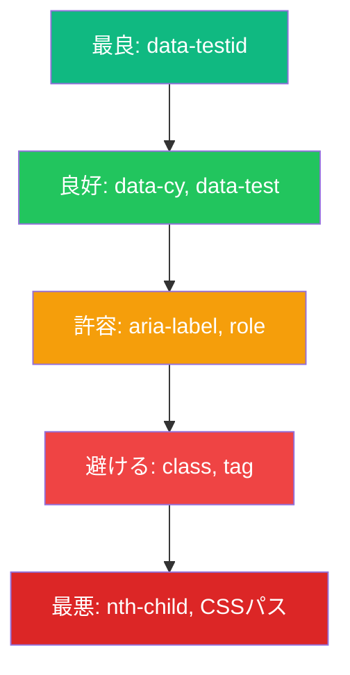
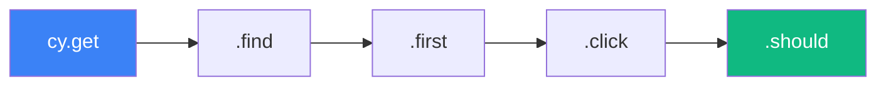

要素を正しく選択することは、信頼性の高いCypressテストを書く上で基本です。このガイドでは、セレクター戦略、コマンドチェーン、再利用可能なテストロジックのためのカスタムコマンド作成について説明します。

## セレクター戦略

### セレクターの優先順位

変更に対する耐性に基づいてセレクターを選択：



| セレクタータイプ | 例 | 耐性 |
|-----------------|----|----|
| `data-testid` | `[data-testid="submit"]` | 高 |
| `data-cy` | `[data-cy="login-button"]` | 高 |
| ロール + 名前 | テキストを持つ`button` | 中 |
| クラス | `.submit-btn` | 低 |
| タグ + インデックス | `button:first` | 非常に低 |

### 推奨セレクター

```javascript
// 最良：テスト専用属性
cy.get('[data-testid="submit-button"]');
cy.get('[data-cy="login-form"]');
cy.get('[data-test="user-name"]');

// 良好：セマンティックセレクター
cy.contains('button', '送信');
cy.get('input[name="email"]');
cy.get('input[type="submit"]');

// 避ける：脆弱なセレクター
cy.get('.btn-primary'); // クラスは変わるかも
cy.get('div > div > button'); // 構造は変わるかも
cy.get(':nth-child(3)'); // 順序は変わるかも
```

### テスト属性の追加

コンポーネントに`data-testid`または`data-cy`属性を追加：

```jsx
// Reactコンポーネント
function LoginForm() {
  return (
    <form data-testid="login-form">
      <input data-testid="email-input" type="email" />
      <input data-testid="password-input" type="password" />
      <button data-testid="submit-button">ログイン</button>
    </form>
  );
}
```

## コアセレクターコマンド

### cy.get()

CSSセレクターで要素を選択：

```javascript
// IDで
cy.get('#email');

// クラスで
cy.get('.form-control');

// 属性で
cy.get('[data-testid="submit"]');
cy.get('[name="email"]');
cy.get('[type="checkbox"]');

// タグで
cy.get('button');
cy.get('input');

// 複合セレクター
cy.get('input[type="email"]');
cy.get('button.primary[disabled]');
cy.get('[data-testid="item"]:first');
cy.get('[data-testid="item"]:last');
cy.get('[data-testid="item"]:eq(2)'); // 3番目のアイテム
```

### cy.contains()

テキストコンテンツで要素を選択：

```javascript
// テキストを含む要素を検索
cy.contains('送信');
cy.contains('おかえりなさい');

// テキストを含む特定の要素タイプを検索
cy.contains('button', '送信');
cy.contains('a', '詳細はこちら');
cy.contains('h1', 'ダッシュボード');

// コンテナ内で検索
cy.contains('.sidebar', '設定');

// 正規表現で
cy.contains(/welcome/i); // 大文字小文字を区別しない
cy.contains(/アイテム \d+/); // パターンマッチング
```

### cy.find()

親要素内の要素を検索：

```javascript
// 子要素を検索
cy.get('.user-card').find('.username');
cy.get('form').find('input');
cy.get('[data-testid="nav"]').find('a');

// 複数のfindをチェーン
cy.get('.page')
  .find('.content')
  .find('.article')
  .find('h2');
```

### DOMの走査

```javascript
// 親子関係
cy.get('.child').parent();
cy.get('.parent').children();
cy.get('.item').siblings();

// 最初/最後/インデックス
cy.get('.items').first();
cy.get('.items').last();
cy.get('.items').eq(2); // 3番目のアイテム（0始まり）

// フィルタリング
cy.get('button').filter('.primary');
cy.get('.item').filter(':visible');
cy.get('input').not('[disabled]');

// 最も近い祖先
cy.get('.nested-element').closest('.container');

// 次/前の兄弟
cy.get('.current').next();
cy.get('.current').prev();
cy.get('.current').nextAll();
cy.get('.current').prevAll();
```

## コマンドチェーン

Cypressコマンドはチェーン可能で、各コマンドは次のコマンドにサブジェクトを渡します：



### 基本的なチェーン

```javascript
cy.get('[data-testid="form"]')
  .find('input[name="email"]')
  .type('user@example.com')
  .should('have.value', 'user@example.com');

cy.get('.nav')
  .contains('設定')
  .click()
  .url()
  .should('include', '/settings');
```

### サブジェクト管理

```javascript
// コマンドは新しいサブジェクトを返す
cy.get('form')           // <form>を返す
  .find('input')         // <input>を返す（サブジェクトが変わる）
  .type('hello')         // <input>を返す
  .should('have.value', 'hello');

// 一部のコマンドは同じサブジェクトを返す
cy.get('input')
  .type('hello')         // 同じ<input>を返す
  .clear()               // 同じ<input>を返す
  .type('world');        // 同じ<input>を返す

// .within()はコマンドを要素にスコープする
cy.get('[data-testid="user-card"]').within(() => {
  cy.get('.name').should('contain', 'John');
  cy.get('.email').should('contain', 'john@example.com');
  cy.get('button').click();
});
```

### リトライ機能

Cypressはコマンドが成功するかタイムアウトするまで自動的にリトライします：

```javascript
// 要素が見えるかタイムアウトするまでリトライ
cy.get('[data-testid="toast"]').should('be.visible');

// チェーン全体をリトライ
cy.get('.items')
  .find('.item')
  .should('have.length', 5);
```

## .within()でスコープ付きクエリ

```javascript
// すべてのクエリがフォームにスコープされる
cy.get('[data-testid="registration-form"]').within(() => {
  cy.get('[name="firstName"]').type('John');
  cy.get('[name="lastName"]').type('Doe');
  cy.get('[name="email"]').type('john@example.com');
  cy.get('[type="submit"]').click();
});

// 複数のカードをテスト
cy.get('[data-testid="user-card"]').each(($card) => {
  cy.wrap($card).within(() => {
    cy.get('.name').should('exist');
    cy.get('.avatar').should('be.visible');
  });
});
```

## .each()でイテレーション

```javascript
// 要素を反復処理
cy.get('[data-testid="item"]').each(($item, index) => {
  cy.wrap($item).should('contain', `アイテム ${index + 1}`);
});

// 各要素にアクションを実行
cy.get('.checkbox').each(($checkbox) => {
  cy.wrap($checkbox).check();
});

// 複雑なイテレーション
cy.get('.product-card').each(($card) => {
  cy.wrap($card).within(() => {
    cy.get('.price')
      .invoke('text')
      .then((price) => {
        const numPrice = parseFloat(price.replace('¥', ''));
        expect(numPrice).to.be.greaterThan(0);
      });
  });
});
```

## カスタムコマンド

### カスタムコマンドの作成

```javascript
// cypress/support/commands.js

// シンプルなコマンド
Cypress.Commands.add('login', (email, password) => {
  cy.visit('/login');
  cy.get('[data-testid="email"]').type(email);
  cy.get('[data-testid="password"]').type(password);
  cy.get('[data-testid="submit"]').click();
  cy.url().should('include', '/dashboard');
});

// オプション付きコマンド
Cypress.Commands.add('login', (email, password, options = {}) => {
  const { redirect = '/dashboard' } = options;

  cy.visit('/login');
  cy.get('[data-testid="email"]').type(email);
  cy.get('[data-testid="password"]').type(password);
  cy.get('[data-testid="submit"]').click();

  if (redirect) {
    cy.url().should('include', redirect);
  }
});

// 子コマンド（サブジェクトからチェーン）
Cypress.Commands.add('shouldBeVisible', { prevSubject: true }, (subject) => {
  cy.wrap(subject).should('be.visible');
  return cy.wrap(subject);
});

// デュアルコマンド（サブジェクトあり/なしで動作）
Cypress.Commands.add('clickIfVisible', { prevSubject: 'optional' }, (subject, selector) => {
  if (subject) {
    cy.wrap(subject).find(selector).click();
  } else {
    cy.get(selector).click();
  }
});
```

### カスタムコマンドの使用

```javascript
// cypress/e2e/dashboard.cy.js
describe('ダッシュボード', () => {
  beforeEach(() => {
    cy.login('user@example.com', 'password123');
  });

  it('ユーザープロフィールを表示', () => {
    cy.get('[data-testid="profile"]')
      .shouldBeVisible()
      .and('contain', 'user@example.com');
  });
});
```

### よく使うカスタムコマンド

```javascript
// cypress/support/commands.js

// API経由でログイン（UIより高速）
Cypress.Commands.add('loginByApi', (email, password) => {
  cy.request('POST', '/api/login', { email, password })
    .then((response) => {
      window.localStorage.setItem('token', response.body.token);
    });
});

// ドラッグアンドドロップ
Cypress.Commands.add('dragTo', { prevSubject: true }, (subject, targetSelector) => {
  cy.wrap(subject).trigger('dragstart');
  cy.get(targetSelector).trigger('drop');
  cy.wrap(subject).trigger('dragend');
});

// テストIDで取得
Cypress.Commands.add('getByTestId', (testId) => {
  return cy.get(`[data-testid="${testId}"]`);
});

// トーストメッセージをアサート
Cypress.Commands.add('shouldShowToast', (message) => {
  cy.get('[data-testid="toast"]')
    .should('be.visible')
    .and('contain', message);
});

// フォームフィールドを入力
Cypress.Commands.add('fillForm', (formData) => {
  Object.entries(formData).forEach(([name, value]) => {
    cy.get(`[name="${name}"]`).clear().type(value);
  });
});

// 使用例
cy.fillForm({
  firstName: 'John',
  lastName: 'Doe',
  email: 'john@example.com',
});
```

### TypeScriptサポート

```typescript
// cypress/support/index.d.ts
declare namespace Cypress {
  interface Chainable {
    login(email: string, password: string): Chainable<void>;
    getByTestId(testId: string): Chainable<JQuery<HTMLElement>>;
    shouldShowToast(message: string): Chainable<void>;
    fillForm(formData: Record<string, string>): Chainable<void>;
  }
}
```

## ベストプラクティス

### 1. 特定のセレクターを使用

```javascript
// 悪い：汎用的すぎる
cy.get('button').click();

// 良い：特定
cy.get('[data-testid="submit-button"]').click();
cy.contains('button', '送信').click();
```

### 2. 可能な限り条件分岐を避ける

```javascript
// 悪い：要素の存在に基づく条件分岐
cy.get('body').then(($body) => {
  if ($body.find('.modal').length) {
    cy.get('.modal .close').click();
  }
});

// より良い：テストセットアップで状態を制御
beforeEach(() => {
  cy.clearCookies();
  cy.visit('/');
});
```

### 3. カスタムコマンドでDRYに保つ

```javascript
// あちこちで繰り返す代わりに
cy.get('[data-testid="email"]').type('user@example.com');
cy.get('[data-testid="password"]').type('password');
cy.get('[data-testid="submit"]').click();

// カスタムコマンドを作成
cy.login('user@example.com', 'password');
```

### 4. 繰り返す選択にはエイリアスを使用

```javascript
// 悪い：選択の繰り返し
cy.get('[data-testid="user-list"]').should('be.visible');
cy.get('[data-testid="user-list"]').find('.user').should('have.length', 5);
cy.get('[data-testid="user-list"]').find('.user').first().click();

// 良い：エイリアスを使用
cy.get('[data-testid="user-list"]').as('userList');
cy.get('@userList').should('be.visible');
cy.get('@userList').find('.user').should('have.length', 5);
cy.get('@userList').find('.user').first().click();
```

## まとめ

| コマンド | 用途 |
|---------|------|
| `cy.get()` | CSSセレクターで選択 |
| `cy.contains()` | テキストコンテンツで選択 |
| `.find()` | 要素内で検索 |
| `.within()` | クエリを要素にスコープ |
| `.each()` | 要素を反復処理 |
| `.first()/.last()/.eq()` | 位置で選択 |
| `Cypress.Commands.add()` | カスタムコマンドを作成 |

重要なポイント：

- 信頼性の高いセレクターには`data-testid`または`data-cy`属性を使用
- よりクリーンで読みやすいテストのためにコマンドをチェーン
- `.within()`でクエリをコンテナにスコープ
- 再利用可能なテストロジックにはカスタムコマンドを作成
- Cypressはコマンドが成功するまで自動的にリトライ
- クラスや複雑なCSSパスなど脆弱なセレクターを避ける

良いセレクター戦略とカスタムコマンドは、テストを保守しやすくしUI変更に耐性を持たせます。

## 参考文献

- [Cypress Selectors Best Practices](https://docs.cypress.io/guides/references/best-practices#Selecting-Elements)
- [Cypress Custom Commands](https://docs.cypress.io/api/cypress-api/custom-commands)
- Mwaura, Waweru. *End-to-End Web Testing with Cypress*. Packt, 2021.
