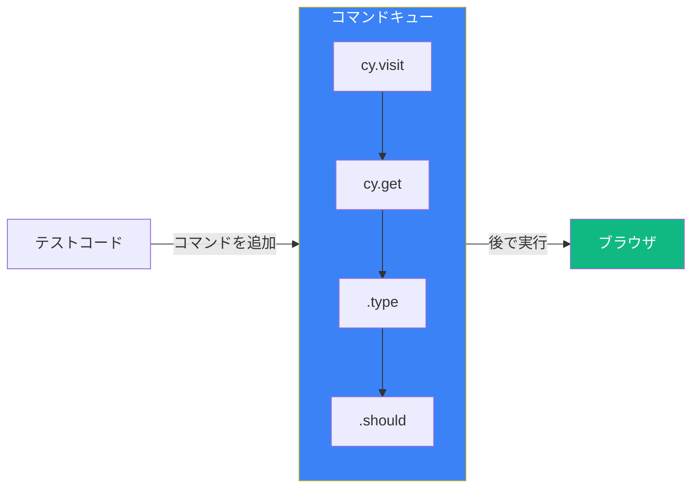
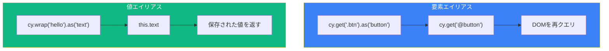

Cypressのコマンドは非同期でキューで実行されるため、同期コードのように結果を単純に変数に代入することはできません。クロージャとエイリアスを理解することは、テストでのデータフローを管理する上で不可欠です。

## Cypressの非同期性



### なぜ変数が直接使えないのか

```javascript
// これは期待通りに動作しません
let username;
cy.get('[data-testid="username"]').invoke('text').then((text) => {
  username = text;
});
console.log(username); // undefined - コマンドはまだ実行されていない！

// .then()コールバックはcy.get()完了後に実行される
cy.get('[data-testid="username"]').invoke('text').then((text) => {
  console.log(text); // これは動作する - コールバック内
});
```

## .then()でクロージャを使用

### 基本パターン

```javascript
cy.get('[data-testid="user-id"]')
  .invoke('text')
  .then((userId) => {
    // userIdはここで利用可能
    cy.visit(`/users/${userId}`);
    cy.get('[data-testid="profile"]').should('contain', userId);
  });
```

### 複数の値をチェーン

```javascript
cy.get('[data-testid="first-name"]')
  .invoke('text')
  .then((firstName) => {
    cy.get('[data-testid="last-name"]')
      .invoke('text')
      .then((lastName) => {
        const fullName = `${firstName} ${lastName}`;
        cy.get('[data-testid="greeting"]').should('contain', fullName);
      });
  });
```

### コールバック地獄を避ける

```javascript
// より良い方法：ネストしたコールバックの代わりにエイリアスを使用
cy.get('[data-testid="first-name"]').invoke('text').as('firstName');
cy.get('[data-testid="last-name"]').invoke('text').as('lastName');

cy.then(function () {
  const fullName = `${this.firstName} ${this.lastName}`;
  cy.get('[data-testid="greeting"]').should('contain', fullName);
});
```

## .as()でエイリアス

### エイリアスの作成

```javascript
// 要素のエイリアス
cy.get('[data-testid="submit-button"]').as('submitBtn');

// 値のエイリアス
cy.get('[data-testid="user-id"]').invoke('text').as('userId');

// インターセプトのエイリアス
cy.intercept('GET', '/api/users').as('getUsers');

// フィクスチャのエイリアス
cy.fixture('users.json').as('usersData');
```

### エイリアスの使用

```javascript
// cy.get()で@プレフィックスを使用して参照
cy.get('@submitBtn').click();
cy.get('@submitBtn').should('be.disabled');

// 関数コールバック内でthis.*で参照
cy.then(function () {
  expect(this.userId).to.equal('123');
});

// エイリアス付きインターセプトを待機
cy.wait('@getUsers').its('response.statusCode').should('eq', 200);
```

### 要素エイリアス vs 値エイリアス



```javascript
// 要素エイリアス - 毎回再クエリ
cy.get('[data-testid="counter"]').as('counter');
cy.get('@counter').should('have.text', '0');
cy.get('[data-testid="increment"]').click();
cy.get('@counter').should('have.text', '1'); // 再クエリして更新された要素を取得

// 値エイリアス - 値を保存
cy.get('[data-testid="counter"]').invoke('text').as('initialCount');
cy.get('[data-testid="increment"]').click();
cy.then(function () {
  // this.initialCountはまだ'0' - クリック前にキャプチャされた
  expect(this.initialCount).to.equal('0');
});
```

## フックとテスト間でのデータ共有

### thisコンテキストの使用

```javascript
describe('ユーザープロフィール', () => {
  beforeEach(function () {
    // beforeEachでエイリアスを作成
    cy.fixture('user.json').as('userData');
    cy.intercept('GET', '/api/profile', { fixture: 'user.json' }).as('getProfile');
  });

  it('ユーザー情報を表示', function () {
    // this.*でエイリアスにアクセス
    cy.visit('/profile');
    cy.wait('@getProfile');

    cy.get('[data-testid="name"]').should('contain', this.userData.name);
    cy.get('[data-testid="email"]').should('contain', this.userData.email);
  });

  it('ユーザー情報を更新できる', function () {
    cy.visit('/profile');
    cy.wait('@getProfile');

    // フィクスチャデータをアサーションに使用
    cy.get('[data-testid="name-input"]').should('have.value', this.userData.name);
  });
});
```

### アロー関数 vs 通常の関数

```javascript
// アロー関数は独自の`this`を持たない
beforeEach(() => {
  cy.fixture('user.json').as('userData');
});

it('this.userDataにアクセスできない', () => {
  // this.userDataはundefined - アロー関数はthisをバインドしない
  console.log(this.userData); // undefined
});

// 通常の関数は独自の`this`を持つ
it('this.userDataにアクセスできる', function () {
  // this.userDataは動作する - 通常の関数はthisをテストコンテキストにバインド
  expect(this.userData.name).to.equal('John');
});
```

### クロージャ変数の使用

```javascript
describe('クロージャでのデータ共有', () => {
  let testUser;

  before(() => {
    cy.fixture('user.json').then((user) => {
      testUser = user;
    });
  });

  it('テストユーザーを使用', () => {
    // testUserはbefore()完了後に利用可能
    cy.visit('/profile');
    cy.get('[data-testid="name"]').type(testUser.name);
  });
});
```

## APIレスポンスの操作

### レスポンスデータのキャプチャ

```javascript
cy.intercept('POST', '/api/users').as('createUser');

cy.get('[data-testid="name"]').type('John Doe');
cy.get('[data-testid="submit"]').click();

cy.wait('@createUser').then((interception) => {
  const userId = interception.response.body.id;

  // レスポンスデータを使用
  cy.visit(`/users/${userId}`);
  cy.get('[data-testid="user-name"]').should('contain', 'John Doe');
});
```

### レスポンスデータのエイリアス

```javascript
cy.intercept('GET', '/api/users').as('getUsers');

cy.visit('/users');

cy.wait('@getUsers')
  .its('response.body')
  .as('users');

cy.then(function () {
  expect(this.users).to.have.length.greaterThan(0);

  // 最初のユーザーのデータを使用
  cy.get('[data-testid="user-card"]')
    .first()
    .should('contain', this.users[0].name);
});
```

## 環境変数

### Cypress環境変数へのアクセス

```javascript
// cypress.config.js
module.exports = defineConfig({
  env: {
    apiUrl: 'http://localhost:3000/api',
    username: 'testuser',
    password: 'testpass',
  },
});

// テスト内で
const apiUrl = Cypress.env('apiUrl');
const username = Cypress.env('username');

cy.request(`${apiUrl}/users`);
cy.get('[data-testid="username"]').type(username);
```

### 環境変数の設定

```javascript
// コマンドラインから
// npx cypress run --env apiUrl=http://api.example.com

// cypress.config.jsから
module.exports = defineConfig({
  env: {
    apiUrl: 'http://localhost:3000/api',
  },
});

// cypress.env.jsonから（gitにコミットしない）
// {
//   "username": "admin",
//   "password": "secret"
// }

// テスト内でプログラム的に
Cypress.env('newVar', 'value');
```

## よくあるパターン

### テストデータの保存と再利用

```javascript
describe('注文ワークフロー', () => {
  let orderId;

  it('注文を作成', () => {
    cy.intercept('POST', '/api/orders').as('createOrder');

    cy.get('[data-testid="product"]').first().click();
    cy.get('[data-testid="add-to-cart"]').click();
    cy.get('[data-testid="checkout"]').click();

    cy.wait('@createOrder').then((interception) => {
      orderId = interception.response.body.id;
      cy.wrap(orderId).as('orderId');
    });

    cy.get('@orderId').then((id) => {
      cy.url().should('include', `/orders/${id}`);
    });
  });

  it('作成した注文を表示', () => {
    // orderIdは前のテストから利用可能（注意して使用）
    cy.visit(`/orders/${orderId}`);
    cy.get('[data-testid="order-status"]').should('contain', '保留中');
  });
});
```

### 動的テストデータ

```javascript
describe('フォームバリデーション', () => {
  const testCases = [
    { email: 'invalid', expected: '無効なメール形式' },
    { email: 'test@', expected: '無効なメール形式' },
    { email: 'test@example.com', expected: null },
  ];

  testCases.forEach(({ email, expected }) => {
    it(`メールを検証: ${email}`, () => {
      cy.visit('/signup');
      cy.get('[data-testid="email"]').type(email);
      cy.get('[data-testid="submit"]').click();

      if (expected) {
        cy.get('[data-testid="error"]').should('contain', expected);
      } else {
        cy.get('[data-testid="error"]').should('not.exist');
      }
    });
  });
});
```

### cy.wrap()でラップした値

```javascript
// 値をラップしてCypressコマンドで使用
const myObject = { name: 'John', age: 30 };

cy.wrap(myObject)
  .its('name')
  .should('eq', 'John');

cy.wrap(myObject)
  .its('age')
  .should('be.greaterThan', 18);

// プロミスをラップ
cy.wrap(fetch('/api/status').then((r) => r.json()))
  .its('status')
  .should('eq', 'ok');
```

## ベストプラクティス

### 1. 変数よりエイリアスを優先

```javascript
// 避ける：外部の可変変数
let userId;
cy.get('#user-id').invoke('text').then((text) => {
  userId = text;
});

// 推奨：エイリアス
cy.get('#user-id').invoke('text').as('userId');
cy.then(function () {
  cy.visit(`/users/${this.userId}`);
});
```

### 2. thisアクセスには通常の関数を使用

```javascript
// this.*アクセスにはfunction()を使用、() =>ではない
it('エイリアスデータを使用', function () {
  cy.get('[data-testid="id"]').invoke('text').as('itemId');

  cy.then(function () {
    expect(this.itemId).to.exist;
  });
});
```

### 3. beforeEachで状態をリセット

```javascript
describe('テスト', function () {
  beforeEach(function () {
    // エイリアスはテスト間でクリアされる
    // beforeEachで再作成
    cy.fixture('testData.json').as('testData');
    cy.intercept('GET', '/api/data').as('getData');
  });
});
```

## まとめ

| 概念 | 使い方 |
|------|--------|
| `.then()` | コールバック内で生成された値にアクセス |
| `.as('name')` | 名前付きエイリアスを作成 |
| `cy.get('@name')` | 要素エイリアスを参照 |
| `this.name` | 関数内で値エイリアスにアクセス |
| `cy.wrap()` | Cypressコマンド用に値をラップ |
| `Cypress.env()` | 環境変数にアクセス |

重要なポイント：

- Cypressコマンドは非同期。`.then()`またはエイリアスを使用して値にアクセス
- 要素、値、インターセプトのエイリアスを作成するには`.as()`を使用
- 要素エイリアスはDOMを再クエリ、値エイリアスはキャプチャした値を保存
- `this.*`エイリアスにアクセスするには通常の関数を使用（アロー関数ではない）
- フィクスチャとエイリアスを使用してフックとテスト間でデータを共有
- JavaScript値をCypressコマンドで使用するには`cy.wrap()`を使用
- よりクリーンで保守しやすいテストのために、クロージャ変数よりエイリアスを優先

Cypressでのデータフローを理解することで、より信頼性の高いテストを書き、非同期コードでよくある落とし穴を避けることができます。

## 参考文献

- [Cypress Variables and Aliases](https://docs.cypress.io/guides/core-concepts/variables-and-aliases)
- [Cypress Closures](https://docs.cypress.io/guides/core-concepts/variables-and-aliases#Closures)
- Mwaura, Waweru. *End-to-End Web Testing with Cypress*. Packt, 2021.
