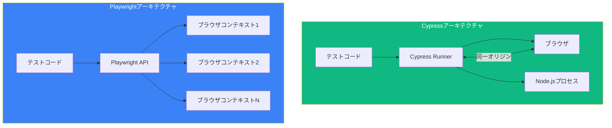

CypressとPlaywrightはどちらもSeleniumに代わるモダンなE2Eテストフレームワークです。それぞれの違いを理解することで、プロジェクトに適したツールを選択できます。

## アーキテクチャ比較



| 側面 | Cypress | Playwright |
|------|---------|------------|
| 実行 | ブラウザ内で実行 | 外部からブラウザを制御 |
| 言語 | JavaScript/TypeScript | JS/TS, Python, .NET, Java |
| マルチタブ | 限定的なサポート | 完全サポート |
| iframe | ワークアラウンドが必要 | ネイティブサポート |
| ネットワーク層 | アプリケーションレベル | ブラウザレベル |

## ブラウザサポート

### Cypress

```javascript
// cypress.config.js
module.exports = defineConfig({
  e2e: {
    // サポートブラウザ
    // Chrome, Chromium, Edge, Electron, Firefox
    // Safari/WebKitはサポートなし
  },
});

// 特定のブラウザで実行
// npx cypress run --browser chrome
// npx cypress run --browser firefox
```

### Playwright

```javascript
// playwright.config.js
export default defineConfig({
  projects: [
    { name: 'chromium', use: { ...devices['Desktop Chrome'] } },
    { name: 'firefox', use: { ...devices['Desktop Firefox'] } },
    { name: 'webkit', use: { ...devices['Desktop Safari'] } },
    { name: 'Mobile Chrome', use: { ...devices['Pixel 5'] } },
    { name: 'Mobile Safari', use: { ...devices['iPhone 12'] } },
  ],
});
```

| ブラウザ | Cypress | Playwright |
|---------|---------|------------|
| Chrome/Chromium | はい | はい |
| Firefox | はい | はい |
| Edge | はい | はい |
| Safari/WebKit | いいえ | はい |
| モバイルブラウザ | いいえ | はい（エミュレーション） |

## 構文比較

### 基本的なテスト構造

**Cypress:**
```javascript
describe('ログイン', () => {
  beforeEach(() => {
    cy.visit('/login');
  });

  it('正常にログインする', () => {
    cy.get('[data-testid="email"]').type('user@example.com');
    cy.get('[data-testid="password"]').type('password');
    cy.get('[data-testid="submit"]').click();
    cy.url().should('include', '/dashboard');
  });
});
```

**Playwright:**
```javascript
import { test, expect } from '@playwright/test';

test.describe('ログイン', () => {
  test.beforeEach(async ({ page }) => {
    await page.goto('/login');
  });

  test('正常にログインする', async ({ page }) => {
    await page.getByTestId('email').fill('user@example.com');
    await page.getByTestId('password').fill('password');
    await page.getByTestId('submit').click();
    await expect(page).toHaveURL(/dashboard/);
  });
});
```

### 要素の選択

**Cypress:**
```javascript
// CSSセレクター
cy.get('[data-testid="submit"]');
cy.get('.btn-primary');
cy.get('#email');

// テキストコンテンツ
cy.contains('送信');
cy.contains('button', '送信');

// チェーン
cy.get('.form').find('input').first();
```

**Playwright:**
```javascript
// 組み込みロケーター（推奨）
await page.getByTestId('submit');
await page.getByRole('button', { name: '送信' });
await page.getByLabel('メール');
await page.getByPlaceholder('メールを入力');
await page.getByText('ようこそ');

// CSSセレクター
await page.locator('.btn-primary');
await page.locator('#email');

// チェーン
await page.locator('.form').locator('input').first();
```

### アサーション

**Cypress:**
```javascript
// should()による暗黙的アサーション
cy.get('.title').should('be.visible');
cy.get('.title').should('have.text', 'ようこそ');
cy.get('.items').should('have.length', 5);
cy.url().should('include', '/dashboard');

// 明示的アサーション
cy.get('.count').invoke('text').then((text) => {
  expect(parseInt(text)).to.be.greaterThan(0);
});
```

**Playwright:**
```javascript
// expectアサーション
await expect(page.locator('.title')).toBeVisible();
await expect(page.locator('.title')).toHaveText('ようこそ');
await expect(page.locator('.items')).toHaveCount(5);
await expect(page).toHaveURL(/dashboard/);

// ソフトアサーション（失敗しても続行）
await expect.soft(page.locator('.title')).toBeVisible();
```

## ネットワーク処理

### APIモック

**Cypress:**
```javascript
cy.intercept('GET', '/api/users', {
  body: [{ id: 1, name: 'John' }],
}).as('getUsers');

cy.visit('/users');
cy.wait('@getUsers');

cy.intercept('GET', '/api/users', (req) => {
  req.reply((res) => {
    res.body.push({ id: 2, name: 'Jane' });
  });
});
```

**Playwright:**
```javascript
await page.route('/api/users', async (route) => {
  await route.fulfill({
    body: JSON.stringify([{ id: 1, name: 'John' }]),
  });
});

await page.goto('/users');

// レスポンスを変更
await page.route('/api/users', async (route) => {
  const response = await route.fetch();
  const json = await response.json();
  json.push({ id: 2, name: 'Jane' });
  await route.fulfill({ json });
});
```

### リクエストの待機

**Cypress:**
```javascript
cy.intercept('POST', '/api/users').as('createUser');
cy.get('[data-testid="submit"]').click();
cy.wait('@createUser').its('response.statusCode').should('eq', 201);
```

**Playwright:**
```javascript
const responsePromise = page.waitForResponse('/api/users');
await page.getByTestId('submit').click();
const response = await responsePromise;
expect(response.status()).toBe(201);
```

## マルチタブとマルチコンテキスト

### Cypress（限定的）

```javascript
// Cypressは単一タブで実行
// 新しいタブの場合、クロスオリジンにはcy.origin()を使用
cy.origin('https://other-domain.com', () => {
  cy.visit('/');
  cy.get('.content').should('exist');
});

// またはwindow.openをスタブ
cy.window().then((win) => {
  cy.stub(win, 'open').as('windowOpen');
});
cy.get('a[target="_blank"]').click();
cy.get('@windowOpen').should('be.called');
```

### Playwright（完全サポート）

```javascript
// 複数タブ
const [newPage] = await Promise.all([
  context.waitForEvent('page'),
  page.click('a[target="_blank"]'),
]);
await newPage.waitForLoadState();
await expect(newPage).toHaveTitle('新しいページ');

// 複数ブラウザコンテキスト（分離されたセッション）
const context1 = await browser.newContext();
const context2 = await browser.newContext();
const page1 = await context1.newPage();
const page2 = await context2.newPage();

// マルチユーザーシナリオのテスト
await page1.goto('/chat');
await page2.goto('/chat');
await page1.getByRole('textbox').fill('ユーザー1からこんにちは');
await expect(page2.locator('.message')).toContainText('ユーザー1からこんにちは');
```

## 並列実行

### Cypress

```javascript
// cypress.config.js
module.exports = defineConfig({
  e2e: {
    // 並列実行にはCypress Cloud（有料）が必要
    // またはsorry-cypressなどのサードパーティツールを使用
  },
});

// コマンドライン
// npx cypress run --record --parallel
```

### Playwright

```javascript
// playwright.config.js
export default defineConfig({
  // 組み込みの並列化（無料）
  workers: process.env.CI ? 2 : undefined,
  fullyParallel: true,
});

// マシン間でシャード
// npx playwright test --shard=1/3
// npx playwright test --shard=2/3
// npx playwright test --shard=3/3
```

## 開発者体験

### テスト生成

**Cypress:**
```bash
# Cypress Studio（実験的）
# cypress.config.jsで有効化
experimentalStudio: true
# Test Runnerで「Add Commands to Test」を使用
```

**Playwright:**
```bash
# 組み込みのcodegen
npx playwright codegen example.com
# アクションを記録してテストコードを生成
```

### デバッグ

**Cypress:**
- Test Runnerでのタイムトラベル
- 各ステップでのDOMスナップショット
- `cy.pause()`と`cy.debug()`
- `.then()`でのコンソールログ

**Playwright:**
- タイムライン付きトレースビューア
- ビデオ録画
- デバッグ用の`await page.pause()`
- ライブデバッグ付きVS Code拡張機能

### レポート

**Cypress:**
```javascript
// 組み込みレポーター
// npx cypress run --reporter spec
// npx cypress run --reporter junit

// ダッシュボードレポート（有料Cypress Cloud）
```

**Playwright:**
```javascript
// playwright.config.js
export default defineConfig({
  reporter: [
    ['html'],           // HTMLレポート
    ['json', { outputFile: 'results.json' }],
    ['junit', { outputFile: 'results.xml' }],
  ],
});

// npx playwright show-report
```

## パフォーマンス比較

| 指標 | Cypress | Playwright |
|------|---------|------------|
| 起動時間 | 遅い | 速い |
| テスト実行 | 中程度 | 非常に速い |
| 並列（無料） | いいえ | はい |
| メモリ使用量 | 高い | 低い |
| CI統合 | 良好 | 優秀 |

## Cypressを選ぶべき時

Cypressが良い選択となるのは：

- **チームの慣れ**: チームがjQueryライクな構文を知っている
- **シンプルなE2Eテスト**: シングルページアプリケーションのテスト
- **ビジュアルデバッグ**: タイムトラベルデバッグが必要
- **コンポーネントテスト**: React/Vue/Angularコンポーネントをテストしたい
- **エコシステム**: Cypressエコシステムのプラグインが必要

```javascript
// Cypressはコンポーネントテストに優れている
import { mount } from 'cypress/react';
import Button from './Button';

it('ボタンをレンダリング', () => {
  mount(<Button>クリック</Button>);
  cy.get('button').should('have.text', 'クリック');
});
```

## Playwrightを選ぶべき時

Playwrightが良い選択となるのは：

- **クロスブラウザテスト**: Safari/WebKitサポートが必要
- **マルチタブシナリオ**: 複雑なワークフローのテスト
- **APIテスト**: 堅牢なリクエスト処理が必要
- **モバイルテスト**: モバイルブラウザエミュレーションが必要
- **パフォーマンス**: 高速な並列実行が必要
- **多言語**: チームがPython、.NET、Javaを使用

```javascript
// Playwrightは複雑なシナリオに優れている
test('マルチユーザーチャット', async ({ browser }) => {
  const user1Context = await browser.newContext();
  const user2Context = await browser.newContext();

  const user1Page = await user1Context.newPage();
  const user2Page = await user2Context.newPage();

  await user1Page.goto('/chat/room-1');
  await user2Page.goto('/chat/room-1');

  await user1Page.getByRole('textbox').fill('こんにちは！');
  await user1Page.getByRole('button', { name: '送信' }).click();

  await expect(user2Page.locator('.message').last()).toHaveText('こんにちは！');
});
```

## 移行の考慮事項

### CypressからPlaywrightへ

```javascript
// Cypress
cy.get('[data-testid="email"]').type('user@example.com');
cy.get('[data-testid="submit"]').click();
cy.url().should('include', '/dashboard');

// Playwright相当
await page.getByTestId('email').fill('user@example.com');
await page.getByTestId('submit').click();
await expect(page).toHaveURL(/dashboard/);
```

### PlaywrightからCypressへ

```javascript
// Playwright
await page.getByRole('button', { name: '送信' }).click();
await expect(page.locator('.success')).toBeVisible();

// Cypress相当
cy.contains('button', '送信').click();
cy.get('.success').should('be.visible');
```

## まとめ

| 機能 | Cypress | Playwright |
|------|---------|------------|
| 学習曲線 | 易しい | 中程度 |
| Safariサポート | いいえ | はい |
| マルチタブ | 限定的 | 完全 |
| 並列（無料） | いいえ | はい |
| コンポーネントテスト | はい | 実験的 |
| APIモック | 優秀 | 優秀 |
| モバイルエミュレーション | いいえ | はい |
| テスト生成 | 限定的 | 組み込み |
| 言語 | JS/TS | 多言語 |
| 価格 | 無料 + 有料クラウド | 無料 |

重要なポイント：

- **Cypress**はシンプルから中程度のE2Eテストに優れ、デバッグが優秀
- **Playwright**は複雑なシナリオ、クロスブラウザテスト、パフォーマンスに優れている
- 両フレームワークとも優れたドキュメントと活発なコミュニティがある
- チームのニーズを考慮：ブラウザサポート、並列実行、テストの複雑さ
- フレームワーク間の移行は可能だが労力が必要
- 新規プロジェクトでは、両方をPoCで評価する

最適なフレームワークは特定の要件によって異なります。多くのチームが両方を成功裏に使用しています - Cypressはコンポーネントテストに、Playwrightはe2Eテストに。

## 参考文献

- [Cypress Documentation](https://docs.cypress.io/)
- [Playwright Documentation](https://playwright.dev/)
- [Cypress vs Playwright Comparison](https://www.browserstack.com/guide/cypress-vs-playwright)
- Mwaura, Waweru. *End-to-End Web Testing with Cypress*. Packt, 2021.
